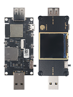
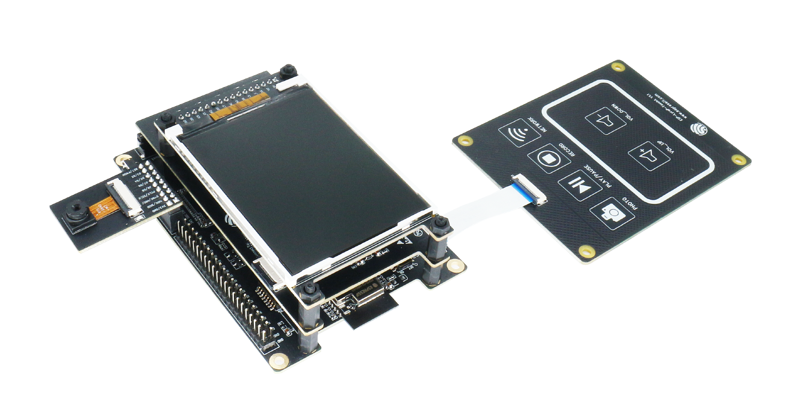
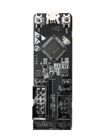
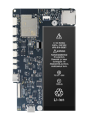
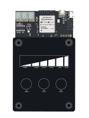
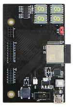

# esp-dev-kits

* [中文版](./README_CN.md)

## Overview

esp-dev-kits provides in-depth information on selected development boards embedded with different Espressif SoCs, such as ESP32, ESP32-S2, and ESP32-S3. For the list of all available boards, see the [Products > DevKits](https://www.espressif.com/en/products/devkits) page on the Espressif website. With esp-dev-kits, you can easily get started with Espressif development boards and build your IoT applications.

esp-dev-kits contains the following information for development boards designed by Espressif:

- User guides
- Hardware resources
- Firmware
- Demo code

## Developing with esp-dev-kits

### Quick Start

esp-dev-kits is developed based on ESP-IDF functions and tools, so the ESP-IDF development environment must be set up first. If this is your first exposure to ESP-IDF, proceed to **Get Started** documentation specific for [ESP32](https://docs.espressif.com/projects/esp-idf/en/latest/esp32/get-started/index.html), [ESP32-S2](https://docs.espressif.com/projects/esp-idf/en/latest/esp32s2/get-started/index.html), [ESP32-S3](https://docs.espressif.com/projects/esp-idf/en/latest/esp32s3/index.html), or [ESP32-C3](https://docs.espressif.com/projects/esp-idf/en/latest/esp32c3/get-started/index.html) SoCs.

Click one of the development boards shown below to set up and start using esp-dev-kits.

### Supported Development Boards

**ESP32-P4 Development Boards**

|
Board
|Picture|Description|
|:----:|:----:|:----|
| [ESP32-P4-Function-EV-Board](https://docs.espressif.com/projects/esp-dev-kits/zh_CN/latest/esp32p4/esp32-p4-function-ev-board/index.html)|  | ESP32-P4-Function-EV-Board is a multimedia development board based on the ESP32-P4 chip. ESP32-P4 chip features a dual-core 400 MHz RISC-V processor and supports up to 32 MB PSRAM. In addition, ESP32-P4 supports USB 2.0 specification, MIPI-CSI/DSI, H264 Encoder, and various other peripherals. With all of its outstanding features, the board is an ideal choice for developing low-cost, high-performance, low-power network-connected audio and video products. |

**ESP32-C3 Development Boards**

|
Board
|Picture|Description|
|:----:|:----:|:----|
| [ESP32-C3-LCDkit](https://docs.espressif.com/projects/esp-dev-kits/en/latest/esp32c3/esp32-c3-lcdkit/index.html)|  | ESP32-C3-LCDkit is a development board for evaluating and verifying ESP32-C3 chip and SPI interface screen. The motherboard of ESP32-C3-LCDkit integrates ESP32-C3-MINI-1 module and it has the functions of screen interaction through rotary encoder switch. It also has audio player and infrared wireless control functions. |

**ESP32-S3 Development Boards**

|
Board
|Picture|Description|
|:----:|:----:|:----|
| [ESP32-S3-USB-OTG](https://docs.espressif.com/projects/esp-dev-kits/en/latest/esp32s3/esp32-s3-usb-otg/index.html)|  |ESP32-S3-USB-OTG is targeting at applications based on USB interface. It is equipped with the ESP32-S3-MINI-1-N8 module. Combined with the Wi-Fi functionality provided by the SoC, the USB interface can be used for video streaming over Wi-Fi, accessing the Internet through a 4G hotspot, connecting to a wireless USB disk, and many other applications.|
| [ESP32-S3-LCD-EV-BOARD](https://docs.espressif.com/projects/esp-dev-kits/en/latest/esp32s3/esp32-s3-lcd-ev-board/index.html)|  | ESP32-S3-LCD-EV-BOARD is a development board for evaluating and verifying ESP32-S3 screen interactive applications. The motherboard of ESP32-S3-LCD-EV-BOARD integrates ESP32-S3-WROOM-1 module and it has the functions of touch screen interaction and voice interaction. |

**ESP32-S2 Development Boards**

|
Board
|Picture|Description|
|:----:|:----:|:----|
| [ESP32-S2-Kaluga-1](https://docs.espressif.com/projects/esp-dev-kits/en/latest/esp32s2/esp32-s2-kaluga-1/index.html) | |The new multimedia development board ESP32-S2-Kaluga-1 based on ESP32-S2 has various functions, such as an LCD screen display, touch panel control, camera image acquisition, audio playback, etc. It can be flexibly assembled and disassembled, thus fulfilling a variety of customized requirements. |

**Other Boards**

|
Board
|Picture|Description|
|:----:|:----:|:---- |
| [ESP-Prog](https://docs.espressif.com/projects/esp-dev-kits/en/latest/other/esp-prog/index.html) |  | ESP-Prog is one of Espressif’s development and debugging tools, with functions including automatic firmware downloading, serial communication, and JTAG online debugging. ESP-Prog's automatic firmware downloading and serial communication functions are supported on both the ESP8266 and ESP32 platforms, while the JTAG online debugging is supported only on the ESP32 platform. ESP-Prog uses FT2232HL as its USB Bridge Controller chip. |

**ESP32 Development Boards**

|
Board
|Picture|Description|
|:----:|:----:|:----|
| [ESP32-LCDKit](https://docs.espressif.com/projects/esp-dev-kits/en/latest/esp32/esp32-lcdkit/index.html)  |  | ESP32-LCD-Kit is an HMI (Human Machine Interface) development board based on ESP32-DevKitC (need to purchase if you didn’t have one). ESP32-LCDKit is integrated with such peripherals as SD-Card, DAC-Audio, and can be connected to an external display. The board is mainly used for HMI-related development and evaluation. The development board is designed to support SPI serial interface, 8-bit parallel interface and 16-bit parallel screen interfaces. |

**EOL (End of Life) Boards**

|
Board
|Picture|Description|
|:----:|:----:|:---- |
| [ESP32-S2-HMI-DevKit-1](https://docs.espressif.com/projects/esp-dev-kits/en/latest/esp32s2/esp32-s2-hmi-devkit-1/index.html) |  | ESP32-S2-HMI-DevKit-1 has been specifically designed for human-machine interfaces in smart-home automation controllers, smart speakers with display, smart alarm clocks, etc. It is powered by the ESP32-S2-WROVER module, which supports a 4.3-inch LCD screen. It has a 1950 mAh rechargeable lithium battery and peripheral interfaces such as Prog & UART, SPI, TWAI, I2C, and an SD card.|
| [ESP32-Sense-Kit](https://docs.espressif.com/projects/esp-dev-kits/en/latest/esp32/esp32-sense-kit/index.html) |  | ESP32-Sense Kit is used for evaluating and developing ESP32 touch sensor system. ESP32-Sense Kit consists of one motherboard and multiple daughterboards. The motherboard contains a display unit, a main control unit and a debug unit. The daughterboards have touch electrodes in different combinations or shapes, such as linear slider, wheel slider, matrix buttons and spring buttons, depending on the application scenarios. |
| [ESP32-MeshKit-Sense](https://docs.espressif.com/projects/esp-dev-kits/en/latest/esp32/esp32-meshkit-sensor/index.html) |  | ESP32-MeshKit-Sense is a development board with an ESP32 module at its core. It features peripherals, such as a temperature and humidity sensor, an ambient light sensor, etc. The board can be interfaced with screens. The board is mainly used to detect the current consumption of ESP32 modules in a normal operation state or in sleep mode, when connected to different peripherals. |
| [ESP32-S2-Touch-DevKit-1](https://docs.espressif.com/projects/esp-dev-kits/en/latest/esp32s2/esp32-s2-touch-devkit-1/index.html) | |ESP32-S2-Touch-Devkit-1 is a development kit that is aimed at helping evaluate and develop capacitive touch sensor applications on ESP32-S2. It is made up of Motherboard-Subboard structure. The motherboard of ESP32-S2-Touch-Devkit-1 integrates ESP32-S2-MINI-1 controller module and several useful little components such as buzzer, digital tube, RGB light, and so on.|

## Resources

* Documentation
    - Please find the latest version of documentation for esp-dev-kits at [Documentation](https://docs.espressif.com/projects/esp-dev-kits/en/latest/index.html). This documentation is built from the [docs directory](docs) of this repository.

* Set up Software Environment
    - Check [ESP-IDF Programming Guide](https://docs.espressif.com/projects/esp-idf/en/latest/esp32/get-started/index.html) for more information on how to get started with Espressif development boards.

* ESP-IoT-Solution
    - [ESP-IoT-Solution](https://github.com/espressif/esp-iot-solution/tree/release/v1.1) project is based on ESP-IDF and contains multiple projects.

* Related Websites
    - The [esp32.com forum](https://esp32.com/) is a place to ask questions and find community resources.
    - Visit [Espressif website](https://espressif.com) to find more information on Espressif.

* Technical Support and Feedback
    - Check the [Issues](https://github.com/espressif/esp-dev-kits/issues) section on github if you find a bug or have a feature request. Please check existing issues before opening a new one.

* Contribution
    - If you are interested in contributing to esp-dev-kits, please check the [Contributions Guide](https://docs.espressif.com/projects/esp-dev-kits/en/latest/contribute/contributions_guide.html).

* Purchase
    - Visit our WeChat Account **espressif_systems** to learn more about how to buy our products.
    - If you need help in choosing a desired development board, [ESP Product Selector](https://products.espressif.com/#/product-selector?names=) is a place for you to visit.
    - Contact us at [Sales Questions](http://www.espressif.com/en/company/contact/pre-sale-questions-crm) if you have any sales-related question about our products.
