# esp-dev-kits

* [中文版](./README_CN.md)

## Overview

esp-dev-kits provides in-depth information on selected development boards embedded with different Espressif SoCs, such as ESP32, ESP32-S2, ESP32-S3, ESP32-C3, ESP32-C5, ESP32-P4 and ESP32-S31. For the list of all available boards, see the [Products > DevKits](https://www.espressif.com/en/products/devkits) page on the Espressif website. With esp-dev-kits, you can easily get started with Espressif development boards and build your IoT applications.

esp-dev-kits contains the following information for development boards designed by Espressif:

- User guides
- Hardware resources
- Firmware
- Demo code

## Developing with esp-dev-kits

### Quick Start

esp-dev-kits is developed based on ESP-IDF functions and tools, so the ESP-IDF development environment must be set up first. If this is your first exposure to ESP-IDF, proceed to **Get Started** documentation specific for [ESP32](https://docs.espressif.com/projects/esp-idf/en/latest/esp32/get-started/index.html), [ESP32-S2](https://docs.espressif.com/projects/esp-idf/en/latest/esp32s2/get-started/index.html), [ESP32-S3](https://docs.espressif.com/projects/esp-idf/en/latest/esp32s3/index.html), [ESP32-C3](https://docs.espressif.com/projects/esp-idf/en/latest/esp32c3/get-started/index.html), [ESP32-C5](https://docs.espressif.com/projects/esp-idf/en/latest/esp32c5/get-started/index.html), [ESP32-P4](https://docs.espressif.com/projects/esp-idf/en/latest/esp32p4/get-started/index.html), or [ESP32-S31](https://docs.espressif.com/projects/esp-idf/en/latest/esp32s31/get-started/index.html) SoCs.

Click one of the development boards shown below to set up and start using esp-dev-kits.

### Supported Development Boards

**ESP32-S31 Development Boards**

|
Board
|Picture|Description|
|:----:|:----:|:----|
| [ESP32-S31-Function-CoreBoard-1](https://docs.espressif.com/projects/esp-dev-kits/en/latest/esp32s31/esp32-s31-function-coreboard-1/index.html)|  | The ESP32-S31-Function-CoreBoard-1 is a development board for connected AIoT prototyping based on the ESP32-S31-WROOM-3 module. It supports Wi-Fi 6, IEEE 802.15.4, Bluetooth 5.4 (LE + BR/EDR), and Gigabit Ethernet; provides an onboard microphone and speaker output; routes out all key GPIOs; and supports out-of-the-box AI voice interaction evaluation. |
| [ESP32-S31-Korvo-1](https://docs.espressif.com/projects/esp-dev-kits/en/latest/esp32s31/esp32-s31-korvo-1/index.html)|  | The ESP32-S31-Korvo-1 is a multimedia development board based on the ESP32-S31-WROOM-3 module for smart audio and HMI applications. It features a dual-microphone array, speaker output, and a microSD card slot; supports speech recognition and voice wake-up; and can connect to a 4.3-inch LCD subboard and DVP camera. |
| [ESP-Mosaico](https://docs.espressif.com/projects/esp-dev-kits/en/latest/esp32s31/esp-mosaico/index.html)|  | ESP-Mosaico is an expandable smart interaction kit based on ESP32-S31. It integrates a 480 × 480 QSPI square touch display, audio codec and amplifier, 6-axis IMU, dual magnetometers, SPI NAND flash, and left/right module headers for magnetic expansion, motion sensing, and edge multimedia scenarios. |

**ESP32-P4 Development Boards**

|
Board
|Picture|Description|
|:----:|:----:|:----|
| [ESP32-P4X-Function-EV-Board](https://docs.espressif.com/projects/esp-dev-kits/en/latest/esp32p4/esp32-p4x-function-ev-board/index.html)|  | ESP32-P4X-Function-EV-Board is a multimedia development board based on the ESP32-P4 chip, equipped with the ESP32-C6-MINI-1 module. ESP32-P4 chip features a dual-core RISC-V processor and supports up to 32 MB PSRAM. In addition, ESP32-P4 supports USB 2.0 specification, MIPI-CSI/DSI, H264 Encoder, and various other peripherals. With all of its outstanding features, the board is an ideal choice for developing low-cost, high-performance, low-power network-connected audio and video products. |
| [ESP32-P4X-C5-Function-EV-Board](https://docs.espressif.com/projects/esp-dev-kits/en/latest/esp32p4/esp32-p4x-c5-function-ev-board/index.html)|  | ESP32-P4X-C5-Function-EV-Board is a multimedia development board based on the ESP32-P4 chip, equipped with the ESP32-C5-MINI-1 module. ESP32-P4 chip features a dual-core RISC-V processor and supports up to 32 MB PSRAM. In addition, ESP32-P4 supports USB 2.0 specification, MIPI-CSI/DSI, H264 Encoder, and various other peripherals. With all of its outstanding features, the board is an ideal choice for developing low-cost, high-performance, low-power network-connected audio and video products. |
| [ESP32-P4-EYE](https://docs.espressif.com/projects/esp-dev-kits/en/latest/esp32p4/esp32-p4-eye/index.html)| [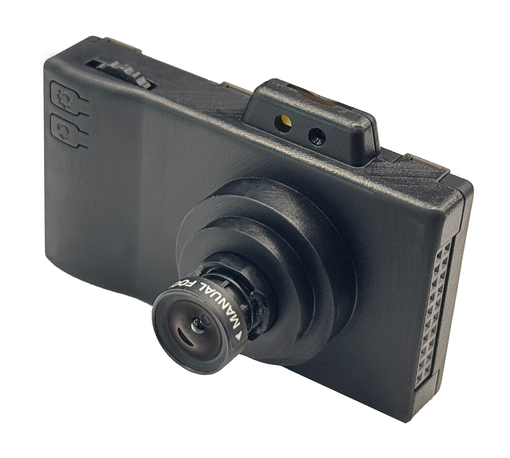](https://docs.espressif.com/projects/esp-dev-kits/en/latest/esp32p4/esp32-p4-eye/index.html) | ESP32-P4-EYE is a vision development board designed by Espressif Systems for camera applications. It features the ESP32-P4 microcontroller and ESP32-C6 wireless module, supporting MIPI-CSI camera interface and USB 2.0 High-Speed device mode. The board comes with integrated camera, display, microphone, and MicroSD card expansion, allowing real-time monitoring of surroundings and collection of image and audio data. It's ideal for smart security cameras, visual model detection, IoT edge computing, and other applications requiring real-time image processing and wireless communication. |

**ESP32-C5 Development Boards**

|
Board
|Picture|Description|
|:----:|:----:|:----|
| [ESP-SensairShuttle](https://docs.espressif.com/projects/esp-dev-kits/en/latest/esp32c5/esp-sensairshuttle/index.html)| [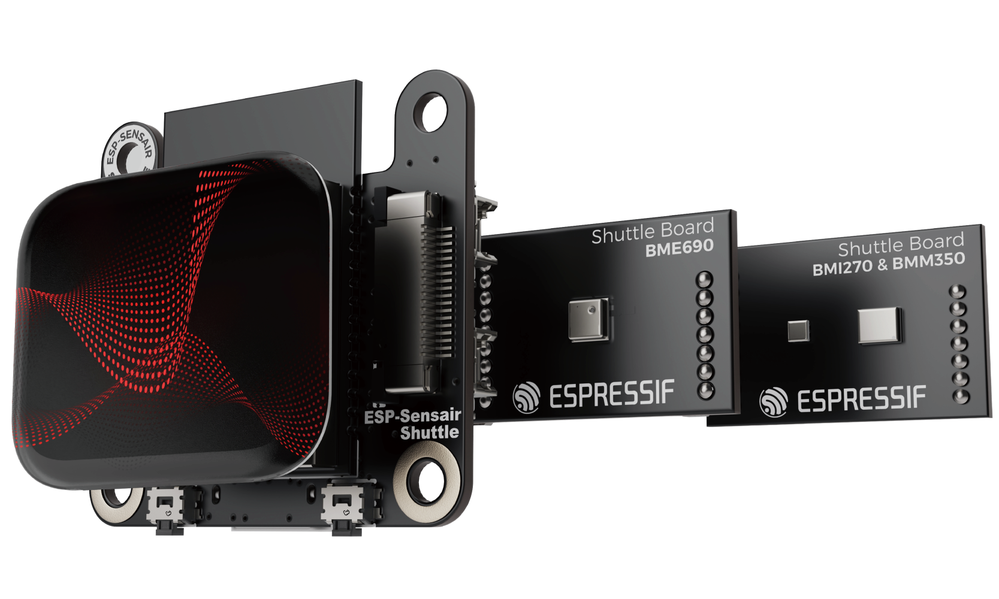](https://docs.espressif.com/projects/esp-dev-kits/en/latest/esp32c5/esp-sensairshuttle/index.html) | ESP-SensairShuttle is a development board jointly launched by Espressif and Bosch Sensortec for motion sensing and large language model human-computer interaction scenarios. It features the ESP32-C5-WROOM-1-N16R8 module, supporting dual-band Wi-Fi 6, Bluetooth 5 (LE), Zigbee, and Thread. The board supports interchangeable sensor daughterboards (BME690, BMI270 & BMM350) for multi-dimensional sensing, and external microphone and speaker interfaces for seamless integration with large language models to achieve AI voice interaction. |

**ESP32-C3 Development Boards**

|
Board
|Picture|Description|
|:----:|:----:|:----|
| [ESP32-C3-LCDkit](https://docs.espressif.com/projects/esp-dev-kits/en/latest/esp32c3/esp32-c3-lcdkit/index.html)| [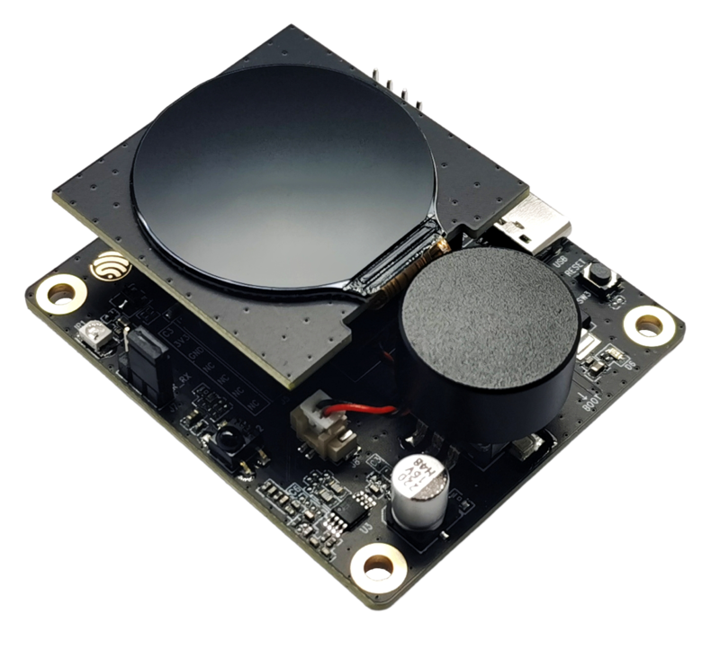](https://docs.espressif.com/projects/esp-dev-kits/en/latest/esp32c3/esp32-c3-lcdkit/index.html) | ESP32-C3-LCDkit is a development board for evaluating and verifying ESP32-C3 chip and SPI interface screen. The motherboard of ESP32-C3-LCDkit integrates ESP32-C3-MINI-1 module and it has the functions of screen interaction through rotary encoder switch. It also has audio player and infrared wireless control functions. |

**ESP32-S3 Development Boards**

|
Board
|Picture|Description|
|:----:|:----:|:----|
| [ESP32-S3-USB-OTG](https://docs.espressif.com/projects/esp-dev-kits/en/latest/esp32s3/esp32-s3-usb-otg/index.html)| [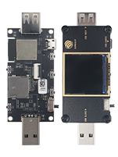](https://docs.espressif.com/projects/esp-dev-kits/en/latest/esp32s3/esp32-s3-usb-otg/index.html) |ESP32-S3-USB-OTG is targeting at applications based on USB interface. It is equipped with the ESP32-S3-MINI-1-N8 module. Combined with the Wi-Fi functionality provided by the SoC, the USB interface can be used for video streaming over Wi-Fi, accessing the Internet through a 4G hotspot, connecting to a wireless USB disk, and many other applications.|
| [ESP32-S3-LCD-EV-BOARD](https://docs.espressif.com/projects/esp-dev-kits/en/latest/esp32s3/esp32-s3-lcd-ev-board/index.html)|  | ESP32-S3-LCD-EV-BOARD is a development board for evaluating and verifying ESP32-S3 screen interactive applications. The motherboard of ESP32-S3-LCD-EV-BOARD integrates ESP32-S3-WROOM-1 module and it has the functions of touch screen interaction and voice interaction. |
| [ESP-VoCat](https://docs.espressif.com/projects/esp-dev-kits/en/latest/esp32s3/esp-vocat/index.html)|  | ESP-VoCat is an intelligent AI development kit. It is suitable for voice interaction products that require large model capabilities, such as toys, smart speakers, and smart central control systems. The device is equipped with an ESP32-S3-WROOM-1 module, a 1.85-inch QSPI circular touch screen, dual microphone array, and supports offline voice wake-up and sound source localization algorithms. Combined with the large model capabilities provided by Amazon Nova, OpenAI, Xiaozhi AI, Gemini, etc. ESP-VoCat can achieve full-duplex voice interaction, multimodal recognition, and intelligent agent control, providing a solid foundation for developers to create complete edge-side AI application experiences.  |
| [ESP-DualKey](https://docs.espressif.com/projects/esp-dev-kits/en/latest/esp32s3/esp-dualkey/index.html) | [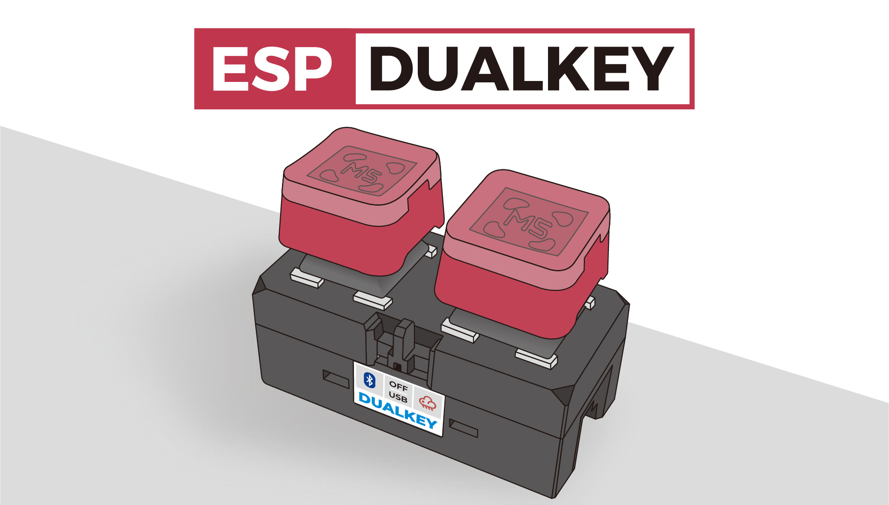](https://docs.espressif.com/projects/esp-dev-kits/en/latest/esp32s3/esp-dualkey/index.html) | ESP-DualKey is an intelligent dual-key controller development board jointly developed by Espressif and M5Stack based on the ESP32-S3 chip. It integrates multiple functions such as smart home control, Bluetooth keyboard, and USB keyboard, and allows switching between different working modes through a physical switch. The board features dual buttons, RGB lighting effects, battery management, and power monitoring, providing developers with a complete smart button solution. |

**ESP32-S2 Development Boards**

|
Board
|Picture|Description|
|:----:|:----:|:----|
| [ESP32-S2-Kaluga-1](https://docs.espressif.com/projects/esp-dev-kits/en/latest/esp32s2/esp32-s2-kaluga-1/index.html) |[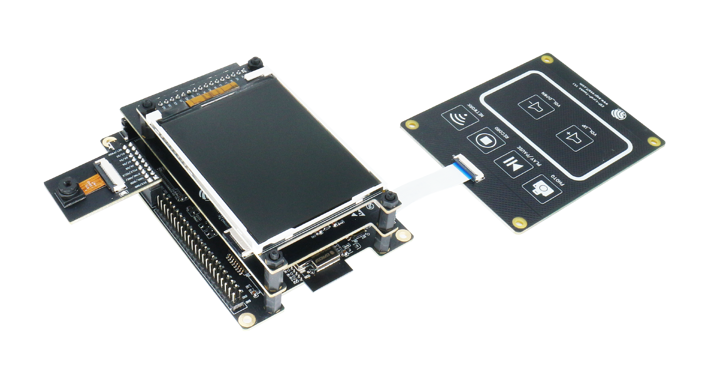](https://docs.espressif.com/projects/esp-dev-kits/en/latest/esp32s2/esp32-s2-kaluga-1/index.html) |The new multimedia development board ESP32-S2-Kaluga-1 based on ESP32-S2 has various functions, such as an LCD screen display, touch panel control, camera image acquisition, audio playback, etc. It can be flexibly assembled and disassembled, thus fulfilling a variety of customized requirements. |

**Other Boards**

|
Board
|Picture|Description|
|:----:|:----:|:---- |
| [ESP-Prog](https://docs.espressif.com/projects/esp-dev-kits/en/latest/other/esp-prog/index.html) | [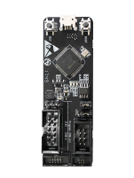](https://docs.espressif.com/projects/esp-dev-kits/en/latest/other/esp-prog/index.html) | ESP-Prog is one of Espressif's development and debugging tools, with functions including automatic firmware downloading, serial communication, and JTAG online debugging. ESP-Prog's automatic firmware downloading and serial communication functions are supported on both the ESP8266 and ESP32 platforms, while the JTAG online debugging is supported only on the ESP32 platform. ESP-Prog uses FT2232HL as its USB Bridge Controller chip. |

**ESP32 Development Boards**

|
Board
|Picture|Description|
|:----:|:----:|:----|
| [ESP32-LCDKit](https://docs.espressif.com/projects/esp-dev-kits/en/latest/esp32/esp32-lcdkit/index.html)  | [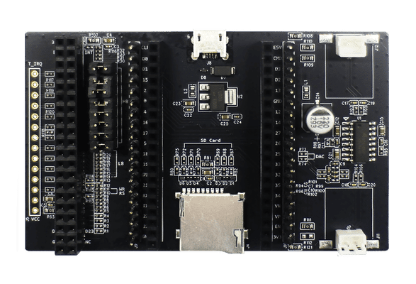](https://docs.espressif.com/projects/esp-dev-kits/en/latest/esp32/esp32-lcdkit/index.html) | ESP32-LCD-Kit is an HMI (Human Machine Interface) development board based on ESP32-DevKitC (need to purchase if you didn't have one). ESP32-LCDKit is integrated with such peripherals as SD-Card, DAC-Audio, and can be connected to an external display. The board is mainly used for HMI-related development and evaluation. The development board is designed to support SPI serial interface, 8-bit parallel interface and 16-bit parallel screen interfaces. |

**EOL (End of Life) Boards**

|
Board
|Picture|Description|
|:----:|:----:|:---- |
| [ESP32-S2-HMI-DevKit-1](https://docs.espressif.com/projects/esp-dev-kits/en/latest/esp32s2/esp32-s2-hmi-devkit-1/index.html) | [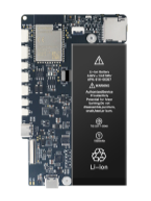](https://docs.espressif.com/projects/esp-dev-kits/en/latest/esp32s2/esp32-s2-hmi-devkit-1/index.html) | ESP32-S2-HMI-DevKit-1 has been specifically designed for human-machine interfaces in smart-home automation controllers, smart speakers with display, smart alarm clocks, etc. It is powered by the ESP32-S2-WROVER module, which supports a 4.3-inch LCD screen. It has a 1950 mAh rechargeable lithium battery and peripheral interfaces such as Prog & UART, SPI, TWAI, I2C, and an SD card.|
| [ESP32-Sense-Kit](https://docs.espressif.com/projects/esp-dev-kits/en/latest/esp32/esp32-sense-kit/index.html) | [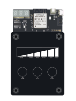](https://docs.espressif.com/projects/esp-dev-kits/en/latest/esp32/esp32-sense-kit/index.html) | ESP32-Sense Kit is used for evaluating and developing ESP32 touch sensor system. ESP32-Sense Kit consists of one motherboard and multiple daughterboards. The motherboard contains a display unit, a main control unit and a debug unit. The daughterboards have touch electrodes in different combinations or shapes, such as linear slider, wheel slider, matrix buttons and spring buttons, depending on the application scenarios. |
| [ESP32-MeshKit-Sense](https://docs.espressif.com/projects/esp-dev-kits/en/latest/esp32/esp32-meshkit-sensor/index.html) | [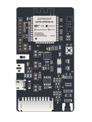](https://docs.espressif.com/projects/esp-dev-kits/en/latest/esp32/esp32-meshkit-sensor/index.html) | ESP32-MeshKit-Sense is a development board with an ESP32 module at its core. It features peripherals, such as a temperature and humidity sensor, an ambient light sensor, etc. The board can be interfaced with screens. The board is mainly used to detect the current consumption of ESP32 modules in a normal operation state or in sleep mode, when connected to different peripherals. |
| [ESP32-S2-Touch-DevKit-1](https://docs.espressif.com/projects/esp-dev-kits/en/latest/esp32s2/esp32-s2-touch-devkit-1/index.html) |[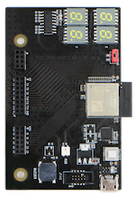](https://docs.espressif.com/projects/esp-dev-kits/en/latest/esp32s2/esp32-s2-touch-devkit-1/index.html) |ESP32-S2-Touch-Devkit-1 is a development kit that is aimed at helping evaluate and develop capacitive touch sensor applications on ESP32-S2. It is made up of Motherboard-Subboard structure. The motherboard of ESP32-S2-Touch-Devkit-1 integrates ESP32-S2-MINI-1 controller module and several useful little components such as buzzer, digital tube, RGB light, and so on.|

## Resources

* Documentation
    - Please find the latest version of documentation for esp-dev-kits at [Documentation](https://docs.espressif.com/projects/esp-dev-kits/en/latest/index.html). This documentation is built from the [docs directory](docs) of this repository.

* Set up Software Environment
    - Check [ESP-IDF Programming Guide](https://docs.espressif.com/projects/esp-idf/en/latest/esp32/get-started/index.html) for more information on how to get started with Espressif development boards.

* ESP-IoT-Solution
    - [ESP-IoT-Solution](https://github.com/espressif/esp-iot-solution/tree/release/v1.1) project is based on ESP-IDF and contains multiple projects.

* Related Websites
    - The [esp32.com forum](https://esp32.com/) is a place to ask questions and find community resources.
    - Visit [Espressif website](https://espressif.com) to find more information on Espressif.

* Technical Support and Feedback
    - Check the [Issues](https://github.com/espressif/esp-dev-kits/issues) section on github if you find a bug or have a feature request. Please check existing issues before opening a new one.

* Purchase
    - Visit our WeChat Account **espressif_systems** to learn more about how to buy our products.
    - If you need help in choosing a desired development board, [ESP Product Selector](https://products.espressif.com/#/product-selector?names=) is a place for you to visit.
    - Contact us at [Sales Questions](http://www.espressif.com/en/company/contact/pre-sale-questions-crm) if you have any sales-related question about our products.

## Open Source Licensing

This repository is distributed under multiple open source licenses, depending on the type of content:

- **Code**: All code files (unless otherwise specified) are licensed under the [Apache License 2.0](./LICENSE-APACHE). This allows commercial use, modification, and redistribution, provided that the original copyright notice and a description of any changes are retained.
- **Documentation**: All documentation content in this repository (including text, diagrams, and images) is licensed under the [Creative Commons Attribution-ShareAlike 4.0 International (CC BY-SA 4.0)](./LICENSE-CC-BY-SA).

Under the CC BY-SA 4.0 license, you are free to reuse, adapt, and share the documentation, as long as you meet the following conditions:

- Attribute the original source (e.g., link to this repository or specific documentation pages)
- Provide a link to the license
- Indicate whether any changes were made
- Distribute derivative works under the same license
