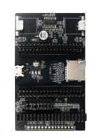

# esp-dev-kits

* [English Version](./README.md)

## 概述

esp-dev-kits 深入介绍了部分内嵌 ESP32、ESP32-S2、ESP32-S3 等 SoC 芯片的乐鑫开发板。如果您想获取乐鑫开发板的完整列表，请参阅乐鑫官网 [产品 > 开发板](https://www.espressif.com/zh_CN/products/devkits) 页面。您可以使用 esp-dev-kits 快速入门乐鑫开发板，构建您的物联网应用。

esp-dev-kits 主要包含以下与乐鑫开发板相关的信息：

- 用户指南
- 硬件参考
- 固件
- 示例代码

## 使用 esp-dev-kits 进行开发

### 快速入门

由于 esp-dev-kits 依赖 ESP-IDF 的基础功能和编译工具，因此您首先需要完成 ESP-IDF 开发环境的搭建。如果这是您首次使用 ESP-IDF，请参考 [ESP32](https://docs.espressif.com/projects/esp-idf/zh_CN/latest/esp32/get-started/index.html)、[ESP32-S2](https://docs.espressif.com/projects/esp-idf/zh_CN/latest/esp32s2/get-started/index.html)、[ESP32-S3](https://docs.espressif.com/projects/esp-idf/zh_CN/latest/esp32s3/index.html) 或 [ESP32-C3](https://docs.espressif.com/projects/esp-idf/zh_CN/latest/esp32c3/get-started/index.html) SoC 的 **快速入门** 文档。

您可以点击以下任意开发板，开始搭建环境并使用 esp-dev-kits。

### 支持开发板

**ESP32-S3 系列开发板**

|
开发板
 |图片|描述|
|:----:|:----:|:----|
| [ESP32-S3-USB-OTG](https://docs.espressif.com/projects/espressif-esp-dev-kits/zh_CN/latest/esp32s3/esp32-s3-usb-otg/index.html)|  |ESP32-S3-USB-OTG 是一款着重 USB 外设应用的开发板，搭载 ESP32-S3-MINI-1-N8 模组。结合芯片的 Wi-Fi 功能，此开发板可利用 USB 实现摄像头 Wi-Fi 图传、4G 热点上网、无线 U 盘等应用。|

**ESP32-S2 系列开发板**

|
开发板
|图片|描述|
|:----:|:----:|:----|
| [ESP32-S2-Touch-DevKit-1](https://docs.espressif.com/projects/espressif-esp-dev-kits/zh_CN/latest/esp32s2/esp32-s2-touch-devkit-1/index.html) | |ESP32-S2-Touch-Devkit-1 开发板由主板和⼦板两部分组成，可用于帮助评估和开发 ESP32-S2 上的电容式触摸传感器应用。ESP32-S2-Touch-Devkit-1 的主板集成了 ESP32-S2-MINI-1 控制器模块及其他设备，例如蜂鸣器、数码管、RGB 灯等。|

**ESP32 系列开发板**

|
开发板
|图片|描述|
|:----:|:----:|:----|
| [ESP32-LCDKit](https://docs.espressif.com/projects/espressif-esp-dev-kits/zh_CN/latest/esp32/esp32-lcdkit/index.html)  |  | ESP32-LCDKit 是一款以乐鑫 ESP32-DevKitC（需另采购）为核心的 HMI（人机交互）开发板，可外接屏幕，并且集成了 SD-Card、DAC-Audio 等外设，主要用于 HMI 相关开发与评估。开发板预留屏幕接口类型：SPI 串行接口、8 位并行接口、16 位并行接口。|

**其他开发板**

|
开发板
|图片|描述|
|:----:|:----:|:---- |
| [ESP-Prog](https://docs.espressif.com/projects/espressif-esp-dev-kits/zh_CN/latest/other/esp-prog/index.html) |  | ESP-Prog 是一款乐鑫推出的开发调试工具，具有自动下载固件、串口通信、JTAG 在线调试等功能。自动下载固件和串口通信功能适用于 ESP8266 和 ESP32 平台，JTAG 在线调试功能适用于 ESP32 平台。ESP-Prog 采用 FT2232HL 作为 USB Bridge Controller 芯片。 |
| [ESP32-MeshKit-Sense](https://docs.espressif.com/projects/espressif-esp-dev-kits/zh_CN/latest/esp32/esp32-meshkit-sensor/index.html) |  | ESP32-MeshKit-Sense 是一款以乐鑫 ESP32 模组为核心的开发板，集成了温湿度传感器、环境亮度传感器等外设，并且可外接屏幕，主要用于检测模组在正常工作或睡眠状态下，连接各个外设时的电流情况。  |

**寿命终止开发板**

|
开发板
|图片|描述|
|:----:|:----:|:---- |
| [ESP32-S2-HMI-DevKit-1](https://docs.espressif.com/projects/espressif-esp-dev-kits/zh_CN/latest/esp32s2/esp32-s2-hmi-devkit-1/index.html) |  | ESP32-S2-HMI-DevKit-1 面向 GUI 应用场景设计，可实现智能家居交互面板，带显示屏的音箱、闹钟等人机交互界面的智能控制。ESP32-S2-HMI-DevKit-1 搭载 ESP32-S2-WROVER 模组，支持 4.3 寸 TFT-LCD 触摸显示屏，配备一块 1950 mAh 的单芯锂离子电池，并提供了多个扩展接口，例如程序下载/UART、SPI、TWAI（兼容 CAN 2.0）、I2C 和 SD 卡。|
| [ESP32-Sense-Kit](https://docs.espressif.com/projects/espressif-esp-dev-kits/zh_CN/latest/esp32/esp32-sense-kit/index.html) |  | ESP32-Sense 开发套件用于评估和开发 ESP32 触摸传感器功能。评估套件包含一个主板和若干子板，主板包含显示单元，主控单元，调试单元；子板的触摸电极的形状和排列方式多样，包括线性滑条、矩阵按键、弹簧按键、轮式滑条等，可以满足不同的使用场景。 |

## 相关资源

* 文档
    - 您可以在 [文档](https://docs.espressif.com/projects/espressif-esp-dev-kits/zh_CN/latest/index.html) 找到 esp-dev-kits 的最新文档。此文档由本仓库的 [docs 目录](docs) 编译而成。

* 开发环境
    - 想要了解更多快速入门乐鑫开发板的信息，请参考 [ESP-IDF 编程指南](https://docs.espressif.com/projects/esp-idf/zh_CN/latest/esp32/get-started/index.html)。

* ESP-IoT-Solution
    - [ESP-IoT-Solution](https://github.com/espressif/esp-iot-solution/tree/release/v1.1) 基于 ESP-IDF 开发，包含多种应用解决方案。

* 相关网站
    - 欢迎访问 [esp32.com 论坛](https://esp32.com/)，发表您的疑问或在社区内获取更多资源。
    - 欢迎访问 [乐鑫官网](https://espressif.com)，了解更多乐鑫相关信息。

* 技术支持与反馈
    - 如果您发现了任何技术上的 bug 或有任何功能上的建议，请在 Github 中的 [Issues](https://github.com/espressif/esp-dev-kits/issues) 页面提交您的反馈。提交新 issue 前请先检查是否有已提交的重复 issue。

* 贡献代码
    - 如果您想要为 esp-dev-kits 贡献代码，请前往 [贡献代码](https://docs.espressif.com/projects/espressif-esp-dev-kits/zh_CN/latest/contribute/index.html)。

* 购买方式
    - 了解更多购买信息，请访问公司官方公众号 **乐鑫信息科技**。
    - 您可以借助 [ESP 产品选型工具](http://products.espressif.com:8000/#/product-selector) 选择合适的开发板。
    - 如果您有任何与销售相关的问题需要咨询，请在 [商务问题](https://www.espressif.com/zh-hans/contact-us/sales-questions) 页面留言。
