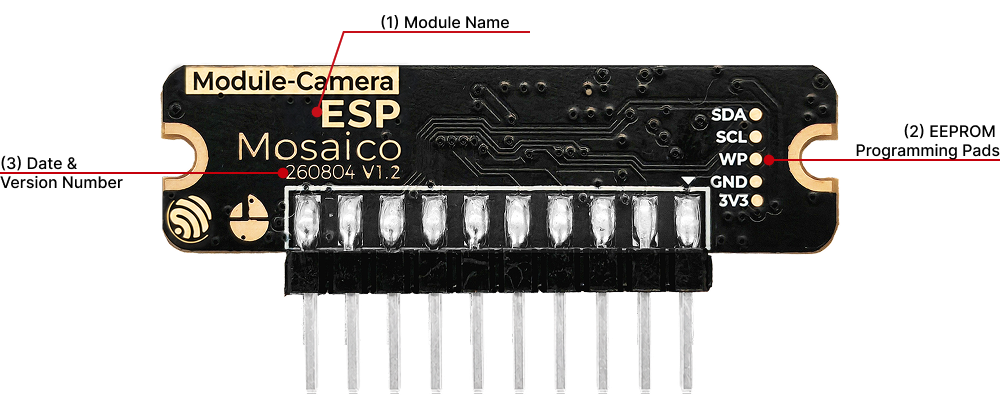
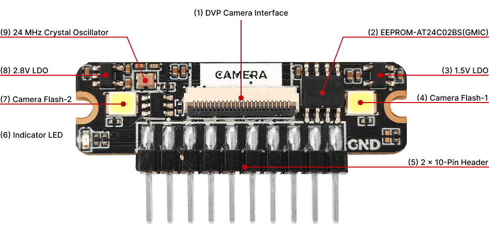
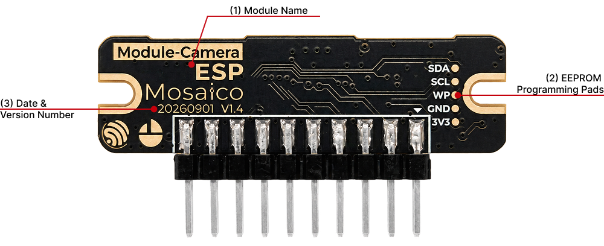
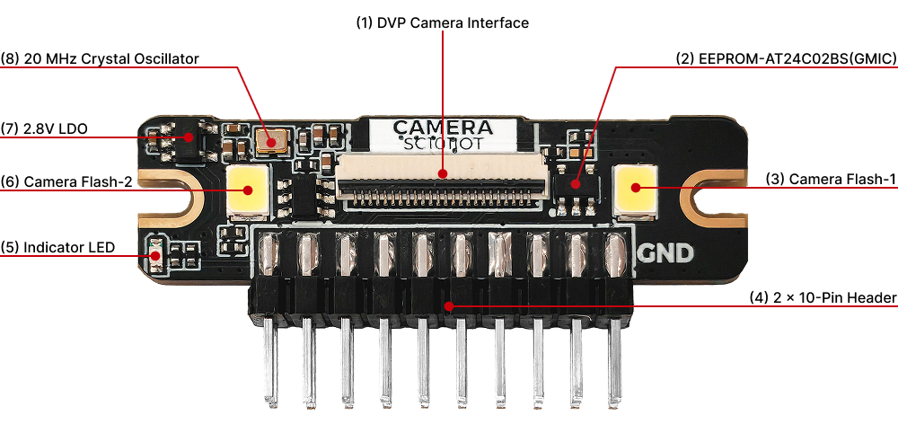
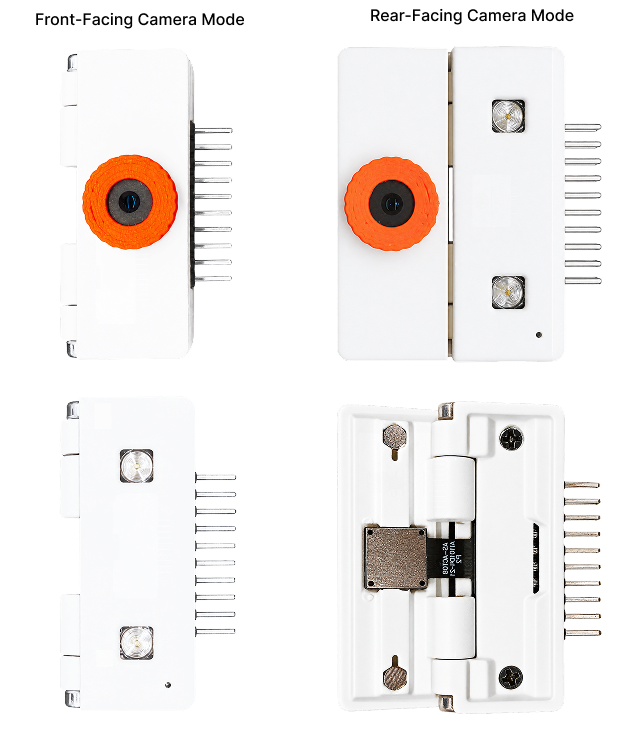
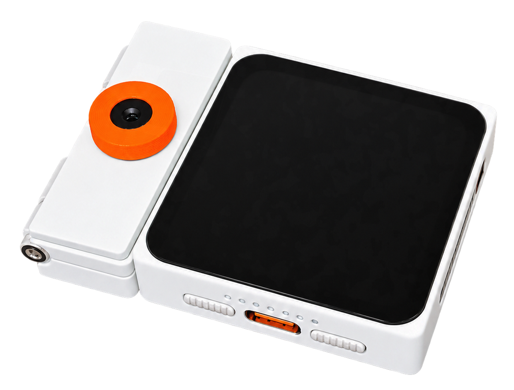
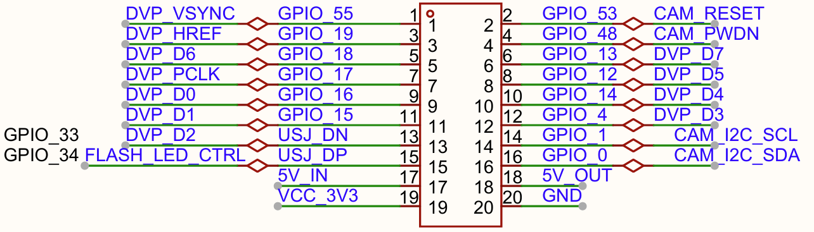

==============================
ESP-Mosaico Camera Module
==============================

:link_to_translation:`zh_CN:[中文]`

This guide describes the hardware versions, interfaces, installation, and software usage of the ESP-Mosaico **Camera Module** (Camera Subboard). The module is available in **V1.2** and **V1.4** versions. Both connect to the left ``2 × 10P`` slot on the CoreBoard / BaseBoard and provide DVP image capture.

.. note::

  The camera module is supported in the **left slot only** (``H2``, EEPROM address 0x50). Do not insert it into the right slot. For the mainboard revision, see :doc:`user_guide` or :doc:`user_guide_v1.0`.

Both versions are powered from the host expansion header, output 8-bit DVP image data, and use SCCB / I2C to communicate with the image sensor and module EEPROM. They share the same pin assignments but differ in image sensor, oscillator frequency, default output resolution, and EEPROM model and package.

This document consists of the following major sections:

- `Hardware Versions`_: PCB views, components, and camera specifications for V1.2, followed by V1.4.
- `Getting Started`_: Module overview, required hardware, installation, and software examples.
- `Hardware Reference`_: DVP pins, power, and usage limits.
- `Related Documents`_: Links to related documentation.
- `Disclaimer and Copyright Notice`_: Disclaimer and copyright notice.

Hardware Versions
=================

Identify the hardware version from the version marking on the front of the camera module PCB, then follow the corresponding link below for detailed information:

- `V1.2 Version`_: Equipped with an OV3640 camera.
- `V1.4 Version`_: Equipped with an SC101IOT camera.

These version numbers refer to the camera module PCB, not the CoreBoard mainboard. Each version is described in the following order: version overview, PCB front markings and interfaces, PCB back components, and camera specifications. Both versions share the installation procedure and pin assignments described in `Getting Started`_ and `Hardware Reference`_.

V1.2 Version
------------

V1.2 Version Overview
^^^^^^^^^^^^^^^^^^^^^

V1.2 features an OV3640 DVP image sensor. A 24 MHz oscillator external to the sensor provides ``XCLK`` without using a host GPIO. The default capture format is **1024 × 768 UYVY**.

The module uses an **AT24C02BS(GMIC)** EEPROM in an **SOP-8** package.

V1.2 PCB Front Markings and Interfaces
^^^^^^^^^^^^^^^^^^^^^^^^^^^^^^^^^^^^^^

The front of the PCB has no components and mainly carries the module name, PCB version V1.2, and date markings.

   V1.2 Camera Module PCB Front (Click to enlarge)

The front mainly contains silkscreen markings and test pads, as described below.

.. list-table:: V1.2 PCB Front Markings and Interfaces
   :widths: 8 28 64
   :header-rows: 1

   * - No.
     - Key Component
     - Description
   * - 1
     - Module Name Markings
     - Marked ``Module-Camera`` and ``ESP Mosaico`` to identify the camera module.
   * - 2
     - Version and Date Markings
     - Marked ``260804 V1.2`` to indicate the PCB date and version.
   * - 3
     - EEPROM Test Pads
     - Labeled ``SDA``, ``SCL``, ``WP``, ``GND``, and ``3V3`` for data, clock, write protection, ground, and 3.3 V power, respectively.

V1.2 PCB Back Components
^^^^^^^^^^^^^^^^^^^^^^^^

All components are located on the back of the PCB, including the camera FPC connector, 24 MHz oscillator, two flash LEDs, camera status indicator (red LED), AT24C02BS(GMIC) EEPROM (SOP-8 package), and power supply circuitry.

The pin header that connects to ESP-Mosaico straddles the PCB edge, with solder joints on both sides of the PCB.

   V1.2 Camera Module PCB Back (Click to enlarge)

The main components on the back are listed below. Positions refer to the orientation in the image.

.. list-table:: V1.2 PCB Back Components
   :widths: 8 28 64
   :header-rows: 1

   * - No.
     - Key Component
     - Description
   * - 1
     - Camera FPC Connector
     - Located in the center. Connects the OV3640 camera and carries image data, control signals, and power.
   * - 2
     - AT24C02BS(GMIC) EEPROM
     - Located to the right of the FPC connector, in an SOP-8 package. Stores module identification information; the 7-bit address in the left slot is 0x50.
   * - 3
     - 1.5 V LDO
     - Located at the upper right. Supplies 1.5 V to the camera.
   * - 4
     - Camera Flash-1
     - Located on the right for supplemental lighting. Controlled by GPIO34: low turns it on and high turns it off. Configure GPIO34 as an open-drain output to prevent a brief flash when the host powers down.
   * - 5
     - 2 × 10-Pin Header (Module Connector)
     - Located at the bottom. Straddles the PCB edge with solder joints on both sides, and connects to the BaseBoard left slot ``H2``.
   * - 6
     - Camera Status Indicator (Red LED)
     - Located at the lower left. Lights up when the camera starts operating and turns off when the camera enters sleep or is shut down.
   * - 7
     - Camera Flash-2
     - Located on the left for supplemental lighting. Shares GPIO34 with Flash-1, with the same control levels and open-drain output requirement.
   * - 8
     - 2.8 V LDO
     - Located at the upper left. Supplies 2.8 V to the camera.
   * - 9
     - 24 MHz Oscillator
     - Located above and to the left of the FPC connector. Provides ``XCLK`` for the OV3640 without using a host GPIO.

V1.2 Camera Specifications
^^^^^^^^^^^^^^^^^^^^^^^^^^

.. list-table:: V1.2 Camera Specifications
   :widths: 30 70
   :header-rows: 1

   * - Parameter
     - Specification
   * - Module PCB Version
     - V1.2
   * - Image Sensor
     - OV3640
   * - Sensor Type and Pixel Count
     - 3.2-megapixel CMOS
   * - Sensor Size
     - 1/4 inch
   * - Pixel Size
     - 1.75 μm
   * - Lens Focal Length
     - 4.15 mm, fixed focus
   * - Aperture
     - F2.4
   * - Field of View
     - 68°
   * - Applications
     - General-purpose image capture
   * - Lens Distortion
     - <1%
   * - Default Output Format
     - 1024 × 768 UYVY
   * - Output Resolution and Frame Rate
     - 1024 × 768 @ 30 FPS
   * - Supported Image Formats
     - RAW / YUV / RGB
   * - Automatic Image Controls
     - AEC (automatic exposure control) / AGC (automatic gain control) / AWB (automatic white balance)

V1.4 Version
------------

V1.4 Version Overview
^^^^^^^^^^^^^^^^^^^^^

V1.4 features an SC101IOT DVP image sensor. An onboard 20 MHz oscillator provides ``XCLK`` without using a host GPIO. The default output format is **1280 × 720 UYVY**.

The module uses a **24C02S(XBLW)** EEPROM in an **SOT23-5** package.

V1.4 PCB Front Markings and Interfaces
^^^^^^^^^^^^^^^^^^^^^^^^^^^^^^^^^^^^^^

The front of the PCB has no components and mainly carries the module name, PCB version V1.4, and date markings.

   V1.4 Camera Module PCB Front (Click to enlarge)

The front mainly contains silkscreen markings and test pads, as described below.

.. list-table:: V1.4 PCB Front Markings and Interfaces
   :widths: 8 28 64
   :header-rows: 1

   * - No.
     - Key Component
     - Description
   * - 1
     - Module Name Markings
     - Marked ``Module-Camera`` and ``ESP Mosaico`` to identify the camera module.
   * - 2
     - Version and Date Markings
     - Marked ``20260901 V1.4`` to indicate the PCB date and version.
   * - 3
     - EEPROM Test Pads
     - Labeled ``SDA``, ``SCL``, ``WP``, ``GND``, and ``3V3`` for data, clock, write protection, ground, and 3.3 V power, respectively.

V1.4 PCB Back Components
^^^^^^^^^^^^^^^^^^^^^^^^

All components are located on the back of the PCB, including the camera FPC connector, 20 MHz oscillator, two flash LEDs, camera status indicator (red LED), 24C02S(XBLW) EEPROM (SOT23-5 package), and power supply circuitry.

The pin header that connects to ESP-Mosaico straddles the PCB edge, with solder joints on both sides of the PCB.

   V1.4 Camera Module PCB Back (Click to enlarge)

The main components on the back are listed below. Positions refer to the orientation in the image.

.. list-table:: V1.4 PCB Back Components
   :widths: 8 28 64
   :header-rows: 1

   * - No.
     - Key Component
     - Description
   * - 1
     - Camera FPC Connector
     - Located in the center. Connects the SC101IOT camera and carries image data, control signals, and power.
   * - 2
     - 24C02S(XBLW) EEPROM
     - Located to the right of the FPC connector, in an SOT23-5 package. Stores module identification information; the 7-bit address in the left slot is 0x50.
   * - 3
     - Camera Flash-1
     - Located on the right for supplemental lighting. Controlled by GPIO34: low turns it on and high turns it off. Configure GPIO34 as an open-drain output to prevent a brief flash when the host powers down.
   * - 4
     - 2 × 10-Pin Header (Module Connector)
     - Located at the bottom. Straddles the PCB edge with solder joints on both sides, and connects to the BaseBoard left slot ``H2``.
   * - 5
     - Camera Status Indicator (Red LED)
     - Located at the lower left. Lights up when the camera starts operating and turns off when the camera enters sleep or is shut down.
   * - 6
     - Camera Flash-2
     - Located on the left for supplemental lighting. Shares GPIO34 with Flash-1, with the same control levels and open-drain output requirement.
   * - 7
     - 2.8 V LDO
     - Located at the upper left. Supplies 2.8 V to the camera.
   * - 8
     - 20 MHz Oscillator
     - Located above and to the left of the FPC connector. Provides ``XCLK`` for the SC101IOT without using a host GPIO.

V1.4 Camera Specifications
^^^^^^^^^^^^^^^^^^^^^^^^^^

The SC101IOT camera module for V1.4 is available with a low-profile lens or a high-profile lens. Both support manual focus. The optical specifications for each lens are listed below; see the corresponding module specifications in `Related Documents`_ for details.

.. list-table:: V1.4 Camera Specifications
   :widths: 30 70
   :header-rows: 1

   * - Parameter
     - Specification
   * - Module PCB Version
     - V1.4
   * - Image Sensor
     - SC101IOT
   * - Sensor Type and Pixel Count
     - 1-megapixel CMOS
   * - Sensor Size
     - 1/4.2 inch
   * - Pixel Size
     - 2.9 μm
   * - Lens Focal Length
     - | Low-profile lens: 3.1 mm, manual focus
       | High-profile lens: 4.3 mm, manual focus
   * - Aperture
     - | Low-profile lens: F1.8 (±5%)
       | High-profile lens: F2.4 (±5%)
   * - Field of View
     - | Low-profile lens: diagonal (D): 79°, horizontal (H): 73°, vertical (V): 42°
       | High-profile lens: diagonal (D): 52°, horizontal (H): 46°, vertical (V): 26°
   * - Applications
     - General-purpose image capture
   * - Lens Distortion
     - | Low-profile lens: <1.0%
       | High-profile lens: <0.5%
   * - Default Output Format
     - 1280 × 720 UYVY
   * - Output Resolution and Frame Rate
     - 1280 × 720 @ 30 FPS (8-bit, maximum transfer specification)
   * - Supported Image Formats
     - RAW / YUV422 / RGB
   * - Automatic Image Controls
     - AEC (automatic exposure control) / AGC (automatic gain control) / AWB (automatic white balance)

.. _Getting-started_esp-mosaico-camera-en:

Getting Started
===============

This section applies to V1.2 and V1.4. For the PCB views, components, and specifications of each version, see `Hardware Versions`_.

Module Overview
---------------

The camera module has a flip design. Folding or unfolding the section that holds the lens switches between front-facing and rear-facing camera modes.

In the image below, the left column shows front-facing mode and the right column shows rear-facing mode. The upper and lower views in each column show the two sides of the module in that mode.

- **Front-facing mode (folded, left column)**: The lens section folds against the module body for a compact form. The upper-left view shows the lens side and the lower-left view shows the flash side. The lens and the two flash LEDs face opposite directions.
- **Rear-facing mode (unfolded, right column)**: The lens section unfolds so that the lens and both flash LEDs face the same direction, allowing the LEDs to provide supplemental lighting. The upper-right view shows the lens and flash LEDs; the lower-right view shows the flip mechanism on the other side.

   Camera Module Overview: Front-facing Mode (Folded) on the Left and Rear-facing Mode (Unfolded) on the Right (Click to enlarge)

Required Hardware
-----------------

- ESP-Mosaico (CoreBoard V1.0 or V1.2)
- ESP-Mosaico Camera Module
- USB cable (data-capable)
- Computer (Windows, Linux, or macOS)

Installation
------------

1. Make sure the host is powered off or the external 3.3 V / 5 V outputs are disabled.
2. Insert the camera module into the host's **left** slot (``H2``), with the orange lens facing up and the flash LEDs facing down. For details, see the `ESP-Mosaico User Guide <https://mosaico.espressif.com/guide/>`__.
3. Power ESP-Mosaico from Type-C and turn it on. The expansion 3.3 V / 5 V rails are output only when GPIO60 is driven low.

The image below shows the camera module connected to the left slot (``H2``) of ESP-Mosaico. Align the module header with the slot and ensure a secure connection.

   Camera Module Connected to ESP-Mosaico (Click to enlarge)

Software Examples
-----------------

The following examples are available for the camera module. Refer to each example's documentation for usage instructions:

- `camera_lcd_preview: LCD preview example <https://github.com/esp-mosaico/esp-mosaico-bsp/tree/master/examples/camera_lcd_preview>`__
- `camera_photo_app: Photo capture and gallery example <https://github.com/esp-mosaico/esp-mosaico-bsp/tree/master/examples/camera_photo_app>`__

You can also use the `mosaico_module_camera component <https://github.com/esp-mosaico/esp-mosaico-bsp/tree/master/components/mosaico_module_camera>`__ to develop your own applications.

.. _Hardware-reference_esp-mosaico-camera-en:

Hardware Reference
==================

Connector Location
------------------

The camera module connects to the BaseBoard left slot ``H2`` through a ``2 × 10P`` header with a 2.54 mm pitch. The host connector definition is in the Module Interface section of :doc:`user_guide`.

.. figure:: ../../_static/esp-mosaico/esp-mosaico-expansion-interface-left.png
   :alt: Left Module Interface Schematic (Click to enlarge)
   :scale: 45%
   :figclass: align-center

   Left Module Interface Schematic (Click to enlarge)

DVP and Control Pins
--------------------

   Camera Module Interface Pinout (Click to enlarge)

The following table applies to both V1.2 and V1.4, which share all pin assignments. ``XCLK`` is provided by the module oscillator, not by a GPIO on the left slot. See `V1.2 Version`_ or `V1.4 Version`_ for the oscillator frequency.

.. list-table::
   :widths: 18 16 16 50
   :header-rows: 1

   * - Signal
     - GPIO
     - Left Slot Pin
     - Description
   * - DVP_D0
     - GPIO16
     - 9
     - Data bit 0
   * - DVP_D1
     - GPIO15
     - 11
     - Data bit 1
   * - DVP_D2
     - GPIO33
     - 13
     - Data bit 2; multiplexed with USB Serial/JTAG D-
   * - DVP_D3
     - GPIO4
     - 12
     - Data bit 3
   * - DVP_D4
     - GPIO14
     - 10
     - Data bit 4; reuses the left EEPROM address-select pin
   * - DVP_D5
     - GPIO12
     - 8
     - Data bit 5
   * - DVP_D6
     - GPIO18
     - 5
     - Data bit 6
   * - DVP_D7
     - GPIO13
     - 6
     - Data bit 7
   * - VSYNC
     - GPIO55
     - 1
     - Frame sync
   * - DE
     - GPIO19
     - 3
     - Data enable
   * - PCLK
     - GPIO17
     - 7
     - Pixel clock
   * - RESET
     - GPIO53
     - 2
     - Sensor reset
   * - PWDN
     - GPIO48
     - 4
     - Sensor power-down
   * - FLASH
     - GPIO34
     - 15
     - Flash LEDs; low turns them on, high turns them off; configure as an open-drain output; multiplexed with USB Serial/JTAG D+, off by default
   * - SCCB_SDA
     - GPIO0
     - 16
     - Sensor / EEPROM data
   * - SCCB_SCL
     - GPIO1
     - 14
     - Sensor / EEPROM clock
   * - VCC_3V3
     -
     - 19
     - 3.3 V supply (controlled by GPIO60)
   * - 5V_OUT / 5V_IN
     -
     - 18 / 17
     - 5 V output / input
   * - GND
     -
     - 20
     - Ground

I2C and Discovery
-----------------

- Module EEPROM: see each version's description for the model and package. Left-slot address **0x50**, board type **0x07** (``MOSAICO_BOARD_TYPE_CAMERA``).
- Sensor SCCB and the EEPROM share the expansion I2C bus: SDA = GPIO0, SCL = GPIO1. On CoreBoard **V1.2** this is external I2C1; on **V1.0** it is the shared onboard I2C bus.
- After the camera is opened, GPIO14 becomes DVP D4 and EEPROM access to the left slot is suspended until ``mosaico_camera_del()`` / ``bsp_subboard_camera_release()`` releases the resource.

Usage Limits
------------

.. important::

  - **Left slot only**. Inserting the module into the right slot returns ``ESP_ERR_NOT_SUPPORTED`` and does not configure DVP.
  - GPIO33 / GPIO34 are multiplexed with the onboard USB Serial/JTAG PHY. While the camera is claimed, USB Serial/JTAG on the left header is unavailable. The Type-C USB-OTG console is unaffected.
  - See the camera specification table for each version's default output format. The software uses four frame buffers by default. Received frames must be returned with ``mosaico_camera_return_frame()``, and all frames must be returned before ``mosaico_camera_restart()``.
  - After power-up, wait for the onboard ``XCLK`` to stabilize (about 20 ms in the BSP) before accessing SCCB.

.. _Related-documents_esp-mosaico-camera-en:

Related Documents
=================

-  `V1.2 Camera Module (OV3640) PCB Schematic <https://dl.espressif.com/ae/mosaico/hardware/SCH_SCH_ESP_Mosaico_OV3640_CameraBoard_V1_2_2026-09-21.pdf>`__ (PDF)
-  `V1.4 Camera Module (SC101IOT) PCB Schematic <https://dl.espressif.com/ae/mosaico/hardware/SCH_SCH_ESP_Mosaico_SC101IOT_CameraBoard_V1_4A_2026-09-21.pdf>`__ (PDF)
-  `OV3640 Datasheet <https://dl.espressif.com/ae/mosaico/hardware/OV3640_CSP_1.1.pdf>`__ (PDF)
-  `OV3640 Camera Module Specification <https://dl.espressif.com/ae/mosaico/hardware/Renheng_OV3640_Camera_Module_21_mm_68_20260724.pdf>`__ (PDF)
-  `SC101IOT Datasheet <https://dl.espressif.com/ae/mosaico/hardware/SC101IoT_Datasheet_V0.5.pdf>`__ (PDF)
-  `SC101IOT Camera Module Specification (Low-profile Lens) <https://dl.espressif.com/ae/mosaico/hardware/AS-AGTO08AI101D4-21-V2.0.pdf>`__ (PDF)
-  `SC101IOT Camera Module Specification (High-profile Lens) <https://dl.espressif.com/ae/mosaico/hardware/AS-AGT08AI101D4-21%EF%BC%88%E5%85%89%E5%9C%882.4%EF%BC%89.pdf>`__ (PDF)

Disclaimer and Copyright Notice
===============================

Please refer to the :doc:`Disclaimer and Copyright Notice <../disclaimer-and-copyright>`.
