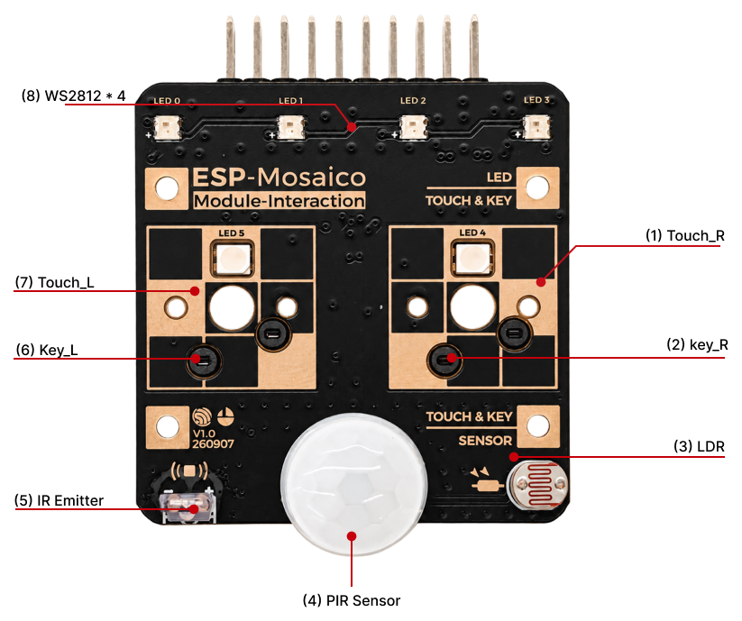
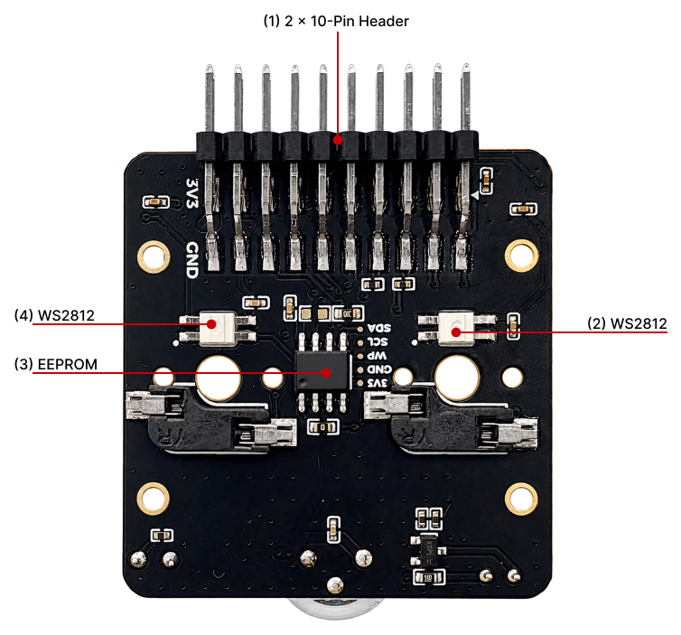
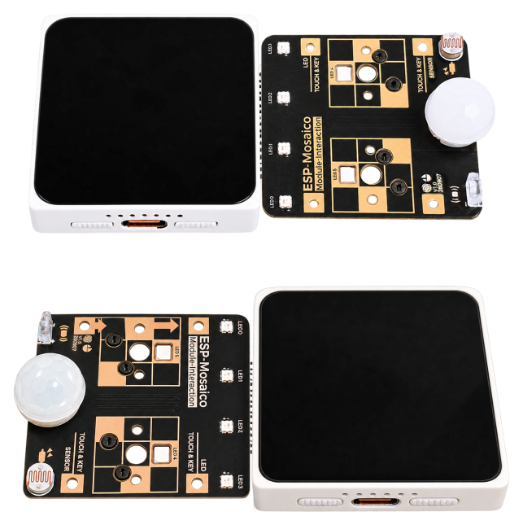
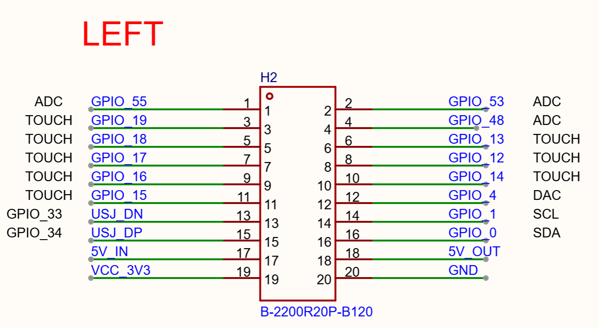
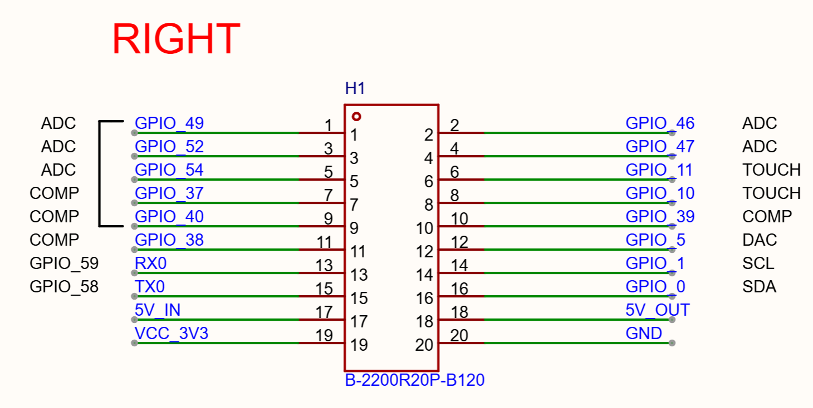

====================================================
ESP-Mosaico Multi-function Interaction Subboard
====================================================

:link_to_translation:`zh_CN:[中文]`

This guide describes the hardware interface, installation, and software usage of the ESP-Mosaico **Multi-function Interaction Subboard**. The board connects to the left or right ``2 × 10P`` module slot and provides ambient-light sensing, PIR motion detection, IR transmit, RGB LEDs, and key / touch input.

.. note::

  The interaction subboard can be inserted into the left slot (``H2``, EEPROM 0x50) or the right slot (``H1``, EEPROM 0x51). The right slot is mounted 180° relative to the left slot. For the mainboard revision, see :doc:`user_guide` or :doc:`user_guide_v1.0`.

The board integrates a GL5506 photoresistor, an AS312 PIR sensor, an IR LED driven by an AO3400A, six WS2812 LEDs (four at the top and two beneath the buttons), and two pads that can be used as mechanical keys or capacitive-touch channels. An AT24C02 EEPROM identifies the board. The board type is 0x16.

This document consists of the following major sections:

- `Getting Started`_: Installation, power, and how to use the board.
- `Hardware Reference`_: Left/right pin map and peripheral notes.
- `Hardware Revision Details`_: Hardware revision history (if any).
- `Related Documents`_: Links to related documentation.
- `Disclaimer and Copyright Notice`_: Disclaimer and copyright notice.

.. _Getting-started_esp-mosaico-interact-en:

Getting Started
===============

Description of Components
-------------------------

The front view and its main components are shown first, followed by the back view.

Front
^^^^^

   Interaction subboard front (Click to enlarge)

The following describes the main components on the front by callout number, in clockwise order.

.. list-table::
   :widths: 8 28 64
   :header-rows: 1

   * - No.
     - Key Component
     - Description
   * - 1
     - Touch_R
     - Right touch pad, usable as a capacitive-touch channel.
   * - 2
     - key_R
     - Right mechanical key, active-low.
   * - 3
     - LDR
     - GL5506 photoresistor sampled by ADC for ambient light.
   * - 4
     - PIR Sensor
     - AS312 PIR sensor that outputs a motion-detect level.
   * - 5
     - IR Emitter
     - Infrared emitter driven by AO3400A. Default protocol is NEC at 38 kHz.
   * - 6
     - Key_L
     - Left mechanical key, active-low.
   * - 7
     - Touch_L
     - Left touch pad, usable as a capacitive-touch channel.
   * - 8
     - WS2812 × 4
     - Top LEDs LED0–LED3: four addressable RGB LEDs on a single data line.

Back
^^^^

   Interaction subboard back (Click to enlarge)

The following describes the main components on the back using the callout numbers in the figure.

.. list-table::
   :widths: 8 28 64
   :header-rows: 1

   * - No.
     - Key Component
     - Description
   * - 1
     - 2 × 10-Pin Header
     - 2 × 10P, 2.54 mm pitch header that mates with the BaseBoard left/right module slots.
   * - 2
     - WS2812
     - Addressable RGB LED on the right side of the figure.
   * - 3
     - EEPROM
     - AT24C02 module EEPROM. Address 0x50 on the left slot and 0x51 on the right slot. Board type 0x16.
   * - 4
     - WS2812
     - Addressable RGB LED on the left side of the figure.

Start Using the Board
---------------------

Required Hardware
^^^^^^^^^^^^^^^^^

- ESP-Mosaico (CoreBoard V1.0 or V1.2)
- ESP-Mosaico Multi-function Interaction Subboard
- USB cable (data-capable)
- Computer (Windows, Linux, or macOS)

Installation
^^^^^^^^^^^^

   Interaction subboard mounting orientation (Click to enlarge)

1. With the host powered off, or with the external 3.3 V / 5 V outputs disabled, insert the board into the left or right module slot. Rotate the board 180° when using the right slot.
2. Power ESP-Mosaico from Type-C and turn it on. The expansion 3.3 V / 5 V rails are output only when GPIO60 is driven low.
3. After power-on, the host identifies the interaction subboard from its EEPROM (board type 0x16). A board without this information is not recognized.

How to Use
^^^^^^^^^^

Once the board is recognized, the display shows a control for each inserted slot. Switch among ambient light (LDR), motion (PIR), infrared transmit (IR), RGB LEDs (LED), keys (Key), and touch (Touch). The left and right slots can be used at the same time, and their functions are independent.

.. _Hardware-reference_esp-mosaico-interact-en:

Hardware Reference
==================

Slots and Discovery
-------------------

ESP-Mosaico distinguishes the two slots by EEPROM address:

.. list-table::
   :widths: 20 20 60
   :header-rows: 1

   * - Slot
     - EEPROM Address
     - Description
   * - Left (``H2``)
     - 0x50
     - Address-select GPIO14, driven low
   * - Right (``H1``)
     - 0x51
     - Address-select GPIO39, driven high; mounted 180° relative to the left slot

Module I2C uses the expansion SDA / SCL pins (GPIO0 / GPIO1). On CoreBoard **V1.2** this is external I2C1; on **V1.0** it is the shared onboard I2C bus.

Left and Right Pin Map
----------------------

The following table lists the interaction-subboard signals on both slots.

.. list-table::
   :widths: 22 20 20 38
   :header-rows: 1

   * - Signal
     - Left GPIO
     - Right GPIO
     - Description
   * - LDR
     - GPIO53
     - GPIO46
     - GL5506 photoresistor ADC
   * - IR
     - GPIO48
     - GPIO47
     - IR transmit drive (AO3400A)
   * - KEY_L / Touch
     - GPIO13
     - GPIO11
     - Left key or touch channel
   * - KEY_R / Touch
     - GPIO12
     - GPIO10
     - Right key or touch channel
   * - PIR
     - GPIO4
     - GPIO5
     - AS312 PIR input
   * - WS2812
     - GPIO15
     - GPIO38
     - Data line for 6 RGB LEDs
   * - SDA
     - GPIO0
     - GPIO0
     - Module I2C / EEPROM
   * - SCL
     - GPIO1
     - GPIO1
     - Module I2C / EEPROM
   * - VCC_3V3
     - Slot pin 19
     - Slot pin 19
     - 3.3 V supply (controlled by GPIO60)
   * - 5V / GND
     - Slot pins 17 / 18 / 20
     - Slot pins 17 / 18 / 20
     - 5 V input/output and ground

The host connector definition is in :doc:`user_guide`.

   Left Module Interface Schematic (Click to enlarge)

   Right Module Interface Schematic (Click to enlarge)

Peripheral Notes
----------------

Photoresistor (LDR)
^^^^^^^^^^^^^^^^^^^

The GL5506 is sampled by ADC. The reading is shown as a 0–100 light percentage, which can indicate ambient brightness or drive LED intensity.

PIR Motion Sensor
^^^^^^^^^^^^^^^^^

The AS312 outputs a motion-detect level. When motion is detected, the corresponding status on the display lights up.

Infrared Transmit (IR)
^^^^^^^^^^^^^^^^^^^^^^

The IR LED is driven by an AO3400A and sends NEC frames (8-bit address and command) at 38 kHz.

WS2812
^^^^^^

The board has **6** WS2812 LEDs. Colors can be set individually or together, and the brightness can be limited.

Keys and Touch
^^^^^^^^^^^^^^

``KEY_L`` / ``KEY_R`` share the same pads and can be used as keys or touch:

- **Key**: active when pressed to ground.
- **Touch**: a finger on the pad triggers it, and pressing the key does as well.

Power
-----

The board is powered from the host ``VCC_3V3`` rail, which is output only when GPIO60 is driven low. On CoreBoard V1.2 the external 3.3 V rail is generated by a dedicated DCDC and is isolated from the internal MCU supply.

Hardware Revision Details
==========================

No previous versions.

.. _Related-documents_esp-mosaico-interact-en:

Related Documents
=================

-  `ESP-Mosaico Interaction Subboard Schematic`_ (PDF)

.. _ESP-Mosaico Interaction Subboard Schematic: https://dl.espressif.com/AE/Mosaico/SCH_SCH_ESP-Mosaico_Interaction_V1_0_2026-09-24.pdf

Disclaimer and Copyright Notice
===============================

Please refer to the :doc:`Disclaimer and Copyright Notice <../disclaimer-and-copyright>`.
