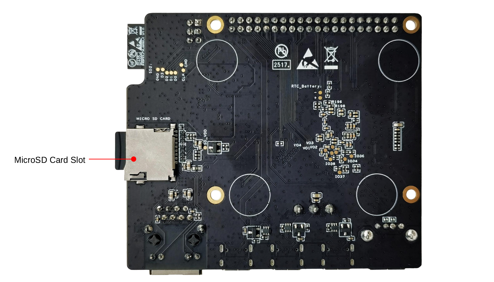
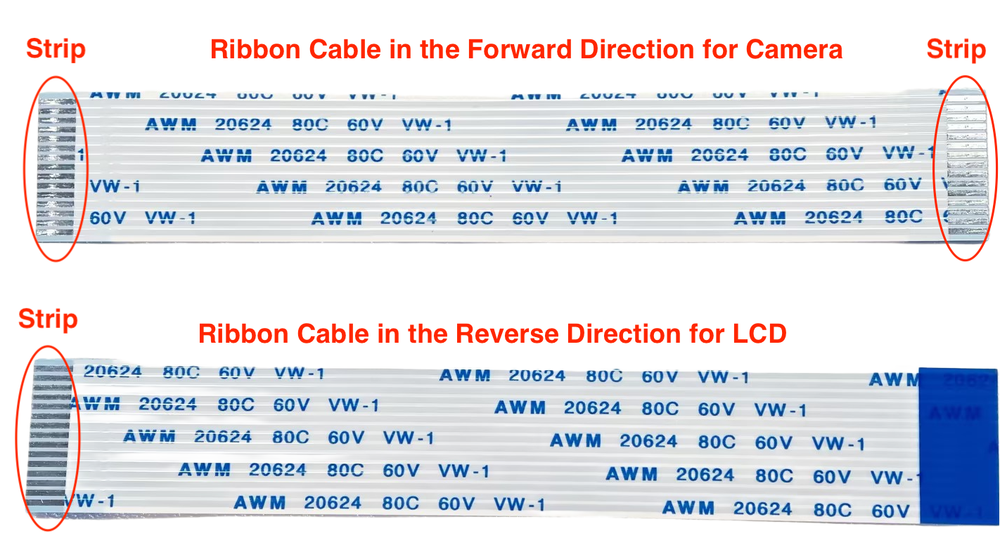
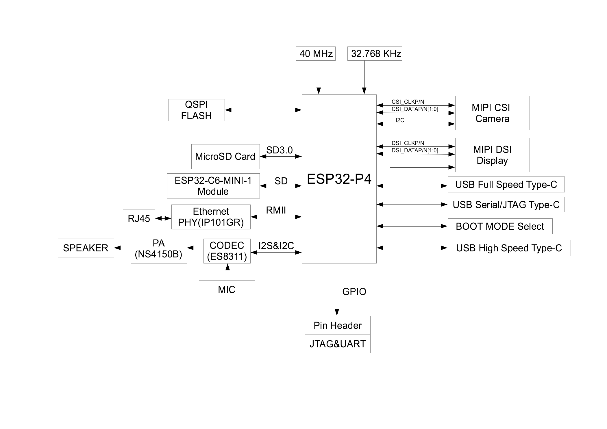

===========================
ESP32-P4X-Function-EV-Board
===========================

:link_to_translation:`zh_CN:[中文]`

.. note::

    The ESP32-P4X-Function-EV-Board with the ESP32-P4 chip revision v3.1 does not support Secure Download. Please do not enable Secure Download Mode. For more details, please refer to `ESP32-P4 Series SoC Errata`_ > ROM-770.

    To identify the embedded chip revision, refer to `ESP32-P4 Series SoC Errata`_ > `Chip Revision Identification`_.

This user guide will help you get started with ESP32-P4X-Function-EV-Board and will also provide more in-depth information.

ESP32-P4X-Function-EV-Board is a multimedia development board based on the ESP32-P4 chip. ESP32-P4 chip features a dual-core RISC-V processor and supports up to 32 MB PSRAM. In addition, ESP32-P4 supports USB 2.0 specification, MIPI-CSI/DSI, H264 Encoder, and various other peripherals. With all of its outstanding features, the board is an ideal choice for developing low-cost, high-performance, low-power network-connected audio and video products.

The 2.4 GHz Wi-Fi 6 & Bluetooth 5 (LE) module ESP32-C6-MINI-1 serves as the Wi-Fi and Bluetooth module of the board. The board also includes a 7-inch capacitive touch screen with a resolution of 1024 x 600 and a 2MP camera with MIPI CSI, enriching the user interaction experience. The development board is suitable for prototyping a wide range of products, including visual doorbells, network cameras, smart home central control screens, LCD electronic price tags, two-wheel vehicle dashboards, etc.

Most of the I/O pins are broken out to the pin headers for easy interfacing. Developers can connect peripherals with jumper wires.

.. figure:: ../../_static/esp32-p4x-function-ev-board/esp32-p4x-function-ev-board-isometric_v1.6.png
    :align: center
    :alt: ESP32-P4X-Function-EV-Board
    :figclass: align-center

    ESP32-P4X-Function-EV-Board

The document consists of the following major sections:

- `Getting Started`_: Overview of ESP32-P4X-Function-EV-Board and hardware/software setup instructions to get started.
- `Hardware Reference`_: More detailed information about the ESP32-P4X-Function-EV-Board's hardware.
- `Hardware Revision Details`_: Revision history, known issues, and links to user guides for previous versions (if any) of ESP32-P4X-Function-EV-Board.
- `Related Documents`_: Links to related documentation.
- `Disclaimer and Copyright Notice`_: Link to the disclaimer and copyright notice.

Getting Started
===============

This section provides a brief introduction to ESP32-P4X-Function-EV-Board, instructions on how to do the initial hardware setup and how to flash firmware onto it.

Description of Components
-------------------------

.. _user-guide-esp32-p4x-function-ev-board-front:

.. figure:: ../../_static/esp32-p4x-function-ev-board/esp32-p4x-function-ev-board-annotated-photo-front_v1.6.png
    :align: center
    :width: 100%
    :alt: ESP32-P4X-Function-EV-Board - front (click to enlarge)
    :figclass: align-center

    ESP32-P4X-Function-EV-Board - front (click to enlarge)

    ESP32-P4X-Function-EV-Board - back (click to enlarge)

The key components on the front and back of the board are described below, starting from J1 and proceeding clockwise.

.. list-table::
   :widths: 10 20 70
   :header-rows: 1

   * - No.
     - Key Component
     - Description
   * - 1
     - J1
     - All available GPIO pins are broken out to the header block J1 for easy interfacing. For more details, see :ref:`header-block_p4x`.
   * - 2
     - ESP32-C6 Module Programming Connector
     - The connector can be used with ESP-Prog or other UART tools to flash firmware onto the ESP32-C6 module.
   * - 3
     - ESP32-C6-MINI-1 Module
     - This module serves as the Wi-Fi and Bluetooth communication module for the board.
   * - 4
     - Microphone
     - Onboard microphone connected to the Audio Codec Chip.
   * - 5
     - Reset Button
     - Resets the board.
   * - 6
     - Audio Codec Chip
     - ES8311 is a low-power mono audio codec chip. It includes a single-channel ADC, a single-channel DAC, a low-noise pre-amplifier, a headphone driver, digital sound effects, analog mixing, and gain functions. It interfaces with the ESP32-P4 chip over I2S and I2C buses to provide hardware audio processing independent of the audio application.
   * - 7
     - Speaker Output Port
     - This port is used to connect a speaker. The maximum output power can drive a 4 Ω, 3 W speaker. The pin spacing is 2.00 mm (0.08”).
   * - 8
     - Audio PA Chip
     - NS4150B is an EMI-compliant, 3 W mono Class D audio power amplifier that amplifies audio signals from the audio codec chip to drive speakers.
   * - 9
     - 5 V to 3.3 V LDO
     - A power regulator that converts a 5 V supply to a 3.3 V output.
   * - 10
     - BOOT Button
     - The boot mode control button. Press the **Reset Button** while holding down the **Boot Button** to reset ESP32-P4 and enter firmware download mode. Firmware can then be downloaded to SPI flash via the USB Serial/JTAG Port.
   * - 11
     - Ethernet PHY IC
     - Ethernet PHY chip IP101GR connected to the ESP32-P4 EMAC RMII interface and RJ45 Ethernet Port.
   * - 12
     - Buck Converter
     - A buck DC-DC converter for the 3.3 V power supply.
   * - 13
     - 5 V Power-on LED
     - This LED lights up when the board is powered through any USB Type-C port.
   * - 14
     - RJ45 Ethernet Port
     - An Ethernet Port supporting 10/100 Mbps adaptive.

.. list-table::
   :widths: 10 20 70
   :header-rows: 1

   * - No.
     - Key Component
     - Description
   * - 15
     - USB Full-speed Port
     - USB Type-C port that supports USB 2.0 Full-speed data rate. It can be used to power the board and serve as a communication interface.
   * - 16
     - USB Serial/JTAG Port
     - USB Type-C port that supports USB 2.0 Full-speed data rate. It can be used to flash firmware to the ESP32-P4 chip, communicate with the chip via the USB protocol, and perform JTAG debugging.
   * - 17
     - USB 2.0 Type-C Port
     - The USB 2.0 Type-C Port is connected to the USB 2.0 OTG High-Speed interface of ESP32-P4, compliant with the USB 2.0 specification. When communicating with other devices via this port, ESP32-P4 acts as a USB device connecting to a USB host. Please note that USB 2.0 Type-C Port and USB 2.0 Type-A Port cannot be used simultaneously. USB 2.0 Type-C Port can also be used for powering the board.
   * - 18
     - USB 2.0 Type-A Port
     - The USB 2.0 Type-A Port is connected to the USB 2.0 OTG High-Speed interface of ESP32-P4, compliant with the USB 2.0 specification. When communicating with other devices via this port, ESP32-P4 acts as a USB host, providing up to 500 mA of current. Please note that USB 2.0 Type-C Port and USB 2.0 Type-A Port cannot be used simultaneously.
   * - 19
     - Power Switch
     - Power On/Off Switch. Toggling toward the ON sign powers the board on (5 V), toggling away from the ON sign powers the board off.
   * - 20
     - Switch
     - TPS2051C is a USB power switch. When the USB 2.0 Type-A port is used for ESP32-P4 as a USB host to connect external USB devices, power must be supplied to those devices. TPS2051C limits the external supply current to within 500 mA, complying with the USB specification and preventing external devices from drawing excessive current. It also protects the development board from damage caused by short circuits or overloads on external devices.
   * - 21
     - MIPI CSI Connector
     - The FPC connector 1.0K-GT-15PB is used for connecting external camera modules to enable image transmission. For details, please refer to 1.0K-GT-15PB specification in Related Documents. FPC specifications: 1.0 mm pitch, 0.7 mm pin width, 0.3 mm thickness, 15 pins.
   * - 22
     - Buck Converter
     - A buck DC-DC converter for VDD_HP power supply of ESP32-P4.
   * - 23
     - ESP32-P4
     - A high-performance MCU with large internal memory and powerful image and voice processing capabilities.
   * - 24
     - 40 MHz XTAL
     - An external precision 40 MHz crystal oscillator that serves as a clock for the system.
   * - 25
     - 32.768 kHz XTAL
     - An external precision 32.768 kHz crystal oscillator that serves as a low-power clock while the chip is in deep-sleep mode.
   * - 26
     - MIPI DSI Connector
     - The FPC connector 1.0K-GT-15PB is used for connecting displays. For details, please refer to 1.0K-GT-15PB Specification in Related Documents. FPC specifications: 1.0 mm pitch, 0.7 mm pin width, 0.3 mm thickness, 15 pins.
   * - 27
     - SPI flash [1]_
     - The 16 MB flash is connected to the chip via the SPI interface.
   * - 28
     - MicroSD Card Slot
     - The development board supports a MicroSD card in 4-bit mode and can store or play audio files from the MicroSD card.

.. [1] By default, the onboard SPI flash connected to the ESP32-P4 chip operates at a maximum clock frequency of 80 MHz and does not support the auto suspend feature. If you have a requirement for a higher flash clock frequency of 120 MHz or if you need the flash auto suspend feature, please `contact us <https://www.espressif.com/en/contact-us/sales-questions>`_.

.. note::

    Usage notes for LDO_VO3 / LDO_VO4:

    On the ESP32-P4X-Function-EV-Board, LDO_VO3 and LDO_VO4 are used to power certain on-board VDD domains. Users must configure the correct output voltage and enable state in software.

    In Light-sleep or Deep-sleep mode, if LDO_VO3 / LDO_VO4 remain enabled, the system power consumption will be relatively high. Even when turned off, the total power consumption may still exceed the typical low-power specifications listed in the chip datasheet due to the board-level power architecture.

    For applications with strict power consumption requirements, it is recommended to optimize the power architecture in custom hardware designs.

Accessories
------------------

Optionally, the following accessories are included in the package:

- LCD and its accessories (optional)

  * 7-inch capacitive touch screen with a resolution of 1024 x 600
  * LCD adapter board
  * Accessories bag, including DuPont wires, ribbon cable for LCD, long brass standoffs (20 mm in length), and short brass standoffs (8 mm in length)

- Camera and its accessories (optional)

  * 2MP camera with MIPI CSI
  * Camera adapter board
  * Ribbon cable for camera

    Ribbon Cables in Forward and Reverse Directions

.. note::

  Please note that the ribbon cable in the **forward direction**, whose strips at the two ends are on the same side, should be used for the **camera**; the ribbon cable in the **reverse direction**, whose strips at the two ends are on different sides, should be used for the **LCD**.

Application Examples
--------------------

The following application examples are available for ESP32-P4X-Function-EV-Board:

- :project:`ESP_Brookesia Phone <examples/esp32-p4-function-ev-board/examples/esp_brookesia_phone>` - Demonstrates an Android-like interface with multiple applications using ESP_Brookesia, utilizing MIPI-DSI, MIPI-CSI, ESP32-C6, SD card, and audio interfaces on a development board, providing a basis for efficient multimedia application development.
- :project:`LVGL Demo v8 <examples/esp32-p4-function-ev-board/examples/lvgl_demo_v8>` - Demonstrates how to port LVGL v8 and conduct performance testing using LVGL's built-in demos on an ESP32-P4X-Function-EV-Board with a 7-inch LCD screen, serving as a foundation for developing applications based on LVGL v8.
- :project:`LVGL Demo v9 <examples/esp32-p4-function-ev-board/examples/lvgl_demo_v9>` - Demonstrates how to port LVGL v9 and conduct performance testing using LVGL's built-in demos on an ESP32-P4X-Function-EV-Board, serving as a basis for developing applications based on LVGL v9.

For more examples and the latest updates, please refer to the :project:`examples <examples/esp32-p4-function-ev-board>` folder.

Alternatively, you can try the factory demo and other prebuilt examples directly in your web browser using `ESP Launchpad <https://espressif.github.io/esp-launchpad/?flashConfigURL=https://espressif2022.github.io/ESP32-P4-Function-EV-Board/launchpad.toml>`__. ESP Launchpad provides a convenient way to flash firmware to your board without installing ESP-IDF or compiling the source code.

To explore the application examples or to develop your own, please follow the steps outlined in the `Start Application Development`_ section.

Start Application Development
------------------------------------

Before powering up your ESP32-P4X-Function-EV-Board, please make sure that it is in good condition with no obvious signs of damage.

Required Hardware
^^^^^^^^^^^^^^^^^

- ESP32-P4X-Function-EV-Board
- USB cables
- Computer running Windows, Linux, or macOS

.. note::

  Be sure to use a good quality USB cable. Some cables are for charging only and do not provide the needed data lines nor work for programming the boards.

Optional Hardware
^^^^^^^^^^^^^^^^^

- MicroSD card

Hardware Setup
^^^^^^^^^^^^^^

Connect the ESP32-P4X-Function-EV-Board to your computer using a USB cable. The board can be powered through any of the USB Type-C ports. The USB Serial/JTAG Port is recommended for flashing firmware and debugging.

The figure below shows the overall appearance of the development board, LCD adapter board, and camera once fully assembled. The components description is available in :ref:`components-fully-assembled_p4x`.

.. figure:: ../../_static/esp32-p4x-function-ev-board/esp32-p4x-function-ev-board-assembled-board-overview.png
    :align: center
    :width: 80%
    :alt: Fully assembled ESP32-P4X-Function-EV-Board
    :figclass: align-center

    Fully assembled ESP32-P4X-Function-EV-Board

To connect the LCD, follow these steps:

1. Secure the development board to the LCD adapter board by attaching the short brass standoffs (8 mm in length) to the four standoff posts at the center of the LCD adapter board.
2. Connect the J3 header of the LCD adapter board to the MIPI DSI connector on the ESP32-P4X-Function-EV-Board using the LCD ribbon cable (**reverse direction**). Note that the LCD adapter board is already connected to the LCD.

.. figure:: ../../_static/esp32-p4x-function-ev-board/esp32-p4x-function-ev-board-assembled-board-lcd.png
    :align: center
    :width: 80%
    :alt: LCD ribbon cable details
    :figclass: align-center

    LCD ribbon cable details

3. Use a DuPont wire to connect the GPIO27 pin of the J1 header on the ESP32-P4X-Function-EV-Board to the RST_LCD pin of the J6 header on the LCD adapter board. The GPIO mapped to RST_LCD can be configured via software, with GPIO27 set as the default.
4. Use a DuPont wire to connect the GPIO26 pin of the J1 header on the ESP32-P4X-Function-EV-Board to the PWM pin of the J6 header on the LCD adapter board. The GPIO mapped to PWM can be configured via software, with GPIO26 set as the default.
5. It is recommended to power the LCD by connecting a USB cable to the J1 header of the LCD adapter board. If this is not feasible, use DuPont wires to connect the 5V and GND pins of the J1 header on the ESP32-P4X-Function-EV-Board to the 5V and GND pins of the LCD adapter board, provided that the development board has sufficient power supply.

.. figure:: ../../_static/esp32-p4x-function-ev-board/esp32-p4x-function-ev-board-assembled-dupont.png
    :align: center
    :width: 80%
    :alt: DuPont wire connections
    :figclass: align-center

    DuPont wire connections

In summary, the ESP32-P4X-Function-EV-Board and the LCD adapter board are connected via the following pins:

.. list-table:: DuPont Wire Connections
  :widths: 20 20
  :header-rows: 1

  * - ESP32-P4X-Function-EV-Board
    - LCD Adapter Board
  * - MIPI DSI connector
    - J3 header
  * - GPIO27 pin of J1 header
    - RST_LCD pin of J6 header
  * - GPIO26 pin of J1 header
    - PWM pin of J6 header
  * - 5V pin of J1 header
    - 5V pin of J6 header
  * - GND pin of J1 header
    - GND pin of J6 header

6. Attach the long brass standoffs (20 mm in length) to the four standoff posts on the periphery of the LCD adapter board to allow the LCD to stand upright.

.. note::

  - If you power the LCD adapter board by connecting a USB cable to its J1 header, you do not need to connect its 5V and GND pins to the corresponding pins on the development board.
  - To use the camera, connect the camera adapter board to the MIPI CSI connector on the development board using the camera ribbon cable (**forward direction**).

.. figure:: ../../_static/esp32-p4x-function-ev-board/esp32-p4x-function-ev-board-assembled-camera.png
    :align: center
    :width: 80%
    :alt: Camera
    :figclass: align-center

    Camera

.. _components-fully-assembled_p4x:

.. list-table:: Components Description of Fully Assembled ESP32-P4X-Function-EV-Board
  :widths: 10 20
  :header-rows: 1

  * - Component Number
    - Main Component
  * - 1
    - Long Brass Standoff
  * - 2
    - Camera Ribbon Cable
  * - 3
    - Short Brass Standoff
  * - 4
    - USB Cable
  * - 5
    - LCD Ribbon Cable
  * - 6
    - GPIO27 to RST_LCD
  * - 7
    - GPIO26 to PWM
  * - 8
    - GND to GND
  * - 9
    - 5V to 5V
  * - 10
    - Camera Front

Software Setup
^^^^^^^^^^^^^^

To set up your development environment and flash an application example onto your board, please follow the instructions in `ESP-IDF Get Started <https://docs.espressif.com/projects/esp-idf/en/latest/esp32p4/get-started/index.html>`__.

Hardware Reference
==================

Block Diagram
-------------

The block diagram below shows the components of ESP32-P4X-Function-EV-Board and their interconnections.

    ESP32-P4X-Function-EV-Board Block Diagram (click to enlarge)

.. _power-supply-options_p4x:

Power Supply Options
--------------------

Power can be supplied through any of the following ports:

- USB 2.0 Type-C Port
- USB Full-speed Port
- USB Serial/JTAG Port

If the USB cable used for debugging cannot provide enough current, you can connect the board to a power adapter via any available USB Type-C port.

.. _header-block_p4x:

Header Block
-------------

The table below provides the **Name** and **Function** of the pin header J1 of the board. The pin header names are shown in Figure :ref:`user-guide-esp32-p4x-function-ev-board-front`. The numbering is the same as in the schematic of `ESP32-P4X-Function-EV-Board Reference Design`_.

J1
^^^
===  =======  ==========  ==========================================
No.  Name     Type [2]_   Function
===  =======  ==========  ==========================================
1    3V3      P           3.3 V power supply
2    5V       P           5 V power supply
3    7        I/O/T       GPIO7
4    5V       P           5 V power supply
5    8        I/O/T       GPIO8
6    GND      GND         Ground
7    23       I/O/T       GPIO23
8    37       I/O/T       U0TXD, GPIO37
9    GND      GND         Ground
10   38       I/O/T       U0RXD, GPIO38
11   21       I/O/T       GPIO21
12   22       I/O/T       GPIO22
13   20       I/O/T       GPIO20
14   GND      GND         Ground
15   6        I/O/T       GPIO6
16   5        I/O/T       GPIO5
17   3V3      P           3.3 V power supply
18   4        I/O/T       GPIO4
19   3        I/O/T       GPIO3
20   GND      GND         Ground
21   2        I/O/T       GPIO2
22   NC(1)    I/O/T       GPIO1 [3]_
23   NC(0)    I/O/T       GPIO0 [3]_
24   36       I/O/T       GPIO36
25   GND      GND         Ground
26   32       I/O/T       GPIO32
27   NC       –           No connection
28   NC       –           No connection
29   33       I/O/T       GPIO33
30   GND      GND         Ground
31   26       I/O/T       GPIO26
32   54       I/O/T       GPIO54
33   48       I/O/T       GPIO48
34   GND      GND         Ground
35   53       I/O/T       GPIO53
36   46       I/O/T       GPIO46
37   47       I/O/T       GPIO47
38   27       I/O/T       GPIO27
39   GND      GND         Ground
40   NC(45)   I/O/T       GPIO45 [4]_
===  =======  ==========  ==========================================

.. [2] P: Power supply; I: Input; O: Output; T: High impedance.
.. [3] GPIO0 and GPIO1 can be enabled by disabling the XTAL_32K function, which can be achieved by moving R61 and R59 to R199 and R197, respectively.
.. [4] GPIO45 can be enabled by disabling the SD_PWRn function, which can be achieved by moving R231 to R100.

Hardware Revision Details
=========================

The difference between the ESP32-P4X-Function-EV-Board and the :doc:`ESP32-P4-Function-EV-Board <../esp32-p4-function-ev-board/user_guide>` is that the main chip on the former has been upgraded to the ESP32-P4 chip revision v3.1 or later version.

Related Documents
=================

.. only:: latex

   Please download the following documents from `the HTML version of esp-dev-kits Documentation <https://docs.espressif.com/projects/esp-dev-kits/en/latest/{IDF_TARGET_PATH_NAME}/index.html>`_.

* `ESP32-P4X-Function-EV-Board Reference Design`_ (ZIP)
* `ESP32-P4 Series SoC Errata`_
* `1.0K-GT-15PB Specification`_ (PDF)
* `Camera Datasheet`_ (PDF)
* `Display Datasheet`_ (PDF)
* `Datasheet of display driver chip EK73217BCGA`_ (PDF)
* `Datasheet of display driver chip EK79007AD`_ (PDF)
* `LCD Adapter Board Schematic`_ (PDF)
* `LCD Adapter Board PCB Layout`_ (PDF)
* `Camera Adapter Board Schematic`_ (PDF)
* `Camera Adapter Board PCB Layout`_ (PDF)
* `LCD Adapter Board Reference Design`_ (ZIP)
* `Camera Adapter Board Reference Design`_ (ZIP)

For further design documentation for the board, please contact us at `sales@espressif.com <sales@espressif.com>`_.

.. _ESP32-P4X-Function-EV-Board Reference Design: https://documentation.espressif.com/ESP32-P4X-Function-EV-Board-EN.zip
.. _ESP32-P4 Series SoC Errata: https://docs.espressif.com/projects/esp-chip-errata/en/latest/esp32p4/index.html
.. _1.0K-GT-15PB Specification: https://dl.espressif.com/dl/schematics/1.0K-GT-15PB_specification.pdf
.. _Camera Datasheet: https://dl.espressif.com/dl/schematics/camera_datasheet.pdf
.. _Display Datasheet: https://dl.espressif.com/dl/schematics/display_datasheet.pdf
.. _Datasheet of display driver chip EK73217BCGA: https://dl.espressif.com/dl/schematics/display_driver_chip_EK73217BCGA_datasheet.pdf
.. _Datasheet of display driver chip EK79007AD: https://dl.espressif.com/dl/schematics/display_driver_chip_EK79007AD_datasheet.pdf
.. _LCD Adapter Board Schematic: https://dl.espressif.com/dl/schematics/esp32-p4-function-ev-board-lcd-subboard-schematics.pdf
.. _LCD Adapter Board PCB Layout: https://dl.espressif.com/dl/schematics/esp32-p4-function-ev-board-lcd-subboard-pcb-layout.pdf
.. _Camera Adapter Board Schematic: https://dl.espressif.com/dl/schematics/esp32-p4-function-ev-board-camera-subboard-schematics.pdf
.. _Camera Adapter Board PCB Layout: https://dl.espressif.com/dl/schematics/esp32-p4-function-ev-board-camera-subboard-pcb-layout.pdf
.. _Chip Revision Identification: https://docs.espressif.com/projects/esp-chip-errata/en/latest/esp32p4/01-chip-identification/index.html#
.. _LCD Adapter Board Reference Design: https://dl.espressif.com/schematics/LCD Adapter Board Reference Design.zip
.. _Camera Adapter Board Reference Design: https://dl.espressif.com/schematics/Camera Adapter Board Reference Design.zip

Disclaimer and Copyright Notice
===============================

See :doc:`Disclaimer and Copyright Notice <../disclaimer-and-copyright>`.
