============
EchoEar
============

:link_to_translation:`zh_CN:[中文]`

.. note::

  Please check the silkscreen version number on the mainboard to confirm your development board version. For v1.0 version development boards, please refer to the current user guide.
  
This guide will help you get started with EchoEar quickly and provide detailed information about this development board.

EchoEar is an intelligent AI development kit. It is suitable for voice interaction products that require large model capabilities, such as toys, smart speakers, and smart central control systems. The device is equipped with an ESP32-S3-WROOM-1 module, a 1.85-inch QSPI circular touch screen, dual microphone array, and supports offline voice wake-up and sound source localization algorithms. Combined with the large model capabilities provided by OpenAI，Xiaozhi AI, Gemini, etc. EchoEar can achieve full-duplex voice interaction, multimodal recognition, and intelligent agent control, providing a solid foundation for developers to create complete edge-side AI application experiences.

EchoEar's main controller uses the Espressif ESP32-S3-WROOM-2-N32R16V module, supporting 2.4 GHz Wi-Fi and Bluetooth 5 (LE) wireless connectivity. For storage, the entire device has 16MB PSRAM and 32MB Flash storage space, and is also equipped with a microSD card slot that can support up to 32GB, meeting the needs of voice interaction and multimedia processing. It features a 1.85-inch circular touch screen (360×360 resolution) with ESP32-S3 native touch sensors, providing an intuitive and rich interactive experience.

For audio, EchoEar has a built-in 3W speaker and dual microphone array, supporting local voice wake-up and sound source localization. The power system is compatible with 5V DC and 3.7V 700mAh lithium battery power supply. Additionally, it integrates a USB-C interface for power supply and programming download, while reserving a Pogopin interface for convenient functional expansion.

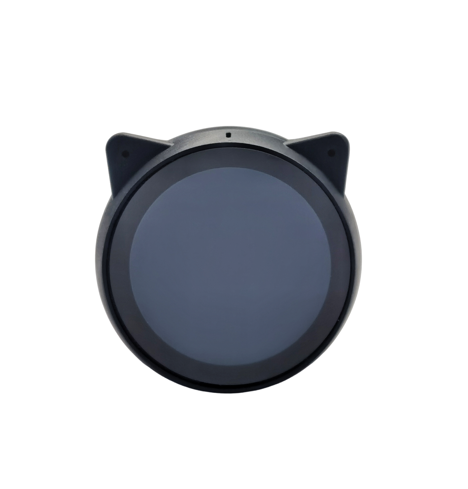

   EchoEar Front View (Click to enlarge)

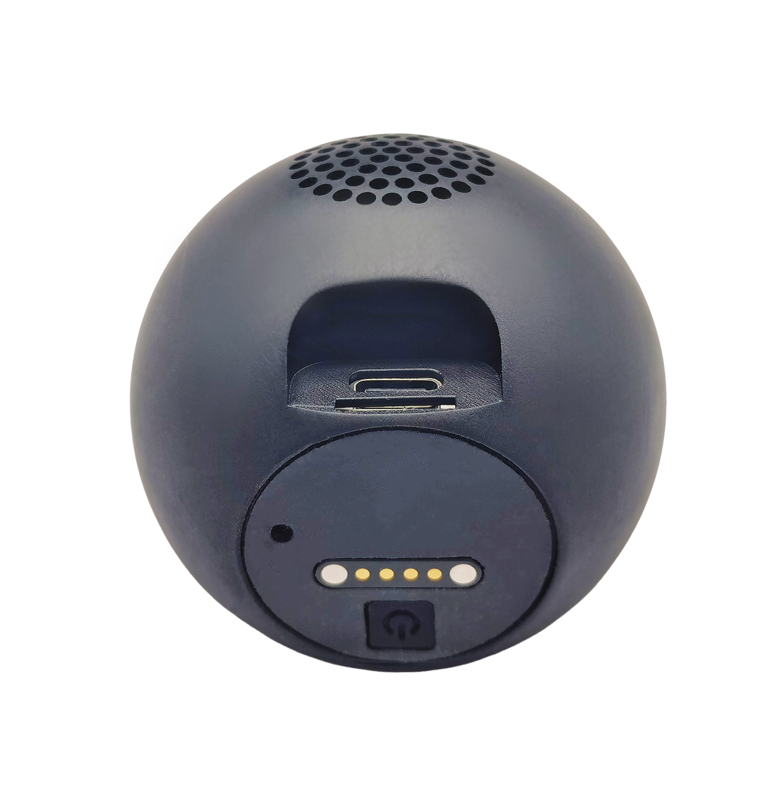

   EchoEar Back View (Click to enlarge)

This guide includes the following content:

- `Getting Started`_: Briefly introduces EchoEar and hardware/software setup guides.
- `Hardware Reference`_: Provides detailed information about EchoEar's hardware.
- `Hardware Versions`_: Introduces hardware historical versions and known issues, and provides links to getting started guides for historical version development boards (if available).
- `Related Documents`_: Lists links to related documents.

.. _Getting-started_echoear:

Getting Started
======================

This section introduces how to start using EchoEar. First, we introduce some basic information about EchoEar, then in the `Application Development`_ chapter, we explain how to start development using this development board.

Component Introduction
------------------------------

.. figure:: ../../_static/esp32-s3-echoear/EchoEar_Coreboard_back_V1_0_comment.png
   :alt: EchoEar CoreBoard PCB Front View (Click to enlarge)
   :scale: 40%
   :figclass: align-center

   EchoEar CoreBoard PCB Front View (Click to enlarge)

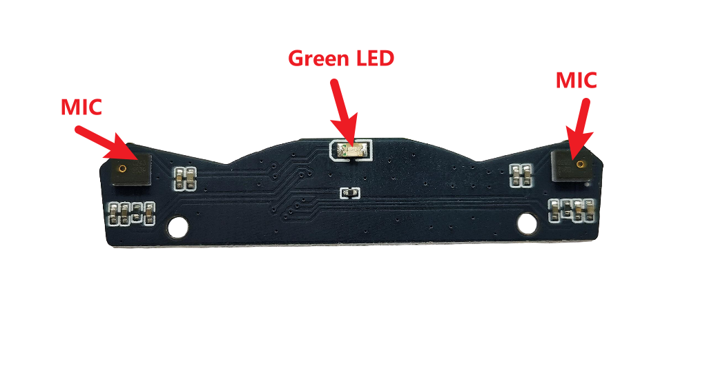

   EchoEar MicBoard PCB Front View (Click to enlarge)

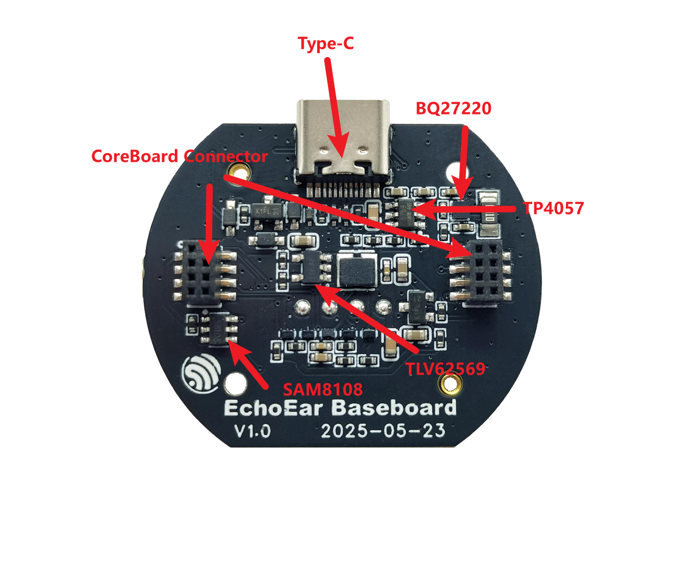

   EchoEar BaseBoard PCB Front View (Click to enlarge)

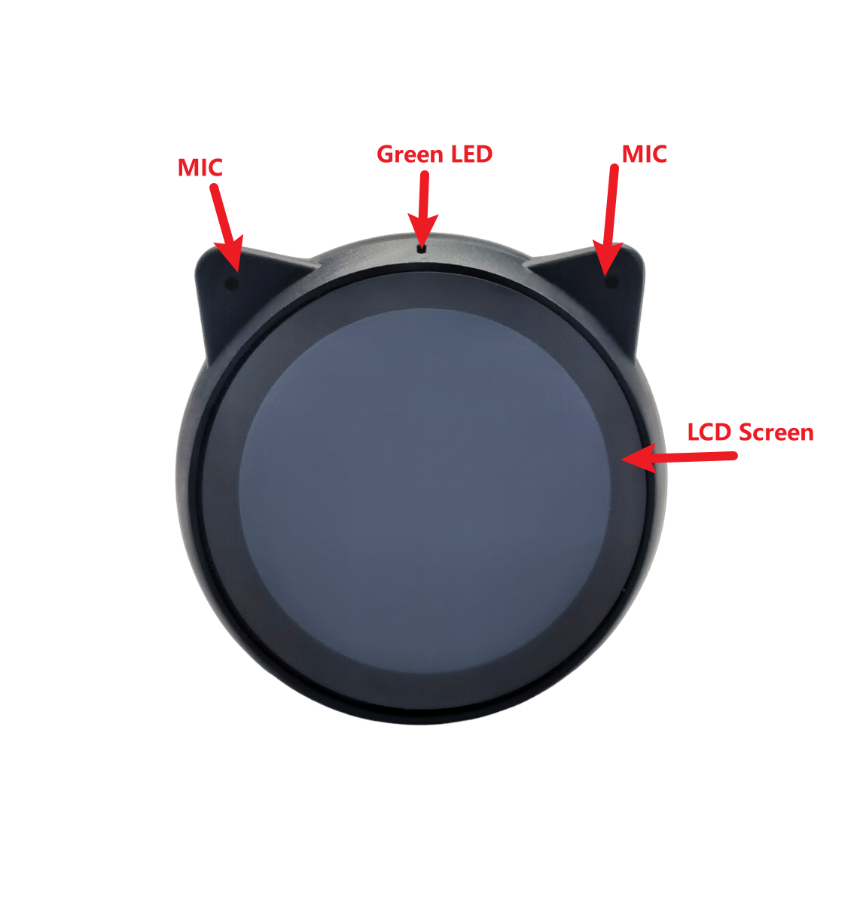

   EchoEar Front View (Click to enlarge)

The following introduces the main components on the front PCB in clockwise order. For user convenience, we have also labeled these components or interfaces on the EchoEar housing.

.. list-table::
   :widths: 30 70
   :header-rows: 1

   * - Main Components
     - Description
   * - :strong:`CoreBoard`
     -
   * - ESP32-S3-WROOM-2-N32R16V
     - Main controller chip, integrates 32MB Flash and 16MB PSRAM, supports 2.4 GHz Wi-Fi and Bluetooth 5 (LE) wireless connectivity.
   * - Battery Connector
     - Battery connector for connecting 3.7V 700mAh lithium battery, top is positive, bottom is negative.
   * - LCD FPC Connector
     - For connecting 1.85-inch circular LCD screen with 360 x 360 resolution. For detailed parameters, please refer to the `Display Specification`_.
   * - MicBoard Connector
     - MicBoard PCB connector, connects dual microphone array and status indicator LED.
   * - Touch Connector
     - Touch connector for connecting touch copper foil to achieve touch interaction functionality.
   * - Speaker Connector
     - 2-wire speaker connector for connecting built-in 3W speaker.
   * - :strong:`MicBoard`
     -
   * - Green LED
     - Green LED indicator.
   * - MIC (Microphone Array)
     - Dual LMA3729T381-OY3S microphone array, supports local voice wake-up and sound source localization functionality.
   * - :strong:`BaseBoard`
     -
   * - Bq27220 (Battery Management Chip)
     - Battery management chip for battery level detection, charging management, and power status monitoring.
   * - TP4057 (Lithium Battery Charging Chip)
     - Lithium battery charging chip for charging lithium batteries with 250mA charging current.
   * - CoreBoard Connector
     - CoreBoard PCB connector, connects core board with base board.
   * - TlV62569 (DCDC Chip)
     - Buck converter chip for converting 5V power to 3.3V power, providing stable power supply for the system.
   * - SAM8108 (Power Control Chip)
     - Power control chip for controlling device power on/off. Single click of POWER button can toggle power on/off status.
   * - Type-C (USB-C Interface)
     - USB-C interface for power supply, programming download, and debugging, supports charging lithium batteries.

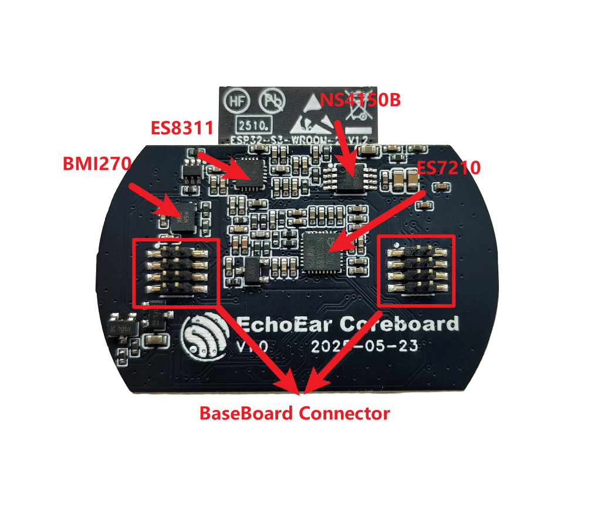

   EchoEar CoreBoard PCB Back View (Click to enlarge)

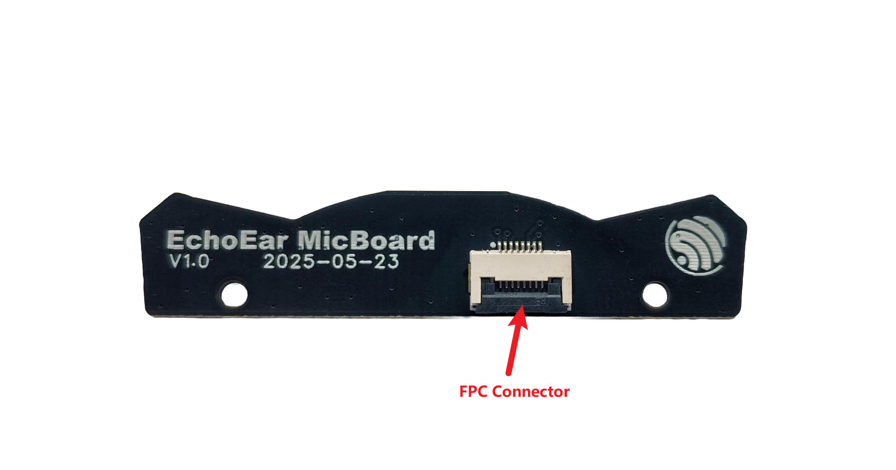

   EchoEar MicBoard PCB Back View (Click to enlarge)

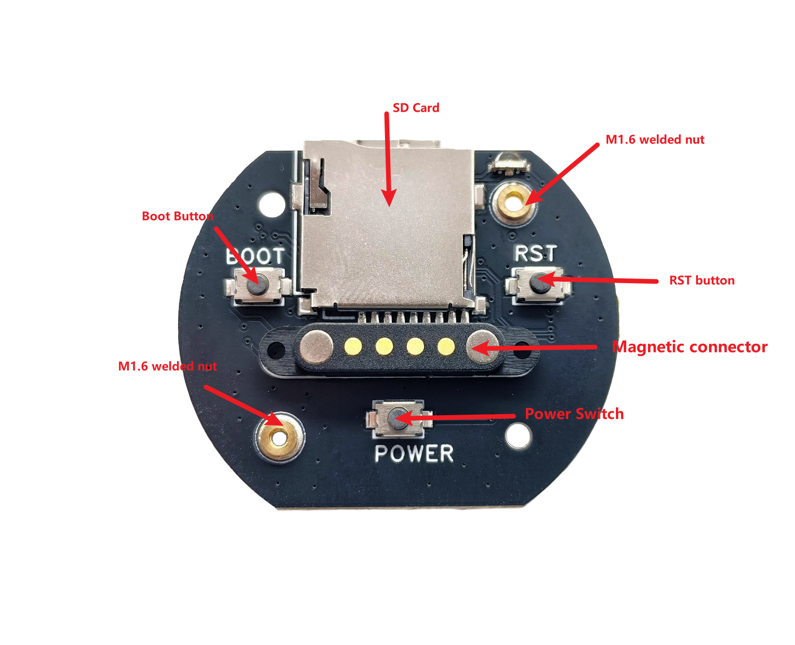

   EchoEar BaseBoard PCB Back View (Click to enlarge)

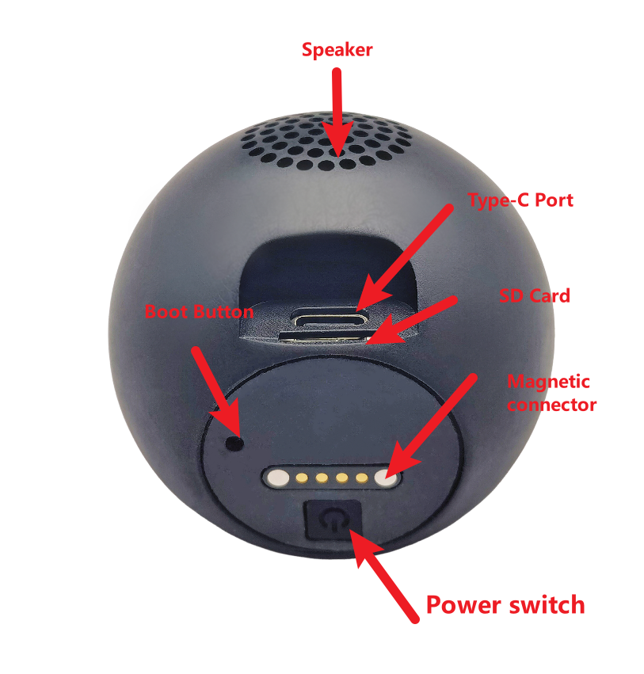

   EchoEar Back View (Click to enlarge)

The following introduces the main components on the back PCB in clockwise order. For user convenience, we have also labeled these components or interfaces on the EchoEar housing.

.. list-table::
   :widths: 30 70
   :header-rows: 1

   * - Main Components
     - Description
   * - :strong:`CoreBoard`
     -
   * - NS4150B (Class D Amplifier)
     - Ultra-low EMI, filterless, 3W mono Class D audio amplifier.
   * - ES7210 (Audio Decoder Chip)
     - High-performance 4-channel audio decoder chip, supports I2S/PDM/TDM data ports.
   * - BaseBoard Connector
     - Base board connector for connecting base board with CoreBoard.
   * - BMI270 (IMU - Inertial Measurement Unit)
     - 6-axis intelligent low-power inertial measurement unit for high-performance applications.
   * - ES8311 (Audio Codec Chip)
     - Low-power mono audio codec with high-performance multi-bit Delta-Sigma audio ADC and DAC.
   * - :strong:`MicBoard`
     -
   * - FPC Connector
     - Connects MicBoard with CoreBoard FPC connector.
   * - :strong:`BaseBoard`
     -
   * - M1.6 Welded Nut
     - For fixing main board to housing.
   * - RST Button (Reset Button)
     - For resetting the main board.
   * - Magnetic Connector
     - For functional expansion, provides a serial port and 5V power interface, can connect to rotating base and other devices.
   * - POWER Switch
     - For controlling device power on/off. Single click of POWER button can toggle power on/off status.
   * - BOOT Button
     - When powering on, hold this button to enter download mode.
   * - SD Card Slot
     - Supports up to 32GB microSD card slot for storing audio, images, videos, and other data.

Application Development
----------------------------

Before powering on, please ensure EchoEar is intact and undamaged.

Required Hardware
^^^^^^^^^^^^^^^^^^^^^^

- EchoEar
- USB data cable
- Computer (Windows, Linux, or macOS)

.. note::

  Please ensure you use a high-quality USB data cable. Some data cables can only be used for charging and cannot be used for data transmission and programming.

Hardware Setup
^^^^^^^^^^^^^^^^^^^^^^

Use a USB data cable to connect EchoEar to your computer through the ``Type-C (USB-C Interface)`` for firmware burning, debugging, and power supply.

Software Setup
^^^^^^^^^^^^^^^^^^^^^^

Please go to the `Quick Start <https://docs.espressif.com/projects/esp-idf/en/latest/esp32s3/get-started/index.html>`__ and refer to the `Detailed Installation Steps <https://docs.espressif.com/projects/esp-idf/en/latest/esp32s3/get-started/index.html#get-started-how-to-get-esp-idf>`__ section to see how to quickly set up the development environment.

Development board application examples are stored in the `esp-brookesia <https://github.com/espressif/esp-brookesia/tree/master/products/speaker>`_ project.

.. _Hardware-reference_echoear:

Hardware Reference
======================

Functional Block Diagram
-----------------------------

The main components and connection methods of EchoEar are shown in the figure below.

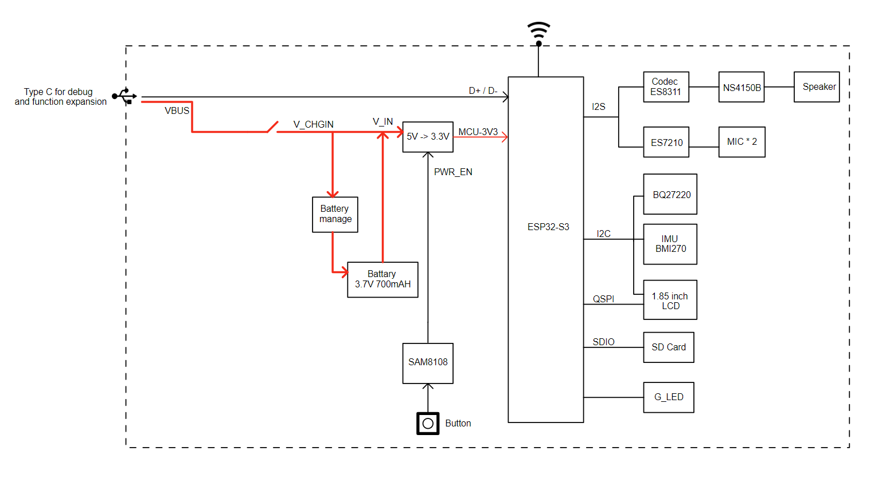

   EchoEar Functional Block Diagram (Click to enlarge)

Power Options
-----------------------------

The development board can be powered through the following methods:

1. Power through ``Type-C (USB-C Interface)``

   When using this method, connect the device's Type-C interface using a USB Type-C data cable. If a lithium battery is installed, you need to press the ``POWER`` button to enable power supply to the device.

2. Power through ``Magnetic Connector``

   When using this method, connect the device to the corresponding magnetic connector base to power the device. If a lithium battery is installed, you need to press the ``POWER`` button to enable power supply to the device.

  .. figure:: ../../_static/esp32-s3-echoear/EchoEar_Magnetic_connector_V1_0.png
   :alt: Magnetic Connector (Click to enlarge)
   :scale: 50%
   :figclass: align-center

   Magnetic Connector (Click to enlarge)

3. Power through ``Battery``

   The device has an integrated 3.7V 700mAh lithium battery. Press the ``POWER`` button to power the device.

Any of the above external power supply methods can charge the internal lithium battery.

Type-C Interface
-----------------------------

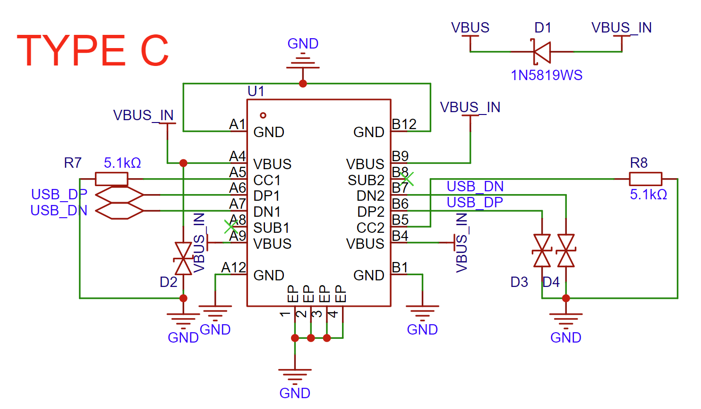

   Type-C Interface Circuit Diagram (Click to enlarge)

Magnetic Connector Interface
-----------------------------

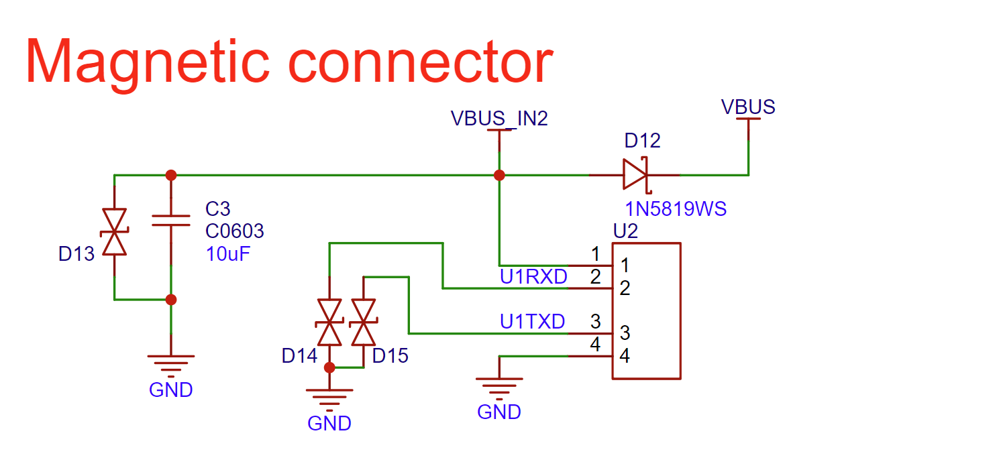

   Magnetic Connector Interface Circuit Diagram (Click to enlarge)

LCD Interface
-----------------------------

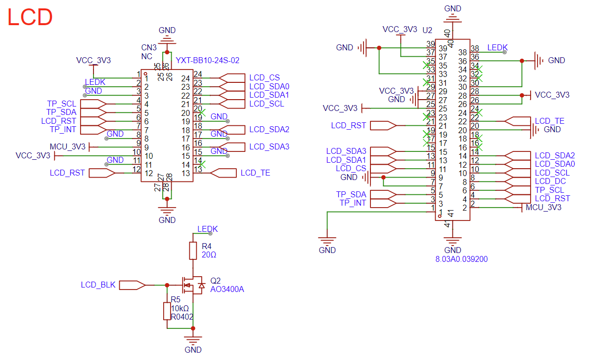

   LCD Interface Circuit Diagram (Click to enlarge)

Please note that the CN3 interface is reserved for other screen compatibility and is currently not enabled.
The U2 interface is the officially used LCD screen interface. The screen model used by this development board is `ST77916 <https://dl.espressif.com/AE/esp-dev-kits/UE018HV-RB39-A002A%20%20V1.0%20SPEC.pdf>`_, LCD: 1.85'', 360x360, ST77916, QSPI Interface. ``LCD_BLK`` (GPIO43) can be used to control screen backlight.

SD Card Interface
-----------------------------

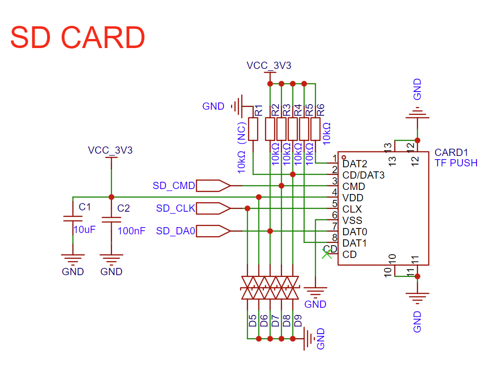

   SD Card Interface Circuit Diagram (Click to enlarge)

**Please note that the SD card interface supports:**

* 1-wire SD bus configuration
* Communication through SDIO protocol

Power Switch Circuit
-----------------------------

.. figure:: ../../_static/esp32-s3-echoear/EchoEar_sch_powerswitch_V1_0.png
   :alt: Power Switch Circuit Diagram (Click to enlarge)
   :scale: 50%
   :figclass: align-center

   Power Switch Circuit Diagram (Click to enlarge)

Charging Circuit
-----------------------------

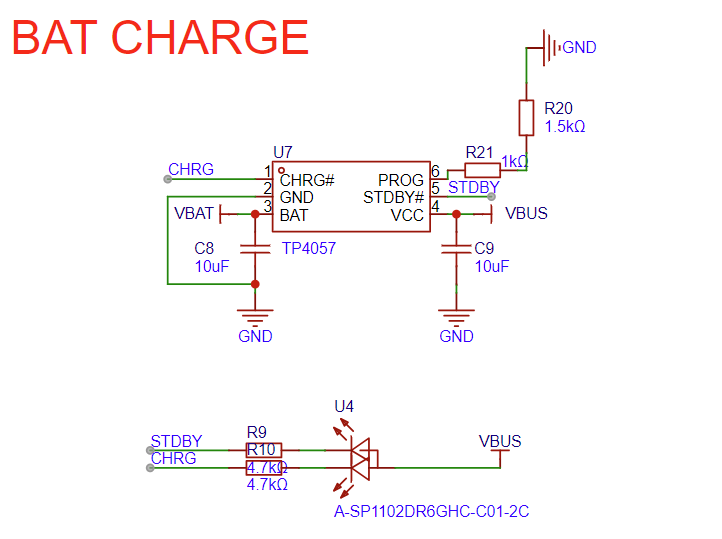

   Charging Circuit Diagram (Click to enlarge)

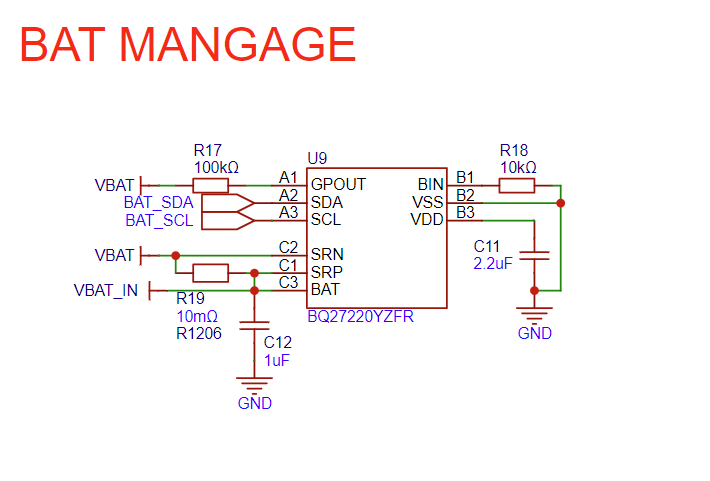

   Battery Management Circuit Diagram (Click to enlarge)

Microphone Interface
-----------------------------

.. figure:: ../../_static/esp32-s3-echoear/EchoEar_sch_Micboard_connector_V1_0.png
   :alt: Microphone Interface Circuit Diagram (Click to enlarge)
   :scale: 50%
   :figclass: align-center

   Microphone Interface Circuit Diagram (Click to enlarge)

Hardware Versions
======================

No historical versions.

.. _Related-documents_echoear:

Related Documents
======================

.. only:: latex

   Please go to the `esp-dev-kits Documentation HTML Web Version <https://docs.espressif.com/projects/esp-dev-kits/en/latest/{IDF_TARGET_PATH_NAME}/index.html>`_ to download the following documents.

-  `EchoEar Schematic`_ (PDF)
-  `EchoEar PCB Layout`_ (PDF)
-  `Display Specification`_ (PDF)
-  `Replication Tutorial`_ (HTML)
-  `User Guide`_ (HTML)

.. _EchoEar Schematic: https://dl.espressif.com/AE/esp-dev-kits/EchoEar_SCH_V1_0.pdf
.. _EchoEar PCB Layout: https://dl.espressif.com/AE/esp-dev-kits/EchoEar_pcb_V1_0.zip
.. _Display Specification: https://dl.espressif.com/AE/esp-dev-kits/UE018HV-RB39-A002A%20%20V1.0%20SPEC.pdf
.. _Replication Tutorial: https://oshwhub.com/esp-college/echoear
.. _User Guide: https://espressif.craft.me/1gOl65rON8G8FK
