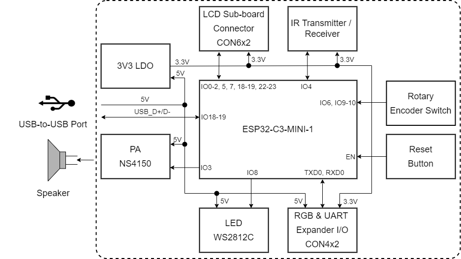
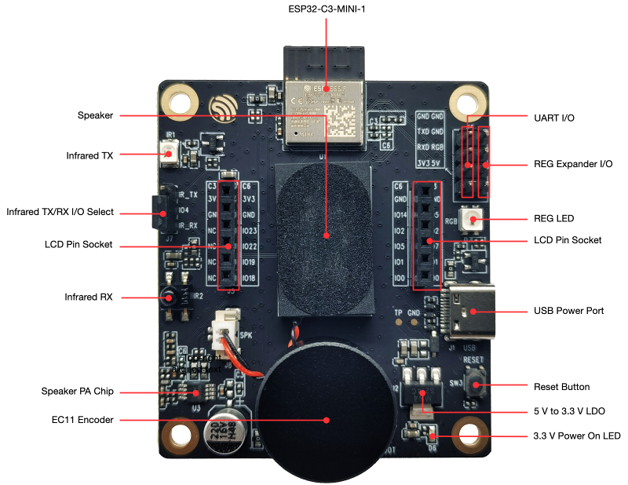
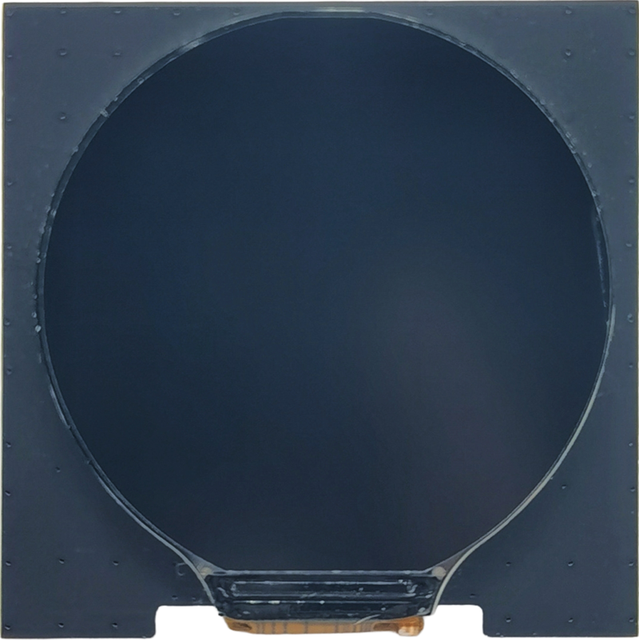
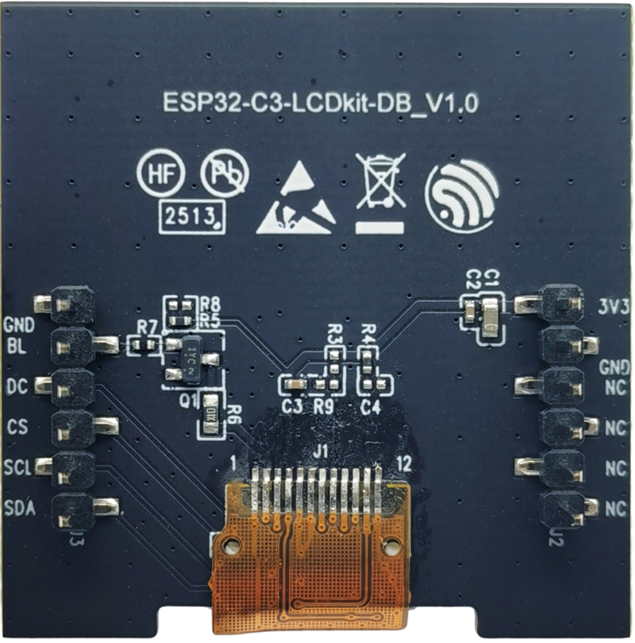
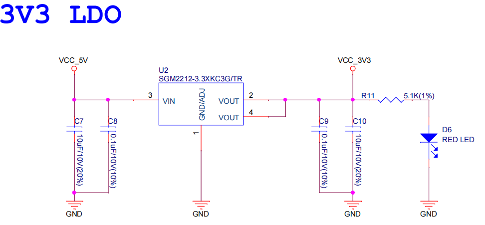
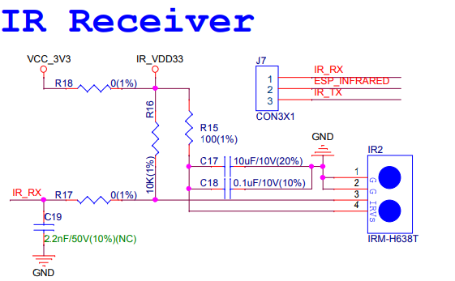
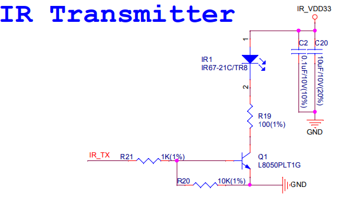
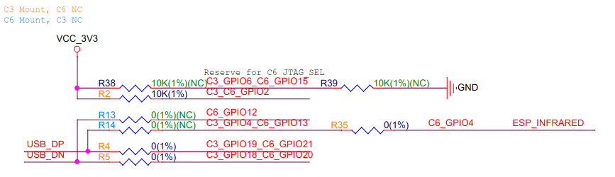

===============
ESP32-C3-LCDkit
===============

:link_to_translation:`zh_CN:[中文]`

This user guide will help you get started with ESP32-C3-LCDkit and will also provide more in-depth information.

The document consists of the following sections:

- `Board Overview`_: Overview of the board hardware/software.
- `Start Application Development`_: How to set up hardware/software to develop applications.
- `Hardware Reference`_: More detailed information about the board's hardware.
- `Hardware Revision Details`_: This is the first revision of this board released.
- `Sample Request`_: How to get a sample board.
- `Related Documents`_: Links to related documentation.

Board Overview
==============

ESP32-C3-LCDkit is an ESP32-C3-based evaluation development board with an SPI interface display. It also has an integrated rotary encoder switch and features screen interaction. Due to its low cost, low power consumption, and high performance, ESP32-C3 satisfies the basic GUI interaction needs, gaining ground in scenarios with small screen sizes.

.. figure:: ../../../_static/esp32-c3-lcdkit/esp32-c3-lcdkit-isometric-raw.png
    :align: center
    :scale: 60%
    :alt: ESP32-C3-LCDkit with ESP32-C3-MINI-1 Module

    ESP32-C3-LCDkit with ESP32-C3-MINI-1 Module

Feature List
------------

The main features of the board are listed below:

- **Module Embedded:** ESP32-C3-MINI-1 module with 4 MB flash and 400 KB SRAM
- **Display:** Compatibility with various subboards and support for displays with ``I2C`` and ``SPI`` interfaces. Please refer to `LCD Subboards`_ for more information
- **Rotary Encoder Switch:** Key switches and 360° rotation for on-screen GUI control
- **Infrared module**: Infrared transmitter and infrared receiver for infrared wireless control
- **Audio**: On-board audio amplifier and speaker for audio playback
- **USB:** USB Type-C download/debug

Block Diagram
-------------

The block diagram below shows the components of ESP32-C3-LCDkit and their interconnections.

    ESP32-C3-LCDkit Block Diagram (Click to Enlarge)

Description of Components
-------------------------

ESP32-C3-LCDkit is a development board designed for wildlife protection. It contains a mainboard and a subboard.

Mainboard
^^^^^^^^^

**ESP32-C3-LCDkit_MB** is the core of the kit, which integrates the ESP32-C3-MINI-1 module and provides ports for connection to the LCD subboard.

    ESP32-C3-LCDkit - Front (Click to Enlarge)

The key components of the board are described in a clockwise direction.

.. list-table::
   :widths: 30 70
   :header-rows: 1

   * - Key Component
     - Description
   * - ESP32-C3-MINI-1 Module
     - ESP32-C3-MINI-1 is a generic Wi-Fi + Bluetooth LE MCU module that is built around the ESP32-C3 series of SoCs. It is integrated with 4 MB flash and 400 KB SRAM.
   * - UART & RGB Expander I/O
     - Connects the system power supply pins and UART and RGB data pins via a 2.54 mm pitch pin header.
   * - RGB LED
     - Supports configuring the RGB LED display to indicate status or behavior.
   * - Speaker
     - Supports speaker playback through an audio power amplifier.
   * - LCD Display Connector
     - Connects the 1.28" LCD subboard via a 2.54 mm pitch female header.
   * - USB Power Port
     - Provides power to the entire system. It is recommended to use at least a 5V/2A power adapter to ensure a stable power supply. Used for USB communication between the PC side and the ESP32-C3-MINI-1 module.
   * - Reset Button
     - Press this button to reset the system.
   * - 5V-to-3.3V LDO
     - Low Dropout Regulator (LDO).
   * - 3.3 V Power On LED
     - Indicates the status of the system power supply.
   * - EC11 Rotary Encoder Switch
     - Features both a 360° rotary encoder and a key switch to enable control of the on-screen GUI.
   * - Speaker PA Chip
     - Supports speaker playback.
   * - Infrared RX
     - Receives external infrared signals.
   * - Infrared TX/RX I/O Select
     - Select the infrared RX/TX function via a 2.54 mm pitch pin header and jumper caps.
   * - Infrared TX
     - Sends out infrared signals.

LCD Subboards
^^^^^^^^^^^^^

The **ESP32-C3-LCDkit_DB** subboard supports a 1.28" LCD screen with SPI interface and 240x240 resolution. The driver chip used for this screen is GC9A01.

    ESP32-C3-LCDkit_DB - Front (Click to Enlarge)

    ESP32-C3-LCDkit_DB - Back (Click to Enlarge)

Software Support
----------------

The ESP32-C3-LCDkit development framework is `ESP-IDF <https://github.com/espressif/esp-idf>`_. ESP-IDF is a FreeRTOS-based SoC development framework with a bunch of components including LCD, ADC, RMT, and SPI. An example is provided for ESP32-C3-LCDkit under the folder :project:`Examples <esp32-c3-lcdkit/examples>`. You can configure project options by entering ``idf.py menuconfig`` in the example directory.

Start Application Development
=============================

This section provides instructions on how to do hardware and software setup and flash firmware onto the board to develop your own application.

Required Hardware
-----------------

- 1 x ESP32-C3-LCDkit_MB
- 1 x LCD subboard
- 1 x USB 2.0 cable (standard Type-A to Type-C)
- 1 x PC (Windows, Linux, or macOS)

.. note::

  Please make sure to use the appropriate USB cable. Some cables can only be used for charging, not for data transfer or program flashing.

Hardware Setup
--------------

Prepare the board for loading of the first sample application:

1. Connect the LCD subboard to the **LCD Display Connector**.
2. Plug in the USB cable to connect the PC with the board.
3. The LCD lights up and you can now control GUI through the rotary encoder switch.

Now the board is ready for software setup.

Software Setup
--------------

To learn how to quickly set up your development environment, please go to `Get Started <https://docs.espressif.com/projects/esp-idf/en/latest/esp32s3/get-started/index.html>`__ > `Installation <https://docs.espressif.com/projects/esp-idf/zh_CN/latest/esp32s3/get-started/index.html#get-started- step-by-step>`__.

For more software information on developing applications, please go to `Software Support`_.

Hardware Reference
==================

This section provides more detailed information about the board's hardware.

GPIO Allocation
---------------

The table below provides the allocation of GPIOs exposed on terminals of ESP32-C3-MINI-1 module to control specific components or functions of the board.

.. list-table:: ESP32-C3-MINI-1 GPIO Allocation
   :header-rows: 1
   :widths: 20 20 50

   * - Pin
     - Pin Name
     - Function
   * - 1
     - GND
     - Ground
   * - 2
     - GND
     - Ground
   * - 3
     - 3V3
     - 3.3 V power supply
   * - 4
     - NC
     - No connection
   * - 5
     - IO2
     - LCD_D/C
   * - 6
     - IO3
     - AUDIO_PA
   * - 7
     - NC
     - No connection
   * - 8
     - EN
     - Reset
   * - 9
     - NC
     - No connection
   * - 10
     - NC
     - No connection
   * - 11
     - GND
     - Ground
   * - 12
     - IO0
     - LCD_SDA
   * - 13
     - IO1
     - LCD_SCL
   * - 14
     - GND
     - Ground
   * - 15
     - NC
     - No connection
   * - 16
     - IO10
     - ENCODER_A
   * - 17
     - NC
     - No connection
   * - 18
     - IO4
     - IR_RX/IR_TX
   * - 19
     - IO5
     - LCD_BL_CTRL
   * - 20
     - IO6
     - ENCODER_A
   * - 21
     - IO7
     - LCD_CS
   * - 22
     - IO8
     - RGB_LED
   * - 23
     - IO9
     - ENCODER_SW
   * - 24
     - NC
     - No connection
   * - 25
     - NC
     - No connection
   * - 26
     - IO18
     - USB_DN
   * - 27
     - IO19
     - USB_DP
   * - 28
     - NC
     - No connection
   * - 29
     - NC
     - No connection
   * - 30
     - RXD0
     - Reserved
   * - 31
     - TXD0
     - Reserved
   * - 32-35
     - NC
     - No connection
   * - 36-53
     - GND
     - Ground

Power Distribution
------------------

The development board is powered via the ``USB-to-USB`` port:

.. figure:: ../../../_static/esp32-c3-lcdkit/esp32-c3-lcdkit-usb-ps.png
    :align: center
    :scale: 60%
    :alt: ESP32-C3-LCDkit - USB-to-USB Power Supply

    ESP32-C3-LCDkit - USB-to-USB Power Supply

Output system power supply:

    ESP32-C3-LCDkit - System Power Supply

Infrared TX/RX Select
---------------------

Since the Infrared TX and Infrared RX modules share the same signal line on the chip, it is required to short-circuit specific pins in ``Infrared TX/RX Select Port`` via jumper caps to choose between the TX/RX function:

    ESP32-C3-LCDkit - Infrared RX Module

    ESP32-C3-LCDkit - Infrared TX Module

C6 Module Compatibility Design
------------------------------

**ESP32-C3-LCDkit** development board uses the ESP32-C3-MINI-1 module by default, with resistors R2, R4, R5, and R35 connected to the mainboard:

    ESP32-C3-LCDkit - C3/C6 Resistor Settings

The development board is also designed to be compatible with the ESP32-C6-MINI-1 module, where resistors R2, R4, R5, and R35 need to be removed and resistors R13 and R14 need to be connected.

Hardware Setup Options
----------------------

Automatic Download
^^^^^^^^^^^^^^^^^^^^^

After the development board is powered on, press the rotary encoder switch and Reset button, then release Reset first and the encoder second, to put the ESP development board into download mode.

Hardware Revision Details
=========================

- ESP32-C3-LCD-Ev-Board: This older-version board is an engineering sample and is minimally maintained by Espressif. For historical documentation for this board, please refer to :doc:`ESP32-C3-LCD-Ev-Board User Guide <user_guide_c3_lcd_ev_board>`.

Sample Request
==============

ESP32-C3 is a cost-effective and industry-leading low-power performance solution for building rotary or small displays driven by an SPI interface. For sample requests, please contact us at `sales@espressif.com <sales@espressif.com>`_.

Related Documents
=================

-  `ESP32-C3 Datasheet <https://www.espressif.com/sites/default/files/documentation/esp32-c3_datasheet_en.pdf>`__
-  `ESP32-C3-MINI-1 Datasheet <https://www.espressif.com/sites/default/files/documentation/esp32-c3-mini-1_datasheet_en.pdf>`__
-  `ESP Product Selector <https://products.espressif.com/#/product-selector?names=>`__
-  `ESP32-C3-LCDkit_MB Schematics <../../_static/esp32-c3-lcdkit/schematics/SCH_ESP32-C3-C6-LCDkit-MB_V1.1_20230417.pdf>`__
-  `ESP32-C3-LCDkit_MB PCB Layout <../../_static/esp32-c3-lcdkit/schematics/PCB_ESP32-C3-C6-LCDkit-MB_V1.1_20230418.pdf>`__
-  `ESP32-C3-LCDkit_DB Schematics <../../_static/esp32-c3-lcdkit/schematics/SCH_ESP32-C3-LCDkit-DB_V1.0_20230329.pdf>`__
-  `ESP32-C3-LCDkit_DB PCB Layout <../../_static/esp32-c3-lcdkit/schematics/PCB_ESP32-C3-LCDkit-DB_V1.0_20230329.pdf>`__
-  `ESP32-C6-LCDkit_DB Schematics <../../_static/esp32-c3-lcdkit/schematics/SCH_ESP32-C6-LCDkit-DB_V1.0_20230403.pdf>`__
-  `ESP32-C6-LCDkit_DB PCB Layout <../../_static/esp32-c3-lcdkit/schematics/PCB_ESP32-C6-LCDkit-DB_V1.0_20230403.pdf>`__
-  `1.28_TFT_240x240_SPI_Display <../../_static/esp32-c3-lcdkit/datasheets/1.28_TFT_240x240_SPI_屏.pdf>`__
-  `Infrared Transmitter (IR67-21CTR8) <../../_static/esp32-c3-lcdkit/datasheets/EVERLIGHT(亿光)_IR67-21CTR8.PDF>`__
-  `Infrared Receiver（IRM-H638TTR2） <../../_static/esp32-c3-lcdkit/datasheets/EVERLIGHT(亿光)_IRM-H638TTR2.PDF>`__
-  `Audio Amplifier (NS4150) <../../_static/esp32-c3-lcdkit/datasheets/NS4150B.pdf>`__
-  `RGB LED (WS2812B) <../../_static/esp32-c3-lcdkit/datasheets/WS2812B-Mini-V3.pdf>`__
-  `2415 Voice Cavity Horn <../../_static/esp32-c3-lcdkit/datasheets/方形2415音腔喇叭规格书-2P1.25-20MM.pdf>`__

For further design documentation for the board, please contact us at `sales@espressif.com <sales@espressif.com>`_.

.. toctree::
    :hidden:

    user_guide_c3_lcd_ev_board