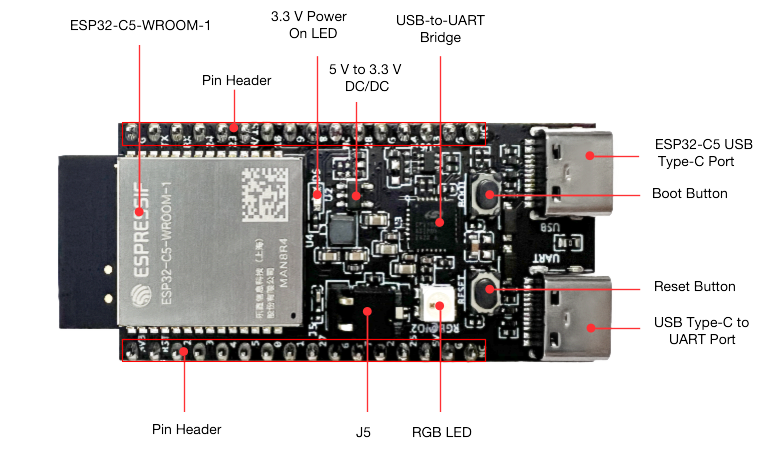
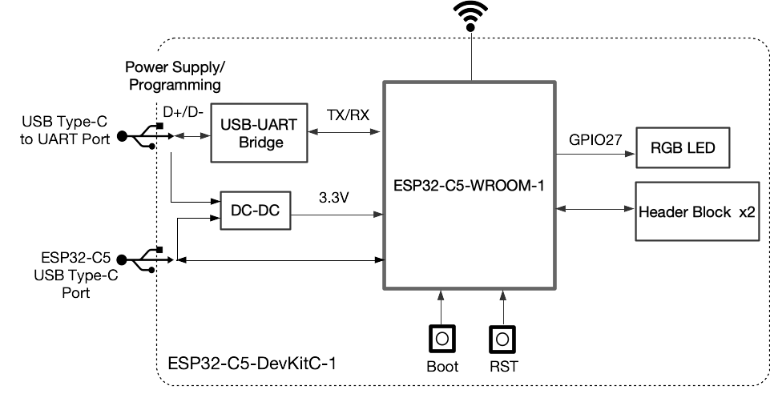

==================
ESP32-C5-DevKitC-1
==================

:link_to_translation:`zh_CN:[中文]`

This user guide will help you get started with ESP32-C5-DevKitC-1 and will also provide more in-depth information.

The ESP32-C5-DevKitC-1 is an entry-level development board based on the general-purpose module ESP32-C5-WROOM-1. This board integrates complete Wi-Fi, Bluetooth (LE), Zigbee, and Thread functions.

.. ESP32-C5-DevKitC-1 is an entry-level development board with a 8 MB SPI flash `ESP32-C5-WROOM-1 <https://www.espressif.com/sites/default/files/documentation/esp32-c5-wroom-1_datasheet_cn.pdf>`_. This board integrates complete Wi-Fi, Bluetooth LE, Zigbee, and Thread functions.

Most of the I/O pins are broken out to the pin headers on both sides for easy interfacing. Developers can either connect peripherals with jumper wires or mount ESP32-C5-DevKitC-1 on a breadboard.

.. figure:: ../../../_static/esp32-c5-devkitc-1/esp32-c5-devkitc-1-isometric_v1.1.png
    :align: center
    :alt: ESP32-C5-DevKitC-1
    :figclass: align-center

    ESP32-C5-DevKitC-1

The document consists of the following major sections:

- `Getting Started`_: Overview of ESP32-C5-DevKitC-1 and hardware/software setup instructions to get started.
- `Hardware Reference`_: More detailed information about the ESP32-C5-DevKitC-1's hardware.
- `Hardware Revision Details`_: Information about revision history, known issues, and links to user guides for previous versions (if any).
- `Related Documents`_: Links to related documentation.

Getting Started
===============

This section provides a brief introduction to ESP32-C5-DevKitC-1, introducing how to perform the initial hardware setup and how to flash firmware onto the board.

Description of Components
-------------------------

.. _user-guide-c5-devkitc-1-board-front:

    ESP32-C5-DevKitC-1 - front

The following list psrovides a description of the key components on the board in a clockwise direction.

.. list-table::
   :widths: 30 70
   :header-rows: 1

   * - Key Component
     - Description
   * - ESP32-C5-WROOM-1
     - ESP32-C5-WROOM-1 is a general-purpose module supporting Wi-Fi 6 in 2.4 & 5 GHz dual-band (802.11ax), Bluetooth® 5 (LE), Zigbee, and Thread (802.15.4) with on-board PCB antenna.
   * - Pin Header
     - All available GPIO pins (except for the SPI bus for flash) are broken out to the pin headers on the board.
   * - 5 V to 3.3 V DC/DC
     - Power regulator that converts a 5 V supply into a 3.3 V output.
   * - 3.3 V Power On LED
     - Turns on when the the board is connected to USB power.
   * - USB-to-UART Bridge
     - Single-chip USB-to-UART bridge offering transfer rate up to 3 Mbps.
   * - ESP32-C5 USB Type-C Port
     - The USB Type-C port on the ESP32-C5 chip supports USB 2.0 full speed, with a data transfer rate of up to 12 Mbps. Note that this port does not support the 480 Mbps high-speed transfer mode. This port is used for power supply to the board, flashing applications to the chip, and communication with the chip via USB protocols, as well as for JTAG debugging.
   * - Boot Button
     - Download button. Holding down **Boot** and then pressing **Reset** initiates Firmware Download mode for downloading firmware through the serial port.
   * - Reset Button
     - Press this button to restart the system.
   * - USB Type-C to UART Port
     - Used for power supply to the board, flashing applications to the chip, as well as communication with chip ESP32-C5 via the on-board USB-to-UART bridge.
   * - RGB LED
     - Addressable RGB LED, driven by GPIO27.
   * - J5
     - Used for current measurement. See details in Section `Current Measurement`_.

Start Application Development
-----------------------------

Before powering up your ESP32-C5-DevKitC-1, please make sure that it is in good condition with no obvious sign of damage.

Required Hardware
^^^^^^^^^^^^^^^^^

- ESP32-C5-DevKitC-1
- USB-A to USB-C cable
- Computer running Windows, Linux, or macOS

.. note::

  Be sure to use a good quality USB cable. Some cables are for charging only and do not provide the needed data lines nor work for programming the boards.

Software Setup
^^^^^^^^^^^^^^

Please proceed to `ESP-IDF Get Started <https://docs.espressif.com/projects/esp-idf/en/latest/esp32c5/get-started/index.html>`__, which will help you set up the development environment quickly and then flash an application example onto your board.

.. ESP-AT Support
.. ^^^^^^^^^^^^^^^^^^^^^^

.. ESP32-C5-DevKitC-1 supports ESP-AT software that provides a set of AT commands with which you can quickly integrate wireless connectivity features into your product without the need for embedded application development of the module on this development board.

.. The ESP-AT software is available as a pre-built binary that can be downloaded from `ESP-AT repository <https://github.com/espressif/esp-at/tags>`_.

.. For more information about using ESP-AT, including information on how to customize pre-built binaries, please refer to `ESP-AT User Guide <https://docs.espressif.com/projects/esp-at/en/latest/>`_.

Contents and Packaging
----------------------

Retail orders
^^^^^^^^^^^^^

If you order a few samples, each ESP32-C5-DevKitC-1 comes in an individual package in either an antistatic bag or any other packaging depending on your retailer.

For retail orders, please go to https://www.espressif.com/en/company/contact/buy-a-sample.

Wholesale Orders
^^^^^^^^^^^^^^^^

If you order in bulk, the boards come in large cardboard boxes.

For wholesale orders, please go to https://www.espressif.com/en/contact-us/sales-questions.

Hardware Reference
==================

Block Diagram
-------------

The block diagram below shows the components of ESP32-5-DevKitC-1 and their interconnections.

    ESP32-C5-DevKitC-1 (click to enlarge)

Power Supply Options
--------------------

There are three mutually exclusive ways to provide power to the board:

- USB Type-C to UART port and ESP32-C5 USB Type-C port (either one or both), default power supply (recommended)
- 5V and GND pin headers
- 3V3 and GND pin headers

Current Measurement
-------------------

The J5 headers on ESP32-C5-DevKitC-1 (see J5 in Figure :ref:`user-guide-c5-devkitc-1-board-front`) can be used for measuring the current drawn by the ESP32-C5-WROOM-1 module:

- Remove the jumper: Power supply between the module and peripherals on the board is cut off. To measure the module's current, connect the board with an ammeter via J5 headers.
- Apply the jumper (factory default): Restore the board's normal functionality.

.. note::

  When using 3V3 and GND pin headers to power the board, please remove the J5 jumper, and connect an ammeter in series between the external power supply and the 3V3 pin header to measure the module's current. This is because the 3V3 pin header supplies power directly to the module, bypassing the J5 headers. Removing the J5 jumper disconnects unnecessary circuits, allowing for a more accurate measurement of the module's current.

Header Block
-------------

The two tables below provide the **Name** and **Function** of the pin headers on both sides of the board (J1 and J3). The pin header names are shown in Figure :ref:`user-guide-c5-devkitc-1-board-front`. The numbering is the same as in the `ESP32-C5-DevKitC-1 Schematic <../../_static/esp32-c5-devkitc-1/schematics/SCH_ESP32-C5-DevkitC-1_V1.1_20240621.pdf>`__ (PDF).

J1
^^^
===  =======  ==========  =================================================
No.  Name     Type [1]_    Function
===  =======  ==========  =================================================
1    3V3       P          3.3 V power supply
2    RST       I          High: enables the chip; Low: disables the chip.
3    2         I/O/T      MTMS [3]_, GPIO2, LP_GPIO2, LP_UART_RTSN, ADC1_CH1, FSPIQ
4    3         I/O/T      MTDI, GPIO3, LP_GPIO3, LP_UART_CTSN, ADC1_CH2
5    4         I/O/T      MTCK, GPIO4, LP_GPIO4, LP_UART_RXD, ADC1_CH3, FSPIHD
6    5         I/O/T      MTDO, GPIO5, LP_GPIO5, LP_UART_TXD, ADC1_CH4, FSPIWP
7    0         I/O/T      GPIO0, XTAL_32K_P, LP_GPIO0, LP_UART_DTRN
8    1         I/O/T      GPIO1, XTAL_32K_N, LP_GPIO1, LP_UART_DSRN, ADC1_CH0
9    27        I/O/T      GPIO27 [2]_ [3]_
10   6         I/O/T      GPIO6, LP_GPIO6, LP_I2C_SDA, ADC1_CH5, FSPICLK
11   7         I/O/T      GPIO7 [3]_, LP_GPIO7, LP_I2C_SCL, FSPID
12   26        I/O/T      GPIO26
13   25        I/O/T      GPIO25
14   5V        P          5 V power supply
15   G         G          Ground
16   NC        –          No connection
===  =======  ==========  =================================================

J3
^^^
===  ==========  ======  ==========================================
No.   Name       Type    Function
===  ==========  ======  ==========================================
1     G          G       Ground
2     TX         I/O/T   U0TXD, GPIO11
3     RX         I/O/T   U0RXD, GPIO12
4     24         I/O/T   GPIO24
5     23         I/O/T   GPIO23
6     NC/15      I/O/T   No connection/GPIO15 [4]_
7     10         I/O/T   GPIO10, FSPICS0
8     9          I/O/T   GPIO9, PAD_COMP1
9     8          I/O/T   GPIO8, PAD_COMP0
10    NC         –       No connection
11    28         I/O/T   GPIO28 [3]_
12    G          G       Ground
13    14         I/O/T   GPIO14, USB_D+
14    13         I/O/T   GPIO13, USB_D-
15    G          G       Ground
16    NC         –       No connection
===  ==========  ======  ==========================================

.. [1] P: Power supply; I: Input; O: Output; T: High impedance.
.. [2] Used to drive the RGB LED.
.. [3] MTMS, GPIO7, GPIO27, and GPIO28 are strapping pins of the ESP32-C5 chip. These pins are used to control several chip functions depending on binary voltage values applied to the pins during chip power-up or system reset.
.. For description and application of the strapping pins, please refer to `ESP32-C5 Datasheet`_ > Section *Strapping Pins*.
.. [4] In modules integrated with SPI SPRAM, this pin is already used for SPICS1 function, thus unavailable for external use. In modules without SPI PSRAM, this pin can be used as GPIO15.

Pin Layout
^^^^^^^^^^^
.. figure:: ../../../_static/esp32-c5-devkitc-1/esp32-c5-devkitc-1-pin-layout.png
    :align: center
    :scale: 40%
    :alt: ESP32-C5-DevKitC-1 Pin Layout (click to enlarge)
    :figclass: align-center

    ESP32-C5-DevKitC-1 Pin Layout (click to enlarge)

Hardware Revision Details
=========================

This is the first revision of this board released.

Related Documents
=================

.. * `ESP32-C5 Datasheet`_ (PDF)
.. * `ESP32-C5-WROOM-1 Datasheet`_ (PDF)

* `ESP32-C5-DevKitC-1 Schematic <../../_static/esp32-c5-devkitc-1/schematics/SCH_ESP32-C5-DevkitC-1_V1.1_20240621.pdf>`_ (PDF)
* `ESP32-C5-DevKitC-1 PCB Layout <../../_static/esp32-c5-devkitc-1/schematics/PCB_ESP32-C5-DevKitC-1_V1.1_20240621.pdf>`_ (PDF)
* `ESP32-C5-DevKitC-1 Dimensions <../../_static/esp32-c5-devkitc-1/schematics/dimension_esp32-c5-devkitc-1_v1.1_20240621.pdf>`_ (PDF)
* `ESP32-C5-DevKitC-1 Dimensions source file <../../_static/esp32-c5-devkitc-1/schematics/dimension_esp32-c5-devkitc-1_v1.1_20240621.dxf>`_ (DXF) - You can view it with `Autodesk Viewer <https://viewer.autodesk.com/>`_ online

For further design documentation for the board, please contact us at `sales@espressif.com <sales@espressif.com>`_.

.. .. _ESP32-C5 Datasheet: https://www.espressif.com/sites/default/files/documentation/esp32-c6_datasheet_cn.pdf
.. .. _ESP32-C5-WROOM-1 Datasheet: https://www.espressif.com/sites/default/files/documentation/esp32-c6-wroom-1_datasheet_cn.pdf
