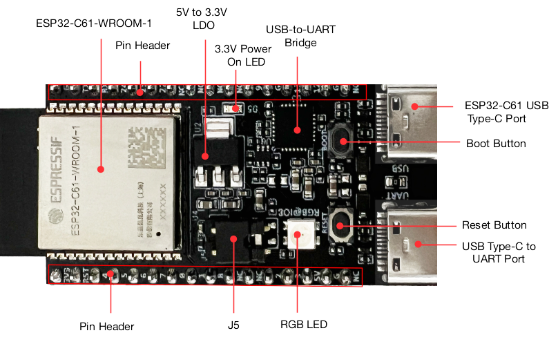
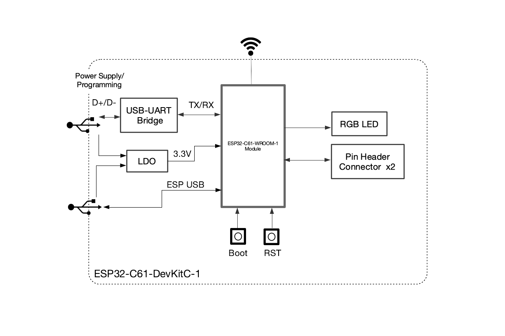
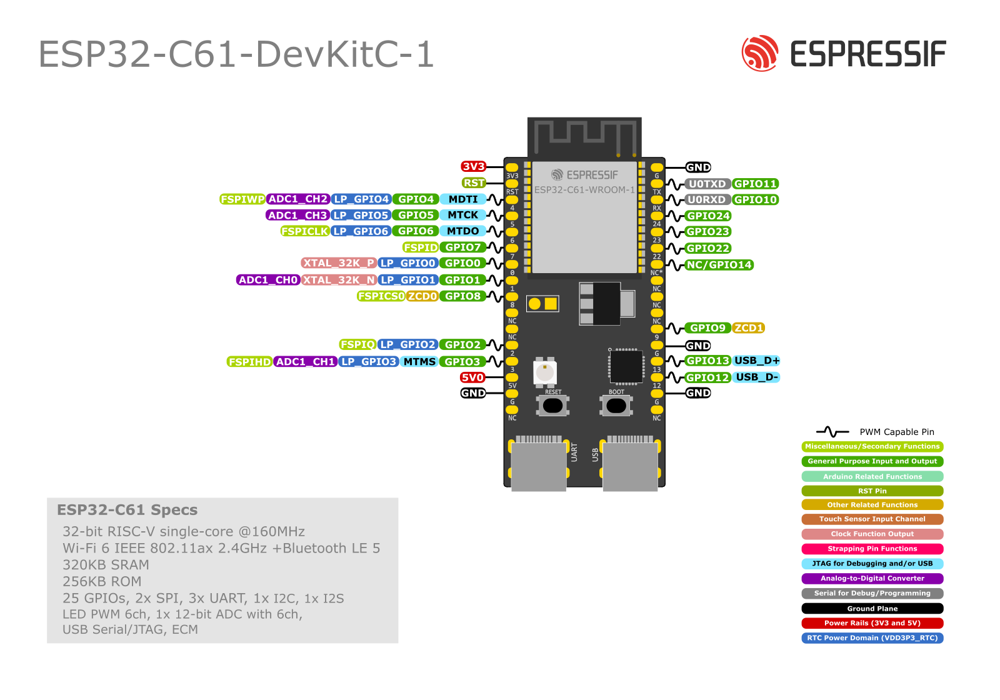

=======================
ESP32-C61-DevKitC-1
=======================

:link_to_translation:`zh_CN:[中文]`

This user guide will help you get started with ESP32-C61-DevKitC-1 and will also provide more in-depth information.

ESP32-C61-DevKitC-1 is an entry-level development board based on ESP32-C61-WROOM-1, a general-purpose module with up to 8 MB SPI flash and 2 MB PSRAM. This board integrates complete Wi-Fi, and Bluetooth® Low Energy functions.

.. ESP32-C61-DevKitC-1 is an entry-level development board based on `ESP32-C61-WROOM-1 <https://www.espressif.com/sites/default/files/documentation/esp32-c61-wroom-1_datasheet_en.pdf>`_, a general-purpose module with up to 8 MB SPI flash and 2 MB PSRAM. This board integrates complete Wi-Fi, and Bluetooth® Low Energy functions.

Most of the I/O pins are broken out to the pin headers on both sides for easy interfacing. Developers can either connect peripherals with jumper wires or mount ESP32-C61-DevKitC-1 on a breadboard.

.. figure:: ../../../_static/esp32-c61-devkitc-1/esp32-c61-devkitc-1-isometric.png
    :align: center
    :scale: 20%
    :alt: ESP32-C61-DevKitC-1
    :figclass: align-center

    ESP32-C61-DevKitC-1 (click to enlarge)

The document consists of the following major sections:

- `Getting Started`_: Overview of ESP32-C61-DevKitC-1 and hardware/software setup instructions to get started.
- `Hardware Reference`_: More detailed information about the ESP32-C61-DevKitC-1's hardware.
- `Hardware Revision Details`_: Revision history, known issues, and links to user guides for previous versions (if any) of ESP32-C61-DevKitC-1.
- `Related Documents`_: Links to related documentation.

Getting Started
===============

This section provides a brief introduction of ESP32-C61-DevKitC-1, instructions on how to do the initial hardware setup and how to flash firmware onto it.

Description of Components
-------------------------

.. _user-guide-c61-devkitc-1-v1-board-front:

    ESP32-C61-DevKitC-1 - front

The key components of the board are described in a clockwise direction.

.. list-table::
   :widths: 30 70
   :header-rows: 1

   * - Key Component
     - Description
   * - ESP32-C61-WROOM-1
     - ESP32-C61-WROOM-1 is a general-purpose module supporting Wi-Fi 6 in 2.4 GHz band and Bluetooth 5. Built around the ESP32-C61HR2 chip, this module comes with a PCB antenna and offers up to 8 MB SPI flash and 2 MB PSRAM.
   * - Pin Header
     - All available GPIO pins (except for the SPI bus for flash and PSRAM) are broken out to the pin headers on the board.
   * - 5 V to 3.3 V LDO
     - Power regulator that converts a 5 V supply into a 3.3 V output.
   * - 3.3 V Power On LED
     - Turns on when the USB power is connected to the board.
   * - USB-to-UART Bridge
     - Single USB-to-UART bridge chip provides transfer rates up to 3 Mbps.
   * - ESP32-C61 USB Type-C Port
     - The USB Type-C port on the ESP32-C61 chip compliant with USB 2.0 full speed. It is capable of up to 12 Mbps transfer speed (Note that this port does not support the faster 480 Mbps high-speed transfer mode). This port is used for power supply to the board, for flashing applications to the chip, for communication with the chip using USB protocols, as well as for JTAG debugging.
   * - Boot Button
     - Download button. Holding down **Boot** and then pressing **Reset** initiates Firmware Download mode for downloading firmware through the serial port.
   * - Reset Button
     - Press this button to restart the system.
   * - USB Type-C to UART Port
     - Used for power supply to the board, flashing applications to the chip, as well as communication with the ESP32-C61 chip via the on-board USB-to-UART bridge.
   * - RGB LED
     - Addressable RGB LED, driven by GPIO8.
   * - J5
     - Used for current measurement. See details in Section :ref:`user-guide-c61-devkitc-1-v1-current`.

Start Application Development
-----------------------------

Before powering up your ESP32-C61-DevKitC-1, please make sure that it is in good condition with no obvious signs of damage.

Required Hardware
^^^^^^^^^^^^^^^^^

- ESP32-C61-DevKitC-1
- USB-A to USB-C cable
- Computer running Windows, Linux, or macOS

.. note::

  Be sure to use a good quality USB cable. Some cables are for charging only and do not provide the needed data lines nor work for programming the boards.

Software Setup
^^^^^^^^^^^^^^

Please proceed to `ESP-IDF Get Started <https://docs.espressif.com/projects/esp-idf/en/latest/esp32c61/get-started/index.html>`__, which will quickly help you set up the development environment then flash an application example onto your board.

.. ESP-AT Support
.. ^^^^^^^^^^^^^^^^^^^^^^

.. The ESP32-C61-DevKitC-1 supports ESP-AT software that provides a set of AT commands with which you can quickly integrate wireless connectivity features into your product without a need for embedded application development of the module on this development board.

.. The software is available as a pre-built binary that can be downloaded from `ESP-AT repository <https://github.com/espressif/esp-at/tags>`_.

.. For more information about using ESP-AT, including information on how to customize pre-built binaries, please refer to `ESP-AT User Guide <https://docs.espressif.com/projects/esp-at/en/latest/>`_.

Contents and Packaging
----------------------

Retail orders
^^^^^^^^^^^^^

If you order a few samples, each ESP32-C61-DevKitC-1 comes in an individual package in either antistatic bag or any packaging depending on your retailer.

For retail orders, please go to https://www.espressif.com/en/company/contact/buy-a-sample.

Wholesale Orders
^^^^^^^^^^^^^^^^

If you order in bulk, the boards come in large cardboard boxes.

For wholesale orders, please go to https://www.espressif.com/en/contact-us/sales-questions. You can also check `Espressif Product Ordering Information <https://www.espressif.com/sites/default/files/documentation/espressif_products_ordering_information_en.pdf>`_ (PDF).

Hardware Reference
==================

Block Diagram
-------------

The block diagram below shows the components of ESP32-C61-DevKitC-1 and their interconnections.

    ESP32-C61-DevKitC-1 (click to enlarge)

Power Supply Options
--------------------

There are three mutually exclusive ways to provide power to the board:

- USB Type-C to UART Port and ESP32-C61 USB Type-C Port (either one or both), default power supply (recommended)
- 5V and GND pin headers
- 3V3 and GND pin headers

.. _user-guide-c61-devkitc-1-v1-current:

Current Measurement
-------------------

The J5 headers on ESP32-C61-DevKitC-1 (see J5 in Figure :ref:`user-guide-c61-devkitc-1-v1-board-front`) can be used for measuring the current drawn by the ESP32-C61-WROOM-1 module:

- Remove the jumper: Power supply between the module and peripherals on the board is cut off. To measure the module's current, connect the board with an ammeter via J5 headers.
- Apply the jumper (factory default): Restore the board's normal functionality.

.. note::

  When using 3V3 and GND pin headers to power the board, please remove the J5 jumper, and connect an ammeter in series to the external circuit to measure the module's current.

Header Block
-------------

The two tables below provide the **Name** and **Function** of the pin headers on both sides of the board (J1 and J3). The pin header names are shown in Figure :ref:`user-guide-c61-devkitc-1-v1-board-front`. The numbering is the same as in the `ESP32-C61-DevKitC-1 Schematic <../../_static/esp32-c61-devkitc-1/schematics/esp32-c61-devkitc-1-schematics.pdf>`_ (PDF).

J1
^^^
===  =======  ==========  =================================================
No.  Name     Type [1]_    Function
===  =======  ==========  =================================================
1    3V3       P          3.3 V power supply
2    RST       I          High: enables the chip; Low: disables the chip.
3    4         I/O/T      MTDI, GPIO4, LP_GPIO4, ADC1_CH2, FSPIWP
4    5         I/O/T      MTCK, GPIO5, LP_GPIO5, ADC1_CH3
5    6         I/O/T      MTDO, GPIO6, LP_GPIO6, FSPICLK
6    7         I/O/T      GPIO7 [3]_, FSPID
7    0         I/O/T      GPIO0, XTAL_32K_P, LP_GPIO0
8    1         I/O/T      GPIO1, XTAL_32K_N, LP_GPIO1, ADC1_CH0
9    8         I/O/T      GPIO8 [2]_ [3]_, ZCD0, FSPICS0
10   NC        --         No connection
11   NC        --         No connection
12   2         I/O/T      GPIO2, LP_GPIO2, FSPIQ
13   3         I/O/T      MTMS, GPIO3, LP_GPIO3, ADC1_CH1, FSPIHD
14   5V        P          5 V power supply
15   G         G          Ground
16   NC        --         No connection
===  =======  ==========  =================================================

J3
^^^
===  ==========  ======  ==========================================
No.   Name       Type    Function
===  ==========  ======  ==========================================
1     G          G       Ground
2     TX         I/O/T   U0TXD, GPIO11
3     RX         I/O/T   U0RXD, GPIO10
4     24         I/O/T   GPIO24
5     23         I/O/T   GPIO23
6     22         I/O/T   GPIO22
7     NC/14      I/O/T   No connection/GPIO14 [4]_
8     NC         --      No connection
9     NC         --      No connection
10    NC         --      No connection
11    9          I/O/T   GPIO9 [3]_, ZCD1
12    G          G       Ground
13    13         I/O/T   GPIO13, USB_D+
14    12         I/O/T   GPIO12, USB_D-
15    G          G       Ground
16    NC         --      No connection
===  ==========  ======  ==========================================

.. [1] P: Power supply; I: Input; O: Output; T: High impedance.
.. [2] Used to drive the RGB LED.
.. [3] GPIO7, GPIO8, and GPIO9 are strapping pins of the ESP32-C61 chip. These pins are used to control several chip functions depending on binary voltage values applied to the pins during chip power-up or system reset.
.. [4] For the module with integrated SPI PSRAM, this pin is already used as SPICS1 and cannot be used for other functions; for the module without integrated SPI PSRAM, this pin can be used as GPIO14.

.. .. [3] GPIO7, GPIO8, and GPIO9 are strapping pins of the ESP32-C61 chip. These pins are used to control several chip functions depending on binary voltage values applied to the pins during chip power-up or system reset. For description and application of the strapping pins, please refer to `ESP32-C61 Datasheet`_ > Section *Strapping Pins*.

Pin Layout
^^^^^^^^^^^

    ESP32-C61-DevKitC-1 Pin Layout (click to enlarge)

Hardware Revision Details
=========================

No previous versions available.

Related Documents
=================
.. * `ESP32-C61 Datasheet`_ (PDF)
.. * `ESP32-C61-WROOM-1 Datasheet`_ (PDF)

* `ESP32-C61-DevKitC-1 Schematic <../../_static/esp32-c61-devkitc-1/schematics/esp32-c61-devkitc-1-schematics.pdf>`_ (PDF)
* `ESP32-C61-DevKitC-1 PCB Layout <../../_static/esp32-c61-devkitc-1/schematics/esp32-c61-devkitc-1-pcb-layout.pdf>`_ (PDF)
* `ESP32-C61-DevKitC-1 Dimensions <../../_static/esp32-c61-devkitc-1/schematics/esp32-c61-devkitc-1-dimensions.pdf>`_ (PDF)
* `ESP32-C61-DevKitC-1 Dimensions source file <../../_static/esp32-c61-devkitc-1/schematics/esp32-c61-devkitc-1-dimensions.dxf>`_ (DXF)

For further design documentation for the board, please contact us at `sales@espressif.com <sales@espressif.com>`_.

.. .. _ESP32-C61 Datasheet: https://www.espressif.com/sites/default/files/documentation/esp32-c61_datasheet_en.pdf
.. .. _ESP32-C61-WROOM-1 Datasheet: https://www.espressif.com/sites/default/files/documentation/esp32-c61-wroom-1_datasheet_en.pdf
