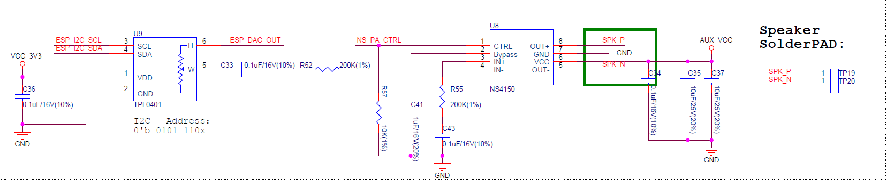
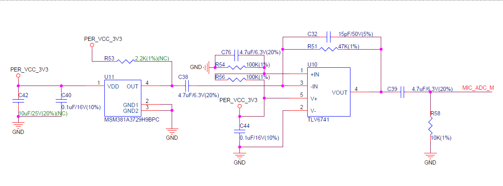

Audio
=========

:link_to_translation:`zh_CN:[中文]`

The ESP32-S2-HMI-DevKit-1 development board supports audio playback and recording. You can find such examples under the ``esp32-s2-hmi-devkit-1/examples/audio/`` directory.

Audio Playback
---------------

The ESP32-S2-HMI-DevKit-1 development board can output audio via DAC or PWM. It is recommended to use PWM for audio output since it has lower noise and higher resolution (DAC has 8-bit resolution, while PWM can reach up to 12-bit resolution at 19.2 kHz of sampling rate).

The output signal generated through the IO port goes to the digital potentiometer TPL0401 first for lossless volume adjustment, and then passes the 100 nF isolation capacitor C33 and the 200 kOhm resistor R52. This RC circuit controls the cut-off frequency at around 8 Hz. On top of that, this signal will be sent to the 3 W class-D audio power amplifier NS4150 to set the gain to 1.5 times, thus amplifying the maximum output signal from 3.3 V to 4.95 V (slightly lower than the PA supply, 5 V) so as to maximize the output volume while minimizing saturation distortion. 

   ESP32-S2-HMI-DevKit-1 audio playback schematic (click to enlarge)

The audio PA is powered by the 5 V power domain. Before using the audio playback function, please make sure this power domain is powered on (refer to :ref:`v-power-domain-1` section).

Audio Recording
-----------------

The ESP32-S2-HMI-DevKit-1 development board can record audio data from the analog microphone via an internal ADC.

The board is equipped with an analog microphone with a sensitivity of -38 dB. And it will send the output signal to the operational amplifier TLV6741 with a fixed gain to amplify the signal.

   ESP32-S2-HMI-DevKit-1 microphone schematic (Click to enlarge)

The microphone and operational amplifier mentioned above are powered by a controlled 3.3 V power domain. Before using the audio recording function, please make sure this power domain is powered on (refer to :ref:`v-power-domain-2` section).

Please use the Timer Group interrupt to record audio data. Do not use code such as the following format in tasks for audio recording:

.. code:: c

   size_t index = 0;
   uint16_t audio_data[configMAX_ACQUIRE_COUNT];
   do {
       audio_data[index] = adc1_get_raw(CONFIG_AUDIO_CHANNEL);
       ets_delay_us(1000000 / CONFIG_AUDIO_FREQ);
   } while (++index < CONFIG_MAX_ACQUIRE_COUNT)

The above format will cause the CPU to be occupied, thus triggering the task watchdog (if it is not disabled), and make other tasks with lower priorities (e.g., IDLE Task) not able to operate normally.

When recording data via ADC with the interrupt function, you need to re-write the ADC recording function to ``IRAM_ATTR`` so as to reduce response time, and place the variables to DRAM. Also, please do not use any semaphore in this function. For more information about implementation examples, please refer to ``audio/audio_record`` under the ``examples`` directory.

ADC Accuracy
------------

The ADC of ESP32-S2 has a high level of repeatability despite the fact that the lack of reference voltage and using Buck power supply may result a high overall noise.

The ADC is configured with 13-bit resolution and 11 dB attenuation, corresponding to a full-scale voltage of 2.6 V. After polling the 2.5 V voltage of the AD584T reference voltage via ADC1_CH8, we convert the 4096-time uncalibrated raw values into voltage values and get the following data:

.. figure:: ../../../../_static/esp32-s2-hmi-devkit-1/ADC.png
   :align: center
   :alt: ESP32-S2-HMI-DevKit-1 ADC (click to enlarge)
   :scale: 35%
   :figclass: align-center

   ESP32-S2-HMI-DevKit-1 ADC (click to enlarge)

As shown in the above figure, most of the uncalibrated data error is within the range of ±0.005 V with a standard deviation (σ) of 3.339 LSB (0.00106 V). These errors are mainly from the absolute accuracy, i.e., the bias. Therefore, the distortion and noise of sounds sampled via ADC can be kept at a relatively low level.

The AD584T has a peak output noise of 50 uV at 10 V within the range of 0.1 ~ 10 Hz, and a peak output noise divided by the internal high-precise laser-adjusted resistor at 2.5 V. And an up to 30 mA push-pull capability is provided by the transistor measured at 10 V. Its output noise at 2.5 V is lower than the resolving power of a 16-bit ADC, which therefore can be used as a testing reference.
