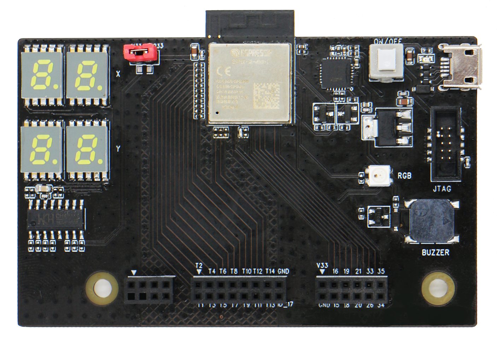
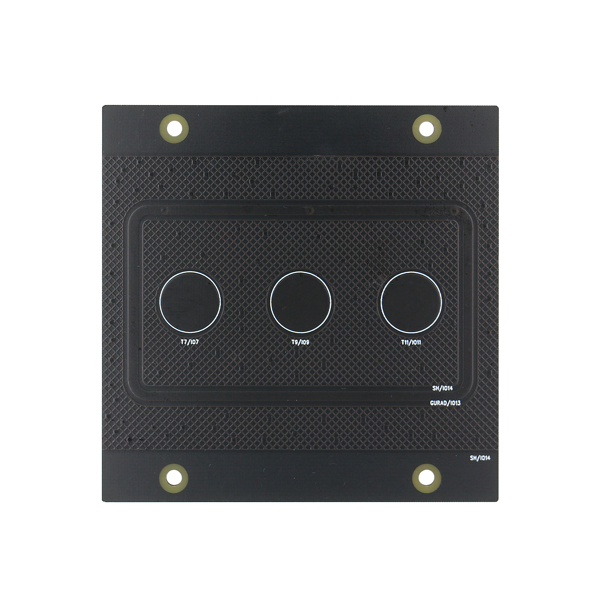
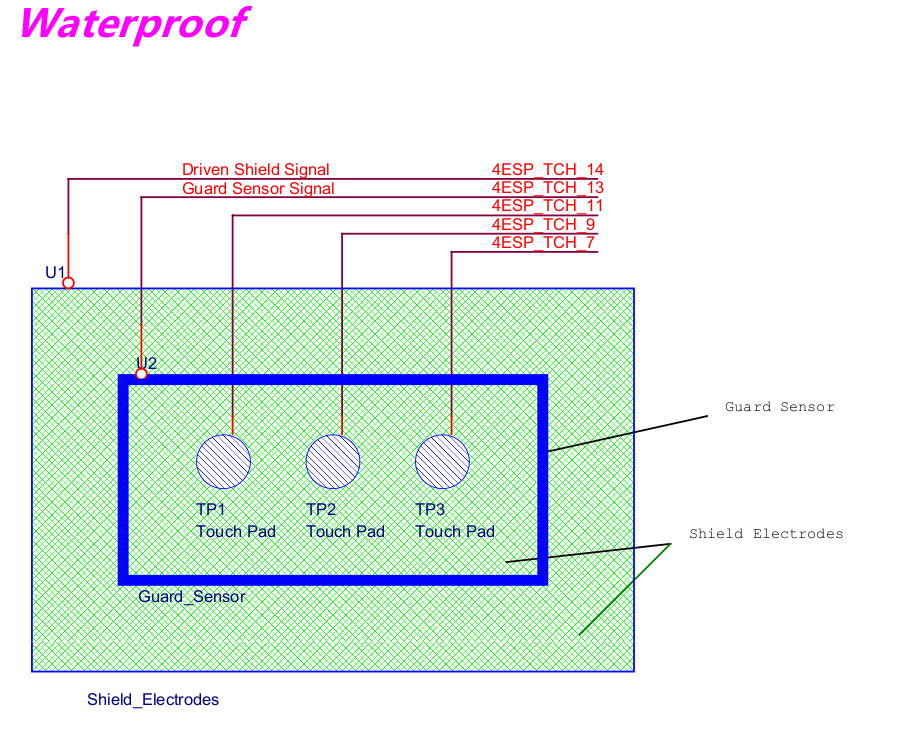
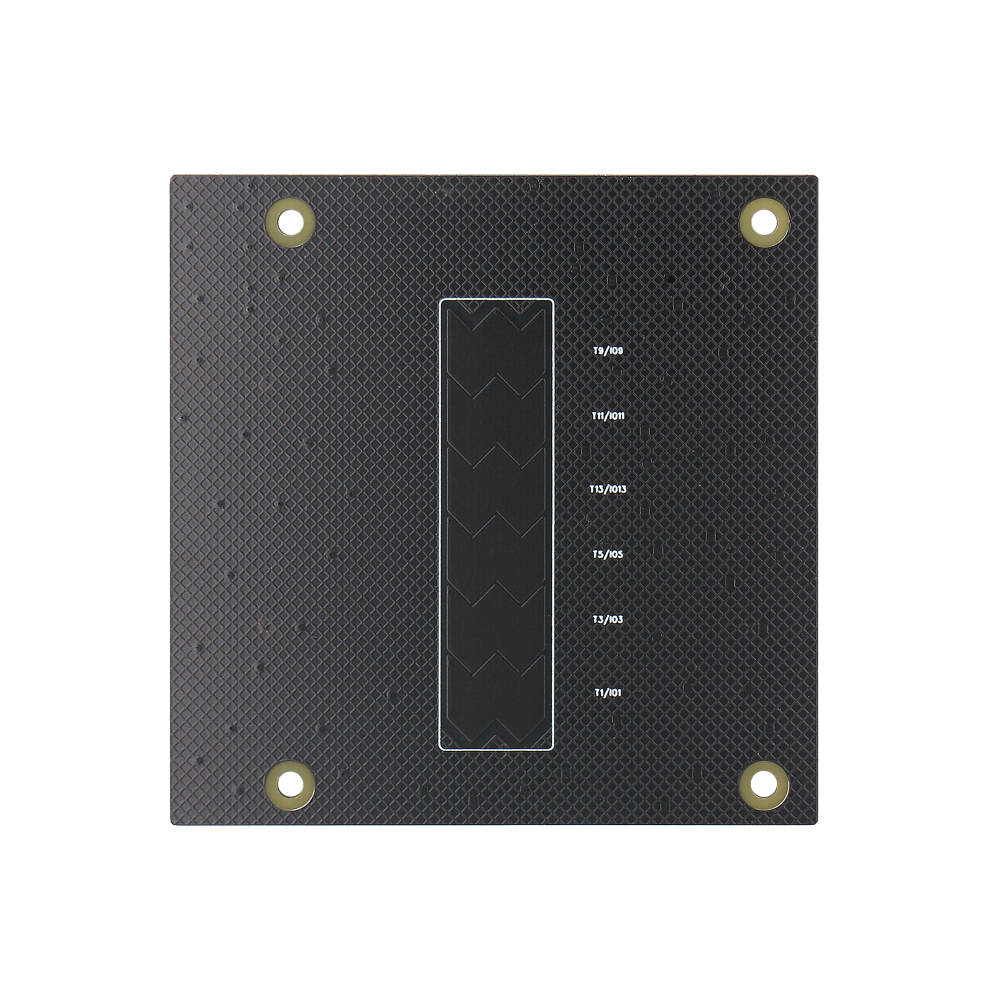
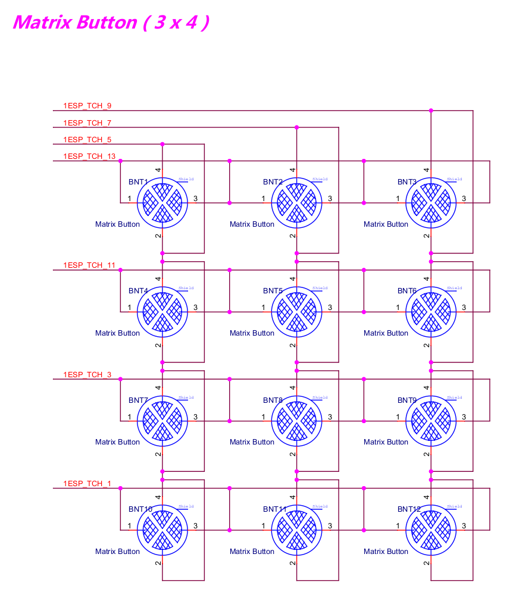
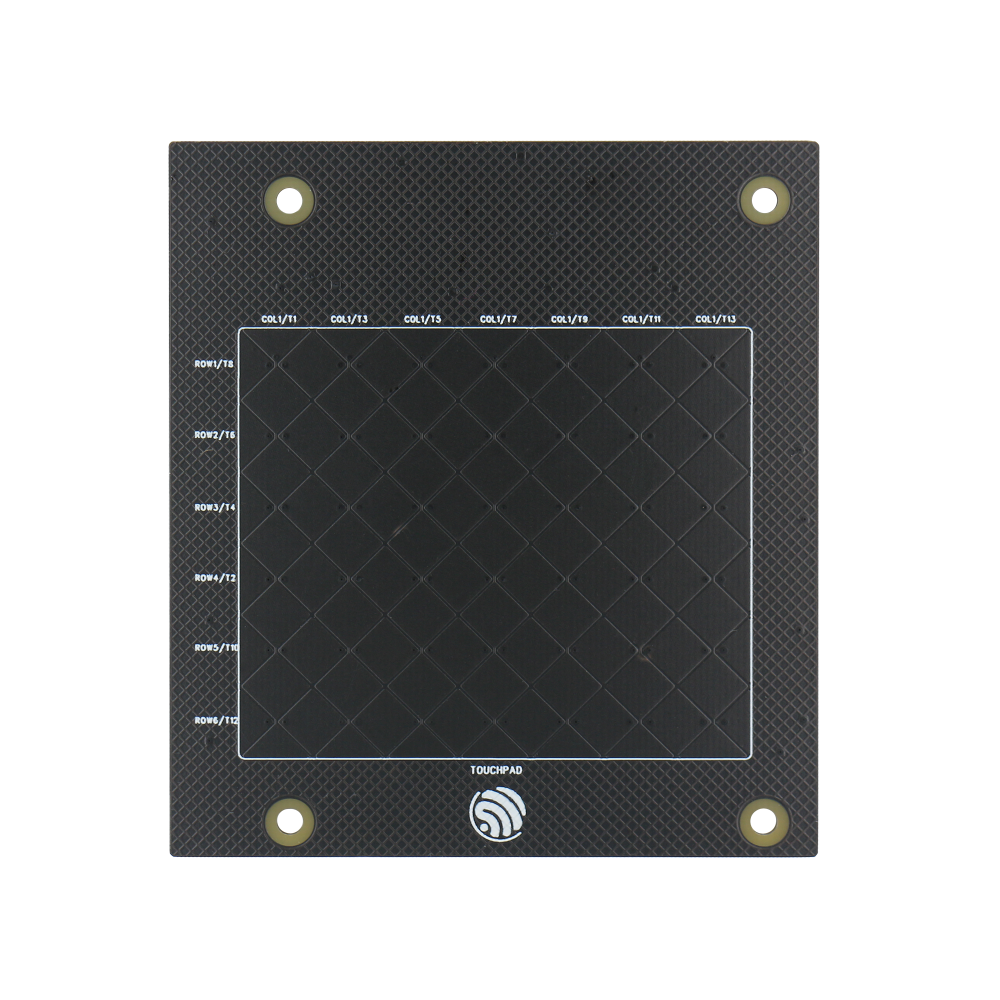
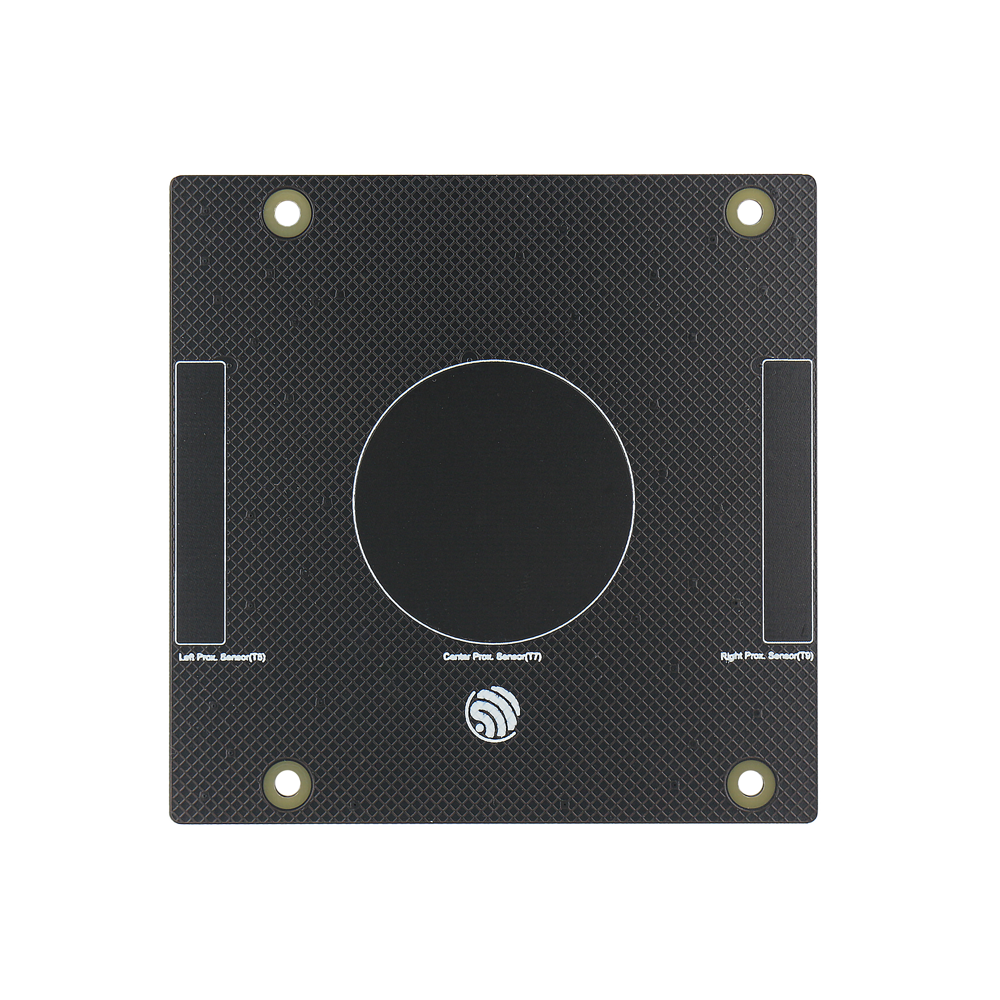

ESP32-S2-Touch-Devkit-1
=======================

:link_to_translation:`zh_CN:[中文]`

.. figure:: ../../../_static/esp32-s2-touch-devkit-1/boardset.jpg
   :align: center
   :alt: ESP32-S2-Touch-Devkit-1
   :figclass: align-center
 
   ESP32-S2-Touch-Devkit-1 Board-set

Overview
--------

ESP32-S2-Touch-Devkit-1 is a development kit that is aimed at helping evaluate and develop capacitive touch sensor applications on ESP32-S2. It is made up of Motherboard-Subboard structure. The motherboard of ESP32-S2-Touch-Devkit-1 integrates `ESP32-S2-MINI-1 <https://www.espressif.com/sites/default/files/documentation/esp32-s2-mini-1_esp32-s2-mini-1u_datasheet_en.pdf>`__ controller module and several useful little components such as buzzer, digital tube, RGB light, and so on. There are several kinds of subboards in ESP32-S2-Touch-Devkit-1 with different kinds of capacitive touch sensor pads, developers can choose one of them and connect it with motherboard so that they could develop different kinds of capacitive touch sensor applications. The motherboard and subboard use the pin header/female pin header as the socket connector which makes it plug in and plug out smoothly.

**Motherboard**

 
   Motherboard

**Subboards**

- Button-board: Three capacitive touch button with waterproof sensor.

==========================   ===========================
    |Button-board|                |Water-proof sensor|    
--------------------------   ---------------------------
      Button-board                 Water-proof sensor    
========================================================

- Slider-board: Capacitive touch linear slider, the relative distance of slider has up to 8 bit precision.

==========================   ===========================
    |Slider-board|                |Slider|    
--------------------------   ---------------------------
      Slider-board                 Slider    
========================================================

.. |Slider| image:: ../../../_static/esp32-s2-touch-devkit-1/sliderboard_sch.jpg

- Matrix-board: 3 x 4 capacitive touch matrix button, 7 channels of touch sensor make up of 12 capacitive touch buttons.

==========================   ===========================
    |Matrix-board|                |Matrix button|    
--------------------------   ---------------------------
      Matrix-board                 Matrix button    
========================================================

.. |Matrix-board| image:: ../../../_static/esp32-s2-touch-devkit-1/matrixboard.png

- Touchpad-board: 7 x 6 two-dimension capacitive touchpad.

==========================   ===========================
    |Touchpad-board|                |Touchpad|    
--------------------------   ---------------------------
      Touchpad-board                 Touchpad    
========================================================

.. |Touchpad| image:: ../../../_static/esp32-s2-touch-devkit-1/touchpadboard_sch.jpg

- Proximity-board: Three capacitive touch proximity sensor.

==========================   ===========================
    |Proximity-board|                |Sensor|    
--------------------------   ---------------------------
      Proximity-board                 Sensor    
========================================================

.. |Sensor| image:: ../../../_static/esp32-s2-touch-devkit-1/proximityboard_sch.jpg

Get Started
-----------

**Install SDK and it’s dependencies**:

1. Install ESP-IDF, please refer to `ESP-IDF Programming Guide <https://docs.espressif.com/projects/esp-idf/en/release-v4.3/esp32/get-started/index.html>`__.

2. Use the release-4.3 version of ESP-IDF.

   .. code:: bash

      cd esp-idf #Enter esp-idf folder
      git checkout release/v4.3 #Checkout release-v4.3 version of ESP-IDF
      git submodule update #Maybe is needed

**Get ESP32-S2-Touch-Devkit-1 project**:

1. Clone esp-dev-kits repo.

   .. code:: bash

      git clone https://github.com/espressif/esp-dev-kits.git

2. Enter ESP32-S2-Touch-Devkit-1 project folder.

   .. code:: bash

      cd esp-dev-kits/esp32-s2-touch-devkit-1

   The project’s structure is show as followed:

   .. code:: bash

      ├── CMakeLists.txt
      ├── components              #components' driver
      │   ├── board_detect    #subboard detector
      │   ├── buzzer              #buzzer driver
      │   ├── digital_tube    #digital tube controllor driver
      │   ├── rgb_light       #RGB light driver(ws2812)
      │   ├── subboards       #Subboards' application source file
      │   └── touch_element       #Touch element library
      ├── main        #Main application demo logic
      │   ├── CMakeLists.txt
      │   └── main.c
  

**Build & Flash ESP32-S2-Touch-Devkit-1 demo project**:

1. Enable ESP-IDF environment variable.

   .. code:: bash

      cd esp-idf
      . ./export.sh

2. Build & Flash.

   .. code:: bash

      cd esp-dev-kits/esp32-s2-touch-devkit-1
      idf.py set-target esp32s2 #Enable esp32s2 platform
      idf.py build flash

3. Monitor log output.

   .. code:: bash

      idf.py monitor

   Example output:

   .. code:: bash

      I (2880) Touch Demo: Slider sub-board plug in
      I (22480) Touch Demo: Slider sub-board plug out
      I (22480) Touch Demo: Nothing detected
      I (41540) Touch Demo: Touchpad sub-board plug in
      I (47700) Touchpad Board: Touchpad pressed, position: [0, 5]
      I (47710) Touchpad Board: Position: [0, 5]
      I (47720) Touchpad Board: Position: [0, 5]
      I (47730) Touchpad Board: Position: [0, 6]
      I (47740) Touchpad Board: Position: [0, 6]
      I (47750) Touchpad Board: Position: [0, 6]
      I (47760) Touchpad Board: Position: [0, 6]
      I (47770) Touchpad Board: Position: [0, 7]
      I (47780) Touchpad Board: Position: [0, 8]
      I (47790) Touchpad Board: Position: [0, 9]
      I (47800) Touchpad Board: Position: [0, 9]
      I (47810) Touchpad Board: Position: [1, 10]
      I (47820) Touchpad Board: Position: [2, 11]
      I (47830) Touchpad Board: Position: [2, 12]
      I (47840) Touchpad Board: Position: [3, 13]
      I (47850) Touchpad Board: Position: [4, 14]
      I (47860) Touchpad Board: Position: [5, 15]
      I (47870) Touchpad Board: Position: [6, 16]
      I (47880) Touchpad Board: Position: [7, 16]
      I (47890) Touchpad Board: Position: [9, 17]
      I (47900) Touchpad Board: Position: [10, 18]
      I (47910) Touchpad Board: Position: [11, 18]
      I (47920) Touchpad Board: Position: [11, 19]
      I (47930) Touchpad Board: Position: [12, 20]
      I (47940) Touchpad Board: Position: [13, 21]
      I (47950) Touchpad Board: Position: [14, 21]
      I (47960) Touchpad Board: Position: [14, 22]
      I (47970) Touchpad Board: Position: [15, 23]
      I (47980) Touchpad Board: Position: [15, 23]
      I (47990) Touchpad Board: Position: [15, 24]
      I (48000) Touchpad Board: Position: [15, 24]
      I (48010) Touchpad Board: Position: [15, 24]
      I (48020) Touchpad Board: Position: [16, 24]
      I (48030) Touchpad Board: Position: [16, 24]
      I (48040) Touchpad Board: Position: [16, 24]
      I (48050) Touchpad Board: Position: [16, 23]
      I (48060) Touchpad Board: Position: [16, 23]
      I (48070) Touchpad Board: Position: [16, 22]
      I (48080) Touchpad Board: Position: [16, 22]
      I (48090) Touchpad Board: Position: [16, 21]
      I (48100) Touchpad Board: Touchpad released, position: [16, 21]

Notes
-----

-  Some new Touch Sensor features (Touchpad, Touch proximity) are not supported in ESP-IDF `Touch Element <https://docs.espressif.com/projects/esp-idf/en/release-v4.3/esp32s2/api-reference/peripherals/touch_element.html>`__ library, so we copy Touch Element from ESP-IDF components into this demo project’s components’ folder and add the necessary features. They will appear in the future version of ESP-IDF.

Troubleshooting
---------------

Q1: Why Proximity-board is connected with Motherboard, they don’t work
or work abnormally?

A1: Though all of those subboards are hot-swappable theoretically, the
Proximity-board needs to startup in an ideal environment(Far away from
your hands). If it goes wrong, you can reset it mandatorily by releasing
the power-switch.

Related Documents
-------------------

Schematic
^^^^^^^^^^^^^^^

- `ESP32-S2-Touch-Devkit-1 Motherboard Schematic <../../_static/schematics/esp32-s2-touch-devkit-1/SCH_ESP-Touch-Kit-MainBoard_V1.0_20210312.pdf>`_
- `Button Subboard Schematic <../../_static/schematics/esp32-s2-touch-devkit-1/SCH_ESP-Touch-Kit-Waterproof_V1.0_20210402.pdf>`_
- `Slider Subboard Schematic <../../_static/schematics/esp32-s2-touch-devkit-1/SCH_ESP-Touch-Kit-Slider_V1.0_20210401.pdf>`_
- `Matrix Button Subboard Schematic <../../_static/schematics/esp32-s2-touch-devkit-1/SCH_ESP-Touch-Kit-Matrix%20Button_V1.0_20210402.pdf>`_
- `Touchpad Subboard Schematic <../../_static/schematics/esp32-s2-touch-devkit-1/SCH_ESP-Touch-Kit-Touchpad_V1.0_20210406.pdf>`_
- `Proximity Subboard Schematic <../../_static/schematics/esp32-s2-touch-devkit-1/SCH_ESP-Touch-Kit-Proximity_V1.0_20210402.pdf>`_

Other documents
^^^^^^^^^^^^^^^^^^^^

-  `Touch Element Library Programming Guide <https://docs.espressif.com/projects/esp-idf/en/latest/esp32s2/api-reference/peripherals/touch_element.html>`__
-  `ESP32-S2-MINI-1 Datasheet <https://www.espressif.com/sites/default/files/documentation/esp32-s2-mini-1_esp32-s2-mini-1u_datasheet_en.pdf>`__
-  `ESP32-S2 Datasheet <https://www.espressif.com/sites/default/files/documentation/esp32-s2_datasheet_en.pdf>`__
-  `ESP32-S2 Technical Reference Manual <https://www.espressif.com/sites/default/files/documentation/esp32-s2_technical_reference_manual_en.pdf>`__
