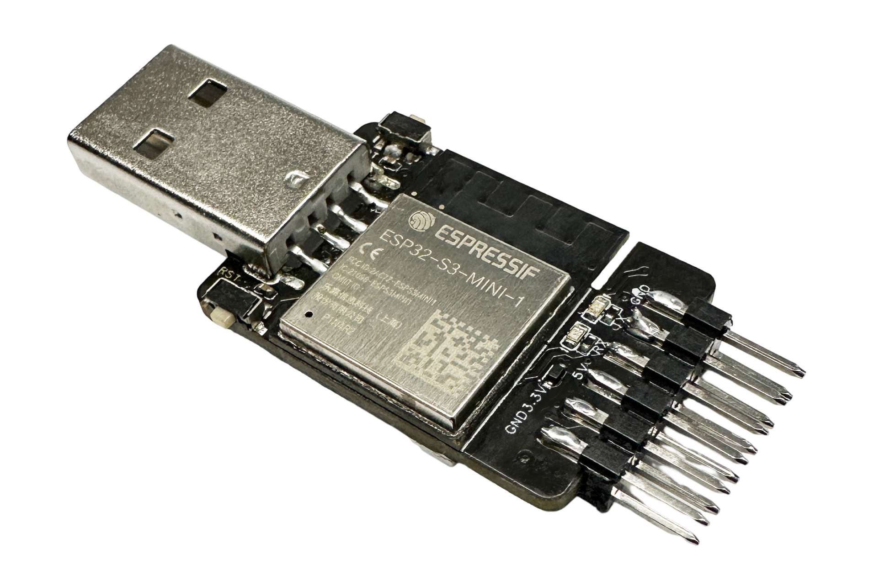
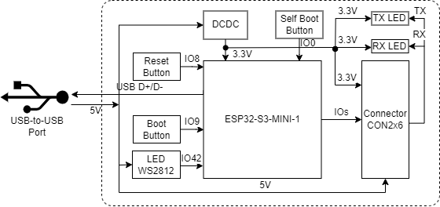
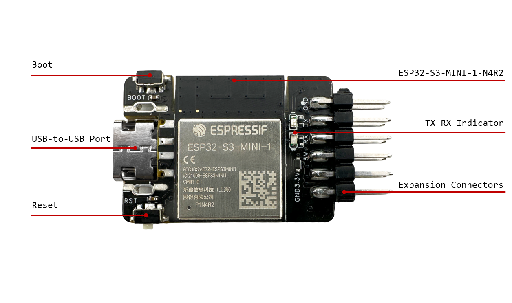
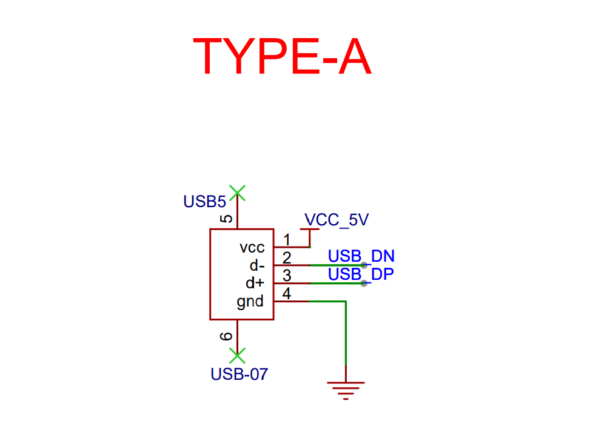
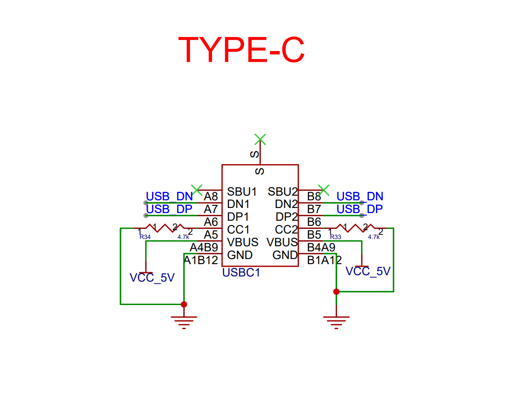
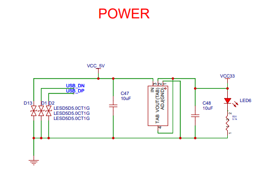

===================
ESP32-S3-USB-Bridge
===================

:link_to_translation:`zh_CN:[中文]`

This user guide will help you get started with ESP32-S3-USB-Bridge and will also provide more in-depth information.

The document consists of the following sections:

- `Board Overview`_: Overview of the board hardware/software
- `Start Application Development`_: How to set up hardware/software to develop applications
- `Hardware Reference`_: More detailed information about the board's hardware
- `Hardware Revision Details`_: This is the first revision of this board released
- `Sample Request`_: How to get a sample board
- `Related Documents`_: Links to related documentation

Board Overview
==============

ESP32-S3-USB-Bridge is a development board based on ESP32-S3.

- The `usb_wireless_bridge <https://github.com/espressif/esp-dev-kits/tree/master/esp32-s3-usb-bridge/examples/usb_wireless_bridge>`_ example can be used to establish a bridge between a computer and the target chip. It can emulate a USB composite device and supports multiple functions:

  - **USB-to-UART Bridge**: realizes serial data transmission and reception between the computer and the target chip.
  - **JTAG Adapter**: realizes duplex JTAG communication between the computer and the target chip.
  - **MSC Storage Device**: updates firmware by storing the UF2 firmware files in the USB storage device of the board.
  - **Wireless Bridge**: realizes wireless flashing and wireless serial data transmission and reception through ESP-NOW.

.. figure:: ../../../_static/esp32-s3-usb-bridge/esp32-s3-usb-bridge.png
    :align: center
    :scale: 35%
    :alt: ESP32-S3-USB-Bridge Type-C Connection

    ESP32-S3-USB-Bridge Type-C Connection

The development board also supports a USB Type-A interface that is convenient for replacement.

    ESP32-S3-USB-Bridge Type-A Connection

Feature List
------------

The main features of the board are listed below:

-  **Module Embedded**: ESP32-S3-MINI-1 module with 4 MB flash and 2 MB PSRAM
-  **LED Indicators**: on-board WS2812 LED indicator with two serial data LED indicators
-  **USB**: on-board USB-to-UART bridge and JTAG adapter, with support for USB download/debugging

Block Diagram
-------------

The block diagram below shows the components of ESP32-S3-USB-Bridge and their interconnections.

    ESP32-S3-USB-Bridge Block Diagram (Click to Enlarge)

Description of Components
-------------------------

**ESP32-S3-USB-Bridge** is a rather compact development board, with a dimension of 23.3 mm * 31.5 mm. It integrates the ESP32-S3-MINI-1 module and offers a 12-pin expansion connector.

    ESP32-S3-USB-Bridge - Front (Click to Enlarge)

The key components of the board are described in a clockwise direction.

.. list-table::
   :widths: 30 70
   :header-rows: 1

   * - Key Component
     - Description
   * - ESP32-S3-MINI-1-N4R2 Module
     - ESP32-S3-MINI-1-N4R2 is a generic Wi-Fi + Bluetooth LE MCU module that is built around the ESP32-S3 series of SoCs. It is integrated with 4 MB flash and 2 MB PSRAM. On top of a rich set of peripherals, the acceleration for neural network computing and signal processing workloads provided by the SoC makes the module an ideal choice for a wide variety of application scenarios related to Artificial Intelligence of Things (AIoT).
   * - TX/RX Indicator
     - Indicates transmit and receive status of serial data.
   * - Expansion Connector
     - Provides connections for JTAG pins, serial pins, TX/RX pins, Boot pins, Reset pins, and power supply pins.
   * - Reset Button
     - Connects the Reset button on the target chip and IO8 on the module. Press this button to reset the target chip.
   * - USB-to-USB Port
     - Provides power to the entire system. Used for USB communication between the PC and the ESP32-S3-MINI-1 module.
   * - Boot Button
     - Connects the Boot button on the target chip and IO9 on the module. Holding down the Boot button and momentarily pressing the Reset button initiates the firmware upload mode. Then you can upload firmware through the serial port or USB.

.. figure:: ../../../_static/esp32-s3-usb-bridge/esp32-s3-usb-bridge-back-instruction.png
    :align: center
    :scale: 55%
    :alt: ESP32-S3-USB-Bridge - Back (Click to Enlarge)

    ESP32-S3-USB-Bridge - Back (Click to Enlarge)

.. list-table::
   :widths: 30 70
   :header-rows: 1

   * - Key Component
     - Description
   * - 5 V to 3.3 V
     - Converts the USB voltage to 3.3 V for powering the ESP32-S3-MINI-1 module.
   * - Module Boot Button
     - Connects IO0 on the module. After holding down the Boot button and powering up the development board again, the board enters the download mode and initiates the firmware upload mode for uploading firmware.
   * - WS2812
     - Connects IO42 on the module and indicates the current state of the development board.

Software Support
----------------

Development of applications for ESP32-S3-USB-Bridge can be done using `ESP-IDF <https://github.com/espressif/esp-idf>`_ framework. ESP-IDF is a FreeRTOS-based SoC development framework with several components including LCD, ADC, RMT, and SPI. An example is provided for ESP32-S3-LCD-EV-Board under the folder :project:`Examples <esp32-s3-usb-bridge/examples>`. You can configure project options by entering ``idf.py menuconfig`` in the example directory.

.. note::

  - The current supported ESP-IDF version is release/5.0.
  - To prevent the default firmware from being replaced, please avoid pressing and holding the module's own Boot button while powering the board up/down.

Start Application Development
=============================

This section provides instructions on how to do hardware and software setup and flash firmware onto the board to develop your own application.

Required Hardware
-----------------

- 1 x ESP32-S3-USB-Bridge
- 1 x LCD subboard
- 1 x USB 2.0 cable (standard Type-A to Type-C)
- 1 x PC (Windows, Linux, or macOS)

.. note::

  Please make sure to use the appropriate USB cable. Some cables can only be used for charging, not for data transfer or program flashing.

Hardware Setup
--------------

Prepare the board for loading of the first sample application:

1. Plug in the USB cable to connect the PC with the USB port on the board.
2. Make sure the board is in the download mode.
3. The LED lights up indicating the completion of flashing.

Now the board is ready for software setup.

Software Setup
--------------

Please proceed to `Get Started <https://docs.espressif.com/projects/esp-idf/en/latest/esp32s3/get-started/index.html>`_, where Section `Installation <https://docs.espressif.com/projects/esp-idf/en/latest/esp32s3/get-started/index.html#installation>`_ will quickly help you set up the development environment.

For more software information on developing applications, please go to `Software Support`_.

Hardware Reference
==================

This section provides more detailed information about the board's hardware.

GPIO Allocation
---------------

The table below provides the GPIO allocation of the ESP32-S3-MINI-1 module and its 12-pin expansion connector, which is used to control specific components or functions on the development board as well as the externally connected target chip.

.. list-table:: ESP32-S3-MINI-1 and Expansion Connector GPIO Allocation
   :header-rows: 1
   :widths: 20 20 50

   * - Pin
     - Pin Name
     - Function
   * - 1
     - GND
     - GND
   * - 2
     - 3V3
     - Power supply
   * - 3
     - IO0
     - Module boot button for entering download mode which can also be used as a key input pin
   * - 4
     - IO2
     - JTAG pin TDO for test data output
   * - 5
     - IO3
     - JTAG pin TDI for test data input
   * - 6
     - IO4
     - JTAG pin TCK for synchronized test data transfer
   * - 7
     - IO5
     - JTAG pin TMS for test mode configuration
   * - 8
     - IO8
     - The Reset pin connecting to the target chip, which sets the target chip to low level when pressed
   * - 9
     - IO9
     - The Boot pin connecting to the target chip, which sets the target chip to low level when pressed
   * - 10
     - IO19
     - USB_D-
   * - 11
     - IO20
     - USB_D+
   * - 12
     - IO40
     - RX connecting to the UART TX pin of the target chip
   * - 13
     - IO41
     - TX connecting to the UART RX pin of the target chip
   * - 14
     - IO42
     - WS2812 control pin

.. note::

  Pin 3 to Pin 14 are the corresponding pins of the 12-pin expansion connector. Apart from the features in the above table, all these IO pins support to be configured for other purposes. Note that GPIO5 and GPIO8 should be connected to external keys.

Power Distribution
------------------

Power Supply over USB
^^^^^^^^^^^^^^^^^^^^^

There are two ways to power the development board via the USB power port:

- Via the ``Type-A`` port

    ESP32-S3-USB-Bridge - Type-A Power Supply

- Via the ``Type-C`` port

    ESP32-S3-USB-Bridge - Type-C Power Supply

Voltage Conversion Circuit
^^^^^^^^^^^^^^^^^^^^^^^^^^

The ESP32-S3-USB-Bridge supports converting 5 V to 3.3 V for the module.

    ESP32-S3-USB-Bridge - Voltage Conversion

Hardware Setup Options
----------------------

Automatic Download
^^^^^^^^^^^^^^^^^^

Press the Boot button on the module and re-power up the board, then release the Boot button to allow the board to enter the download mode.

Hardware Revision Details
=========================

No previous revisions.

Sample Request
==============

This board has been open-sourced to `OSHWHub <https://oshwhub.com/esp-college/esp32s3_usb_flash_tool>`_. Please sample it according to your needs.

Related Documents
=================

-  `ESP32-S3 Datasheet <https://www.espressif.com/sites/default/files/documentation/esp32-s3_datasheet_en.pdf>`__
-  `ESP32-S3-MINI-1 Datasheet <https://www.espressif.com/sites/default/files/documentation/esp32-s3-mini-1_mini-1u_datasheet_en.pdf>`__
-  `ESP Product Selector <https://products.espressif.com/#/product-selector?names=>`__
-  `ESP32-S3-USB-Bridge PCB Layout <../../_static/esp32-s3-usb-bridge/schematics/PCB_ESP32-S3-USB-Bridge-MB_V2.1_20230601.pdf>`__
-  `ESP32-S3-USB-Bridge Schematics <../../_static/esp32-s3-usb-bridge/schematics/SCH_ESP32-S3-USB-Bridge-MB_V2.1_20230601.pdf>`__

For further design documentation for the board, please contact us at `sales@espressif.com <sales@espressif.com>`_.
