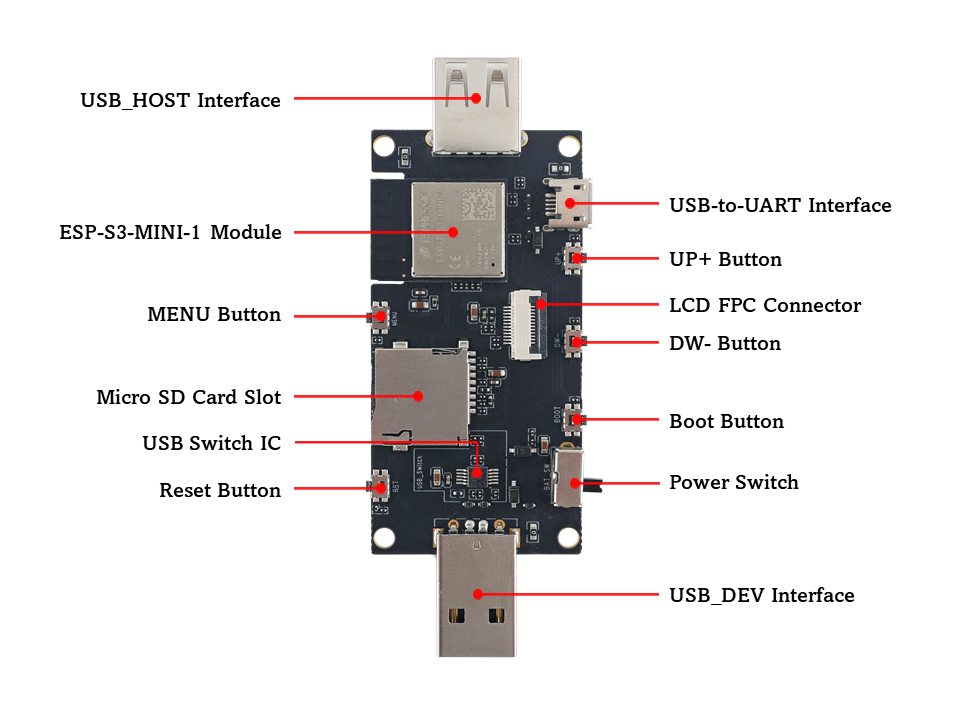
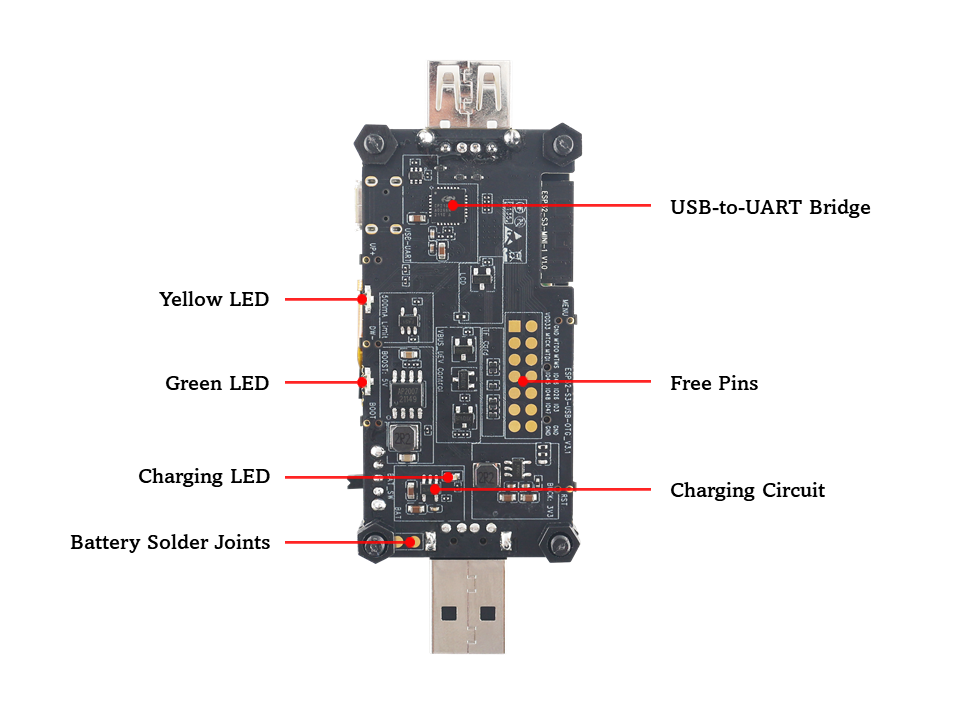
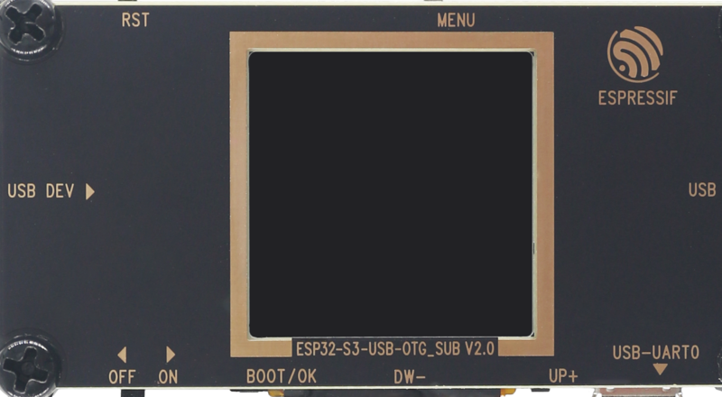
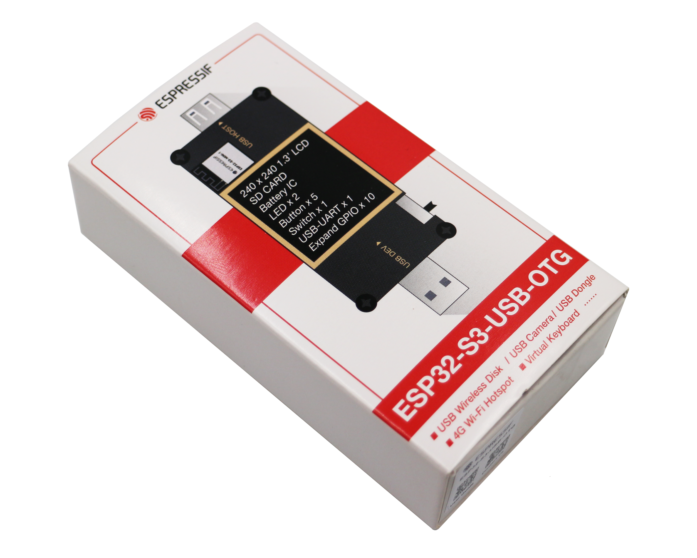
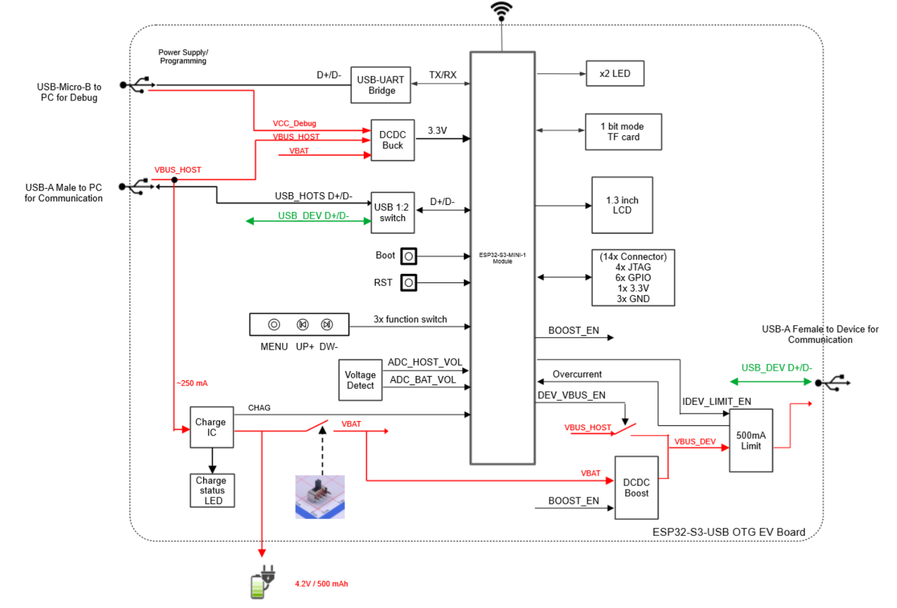
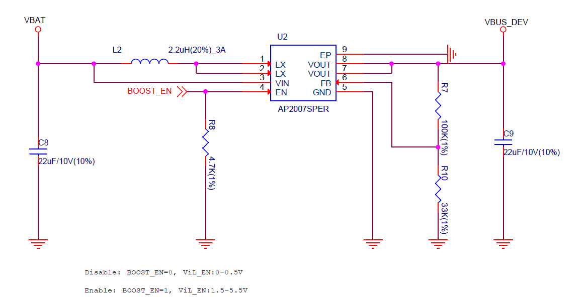
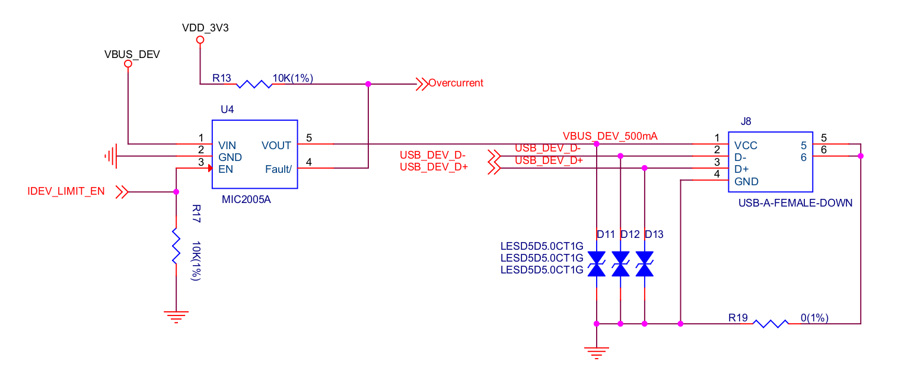
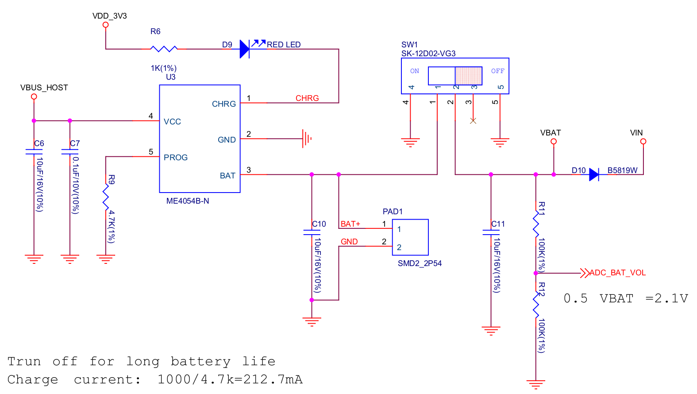

ESP32-S3-USB-OTG
====================

:link_to_translation:`zh_CN:[中文]`

ESP32-S3-USB-OTG is a development board that focuses on USB-OTG function verification and application development. It is based on ESP32-S3 SoC, supports Wi-Fi and BLE 5.0 wireless functions, and supports USB host and USB device functions. It can be used to develop applications such as wireless storage devices, Wi-Fi network cards, LTE MiFi, multimedia devices, virtual keyboards and mice. The development board has the following features:

-  Onboard ESP32-S3-MINI-1-N8 module, with built-in 8 MB flash
-  Onboard USB Type-A host and device interface, with built-in USB interface switching circuit
-  Onboard USB to serial debugging chip (Micro USB interface)
-  Onboard 1.3-inch LCD color screen, supports GUI
-  Onboard SD card interface, compatible with SDIO and SPI interfaces
-  Onboard charging IC, can be connected to lithium battery

.. figure:: ../../../_static/esp32-s3-usb-otg/pic_product_esp32_s3_otg.png
   :alt: ESP32-S3-USB-OTG
   :scale: 40%
   :figclass: align-center

   ESP32-S3-USB-OTG (click to enlarge)

**The document consists of the following major sections:**

-  :ref:`Getting-started`: Provides a brief overview of ESP32-S3-USB-OTG and necessary hardware and software information.
-  :ref:`Hardware-reference`: Provides detailed hardware information of ESP32-S3-USB-OTG.
-  :ref:`Related-documents`: Provides links to related documents.

.. _Getting-started:

Getting Started
---------------

This section describes how to start using ESP32-S3-USB-OTG. It includes introduction to basic information about ESP32-S3-USB-OTG first, and then on how to start using the development board for application development, as well as board packaging and retail information.

Description of Components
~~~~~~~~~~~~~~~~~~~~~~~~~

The ESP32-S3-USB-OTG development board includes the following parts:

-  **Motherboard:** ESP32-S3-USB-OTG motherboard is the core of the kit. The motherboard integrates the ESP32-S3-MINI-1 module and provides an interface of the 1.3-inch LCD screen.

   ESP32-S3-USB-OTG Top View (click to enlarge)

The following table starts with the USB_HOST Interface on the left, and introduces the main components in the above figure in an anticlockwise order.

.. list-table::
   :widths: 30 70
   :header-rows: 1

   * - Main components
     - Description
   * - USB_HOST Interface
     - USB Type-A female port, used to connect other USB devices.
   * - ESP32-S3-MINI-1 Module
     - ESP32-S3-MINI-1 is a powerful, generic Wi-Fi + Bluetooth LE MCU module that has a rich set of peripherals. It has strong ability for neural network computing and signal processing. ESP32-S3-MINI-1 comes with a PCB antenna and is pin-to-pin compatible with ESP32-S2-MINI-1.
   * - MENU Button
     - Menu button.
   * - Micro SD Card Slot
     - Micro SD card can be inserted. Both four-line SDIO and SPI mode are supported.
   * - USB Switch IC
     - By setting the level of USB_SEL, you can switch USB peripherals to make them either connected to the USB_DEV interface or the USB_HOST interface. USB_DEV will be connected by default.
   * - Reset Button
     - Press this button to restart the system.
   * - USB_DEV Interface
     - USB Type-A male port, can be connected to the USB host, and also used as a lithium battery charge power source.
   * - Power Switch
     - Switch to ON to use battery power. Switch to OFF to power off battery.
   * - Boot Button
     - Download button. Holding down Boot and then pressing Reset initiates Firmware Download mode for downloading firmware through the serial port.
   * - DW- Button
     - Down button.
   * - LCD FPC Connector
     - Used to connect the 1.3-inch LCD screen.
   * - UP+ Button
     - Up button.
   * - USB-to-UART Interface
     - A Micro-USB port used for power supply to the board, for flashing applications to the chip, as well as for communication with the chip via the on-board USB-to-UART bridge.

   ESP32-S3-USB-OTG Bottom View (click to enlarge)

The following table starts with the Yellow LED on the left, and introduces the main components in the above figure in an anticlockwise order.

.. list-table::
   :widths: 30 70
   :header-rows: 1

   * - Main components
     - Description
   * - Yellow LED
     - Driven by GPIO16, set high level to turn on.
   * - Green LED
     - Driven by GPIO15, set high level to turn on.
   * - Charging LED
     - During charging, the red light is on, which will be turned off when charged.
   * - Battery Solder Joints
     - 3.6 V lithium battery can be welded to power the motherboard.
   * - Charging Circuit
     - Used to charge lithium battery.
   * - Free Pins
     - Idle pins that can be customized.
   * - USB-to-UART Bridge
     - Single USB-to-UART bridge chip provides transfer rates up to 3 Mbps.

-  **Subboard:** ESP32-S3-USB-OTG-SUB mount the 1.3-inch LCD screen

   ESP32-S3-USB-OTG Subboard (click to enlarge)

Start Application Development
~~~~~~~~~~~~~~~~~~~~~~~~~~~~~

Before powering on the ESP32-S3-USB-OTG, please make sure that the development board is intact.

Required Hardware
^^^^^^^^^^^^^^^^^

-  ESP32-S3-USB-OTG
-  A USB 2.0 data cable (standard A to Micro-B)
-  Computer (Windows, Linux or macOS)

Software Setup
^^^^^^^^^^^^^^

Please proceed to `Get Started <https://docs.espressif.com/projects/esp-idf/en/latest/esp32s3/get-started/index.html>`__, where Section `Installation Step by Step <https://docs.espressif.com/projects/esp-idf/en/latest/esp32s3/get-started/index.html#get-started-step-by-step>`__ will quickly help you set up the development environment and then flash an application example onto your board.

Project Option
^^^^^^^^^^^^^^

An example is provided for ESP32-S3-USB-OTG under the folder :project:`Examples <esp32-s3-usb-otg/examples>`.

You can configure project options by entering ``idf.py menuconfig`` in the example directory.

Contents and Packaging
~~~~~~~~~~~~~~~~~~~~~~

Retail Orders
^^^^^^^^^^^^^

If you order a few samples, each board comes in an individual package in either an antistatic bag or any packaging depending on your retailer.

   ESP32-S3-USB-OTG Package (click to enlarge)

Which contains the following parts:

- Motherboard:

  - ESP32-S3-USB-OTG

- Subboard:

  - ESP32-S3-USB-OTG_SUB

- Fastener

  - Mounting bolt (x4)
  - Screw (x4)
  - Nut (x4)

For retail orders, please go to https://www.espressif.com/zh-hans/company/contact/buy-a-sample.

Wholesale Order
^^^^^^^^^^^^^^^

If purchased in bulk, the development board will be packaged in a large cardboard box.

For wholesale orders, please go to https://www.espressif.com/en/contact-us/sales-questions.

.. _Hardware-reference:

Hardware Reference
------------------

Block Diagram
~~~~~~~~~~~~~

The block diagram below shows the components of ESP32-S3-USB-OTG and their interconnections.

   ESP32-S3-USB-OTG Block Diagram (click to enlarge)

Please note that the external interface corresponding to the ``USB_HOST D+ D-`` signal in the functional block diagram is ``USB DEV``, which means that ESP32-S3 is used as a device to receive signals from other USB hosts. The external interface corresponding to the ``USB_DEV D+ D-`` signal is ``USB HOST``, which means that ESP32-S3 acts as a host to control other devices.

Power Supply Options
~~~~~~~~~~~~~~~~~~~~

There are three power supply methods for the development board:

1. Power supply through the ``Micro_USB`` interface

   -  Use the USB cable (standard A to Micro-B) to connect the motherboard to a power supply device, and set battery switch to OFF. Please note that in this power supply mode, only the motherboard and display are powered.

2. Power supply through the ``USB_DEV`` interface

   -  Set ``DEV_VBUS_EN`` to high level, and set the battery switch to OFF. This mode can supply power to the ``USB HOST`` interface. The lithium battery will be charged at the same time (if the lithium battery is installed)

3. Power supply through the battery

   -  Set ``BOOST_EN`` to high level, and set the battery switch to ON. You should solder a 1-Serial lithium battery (3.7 V ~ 4.2 V) to the power solder joint reserved on the back of the motherboard first. This mode can supply power to the ``USB HOST`` interface at the same time. The battery interface description is as follows:

.. figure:: ../../../_static/esp32-s3-usb-otg/pic_board_battery_lable.png
   :alt: ESP32-S3-USB-OTG
   :scale: 65%
   :figclass: align-center

   Battery Connection (click to enlarge)

USB HOST Interface Power Options
~~~~~~~~~~~~~~~~~~~~~~~~~~~~~~~~

The ``USB HOST`` interface (Type-A female port) can supply power to the connected USB device. The power supply voltage is 5 V and the maximum current is 500 mA.

-  There are two power supply methods for the ``USB HOST`` interface:

   1. Power is supplied through the ``USB_DEV`` interface, and the 5 V power is directly from the power source connected to the interface.
   2. Power is supplied through the lithium battery, and the 3.6 V ~ 4.2 V voltage of the lithium battery is boosted to 5 V through the Boost circuit. The working status of Boost IC can be controlled by BOOST_EN/GPIO13, set high to enable Boost.

   Boost Circuit (click to enlarge)

-  ``USB HOST`` interface power supply selection:

.. list-table::
   :widths: 30 35 35
   :header-rows: 1

   * - BOOST_EN
     - DEV_VBUS_EN
     - Power Source
   * - 0
     - 1
     - USB_DEV
   * - 1
     - 0
     - Battery
   * - 0
     - 0
     - No output
   * - 1
     - 1
     - Undefined

.. figure:: ../../../_static/esp32-s3-usb-otg/sch_power_switch.png
   :alt: ESP32-S3-USB-OTG
   :scale: 65%
   :figclass: align-center

   Power Switch Circuit (click to enlarge)

-  500 mA current limiting circuit:

   1. The current limiting IC MIC2005A can limit the maximum output current of the ``USB HOST`` interface to 500 mA. Please set the ``IDEV_LIMIT_EN`` (GPIO17) to high level to enable the current-limiting IC to output voltage.

   500 mA Current Limiting Circuit (click to enlarge)

USB Interface Switch Circuit
~~~~~~~~~~~~~~~~~~~~~~~~~~~~

.. figure:: ../../../_static/esp32-s3-usb-otg/sch_usb_switch.png
   :alt: ESP32-S3-USB-OTG
   :scale: 45%
   :figclass: align-center

   USB Interface Switch Circuit (click to enlarge)

-  When **USB_SEL** (GPIO18) is set to high level, the USB D+/D- Pin (GPIO19, 20) will be connected to ``USB_DEV D+ D-``. Then you can use the ``USB HOST`` interface (Type-A female Port) to connect other USB devices.
-  When **USB_SEL** (GPIO18) is set to low level, the USB D+/D- Pin (GPIO19, 20) will be connected to ``USB_HOST D+ D-``. Then you can use the ``USB DEV`` interface (Type-A male port) to connect to a host like a PC.
-  **USB_SEL** is pulled low level by default.

LCD Interface
~~~~~~~~~~~~~

.. figure:: ../../../_static/esp32-s3-usb-otg/sch_interface_lcd.png
   :alt: ESP32-S3-USB-OTG
   :scale: 50%
   :figclass: align-center

   LCD Interface Circuit (click to enlarge)

Please note that this interface supports connecting SPI interface screens. The screen controller used by this development board is :project:` ST7789 <esp32-s3-usb-otg/datasheet/ST7789VW_datasheet.pdf>`, and ``LCD_BL`` (GPIO9) can be used to control the screen backlight.

SD Card Interface
~~~~~~~~~~~~~~~~~

.. figure:: ../../../_static/esp32-s3-usb-otg/sch_micro_sd_slot.png
   :alt: ESP32-S3-USB-OTG
   :scale: 45%
   :figclass: align-center

   SD Card Interface Circuit (click to enlarge)

Please note that the SD card interface is compatible with 1-wire, 4-wire SDIO mode and SPI mode. After being powered on, the card will be in 3.3 V signaling mode. Please send the first CMD0 command to select the bus mode: SD mode or SPI mode.

Charging Circuit
~~~~~~~~~~~~~~~~

   Charging Circuit (click to enlarge)

Please note that the Type-A male port can be connected to a power adapter that outputs 5 V. When charging the battery, the red indicator LED is on, after fully charged, the red indicator LED is off. When using the charging circuit, please set the battery switch to OFF. The charging current is 212.7 mA.

Pin Layout
~~~~~~~~~~

**Function pin:**

.. list-table::
   :widths: 10 20 70
   :header-rows: 1

   * - No.
     - ESP32-S3-MINI-1 Pin
     - Description
   * - 1
     - GPIO18
     - USB_SEL: Used to switch the USB interface. When high level, the USB_HOST interface is enabled. When low level (default), the USB_DEV interface is enabled.
   * - 2
     - GPIO19
     - Connect with USB D-.
   * - 3
     - GPIO20
     - Connect with USB D+.
   * - 4
     - GPIO15
     - LED_GREEN: the light is lit when set high level.
   * - 5
     - GPIO16
     - LED_YELLOW: the light is lit when set high level.
   * - 6
     - GPIO0
     - BUTTON_OK: OK button, low level when pressed.
   * - 7
     - GPIO11
     - BUTTON_DW: Down button, low level when pressed.
   * - 8
     - GPIO10
     - BUTTON_UP: UP button, low level when pressed.
   * - 9
     - GPIO14
     - BUTTON_MENU: Menu button, low level when pressed.
   * - 10
     - GPIO8
     - LCD_RET: used to reset LCD, low level to reset.
   * - 11
     - GPIO5
     - LCD_EN: used to enable LCD, low level to enable.
   * - 12
     - GPIO4
     - LCD_DC: Used to switch data and command status.
   * - 13
     - GPIO6
     - LCD_SCLK: LCD SPI Clock.
   * - 14
     - GPIO7
     - LCD_SDA: LCD SPI MOSI.
   * - 15
     - GPIO9
     - LCD_BL: LCD backlight control.
   * - 16
     - GPIO36
     - SD_SCK: SD SPI CLK / SDIO CLK.
   * - 17
     - GPIO37
     - SD_DO: SD SPI MISO / SDIO  Data0.
   * - 18
     - GPIO38
     - SD_D1: SDIO Data1.
   * - 19
     - GPIO33
     - SD_D2: SDIO Data2.
   * - 20
     - GPIO34
     - SD_D3: SD SPI CS / SDIO Data3.
   * - 21
     - GPIO1
     - HOST_VOL: USB_DEV voltage monitoring, ADC1 channel 0.
   * - 22
     - GPIO2
     - BAT_VOL: Battery voltage monitoring, ADC1 channel 1.
   * - 23
     - GPIO17
     - LIMIT_EN: Enable current limiting IC, high level enable.
   * - 24
     - GPIO21
     - 0VER_CURRENT: Current overrun signal, high level means overrun.
   * - 25
     - GPIO12
     - DEV_VBUS_EN: High level to enable DEV_VBUS power supply.
   * - 26
     - GPIO13
     - BOOST_EN: High level to enable Boost boost circuit.

**Extended pin:**

.. list-table::
   :widths: 10 30 60
   :header-rows: 1

   * - No.
     - ESP32-S3-MINI-1 Pin
     - Description
   * - 1
     - GPIO45
     - FREE_1: Idle, can be customized.
   * - 2
     - GPIO46
     - FREE_2: Idle, can be customized.
   * - 3
     - GPIO48
     - FREE_3: Idle, can be customized.
   * - 4
     - GPIO26
     - FREE_4: Idle, can be customized.
   * - 5
     - GPIO47
     - FREE_5: Idle, can be customized.
   * - 6
     - GPIO3
     - FREE_6: Idle, can be customized.

.. _Related-documents:

Related Documents
---------------------

-  `ESP32-S3 Datasheet <https://www.espressif.com/sites/default/files/documentation/esp32-s3_datasheet_en.pdf>`_ (PDF)
-  `ESP32-S3-MINI-1/1U Datasheet <https://www.espressif.com/sites/default/files/documentation/esp32-s3-mini-1_mini-1u_datasheet_en.pdf>`_ (PDF)
-  `Espressif Product Selection Tool <https://products.espressif.com/#/product-selector?names=>`_
-  `ESP32-S3-USB-OTG Schematic Diagram <../../_static/esp32-s3-usb-otg/schematics/SCH_ESP32-S3_USB_OTG.pdf>`_ (PDF)
-  `ESP32-S3-USB-OTG PCB Layout Drawing <../../_static/esp32-s3-usb-otg/schematics/PCB_ESP32-S3_USB_OTG.pdf>`_ (PDF)
-  `ST7789VW Datasheet <../../_static/esp32-s3-usb-otg/datasheet/ST7789VW_datasheet.pdf>`_ (PDF)
