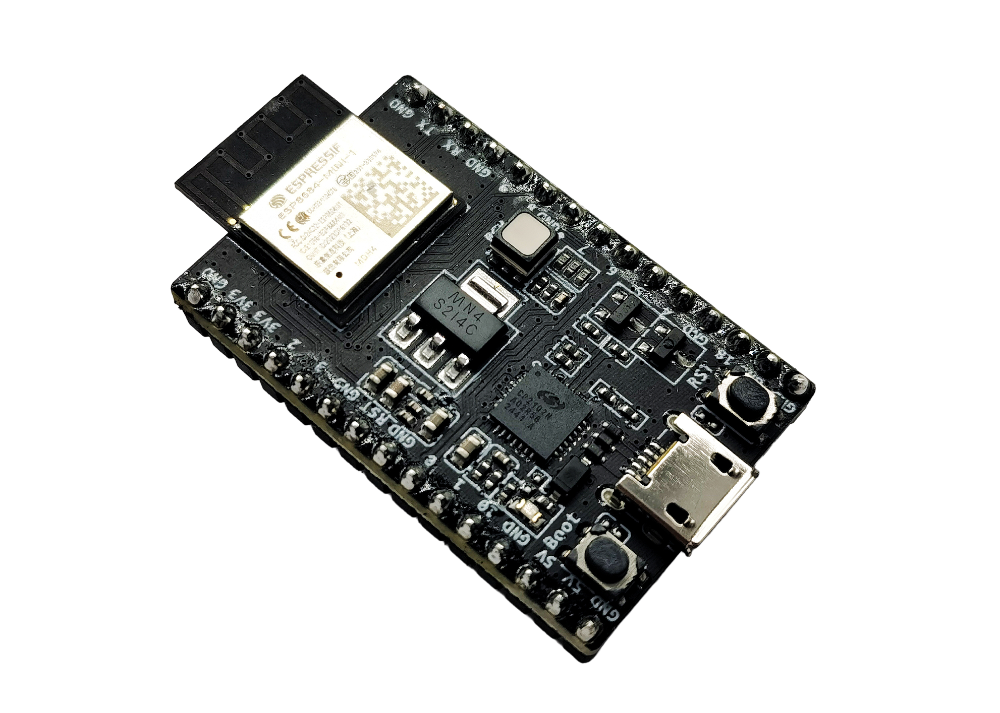
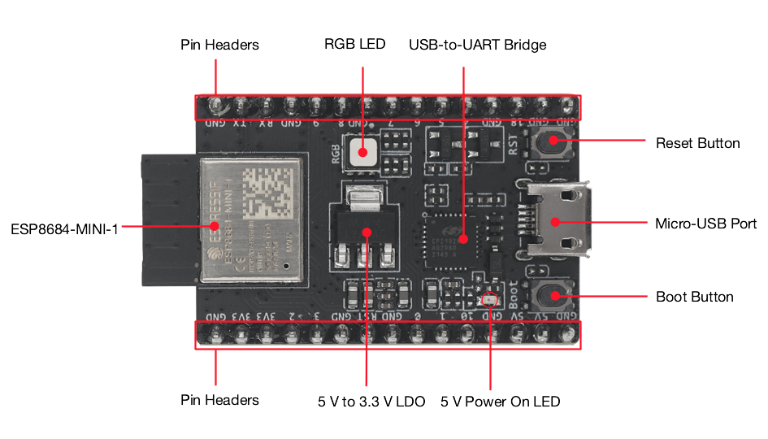
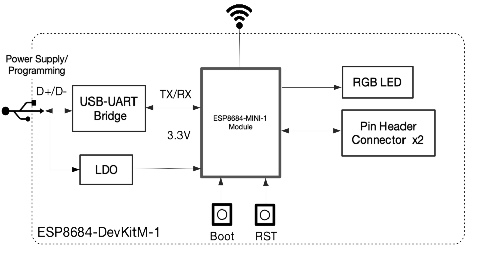
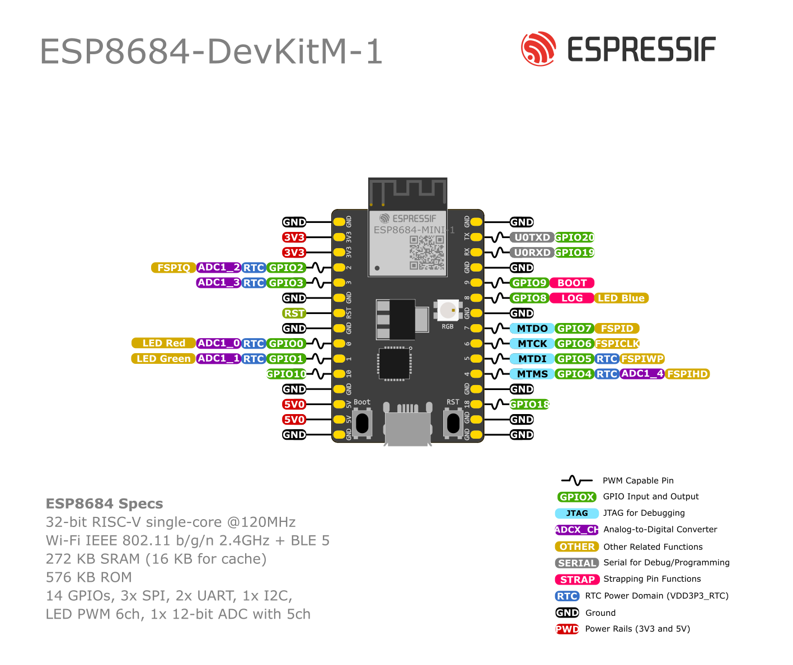

=========================
ESP8684-DevKitM-1 v1.1
=========================

:link_to_translation:`zh_CN:[中文]`

The older version: :doc:`user_guide-v1.0`.

This user guide will help you get started with ESP8684-DevKitM-1 and will also provide more in-depth information.

The ESP8684-DevKitM-1 is an entry-level development board based on ESP8684-MINI-1, a general-purpose module with 1 MB/2 MB/4 MB SPI flash. This board integrates complete Wi-Fi and Bluetooth LE functions.

Most of the I/O pins on the module are broken out to the pin headers on both sides of this board for easy interfacing. Developers can either connect peripherals with jumper wires or mount ESP8684-DevKitM-1 on a breadboard.

    ESP8684-DevKitM-1 with ESP8684-MINI-1 module

The document consists of the following major sections:

- `Getting Started`_: Overview of the board and hardware/software setup instructions to get started.
- `Hardware Overview`_: More detailed information about the board's hardware.
- `Hardware Revision Details`_: Hardware revision history, known issues, and links to user guides for previous versions (if any) of the board.
- `Related Documents`_: Links to related documentation.

Getting Started
===============

This section provides a brief introduction of ESP8684-DevKitM-1, instructions on how to do the initial hardware setup and how to flash firmware onto it.

Description of Components
-------------------------

.. _user-guide-esp8684-devkitm-1-v1.1-board-front:

    ESP8684-DevKitM-1 - front

The key components of the board are described in a counter-clockwise direction.

.. list-table::
   :widths: 30 70
   :header-rows: 1

   * - Key Component
     - Description
   * - ESP8684-MINI-1
     - ESP8684-MINI-1 from Espressif is a powerful and general-purpose module that offers Wi-Fi and Bluetooth LE coexistence. It has a PCB antenna and a 1 MB/2 MB/4 MB SPI flash.
   * - Pin Headers
     - All available GPIO pins are broken out to the pin headers on the board. For details, please see :ref:`user-guide-esp8684-devkitm-1-v1.1-header-blocks`.
   * - 5 V to 3.3 V LDO
     - Power regulator that converts a 5 V supply into a 3.3 V output.
   * - 5 V Power On LED
     - Turns on when the USB power is connected to the board.
   * - Boot Button
     - Download button. Holding down **Boot** and then pressing **Reset** initiates Firmware Download mode for downloading firmware through the serial port.
   * - Micro-USB Port
     - USB interface. Power supply for the board as well as the communication interface between a computer and the ESP8684 chip.
   * - Reset Button
     - Press this button to restart the system.
   * - USB-to-UART Bridge
     - Single USB-to-UART bridge chip provides transfer rates up to 3 Mbps.
   * - RGB LED
     - RGB LED, driven by GPIO0, GPIO1 and GPIO8.

Start Application Development
-----------------------------

Before powering up your board, please make sure that it is in good condition with no obvious signs of damage.

Required Hardware
^^^^^^^^^^^^^^^^^

- ESP8684-DevKitM-1
- USB 2.0 cable (Standard-A to Micro-B)
- Computer running Windows, Linux, or macOS

.. note::

  Be sure to use an appropriate USB cable. Some cables are for charging only and do not provide the needed data lines nor work for programming the boards.

Software Setup
^^^^^^^^^^^^^^

Please proceed to `Get Started <https://docs.espressif.com/projects/esp-idf/en/latest/esp32/get-started/index.html>`__, where Section `Installation Step by Step <https://docs.espressif.com/projects/esp-idf/en/latest/esp32/get-started/index.html#get-started-step-by-step>`__ will quickly help you set up the development environment then flash an application example onto your board.

ESP-AT Support
^^^^^^^^^^^^^^^^^^^^^^

The ESP8684-DevKitM-1 supports ESP-AT software that provides a set of AT commands with which you can quickly integrate wireless connectivity features into your product without a need for embedded application development of the module on this development board .

The software is available as a pre-built binary that can be downloaded from `ESP-AT repository <https://github.com/espressif/esp-at/tags>`_.

For more information about using ESP-AT, including information on how to customize pre-built binaries, please refer to `ESP-AT User Guide <https://docs.espressif.com/projects/esp-at/en/latest/>`_.

Contents and Packaging
----------------------

Retail Orders
^^^^^^^^^^^^^

If you order a few samples, each board comes in an individual package in either antistatic bag or any packaging depending on your retailer.

For retail orders, please go to https://www.espressif.com/en/company/contact/buy-a-sample.

Wholesale Orders
^^^^^^^^^^^^^^^^

If you order in bulk, the boards come in large cardboard boxes.

For wholesale orders, please go to https://www.espressif.com/en/contact-us/sales-questions.

Hardware Overview
==================

Block Diagram
-------------

The block diagram below shows the components of ESP8684-DevKitM-1 and their interconnections.

    ESP8684-DevKitM-1 (click to enlarge)

Power Supply Options
^^^^^^^^^^^^^^^^^^^^^^^

There are three mutually exclusive ways to provide power to the board:

- Micro-USB Port, default power supply (recommended)
- 5V and G (GND) pins
- 3V3 and G (GND) pins

.. _user-guide-esp8684-devkitm-1-v1.1-header-blocks:

Header Block
-------------

The two tables below provide the **Name** and **Function** of the pins on both sides of the board (J1 and J3). The pin names are shown in :ref:`user-guide-esp8684-devkitm-1-v1.1-board-front`. The numbering is the same as in the `Board Schematic <../../../_static/esp8684-devkitm-1/schematics/esp8684-devkitm-1-schematics_V1.1>`_ (PDF).

J1
^^^

====  ====  ==========  ========================================
No.   Name  Type [1]_   Function
====  ====  ==========  ========================================
1     G     G            Ground
2     3V3   P            3.3 V power supply
3     3V3   P            3.3 V power supply
4     2     I/O/T        GPIO2, ADC1_CH2, FSPIQ
5     3     I/O/T        GPIO3, ADC1_CH3
6     G     G            Ground
7     RST   I            Reset; High: enable; Low: powers off
8     G     G            Ground
9     0     I/O/T        GPIO0, ADC1_CH0, LED Red
10    1     I/O/T        GPIO1, ADC1_CH1, LED Green
11    10    I/O/T        GPIO10, FSPICS0
12    G     G            Ground
13    5V    P            5 V power supply
14    5V    P            5 V power supply
15    G     G            Ground
====  ====  ==========  ========================================

J3
^^^
====  ====  ==========  ================================
No.   Name  Type [1]_   Function
====  ====  ==========  ================================
1     G     G            Ground
2     TX    I/O/T        GPIO20, U0TXD
3     RX    I/O/T        GPIO19, U0RXD
4     G     G            Ground
5     9     I/O/T        GPIO9 [2]_
6     8     I/O/T        GPIO8 [2]_, LED Blue
7     G     G            Ground
8     7     I/O/T        GPIO7, FSPID, MTDO
9     6     I/O/T        GPIO6, FSPICLK, MTCK
10    5     I/O/T        GPIO5, ADC2_CH0, FSPIWP ,MTDI
11    4     I/O/T        GPIO4, ADC1_CH4, FSPIHD ,MTMS
12    G     G            Ground
13    18    I/O/T        GPIO18
14    G     G            Ground
15    G     G            Ground
====  ====  ==========  ================================

.. [1] P: Power supply; I: Input; O: Output; T: High impedance.
.. [2] GPIO8 and GPIO9 are strapping pins of the ESP8684 chip. These pins are used to control several chip functions depending on binary voltage values applied to the pins during chip power-up or system reset. For description and application of the strapping pins, please refer to `ESP8684 Datasheet`_ > Section *Strapping Pins*.

Pin Layout
^^^^^^^^^^^

    ESP8684-DevKitM-1 Pin Layout (click to enlarge)

Hardware Revision Details
=========================

:doc:`Initial release <user_guide-v1.0>`

Main differences compared to the previous version:

- Addressable RGB LED in the previous version of the board has been changed to an RGB LED with discrete inputs for each color.
- The addressable LED was connected to GPIO8, and the new discrete LED is connected to GPIO0, GPIO1, and GPIO8.

.. note::

    Both versions of ESP8684-DevKitM-1 are available on the market.

Related Documents
=================

- `ESP8684 Datasheet <https://www.espressif.com/sites/default/files/documentation/esp8684_datasheet_en.pdf>`_ (PDF)
- `ESP8684-DevKitM-1 Schematic <../../_static/esp8684-devkitm-1/schematics/esp8684-devkitm-1-schematics_V1.1.pdf>`_ (PDF)
- `ESP8684-DevKitM-1 PCB layout <../../_static/esp8684-devkitm-1/schematics/esp8684-devkitm-1-pcb-layout_V1.1.pdf>`_ (PDF)
- `ESP8684-DevKitM-1 Dimensions <../../_static/esp8684-devkitm-1/schematics/esp8684-devkitm-1-dimensions_V1.1.pdf>`_ (PDF)
- `ESP8684-DevKitM-1 Dimensions source file <../../_static/esp8684-devkitm-1/schematics/esp8684-devkitm-1-dimensions_source_V1.1.dxf>`_ (DXF) - You can view it with `Autodesk Viewer <https://viewer.autodesk.com/>`_ online

For further design documentation for the board, please contact us at `sales@espressif.com <sales@espressif.com>`_.

.. toctree::
    :hidden:

    user_guide-v1.0