esp-dev-kits
===========================

:link_to_translation:`zh_CN:[中文]`

This is the documentation for `esp-dev-kits <https://github.com/espressif/esp-dev-kits>`_.

Supported Development Boards
----------------------------------------
=============================   ===========================
       **ESP32-P4 Development Boards**
-----------------------------------------------------------
|ESP32-P4-Function-EV-Board|_
-----------------------------   ---------------------------
`ESP32-P4-Function-EV-Board`_
=============================   ===========================

============================   ===========================
       **ESP32-C5 Development Boards**
----------------------------------------------------------
|ESP32-C5-DevKitC-1|_
----------------------------   ---------------------------
`ESP32-C5-DevKitC-1`_
============================   ===========================

============================   ===========================
       **ESP32-H2 Development Boards**
----------------------------------------------------------
 |ESP32-H2-DevKitM-1|_
----------------------------   ---------------------------
 `ESP32-H2-DevKitM-1`_
============================   ===========================

============================   ===========================
       **ESP32-C3 Development Boards**
----------------------------------------------------------
 |ESP32-C3-DevKitC-02|_         |ESP32-C3-DevKitM-1|_
----------------------------   ---------------------------
`ESP32-C3-DevKitC-02`_          `ESP32-C3-DevKitM-1`_
----------------------------   ---------------------------
 |ESP32-C3-LCDkit|_
----------------------------   ---------------------------
 `ESP32-C3-LCDkit`_
============================   ===========================

============================   ===========================
       **ESP32-C6 Development Boards**
----------------------------------------------------------
 |ESP32-C6-DevKitC-1|_          |ESP32-C6-DevKitM-1|_
----------------------------   ---------------------------
 `ESP32-C6-DevKitC-1`_          `ESP32-C6-DevKitM-1`_
============================   ===========================

============================   ===========================
       **ESP32-C61 Development Boards**
----------------------------------------------------------
 |ESP32-C61-DevKitC-1|_
----------------------------   ---------------------------
 `ESP32-C61-DevKitC-1`_
============================   ===========================

============================   ===========================
       **ESP8684 Development Boards**
----------------------------------------------------------
 |ESP8684-DevKitM-1|_            |ESP8684-DevKitC-02|_
----------------------------   ---------------------------
 `ESP8684-DevKitM-1`_            `ESP8684-DevKitC-02`_
============================   ===========================

============================   ===========================
       **ESP32-S3 Development Boards**
----------------------------------------------------------
 |ESP32-S3-DevKitC-1|_            |ESP32-S3-DevKitM-1|_
----------------------------   ---------------------------
 `ESP32-S3-DevKitC-1`_            `ESP32-S3-DevKitM-1`_
----------------------------   ---------------------------
 |ESP32-S3-USB-OTG|_            |ESP32-S3-LCD-EV-Board|_
----------------------------   ---------------------------
 `ESP32-S3-USB-OTG`_            `ESP32-S3-LCD-EV-Board`_
----------------------------   ---------------------------
 |ESP32-S3-USB-Bridge|_
----------------------------   ---------------------------
 `ESP32-S3-USB-Bridge`_
============================   ===========================

============================   ===========================
       **ESP32-S2 Development Boards**
----------------------------------------------------------
 |ESP32-S2-DevKitC-1|_            |ESP32-S2-DevKitM-1|_
----------------------------   ---------------------------
 `ESP32-S2-DevKitC-1`_            `ESP32-S2-DevKitM-1`_
============================   ===========================

============================   ===========================
       **ESP32 Development Boards**
----------------------------------------------------------
 |ESP32-DevKitC|_                |ESP32-DevKitM-1|_
----------------------------   ---------------------------
 `ESP32-DevKitC`_                `ESP32-DevKitM-1`_
----------------------------   ---------------------------
 |ESP32-PICO-KIT-1|_             |ESP32-PICO-DevKitM-2|_
----------------------------   ---------------------------
 `ESP32-PICO-KIT-1`_             `ESP32-PICO-DevKitM-2`_
----------------------------   ---------------------------
 |ESP32-LCDKit|_                 |ESP32-Ethernet-Kit|_
----------------------------   ---------------------------
 `ESP32-LCDKit`_                 `ESP32-Ethernet-Kit`_
----------------------------   ---------------------------
 |ESP32-PICO-KIT|_
----------------------------   ---------------------------
 `ESP32-PICO-KIT`_
============================   ===========================

============================   ===========================
       **Other Boards**
----------------------------------------------------------
 |ESP-Module-Prog-1|_           |ESP-Module-Prog-1R|_
----------------------------   ---------------------------
 `ESP-Module-Prog-1`_           `ESP-Module-Prog-1R`_
----------------------------   ---------------------------
 |ESP-Module-Prog-SUB-02|_     |ESP-Module-Prog-SUB-01&04|
----------------------------   ---------------------------
 `ESP-Module-Prog-SUB-02`_     `ESP-Module-Prog-SUB-01&04`_
----------------------------   ---------------------------
 |ESP-Prog|_
----------------------------   ---------------------------
 `ESP-Prog`_
============================   ===========================

============================   ===========================
       **EOL (End of Life) Boards**
----------------------------------------------------------
 |ESP32-S2-HMI-DevKit-1|_       |ESP32-Sense-Kit|_
----------------------------   ---------------------------
 `ESP32-S2-HMI-DevKit-1`_       `ESP32-Sense-Kit`_
----------------------------   ---------------------------
 |ESP32-MeshKit-Sense|_         |ESP32-S2-Touch-DevKit-1|_
----------------------------   ---------------------------
 `ESP32-MeshKit-Sense`_         `ESP32-S2-Touch-DevKit-1`_
----------------------------   ---------------------------
 |ESP32-S2-Kaluga-1|_           |ESP-WROVER-KIT|_
----------------------------   ---------------------------
 `ESP32-S2-Kaluga-1`_           `ESP-WROVER-KIT`_
----------------------------   ---------------------------
 |ESP32-S2-Saola-1|_
----------------------------   ---------------------------
 `ESP32-S2-Saola-1`_
============================   ===========================

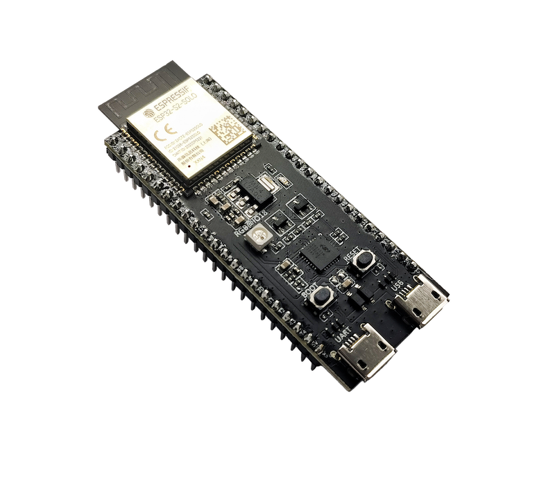
.. _ESP32-S2-DevKitC-1: esp32s2/esp32-s2-devkitc-1/index.html

.. |ESP32-S2-DevKitM-1| image:: ../_static/esp32-s2-devkitm-1/esp32-s2-devkitm-1-v1-isometric.png
.. _ESP32-S2-DevKitM-1: esp32s2/esp32-s2-devkitm-1/index.html

.. |ESP32-S2-Saola-1| image:: ../_static/esp32-s2-saola-1/esp32-s2-saola-1-v1.2-isometric.png
.. _ESP32-S2-Saola-1: esp32s2/esp32-s2-saola-1/index.html

.. |ESP32-Sense-Kit| image:: ../_static/esp32-sense-kit/touch_eb_overview.jpg
.. _ESP32-Sense-Kit: esp32/esp32-sense-kit/index.html

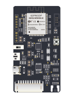
.. _ESP32-MeshKit-Sense: esp32/esp32-meshkit-sensor/index.html

.. |ESP32-LCDKit| image:: ../_static/esp32-lcdkit/esp32-lcdkit-board.png
                  :height: 230px
                  :width: 400px
.. _ESP32-LCDKit: esp32/esp32-lcdkit/index.html

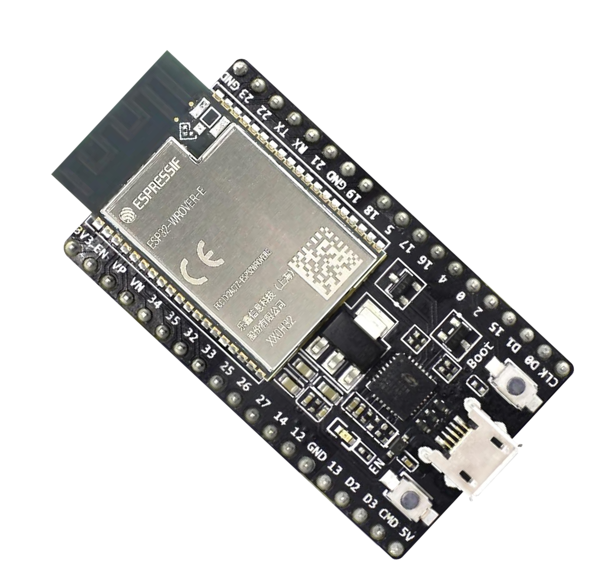
.. _ESP32-DevKitC: esp32/esp32-devkitc/index.html

.. |ESP32-S2-HMI-DevKit-1| image:: ../_static/esp32-s2-hmi-devkit-1/esp32-s2-hmi-devkit-1-3d-v1.0.png
.. _ESP32-S2-HMI-DevKit-1: esp32s2/esp32-s2-hmi-devkit-1/index.html

.. |ESP32-S2-Kaluga-1| image:: ../_static/esp32-s2-kaluga-1/ESP32-S2-Kaluga_V1.0_mainbody.png
.. _ESP32-S2-Kaluga-1: esp32s2/esp32-s2-kaluga-1/index.html

.. |ESP32-S2-Touch-DevKit-1| image:: ../_static/esp32-s2-touch-devkit-1/motherboard.png
.. _ESP32-S2-Touch-DevKit-1: esp32s2/esp32-s2-touch-devkit-1/index.html

.. |ESP32-S3-DevKitC-1| image:: ../_static/esp32-s3-devkitc-1/esp32-s3-devkitc-1-v1-isometric.png
.. _ESP32-S3-DevKitC-1: esp32s3/esp32-s3-devkitc-1/index.html

.. |ESP32-S3-DevKitM-1| image:: ../_static/esp32-s3-devkitm-1/esp32-s3-devkitm-1-v1-isometric.png
.. _ESP32-S3-DevKitM-1: esp32s3/esp32-s3-devkitm-1/index.html

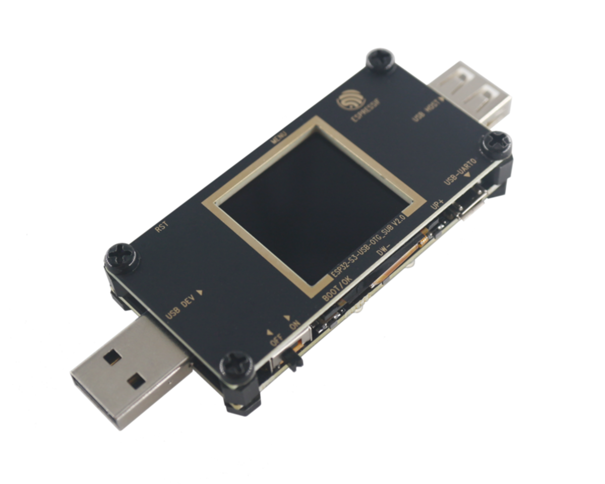
.. _ESP32-S3-USB-OTG: esp32s3/esp32-s3-usb-otg/index.html

.. |ESP32-S3-LCD-EV-Board| image:: ../_static/esp32-s3-lcd-ev-board/ESP32-S3-LCD-EV-Board_480x480.png
.. _ESP32-S3-LCD-EV-Board: esp32s3/esp32-s3-lcd-ev-board/index.html

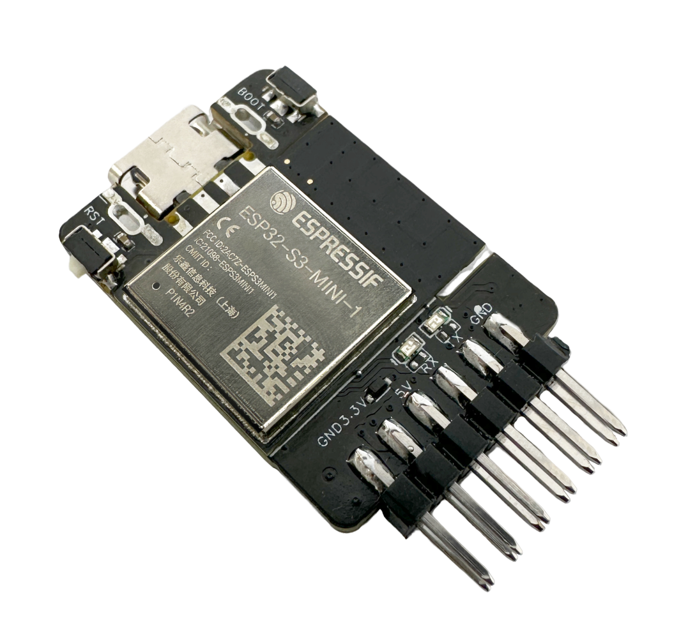
.. _ESP32-S3-USB-Bridge: esp32s3/esp32-s3-usb-bridge/index.html

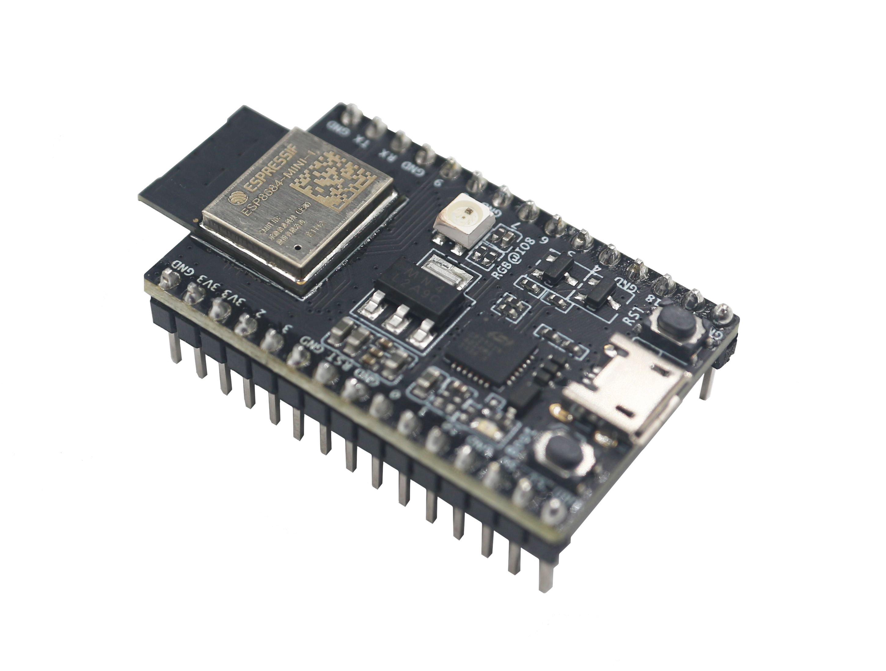
.. _ESP8684-DevKitM-1: esp8684/esp8684-devkitm-1/index.html

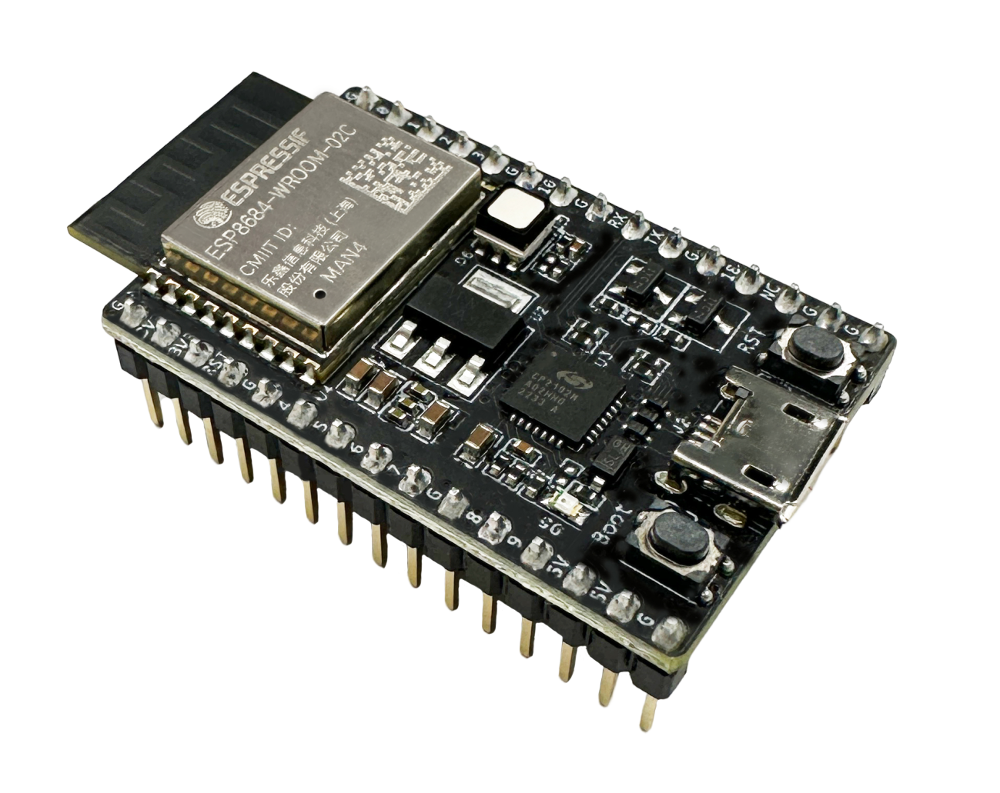
.. _ESP8684-DevKitC-02: esp8684/esp8684-devkitc-02/index.html

.. |ESP32-C3-DevKitC-02| image:: ../_static/esp32-c3-devkitc-02/esp32-c3-devkitc-02-v1-isometric.png
.. _ESP32-C3-DevKitC-02: esp32c3/esp32-c3-devkitc-02/index.html

.. |ESP32-C3-DevKitM-1| image:: ../_static/esp32-c3-devkitm-1/esp32-c3-devkitm-1-v1-isometric.png
.. _ESP32-C3-DevKitM-1: esp32c3/esp32-c3-devkitm-1/index.html

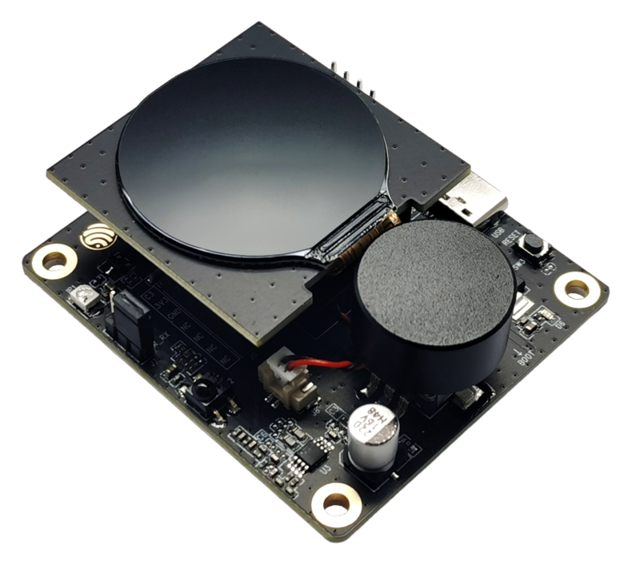
.. _ESP32-C3-LCDkit: esp32c3/esp32-c3-lcdkit/index.html

.. |ESP32-C6-DevKitC-1| image:: ../_static/esp32-c6-devkitc-1/esp32-c6-devkitc-1-isometric_v1.2.png
.. _ESP32-C6-DevKitC-1: esp32c6/esp32-c6-devkitc-1/index.html

.. |ESP32-C6-DevKitM-1| image:: ../_static/esp32-c6-devkitm-1/esp32-c6-devkitm-1-isometric.png
.. _ESP32-C6-DevKitM-1: esp32c6/esp32-c6-devkitm-1/index.html

.. |ESP32-C61-DevKitC-1| image:: ../_static/esp32-c61-devkitc-1/esp32-c61-devkitc-1-isometric.png
.. _ESP32-C61-DevKitC-1: esp32c61/esp32-c61-devkitc-1/index.html

.. |ESP-Prog| image:: ../_static/esp-prog/three_dimension.png
.. _ESP-Prog: other/esp-prog/index.html

.. |ESP32-H2-DevKitM-1| image:: ../_static/esp32-h2-devkitm-1/esp32-h2-devkitm-1-45.png
.. _ESP32-H2-DevKitM-1: esp32h2/esp32-h2-devkitm-1/index.html

.. |ESP32-P4-Function-EV-Board| image:: ../_static/esp32-p4-function-ev-board/esp32-p4-function-ev-board-isometric.png
.. _ESP32-P4-Function-EV-Board: esp32p4/esp32-p4-function-ev-board/index.html

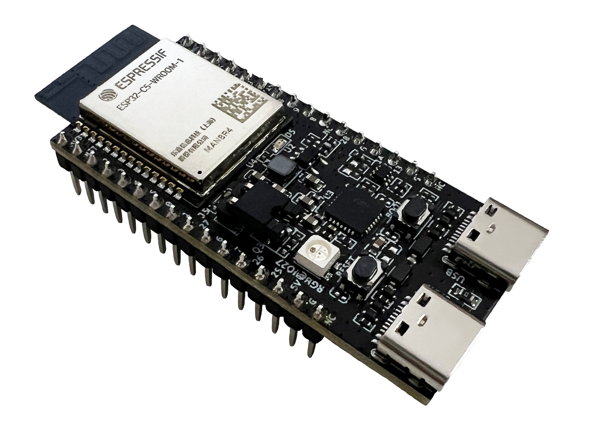
.. _ESP32-C5-DevKitC-1: esp32c5/esp32-c5-devkitc-1/index.html

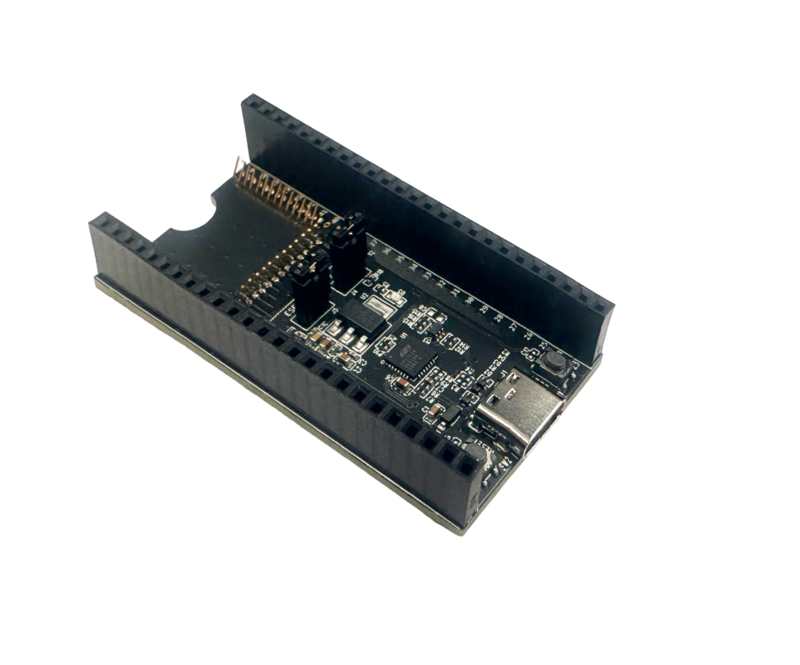
.. _ESP-Module-Prog-1: other/esp-module-prog-1-r/index.html

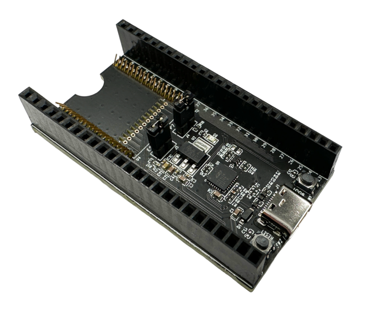
.. _ESP-Module-Prog-1R: other/esp-module-prog-1-r/index.html

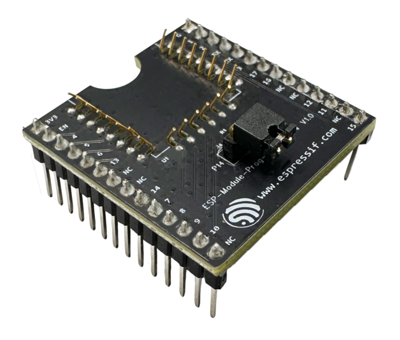
.. _ESP-Module-Prog-SUB-01&04: other/esp-module-prog-sub-01&04/index.html

.. |ESP-Module-Prog-SUB-02| image:: ../_static/esp-module-prog-sub-02/esp-module-prog-sub-02.png
.. _ESP-Module-Prog-SUB-02: other/esp-module-prog-sub-02/index.html

.. |ESP32-PICO-DevKitM-2| image:: ../_static/esp32-pico-devkitm-2/esp32-pico-devkitm-2-overview.png
.. _ESP32-PICO-DevKitM-2: esp32/esp32-pico-devkitm-2/index.html

.. |ESP32-Ethernet-Kit| image:: ../_static/esp32-ethernet-kit/esp32-ethernet-kit-v1.2-overview.png
.. _ESP32-Ethernet-Kit: esp32/esp32-ethernet-kit/index.html

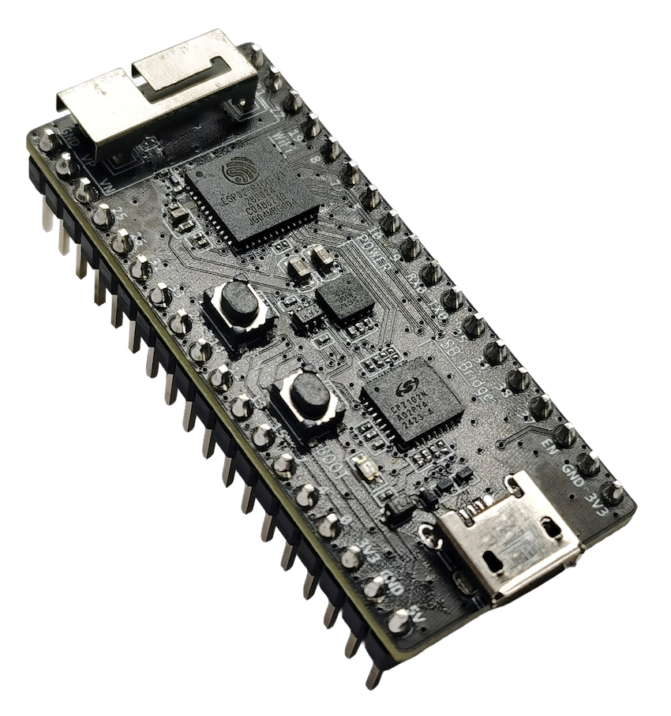
.. _ESP32-PICO-KIT-1: esp32/esp32-pico-kit-1/index.html

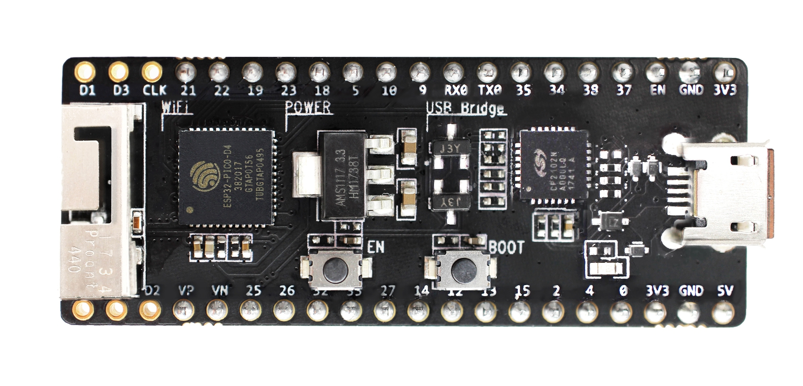
.. _ESP32-PICO-KIT: esp32/esp32-pico-kit/index.html

.. |ESP-WROVER-KIT| image:: ../_static/esp-wrover-kit/esp-wrover-kit-v4.1-layout-front.png
.. _ESP-WROVER-KIT: esp32/esp-wrover-kit/index.html

.. |ESP32-DevKitM-1| image:: ../_static/esp32-devkitm-1/esp32-DevKitM-1-isometric.png
.. _ESP32-DevKitM-1: esp32/esp32-devkitm-1/index.html

Related
~~~~~~~~~~~~~~~~

- `ESP-IDF Get Started <https://docs.espressif.com/projects/esp-idf/en/latest/esp32/get-started/index.html#get-started-get-prerequisites>`_
- `ESP-IDF Programming Guide <https://docs.espressif.com/projects/esp-idf/en/latest/esp32/get-started/index.html>`__
- `ESP Product Selector <https://products.espressif.com/#/product-selector?language=en&names=>`_

.. toctree::
   :hidden:
   :caption: ESP32-C3 Boards

   ESP32-C3-DevKitC-02 <esp32c3/esp32-c3-devkitc-02/index>
   ESP32-C3-DevKitM-1 <esp32c3/esp32-c3-devkitm-1/index>
   ESP32-C3-LCDkit <esp32c3/esp32-c3-lcdkit/index>

.. toctree::
   :hidden:
   :caption: ESP32-C6 Boards

   ESP32-C6-DevKitC-1 <esp32c6/esp32-c6-devkitc-1/index>
   ESP32-C6-DevKitM-1 <esp32c6/esp32-c6-devkitm-1/index>

.. toctree::
   :hidden:
   :caption: ESP32-C61 Boards

   ESP32-C61-DevKitC-1 <esp32c61/esp32-c61-devkitc-1/index>

.. toctree::
   :hidden:
   :caption: ESP32-H2 Boards

   ESP32-H2-DevKitM-1 <esp32h2/esp32-h2-devkitm-1/index>

.. toctree::
   :hidden:
   :caption: ESP32-P4 Boards

   ESP32-P4-Function-EV-Board <esp32p4/esp32-p4-function-ev-board/index>

.. toctree::
   :hidden:
   :caption: ESP32-C5 Boards

   ESP32-C5-DevKitC-1 <esp32c5/esp32-c5-devkitc-1/index>

.. toctree::
   :hidden:
   :caption: ESP8684 Boards

   ESP8684-DevKitM-1 <esp8684/esp8684-devkitm-1/index>
   ESP8684-DevKitC-02 <esp8684/esp8684-devkitc-02/index>

.. toctree::
   :hidden:
   :caption: ESP32-S3 Boards

   ESP32-S3-DevKitC-1 <esp32s3/esp32-s3-devkitc-1/index>
   ESP32-S3-DevKitM-1 <esp32s3/esp32-s3-devkitm-1/index>
   ESP32-S3-USB-OTG <esp32s3/esp32-s3-usb-otg/index>
   ESP32-S3-LCD-EV-Board <esp32s3/esp32-s3-lcd-ev-board/index>
   ESP32-S3-USB-Bridge <esp32s3/esp32-s3-usb-bridge/index>

.. toctree::
   :hidden:
   :caption: ESP32-S2 Boards

   ESP32-S2-DevKitC-1 <esp32s2/esp32-s2-devkitc-1/index>
   ESP32-S2-DevKitM-1 <esp32s2/esp32-s2-devkitm-1/index>

.. toctree::
   :hidden:
   :caption: ESP32 Boards

   ESP32-DevKitC <esp32/esp32-devkitc/index>
   ESP32-DevKitM-1 <esp32/esp32-devkitm-1/index>
   ESP32-PICO-KIT-1 <esp32/esp32-pico-kit-1/index>
   ESP32-PICO-DevKitM-2 <esp32/esp32-pico-devkitm-2/index>
   ESP32-LCDKit <esp32/esp32-lcdkit/index>
   ESP32-Ethernet-Kit <esp32/esp32-ethernet-kit/index>
   ESP32-PICO-KIT <esp32/esp32-pico-kit/index>

.. toctree::
   :hidden:
   :caption: Other Boards

   ESP-Prog <other/esp-prog/index>
   ESP-Module-Prog-1(R) <other/esp-module-prog-1-r/index>
   ESP-Module-Prog-SUB-01&04 <other/esp-module-prog-sub-01&04/index>
   ESP-Module-Prog-SUB-02 <other/esp-module-prog-sub-02/index>

.. toctree::
   :hidden:
   :caption: EOL (End of Life) Boards

   ESP32-S2-HMI-DevKit-1 <esp32s2/esp32-s2-hmi-devkit-1/index>
   ESP32-Sense-Kit <esp32/esp32-sense-kit/index>
   ESP32-S2-Touch-Devkit-1 <esp32s2/esp32-s2-touch-devkit-1/index>
   ESP32-MeshKit-Sense <esp32/esp32-meshkit-sensor/index>
   ESP32-S2-Kaluga-1 <esp32s2/esp32-s2-kaluga-1/index>
   ESP-WROVER-KIT <esp32/esp-wrover-kit/index>
   ESP32-S2-Saola-1 <esp32s2/esp32-s2-saola-1/index>

.. toctree::
   :hidden:
   :caption: Contribute

   Contribute <contribute/contributions_guide>
