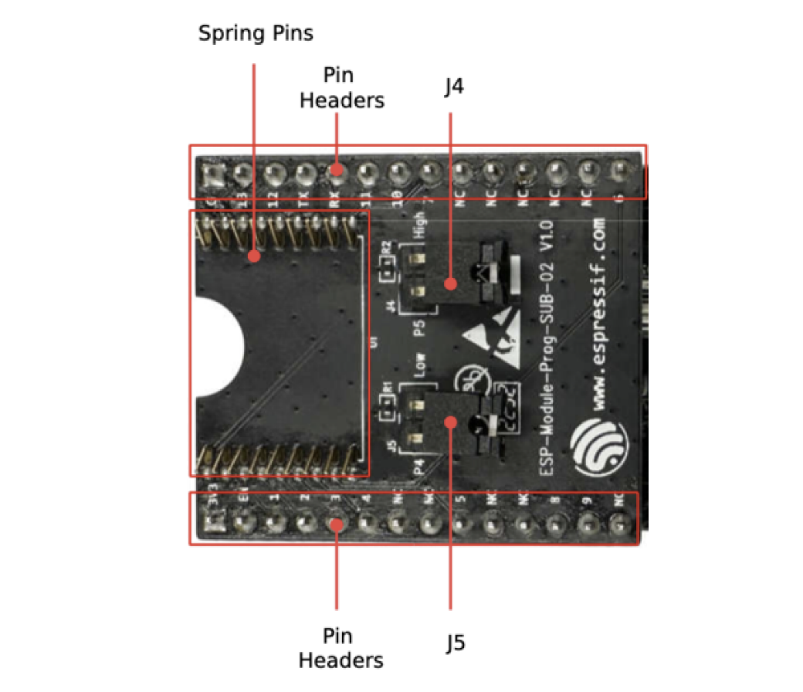
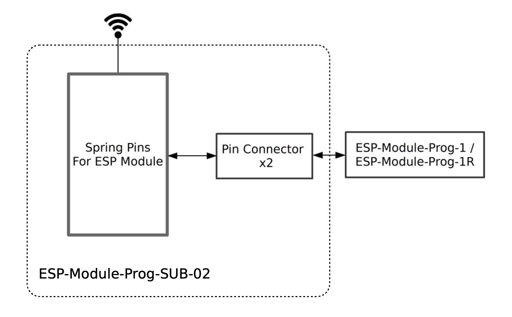

======================
ESP-Module-Prog-SUB-02
======================

:link_to_translation:`zh_CN:[中文]`

This user guide will help you get started with ESP-Module-Prog-SUB-02 and will also provide more in-depth information. For detailed information about the mainboard and the other subboard, please click the links below and check the corresponding user guides.

  - :doc:`../esp-module-prog-1-r/user_guide`
  - :doc:`../esp-module-prog-sub-01&04/user_guide`

.. figure:: ../../../_static/esp-module-prog-sub-02/esp-module-prog-sub-02.png
    :align: center
    :scale: 60%
    :alt: ESP-Module-Prog-SUB-02

    ESP-Module-Prog-SUB-02

This user guide consists of the following sections:

- `Board Overview`_: Overview of the board hardware/software.
- `Start Application Development`_: How to set up hardware/software to develop applications.
- `Hardware Reference`_: More detailed information about the board's hardware.
- `Sample Request`_: How to get a sample board.
- `Related Documents`_: Links to related documentation.

Board Overview
==============

ESP-Module-Prog-SUB-02 is an Espressif flashing subboard designed specifically for modules. It can be used to flash modules without soldering the module to the power supply and signal lines. With a module mounted, ESP-Module-Prog-SUB-02 can also be used as a mini development board like ESP32-DevKitC. Note that as a subboard, ESP-Module-Prog-SUB-02 cannot be used alone, but must be used together with the ESP-Module-Prog-1 or ESP-Module-Prog-1R mainboard.

.. _fitting-modules-of-prog-02:

- ESP-Module-Prog-SUB-02 fits the following Espressif modules:
   - ESP-WROOM-02
   - ESP-WROOM-02D
   - ESP-WROOM-02U
   - ESP32-C3-WROOM-02
   - ESP32-C3-WROOM-02U
   - ESP8684-WROOM-02C
   - ESP8684-WROOM-02UC
   - ESP32-H2-WROOM-02C

For information about the above modules, please refer to `Espressif Series Modules <https://www.espressif.com/en/products/modules?id=ESP32>`_.

Description of Components
-------------------------

.. _user-guide-esp-module-prog-sub-02-front:

    ESP-Module-Prog-SUB-02 - Front

The key components of the board are described in a clockwise direction.

.. list-table::
   :widths: 30 70
   :header-rows: 1

   * - Key Component
     - Description
   * - Spring Pins
     - Pins that fit into the module's castellated holes for attaching and securing the module.
   * - Pin Headers
     - 2.54 mm pin headers that are connected to the pins of the module mounted in this board and to the mainboard. For detailed information, please refer to Section `Pin Descriptions`_.
   * - J4
     - Configures the strapping pin. For details, please refer to Section `Strapping Pin Configuration`_.
   * - ESP-Module-Prog-1(R)
     - ESP-Module-Prog-1 and ESP-Module-Prog-1R (R stands for WROVER) are two flashing mainboards produced by Espressif. For detailed information about the mainboard, please refer to :doc:`../esp-module-prog-1-r/user_guide`.
   * - J5
     - Configures the strapping pin. For details, please refer to Section `Strapping Pin Configuration`_.

Start Application Development
=============================

Before powering up your ESP-Module-Prog-SUB-02, please make sure that it is in good condition with no obvious signs of damage.

Required Hardware
-----------------

- Any one of the above-mentioned Espressif modules
- USB-A to USB-C cable
- PC (Windows, Linux, or macOS)
- ESP-Module-Prog-1 or ESP-Module-Prog-1R mainboard

.. note::

  Please make sure to use the appropriate USB cable. Some cables can only be used for charging, not for data transfer or program flashing.

Hardware Setup
--------------

Mount the module to the ESP-Module-Prog-SUB-02 subboard as follows:

1. Place the module lightly on ESP-Module-Prog-SUB-02, making sure the castellated holes on the module are aligned with the spring pins on the board.
2. Press the module inward until you hear a "click", which indicates that the module has been successfully mounted.
3. Check if all the spring pins are clicked into the castellated holes. If there is a misalignment, you can use tweezers to poke the spring pins into the castellated holes.
4. Mount the subboard to the mainboard.

Now the board is ready for software setup.

Software Setup
--------------

Recommended Approach
^^^^^^^^^^^^^^^^^^^^

It is recommended to use the ESP-IDF development framework to flash the binary file (\*.bin) to ESP-Module-Prog-SUB-01&04. Please refer to `ESP-IDF Get Started <https://docs.espressif.com/projects/esp-idf/en/latest/esp32/get-started/index.html>`__ to get a quick overview of setting up your development environment and flashing applications.

Alternative Approach
^^^^^^^^^^^^^^^^^^^^

For Windows systems, you can also use the `Flash Download Tool <https://www.espressif.com/en/support/download/other-tools?keys=FLASH+>`_ to flash the binary files.

.. note::

  1. To flash binary files, the chip should be set to Firmware Download mode. This can be done either by the flash tool automatically, or by holding down the Boot button and tapping the Reset button.
  2. After flashing binary files, the Flash Download Tool restarts your module and boots the flashed application by default.

Hardware Reference
==================

This section provides more detailed information about the board’s hardware.

Block Diagram
-------------

The block diagram below shows the components of ESP-Module-Prog-SUB-02 and their interconnections.

    ESP-Module-Prog-SUB-02

Strapping Pin Configuration
---------------------------

J4 on ESP-Module-Prog-SUB-02 is a 2-Pin header, with one end being P5 and one end being High (i.e. pull-up):

- For some modules, the corresponding pin of P5 is not a strapping pin and no pull-up is needed for downloading. In this case, a jump cap is not required for J4.
- For some modules, the corresponding pin of P5 is a strapping pin and a pull-up is needed for downloading. In this case, a jump cap is required for J4.

J5 on ESP-Module-Prog-SUB-02 is a 2-Pin header, with one end being P4 and one end being Low (i.e. pull-down):

- For some modules, the corresponding pin of P4 is not a strapping pin and no pull-up is needed for downloading. In this case, a jump cap is not required for J5.
- For some modules, the corresponding pin of P4 is a strapping pin and a pull-up is needed for downloading. In this case, a jump cap is required for J5.

.. note::

  For the corresponding pin of P4 and P5 on Espressif modules, please refer to `ESP-Module-Prog-SUB-02 GPIO Map <https://dl.espressif.com/dl/schematics/GPIO%20MAP_ESP-Module-Prog-SUB-02_V1.0_EN_20230523.xls>`__。

Pin Descriptions
----------------

The two tables below provide the **Name** and **Signal** of pin headers on both sides of the board (J2 and J3). The pin names are shown in Figure :ref:`user-guide-esp-module-prog-sub-02-front`. The numbering is the same as in the `ESP-Module-Prog-SUB-02 Schematics <https://dl.espressif.com/dl/schematics/esp_idf/esp-module-prog-sub-02-schematics.pdf>`_ (PDF). For the corresponding pin of each signal on Espressif modules, please refer to `ESP-Module-Prog-SUB-02 GPIO Map <https://dl.espressif.com/dl/schematics/GPIO%20MAP_ESP-Module-Prog-SUB-02_V1.0_EN_20230523.xls>`__.

J2
^^^
=======  ================  ================================
No.      Name              Signal
=======  ================  ================================
1        3V3               3.3 V power supply
2        EN                CHIP_EN (High: enables the chip; Low: disables the chip. Pulled up by default.)
3        1                 P1
4        2                 P2
5        3                 P3
6        4                 P4
7        NC                No connection
8        NC                No connection
9        5                 P5
10       NC                No connection
11       NC                No connection
12       8                 P8
13       9                 P9
14       NC                No connection
=======  ================  ================================

J3
^^^
=======  ================  ================================
No.      Name              Signal
=======  ================  ================================
1        G                 Ground
2        13                P13
3        12                P12
4        TX                TXD0
5        RX                RXD0
6        11                P11
7        10                P10
8        7                 P7
9        NC                No connection
10       NC                No connection
11       NC                No connection
12       NC                No connection
13       NC                No connection
14       6                 P6
=======  ================  ================================

Sample Request
==============

Retail Orders
-------------

If you order a few samples, each ESP-Module-Prog-SUB-02 comes in an individual package in either antistatic bag or any packaging depending on your retailer.

For retail orders, please go to https://www.espressif.com/en/company/contact/buy-a-sample.

Wholesale Orders
----------------

If you order in bulk, the boards come in large cardboard boxes.

For wholesale orders, please go to https://www.espressif.com/en/contact-us/sales-questions.

Related Documents
=================

- `ESP-Module-Prog-SUB-02 GPIO Map <https://dl.espressif.com/dl/schematics/GPIO%20MAP_ESP-Module-Prog-SUB-02_V1.0_EN_20230523.xls>`__ (XLS)
- `ESP-Module-Prog-SUB-02 Schematics <https://dl.espressif.com/dl/schematics/esp_idf/esp-module-prog-sub-02-schematics.pdf>`__ (PDF)
- `ESP-Module-Prog-SUB-02 PCB Layout <https://dl.espressif.com/dl/schematics/esp_idf/PCB_ESP-Module-Prog-SUB-02_V1.0_20221213.pdf>`_ (PDF)
- `ESP-Module-Prog-SUB-02 Dimensions <https://dl.espressif.com/dl/schematics/esp_idf/Dimension_ESP-Module-Prog-SUB-02_V1.0_20230523.pdf>`_ (PDF)
- `ESP-Module-Prog-SUB-02 Dimensions source file <https://dl.espressif.com/dl/schematics/esp_idf/Dimension_ESP-Module-Prog-SUB-02_V1.0_20230523.dxf>`_ (DXF) - You can view it with `Autodesk Viewer <https://viewer.autodesk.com/>`_ online
- `Espressif Modules Datasheet <https://www.espressif.com/en/support/documents/technical-documents?keys=&field_type_tid%5B%5D=1133&field_type_tid%5B%5D=838&field_type_tid%5B%5D=839&field_type_tid%5B%5D=1181&field_type_tid%5B%5D=682&field_type_tid%5B%5D=268&field_type_tid%5B%5D=266&field_type_tid%5B%5D=54&field_type_tid%5B%5D=400>`__
- `Espressif Product Selector <https://products.espressif.com/#/product-selector?names=>`__
