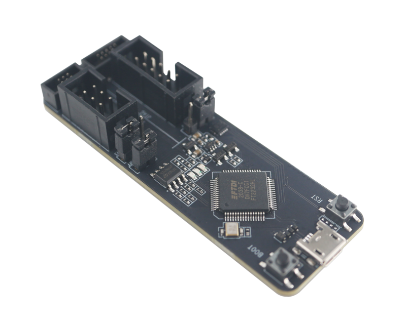
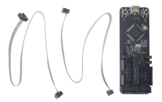

========
ESP-Prog
========

:link_to_translation:`zh_CN:[中文]`

This user guide will help you get started with ESP-Prog and will also provide more in-depth information.

ESP-Prog is one of Espressif’s development and debugging tools, with functions including automatic firmware downloading, serial communication, and JTAG debugging. ESP-Prog's automatic firmware downloading and serial communication functions are supported on ESP8266, ESP32, ESP32-S2, ESP32-S3, and ESP32-C3, while the JTAG debugging is supported only on ESP32, ESP32-S2, ESP32-S3, and ESP32-C3.

ESP-Prog can be easily connected to a PC with the use of only one USB cable. Then, the PC can identify the board's Program and JTAG interfaces (functions) by their port numbers.

Given that the power supply voltage may vary on different user boards, either of the ESP-Prog interfaces can provide 5 V or 3.3 V power supply through pin headers, in order to ensure power compatibility. Power on ESP-Prog could be toggled between 3.3 V and 5 V, but the RX/TX & JTAG signals will always be at the 3.3 V level.

    ESP-Prog (click to enlarge)

The document consists of the following major sections:

- `Getting started`_: Overview of the board and hardware/software setup instructions to get started.
- `Hardware Reference`_: More detailed information about the board's hardware.
- `Related Documents`_: Links to related documentation.

Getting Started
===============

This section provides a brief introduction of ESP-Prog on how to do the initial hardware setup.

Description of Components
-------------------------

.. figure:: ../../../_static/esp-prog/modules.png
    :align: center
    :scale: 70%
    :alt: ESP-Prog - front (click to enlarge)

    ESP-Prog - front (click to enlarge)

The key components of the board are described in a clockwise direction.

.. list-table::
   :widths: 25 75
   :header-rows: 1

   * - Key Component
     - Description
   * - Micro USB
     - Interface between PC and ESP-Prog.
   * - Boot Button
     - Download button. Holding down boot and then pressing reset initiates Firmware Download mode for downloading firmware through the serial port.
   * - IO0 On/Off
     - Pin Header to set the state of GPIO0 strapping pin.
   * - PROG PWR SEL
     - Pin Header to select power input for the Program interface.
   * - PROG 2.54 mm
     - Program interface with 2.54 mm (0.1") pin pitch.
   * - PROG 1.27 mm
     - Program interface with 1.27 mm (0.05") pin pitch.
   * - JTAG 1.27 mm
     - JTAG interface with 1.27 mm (0.05") pin pitch.
   * - JTAG 2.54 mm
     - JTAG interface with 2.54 mm (0.1") pin pitch.
   * - JTAG PWR SEL
     - Pin Header to select power input for the JTAG interface.
   * - LED Indicator
     - LED to indicate ESP-Prog state. There are three LED modes: red, green, and blue. The red LED lights up when the system is connected to the 3.3 V power. The green LED lights up when ESP-Prog is downloading data. The blue LED lights up when ESP-Prog is receiving data.
   * - USB Bridge
     - Single USB-to-UART bridge chip provides up to 3 Mbps of transfer rate.
   * - Reset Button
     - Press this button to restart the system.

Start Application Development
-----------------------------

Before powering up your board, please make sure that it is in good condition with no obvious signs of damage.

Required Hardware
^^^^^^^^^^^^^^^^^

- ESP-Prog
- USB 2.0 cable (Standard-A to Micro-B)
- Computer running Windows, Linux, or macOS
- Dupont lines or flat cables provided by Espressif for connecting the development board to ESP-Prog

.. note::

  Be sure to use an appropriate USB cable. Some cables are for charging only and do not provide the needed data lines nor work for programming the boards.

Hardware Setup
^^^^^^^^^^^^^^

1. Connect the ESP-Prog board and the PC USB port via a USB cable.
2. The PC then detects the two ports of ESP-Prog, indicating that the board is connected successfully. If the ports are not detected install the `FT2232HL chip driver <http://www.ftdichip.com/Drivers/VCP.htm>`__ on your PC.
3. Select the output power voltage for the Program/JTAG interfaces, using PROG PWR SEL/JTAG PWR SEL pin headers.
4. Connect the ESP-Prog and ESP user board with the flat cables provided by Espressif.
5. Start programming (downloading) or JTAG debugging, using the official software tools or scripts provided by Espressif.

Software Setup
^^^^^^^^^^^^^^

Please proceed to `Get Started with ESP-IDF <https://idf.espressif.com/>`__, where Section `Installation Step by Step <https://docs.espressif.com/projects/esp-idf/en/stable/esp32/get-started/index.html#installation-step-by-step>`__ will quickly help you set up the development environment.

Contents and Packaging
----------------------

Retail Orders
^^^^^^^^^^^^^

Each ESP-Prog board comes in an individual package.

   ESP-Prog Package Contents

The contents are as follows:

- Development board

  ESP-Prog

- Cables

  Two flexible flat cables: 
    - One cable to connect to 2*5-PIN 2.54 mm male shrouded box header.
    - One cable to connect to 2*3-PIN 1.27 mm male shrouded box header.

If you order a few samples, each board comes in an individual package in either antistatic bag or any packaging depending on your retailer.

For retail orders, please go to https://www.espressif.com/en/company/contact/buy-a-sample.

Wholesale Orders
^^^^^^^^^^^^^^^^

If you order in bulk, the boards come in large cardboard boxes.

For wholesale orders, please go to https://www.espressif.com/en/contact-us/sales-questions.

Hardware Reference
==================

Block Diagram
-------------

The block diagram below shows the components of ESP-Prog and their interconnections.

.. figure:: ../../../_static/esp-prog/block.png
    :align: center
    :scale: 80%
    :alt: ESP-Prog Block Diagram (click to enlarge)

    ESP-Prog Block Diagram (click to enlarge)

Power Supply Options
^^^^^^^^^^^^^^^^^^^^^^^

There are three mutually exclusive ways to provide power to the board:

- ESP-Prog USB Port, default power supply (recommended)
- 5 V and G (GND) pins
- 3.3 V and G (GND) pins

Header Block
-------------

The two tables below provide the **Name** and **Function** of the pins on both sides of the board (Program Interface and JTAG Interface). The pin names are shown in the front view of the ESP-Prog board. The numbering is the same as in the `ESP-Prog Schematic <../../_static/schematics/esp-prog/SCH_ESP32-PROG_V2.1_20190709.pdf>`_ (PDF).

Program Interface
^^^^^^^^^^^^^^^^^^

.. list-table::
   :widths: 30 35 35
   :header-rows: 1
   
   * - No.
     - Name
     - Function
   * - 1
     - ESP_EN
     - Enable signal
   * - 2
     - VDD
     - Power supply
   * - 3
     - ESP_TXD
     - TX pin
   * - 4
     - GND
     - Ground
   * - 5
     - ESP_RXD
     - RX pin
   * - 6
     - ESP_IO0
     - Strapping pin

JTAG Interface
^^^^^^^^^^^^^^^

.. list-table::
   :widths: 30 30 40
   :header-rows: 1
   
   * - No.
     - Name
     - Function
   * - 1
     - VDD
     - Power supply
   * - 2
     - ESP_TMS
     - JTAG TMS pin, mode selection
   * - 3
     - GND
     - Ground
   * - 4
     - ESP_TCK
     - JTAG TCK pin, clock input
   * - 5
     - GND
     - Ground
   * - 6
     - ESP_TDO
     - JTAG TDO pin
   * - 7
     - GND
     - Ground
   * - 8
     - ESP_TDI
     - JTAG TDI pin
   * - 9
     - GND
     - Ground
   * - 10
     - NC
     - None

Related Documents
=================

- `ESP-Prog Schematic <../../_static/schematics/esp-prog/SCH_ESP32-PROG_V2.1_20190709.pdf>`_ (PDF)
- `ESP-Prog PCB Layout <../../_static/schematics/esp-prog/PCB_ESP32-PROG_V2.1_20190709.pdf>`_ (PDF)
- `ESP-Prog Dimensions <../../_static/schematics/esp-prog/DIM_ESP32-PROG_V2.1_20190709.pdf>`_ (PDF)

For further design documentation for the board, please contact us at `sales@espressif.com <sales@espressif.com>`_.

