============
EchoEar v1.0
============

:link_to_translation:`en:[English]`

.. note::

  请查看主板上的丝印版本号，以确认您的开发板版本。对于 v1.0 版本的开发板，请参考当前用户指南；对于 v1.2 版本的开发板，请参考 :doc:`user_guide_v1.2` 。

本指南将帮助您快速上手 EchoEar，并提供该款开发板的详细信息。

EchoEar 喵伴是乐鑫携手火山引擎扣子大模型团队打造的智能 AI 开发套件，适用于玩具、智能音箱、智能中控等需要大模型赋能的语音交互类产品。该设备搭载 1.85 英寸 QSPI 圆形触摸屏，双麦阵列，支持离线语音唤醒与声源定位算法。结合火山引擎提供的大模型能力，喵伴可实现全双工语音交互、多模态识别与智能体控制，为开发者打造完整的端侧 AI 应用体验提供坚实基础。

EchoEar 主控采用乐鑫 ESP32-S3-WROOM-2-N32R16V 模组，支持 2.4 GHz Wi-Fi 和 Bluetooth 5 (LE) 无线连接。存储方面，整机具备 16 MB PSRAM、32 MB flash 的存储空间，同时还配备了一个可支持高达 32GB 的 microSD 卡插槽，满足语音交互和多媒体处理需求。配备 1.85 英寸圆形触摸屏（360 × 360 分辨率）与 ESP32-S3 原生触摸传感器，提供直观丰富的交互体验。

音频方面，EchoEar 内置 3W 扬声器和双麦克风阵列，支持本地语音唤醒和声源定位。电源系统兼容 5 V DC 和 3.7 V 锂电池供电。此外，还集成一个 USB-C 接口支持供电与编程下载，同时预留 Pogopin 接口方便功能扩展。

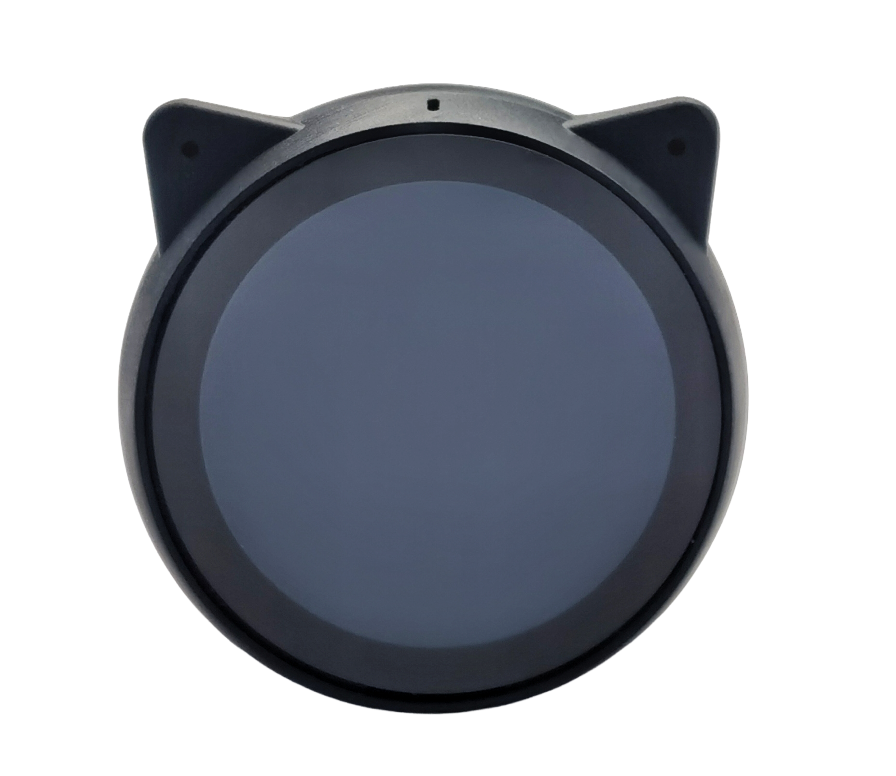

   EchoEar 正面图（点击放大）

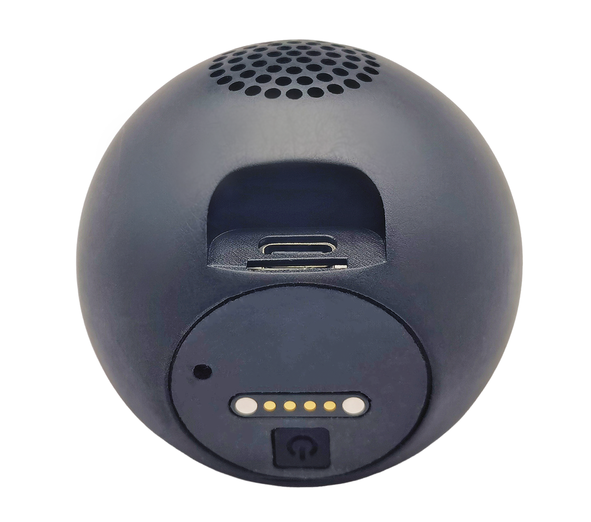

   EchoEar 背面图（点击放大）

本指南包括如下内容：

- `入门指南`_：简要介绍了开发板和硬件、软件设置指南。
- `硬件参考`_：详细介绍了开发板的硬件。
- `硬件版本`_：介绍硬件历史版本和已知问题（如有）。
- `相关文档`_：列出了相关文档的链接。

.. _Getting-started_echoear:

入门指南
========

本小节将简要介绍 EchoEar，说明如何在 EchoEar 上烧录固件及相关准备工作。

组件介绍
--------

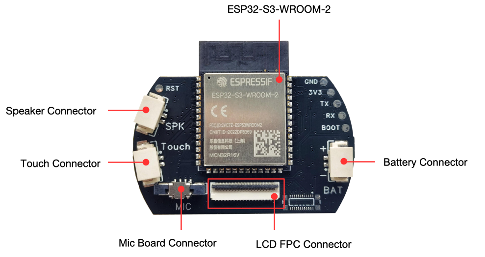

   EchoEar CoreBoard PCB 正面图（点击放大）

.. figure:: ../../_static/echoear/echoear-micboard-front-annotated-photo_v1.0.png
   :alt: EchoEar MicBoard PCB 正面图（点击放大）
   :scale: 50%
   :figclass: align-center

   EchoEar MicBoard PCB 正面图（点击放大）

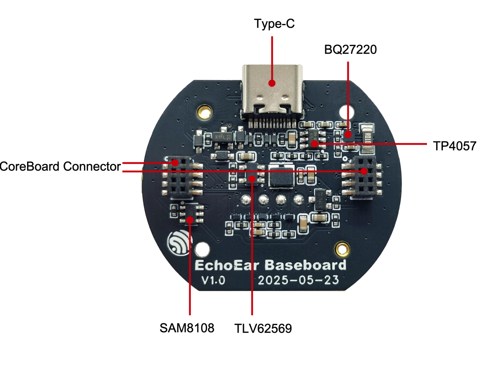

   EchoEar BaseBoard PCB 正面图（点击放大）

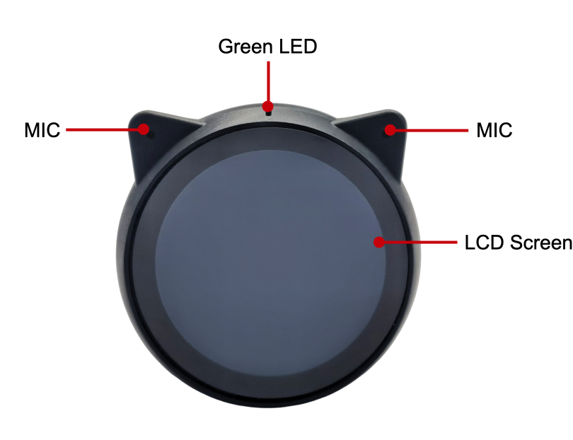

   EchoEar 正面图（点击放大）

以下按照顺时针的顺序依次介绍正面 PCB 上的主要组件。为了方便用户使用，我们同时在 EchoEar 的外壳上标注出了这些组件或者接口。

.. list-table::
   :widths: 30 70
   :header-rows: 1

   * - 主要组件
     - 描述
   * - :strong:`CoreBoard（核心板）`
     -
   * - ESP32-S3-WROOM-2-N32R16V
     - 主控芯片，集成 32 MB Flash 和 16 MB PSRAM，支持 2.4 GHz Wi-Fi 和 Bluetooth 5 (LE) 无线连接。
   * - Battery Connector（电池连接器）
     - 电池连接器，用于连接 3.7 V 锂电池，上为正极，下为负极。
   * - LCD FPC Connector（屏幕连接器）
     - 用于连接 1.85 英寸圆形 LCD 屏幕，分辨率为 360 x 360，详细参数请参考 `显示屏规格书`_。
   * - MicBoard Connector（麦克风连接器）
     - MicBoard PCB 板连接器，连接双麦克风阵列和状态指示 LED 灯。
   * - Touch Connector（触摸连接器）
     - 触摸连接器，用于连接触摸铜箔，实现触摸交互功能。
   * - Speaker Connector（扬声器连接器）
     - 2 线扬声器连接器，用于连接内置 3 W 扬声器。
   * - :strong:`MicBoard（麦克风板）`
     -
   * - Green LED（绿色 LED）
     - 绿色 LED 指示灯。
   * - MIC（麦克风阵列）
     - 双 LMA3729T381-OY3S 麦克风阵列，支持本地语音唤醒和声源定位功能。
   * - :strong:`BaseBoard（底板）`
     -
   * - BQ27220（电池管理芯片）
     - 电池管理芯片，用于电池电量检测、充电管理和电源状态监控。
   * - TP4057（锂电池充电芯片）
     - 锂电池充电芯片，用于为锂电池充电，充电电流为 250 mA。
   * - CoreBoard Connector（CoreBoard 连接器）
     - CoreBoard PCB 板连接器，连接核心板与底板。
   * - TlV62569（DCDC 芯片）
     - 降压转换芯片，用于将 5 V 电源转换为 3.3 V 电源，为系统提供稳定供电。
   * - SAM8108（开关机控制芯片）
     - 开关机控制芯片，用于控制设备开关机，单击 POWER 按键即可切换开关机状态。
   * - Type-C（USB-C 接口）
     - USB-C 接口，用于供电、编程下载和调试，支持对锂电池进行充电。

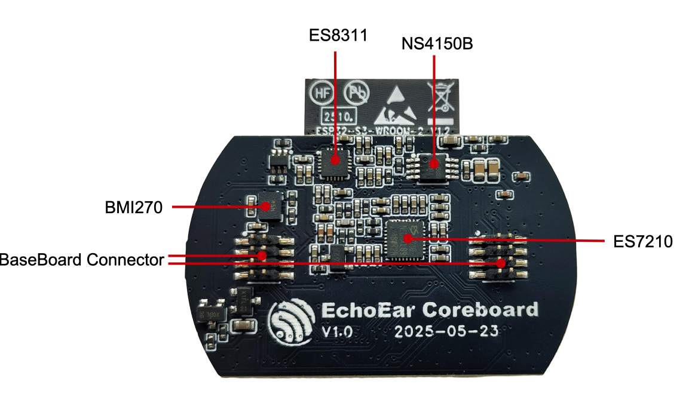

   EchoEar CoreBoard PCB 背面图（点击放大）

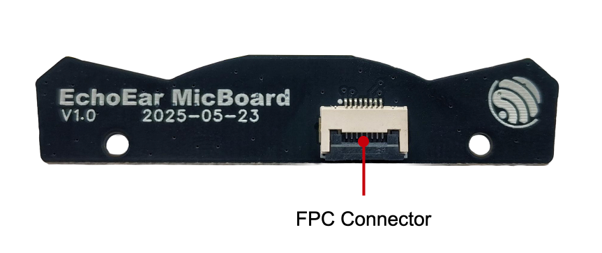

   EchoEar MicBoard PCB 背面图（点击放大）

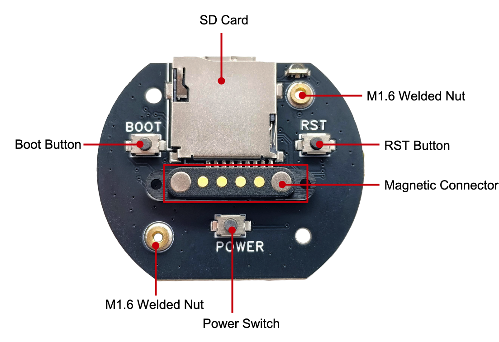

   EchoEar BaseBoard PCB 背面图（点击放大）

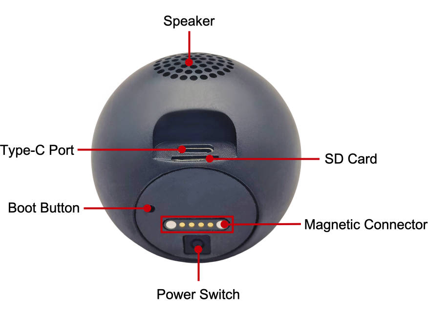

   EchoEar 背面图（点击放大）

以下按照顺时针的顺序依次介绍背面 PCB 上的主要组件。为了方便用户使用，我们同时在 EchoEar 的外壳上标注出了这些组件或者接口。

.. list-table::
   :widths: 30 70
   :header-rows: 1

   * - 主要组件
     - 描述
   * - :strong:`CoreBoard（核心板）`
     -
   * - NS4150B（D 类功放）
     - 超低 EMI、无需滤波器、3W单声道D类音频功放。
   * - ES7210（音频解码芯片）
     - 高性能四通道音频解码芯片，支持 I2S/PDM/TDM 数据端口。
   * - BaseBoard Connector（底板连接器）
     - 底板连接器，用于连接底板与 CoreBoard。
   * - BMI270（IMU-惯性测量单元）
     - 用于高性能应用的 6 轴智能低功耗惯性测量单元。
   * - ES8311（音频编码解码芯片）
     - 低功耗单声道音频编码解码器，具有高性能多比特 Delta-Sigma 音频 ADC 和 DAC。
   * - :strong:`MicBoard（麦克风板）`
     -
   * - FPC Connector（FPC 连接器）
     - 连接 MicBoard 与 CoreBoard FPC 连接口。
   * - :strong:`BaseBoard（底板）`
     -
   * - M1.6 Welded Nut（M1.6 焊接螺母）
     - 用于固定主板到外壳。
   * - RST Button（复位按键）
     - 用于复位主板。
   * - Magnetic Connector（磁吸连接器）
     - 用于功能扩展，提供一个串口和 5 V 电源接口，可以连接旋转底座等设备。
   * - Power Switch（电源按键）
     - 用于控制设备开关机，单击 POWER 按键即可切换开关机状态。
   * - BOOT Button（启动按键）
     - 在上电时，按住该按键可以进入下载模式。
   * - SD Card Slot（SD 卡槽）
     - 支持高达 32 GB 的 microSD 卡插槽，用于存储音频、图片、视频等数据。

开始开发应用
------------

通电前，请确保 EchoEar 完好无损。

必备硬件
^^^^^^^^

- EchoEar
- USB 数据线
- 电脑（Windows、Linux 或 macOS）

.. 注解::

  请确保使用适当的 USB 数据线。部分数据线仅可用于充电，无法用于数据传输和编程。

硬件设置
^^^^^^^^

使用 USB 数据线将 EchoEar 连接到电脑，通过 ``Type-C（USB-C 接口）`` 烧录固件、调试和供电。

软件设置
^^^^^^^^

请前往 `ESP-IDF 快速入门 <https://docs.espressif.com/projects/esp-idf/zh_CN/latest/esp32s3/get-started/index.html>`__ 小节查看如何快速设置开发环境，将应用程序烧录至您的开发板。

.. 注解::

  开发板使用 USB 端口与电脑通信。大多数操作系统（Windows、Linux、macOS）已预装所需驱动，开发板插入后可自动识别。如无法识别设备或无法建立串口连接，请参考 `如何建立串口连接 <https://docs.espressif.com/projects/esp-idf/zh_CN/latest/esp32s3/get-started/establish-serial-connection.html>`__ 获取安装驱动的详细步骤。

乐鑫为多种开发板提供了板级支持包 (BSP)，可帮助您更轻松、高效地初始化和使用板载的主要外设，如 LCD 显示屏、音频芯片、按键和 LED 等。请访问 `esp-bsp <https://github.com/espressif/esp-bsp>`__ 查询支持的所有开发板。

开发板应用示例存放在 `esp-brookesia <https://github.com/espressif/esp-brookesia/tree/master/products/speaker>`_ 工程中。

.. _Hardware-reference_echoear:

硬件参考
========

功能框图
--------

EchoEar 的主要组件和连接方式如下图所示。

.. figure:: ../../_static/echoear/echoear-sch-function-block_v1.0.png
   :alt: EchoEar 功能框图（点击放大）
   :scale: 50%
   :figclass: align-center

   EchoEar 功能框图（点击放大）

电源选项
--------

可通过以下方法为开发板供电：

1. 通过 ``Type-C（USB-C 接口）`` 供电

   使用该方法供电时，使用 USB Type-C 数据线连接设备上 Type-C 接口。如果已安装锂电池，需要按下 ``POWER`` 按键开启对设备供电。

2. 通过 ``Magnetic Connector（磁吸连接器）`` 供电

  使用该方法供电时，将设备连接在对应的磁吸连接座上即可对设备进行供电。如果已安装锂电池，需要按下 ``POWER`` 按键开启对设备供电。

  .. figure:: ../../_static/echoear/echoear-magnetic-connector-annotated-photo_v1.0.png
   :alt: 磁吸连接器（点击放大）
   :scale: 50%
   :figclass: align-center

   磁吸连接器（点击放大）

3. 通过 ``电池`` 供电

  设备内部集成 3.7 V 锂电池，按下 ``POWER`` 按键即可对设备进行供电。

上述任意外部供电方式，均可对设备内锂电池进行充电。

Type-C 接口
----------------------

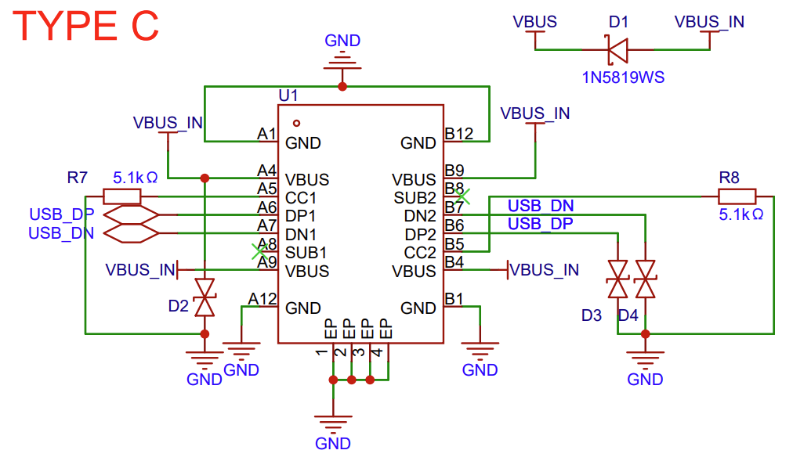

   Type-C 接口电路图（点击放大）

Magnetic Connector 接口
---------------------------

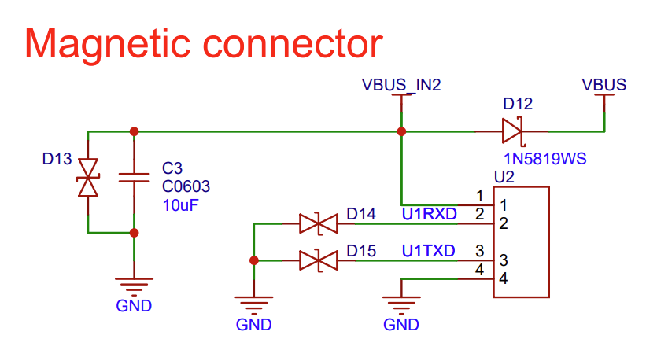

   Magnetic Connector 接口电路图（点击放大）

LCD 接口
---------

.. figure:: ../../_static/echoear/echoear-sch-lcd_v1.0.png
   :alt: LCD 接口电路图（点击放大）
   :scale: 50%
   :figclass: align-center

   LCD 接口电路图（点击放大）

请注意，CN3 接口为其他屏幕兼容预留，目前未启用。

U2 接口为正式使用的 LCD 屏幕接口，该开发板使用的屏幕型号为 `ST77916 <https://dl.espressif.com/AE/esp-dev-kits/UE018HV-RB39-A002A%20%20V1.0%20SPEC.pdf>`_，LCD: 1.85"，360 x 360，ST77916，QSPI Interface，``LCD_BLK`` (GPIO44) 可用于控制屏幕背光。

SD 卡接口
-------------

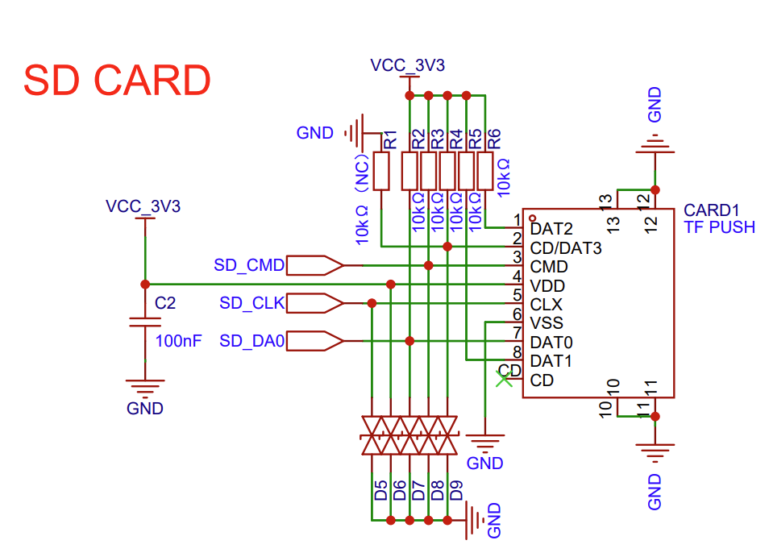

   SD 卡接口电路图（点击放大）

**请注意，SD 卡接口支持：**

* 1 线 SD 总线配置
* 可通过 SDIO 协议通信

开关机电路
----------

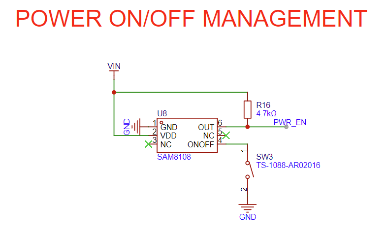

   开关机电路图（点击放大）

充电电路
----------

.. figure:: ../../_static/echoear/echoear-sch-battery-charge_v1.0.png
   :alt: 充电电路图（点击放大）
   :scale: 50%
   :figclass: align-center

   充电电路图（点击放大）

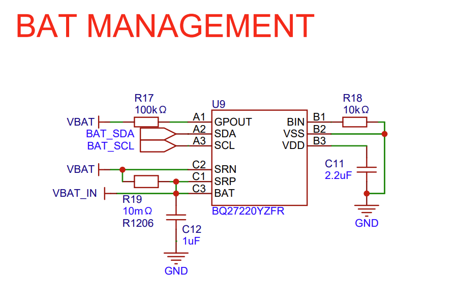

   电池管理电路图（点击放大）

麦克风接口
--------------

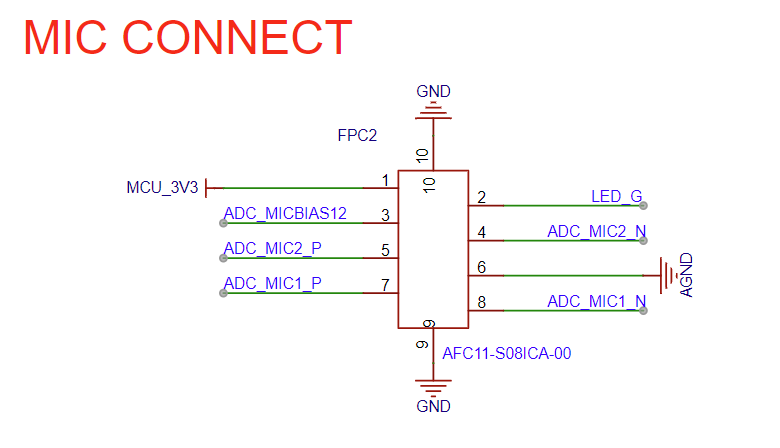

   麦克风接口电路图（点击放大）

硬件版本
==========

无历史版本。

.. _Related-documents_echoear:

相关文档
==========

-  `EchoEar V1.0 原理图`_ (PDF)
-  `EchoEar V1.0 PCB 布局图`_ (PDF)
-  `显示屏规格书`_ (PDF)
-  `复刻教程`_ (HTML)
-  `用户指南`_ (HTML)

.. _EchoEar V1.0 原理图: https://dl.espressif.com/AE/esp-dev-kits/EchoEar_SCH_V1_0.pdf
.. _EchoEar V1.0 PCB 布局图: https://dl.espressif.com/AE/esp-dev-kits/EchoEar_pcb_V1_0.zip
.. _显示屏规格书: https://dl.espressif.com/AE/esp-dev-kits/UE018HV-RB39-A002A%20%20V1.0%20SPEC.pdf
.. _复刻教程: https://oshwhub.com/esp-college/echoear
.. _用户指南: https://espressif.craft.me/1gOl65rON8G8FK
