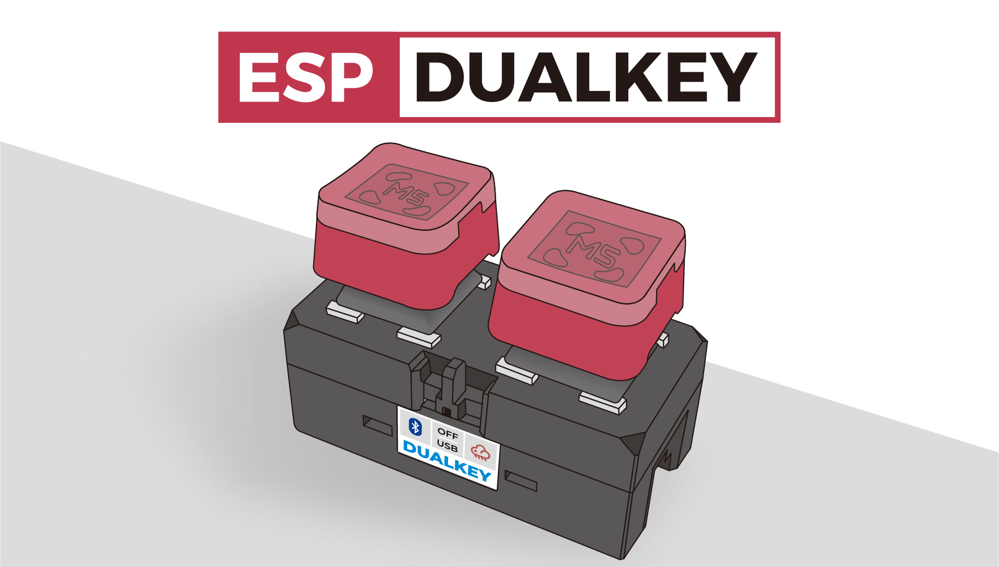
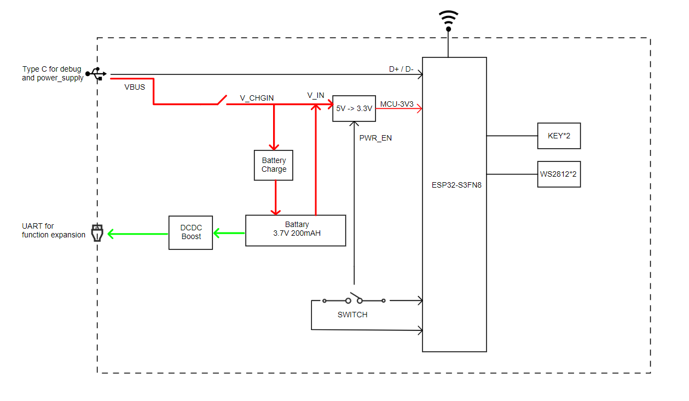
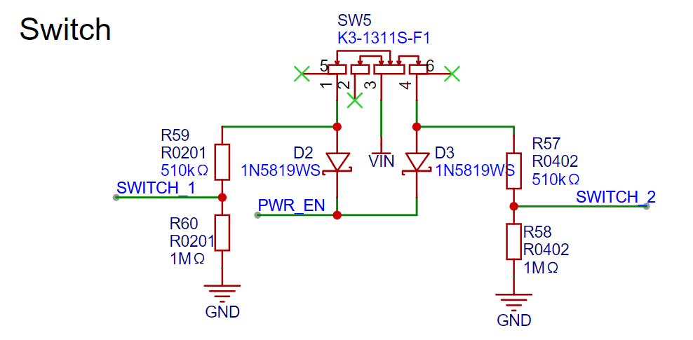

============
ESP-DualKey
============

:link_to_translation:`en:[English]`

.. note::

  请查看主板上的丝印版本号，以确认您的开发板版本。

本指南将帮助您快速上手 ESP-DualKey，并提供该款开发板的详细信息。

ESP-DualKey 是乐鑫基于 ESP32-S3 芯片开发的智能双键控制器开发板，集成了智能家居控制、蓝牙键盘、USB 键盘等多种功能，可通过物理开关在不同工作模式间切换。该开发板配备双按键、RGB 灯效、电池管理、电源监控等功能，为开发者提供完整的智能按键解决方案。

ESP-DualKey 主控采用乐鑫 ESP32-S3 芯片，支持 2.4 GHz Wi-Fi 和 Bluetooth 5 (LE) 无线连接。存储方面，整机具备 8 MB flash 存储空间，满足智能按键应用需求。配备双按键矩阵和 WS2812 RGB 灯效，提供直观丰富的交互体验。

电源方面，ESP-DualKey 支持 USB-C 供电和内置锂电池供电，集成电池管理芯片和电源监控功能。此外，还集成一个 USB-C 接口支持供电与编程下载，同时提供多种工作模式切换功能。

   ESP-DualKey 正面图（点击放大）

本指南包括如下内容：

- `入门指南`_：简要介绍了开发板和硬件、软件设置指南。
- `硬件参考`_：详细介绍了开发板的硬件。
- `硬件版本`_：介绍硬件历史版本和已知问题（如有）。
- `相关文档`_：列出了相关文档的链接。

.. note::

  关于出厂固件的使用说明，请参考 `ESP-DualKey 用户指南 <https://espressif.craft.me/5gX6vzhfn5QL93>`_。

入门指南
===========

本小节将简要介绍 ESP-DualKey，说明如何在 ESP-DualKey 上烧录固件及相关准备工作。

特性列表
--------

该开发板具有以下特性：

**按键矩阵配置：**

* 2×1 矩阵配置
* 支持独立按键检测
* 支持组合按键功能

**RGB LED 特性：**

* WS2812 可编程 RGB LED
* 支持多种灯效模式
* 支持亮度、色调、饱和度调节

**模式切换开关：**

* **左档位**：蓝牙键盘模式
* **中档位**：USB 键盘模式
* **右档位**：智能家居模式 (ESP RainMaker)

组件介绍
------------

以下依次介绍开发板上的主要组件。为方便用户使用，ESP-DualKey 的外壳上也标注了以下组件或接口。

.. list-table::
   :widths: 30 70
   :header-rows: 1

   * - 主要组件
     - 描述
   * - :strong:`主控芯片`
     -
   * - ESP32-S3
     - 主控芯片，支持 2.4 GHz Wi-Fi 和 Bluetooth 5 (LE) 无线连接，集成 8 MB flash 存储。
   * - :strong:`交互`
     -
   * - 双按键
     - 2×1 按键矩阵，支持独立按键和组合按键功能。
   * - 模式切换开关
     - 三档位开关，用于切换工作模式（蓝牙键盘/智能家居/USB 键盘）。
   * - :strong:`RGB 灯效`
     -
   * - WS2812 RGB LED
     - 可编程 RGB LED，支持多种灯效模式，包括热力图、呼吸灯、流水灯等。
   * - :strong:`电源管理`
     -
   * - 锂电池充电芯片
     - TP4057 锂电池充电管理，支持 USB-C 充电。
   * - :strong:`接口`
     -
   * - USB-C 接口
     - USB-C 接口，用于供电、编程下载和调试，支持对锂电池进行充电。
   * - 两个 HY2.0-4P 接口
     - 支持向外供电，用于连接外置传感器
   * - :strong:`其他功能`
     -
   * - 电池电压监控
     - 实时监控电池电压和充电状态。
   * - VBUS 监控
     - 监控 USB 供电状态。
   * - Deep-sleep
     - 支持 Deep-sleep 模式以节省功耗。

开始开发应用
----------------

通电前，请确保开发板完好无损。

必备硬件
^^^^^^^^

- ESP-DualKey
- USB 2.0 数据线（标准 A 型转 Micro-B 型）
- 电脑（Windows、Linux 或 macOS）

.. 注解::

  请确保使用适当的 USB 数据线。部分数据线仅可用于充电，无法用于数据传输和编程。

硬件设置
^^^^^^^^

使用 USB 数据线将 ESP-DualKey 连接到电脑，通过 ``USB-C 接口`` 烧录固件、调试和供电。

软件设置
^^^^^^^^

请前往 `ESP-IDF 快速入门 <https://docs.espressif.com/projects/esp-idf/zh_CN/latest/esp32s3/get-started/index.html>`__ 小节查看如何快速设置开发环境，将应用程序烧录至您的开发板。

.. 注解::

  开发板使用 USB 端口与电脑通信。大多数操作系统（Windows、Linux、macOS）已预装所需驱动，开发板插入后可自动识别。如无法识别设备或无法建立串口连接，请参考 `如何建立串口连接 <https://docs.espressif.com/projects/esp-idf/zh_CN/latest/esp32s3/get-started/establish-serial-connection.html>`__ 获取安装驱动的详细步骤。

乐鑫为多种开发板提供了板级支持包 (BSP)，可帮助您更轻松、高效地初始化和使用板载的主要外设，如按键、LED 和电源管理等。请访问 `esp-bsp <https://github.com/espressif/esp-bsp>`__ 查询支持的所有开发板。

开发板应用示例存放在 :project:`Examples <examples/esp-dualkey/examples>` 目录中。

硬件参考
============

功能框图
--------

ESP-DualKey 的主要组件和连接方式如下图所示。

   ESP-DualKey 功能框图（点击放大）

电源选项
^^^^^^^^

您可从以下两种供电方式中任选其一给开发板供电：

1. 通过 ``USB-C 接口`` 供电

   使用该方法供电时，使用 USB Type-C 数据线连接设备上 USB-C 接口。

2. 通过 ``内置锂电池`` 供电

   设备内部集成锂电池，支持独立供电运行。

模式切换开关
^^^^^^^^^^^^

开发板模式切换开关电路图如下所示。

   模式切换开关电路图（点击放大）

硬件版本
==========

无历史版本。

相关文档
==========

-  `ESP-DualKey 原理图`_ (PDF)
-  `使用指南`_ (HTML)

.. _ESP-DualKey 原理图: https://dl.espressif.com/AE/esp-dev-kits/SCH-ESP-Dualkey-MainBoard-V1_2.pdf
.. _使用指南: https://espressif.craft.me/DiTh53ddFXD94L
