===================
ESP-Mosaico V1.0
===================

:link_to_translation:`en:[English]`

.. note::

  本文档对应 CoreBoard **V1.0** 硬件。请查看主板上的丝印版本号，以确认您的开发板版本。

本指南将帮助您快速上手 ESP-Mosaico，并提供该款开发板的详细信息。

ESP-Mosaico 是一款基于 ESP32-S31 的可扩展智能交互开发套件，适用于磁吸扩展玩具、运动感知交互、方形触摸屏 HMI、端侧语音与多媒体等应用。设备集成 480 × 480 QSPI 方形触摸屏、ES8311 音频编解码、NS4150B 功放、BMI270 六轴 IMU、双 BMM150 磁力计、SPI NAND flash，以及左右两个 2 × 10P、2.54 mm 标准间距端子的模块接口。

ESP-Mosaico 主控采用乐鑫 ESP32-S31，支持 2.4 GHz Wi-Fi 6（IEEE 802.11b/g/n/ax）、Bluetooth® 5.4（LE + BR/EDR）以及 IEEE 802.15.4（Thread / Zigbee）。存储方面，整机配置封装内 16 MB PSRAM、板载 16 MB SPI NOR flash 与板载 1 Gbit SPI NAND flash，满足图形界面、多媒体与资源缓存需求。显示方面配备 CO5300 驱动的 480 × 480 QSPI 方形触摸屏，触摸控制器为 CST9220 系列。

音频方面，ESP-Mosaico 集成 ES8311 编解码芯片、NS4150B D 类功放。电源系统兼容 USB Type-C 5 V 供电与 3.7 V / 65 mAh 锂电池供电，板载 TP4057 充电、BQ27220 电量计与 SAM8108 开关机控制；Type-C 接口与左右模块接口均支持电源输入与输出。此外，板载 USB 2.0 High-Speed OTG 接口可用于供电、调试与通信，并预留 UART 扩展能力与左右模块接口。

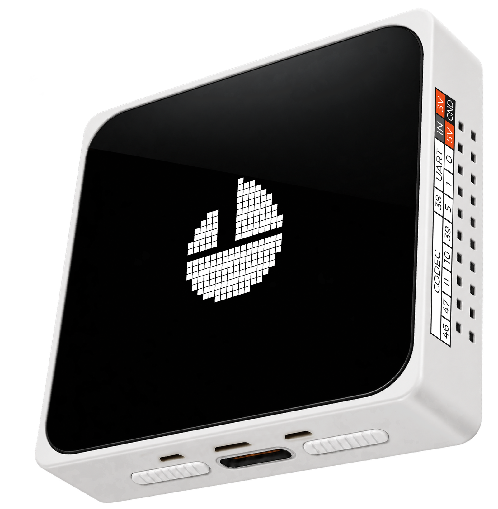

   ESP-Mosaico 整机外观（点击放大）

本指南包括如下内容：

- `入门指南`_：简要介绍了开发板和硬件、软件设置指南。
- `硬件参考`_：详细介绍了开发板的硬件。
- `硬件版本`_：介绍硬件历史版本和已知问题（如有）。
- `相关文档`_：列出了相关文档的链接。
- `免责声明和版权公告`_: 链接到免责声明和版权公告。

.. _Getting-started_esp-mosaico:

入门指南
========

本小节将简要介绍 ESP-Mosaico，说明如何在 ESP-Mosaico 上烧录固件及相关准备工作。

组件介绍
--------

ESP-Mosaico 由 CoreBoard（核心板）和 BaseBoard（底板）组成。下文先介绍正面视图及其主要组件，再介绍背面视图及其主要组件。

正面
^^^^

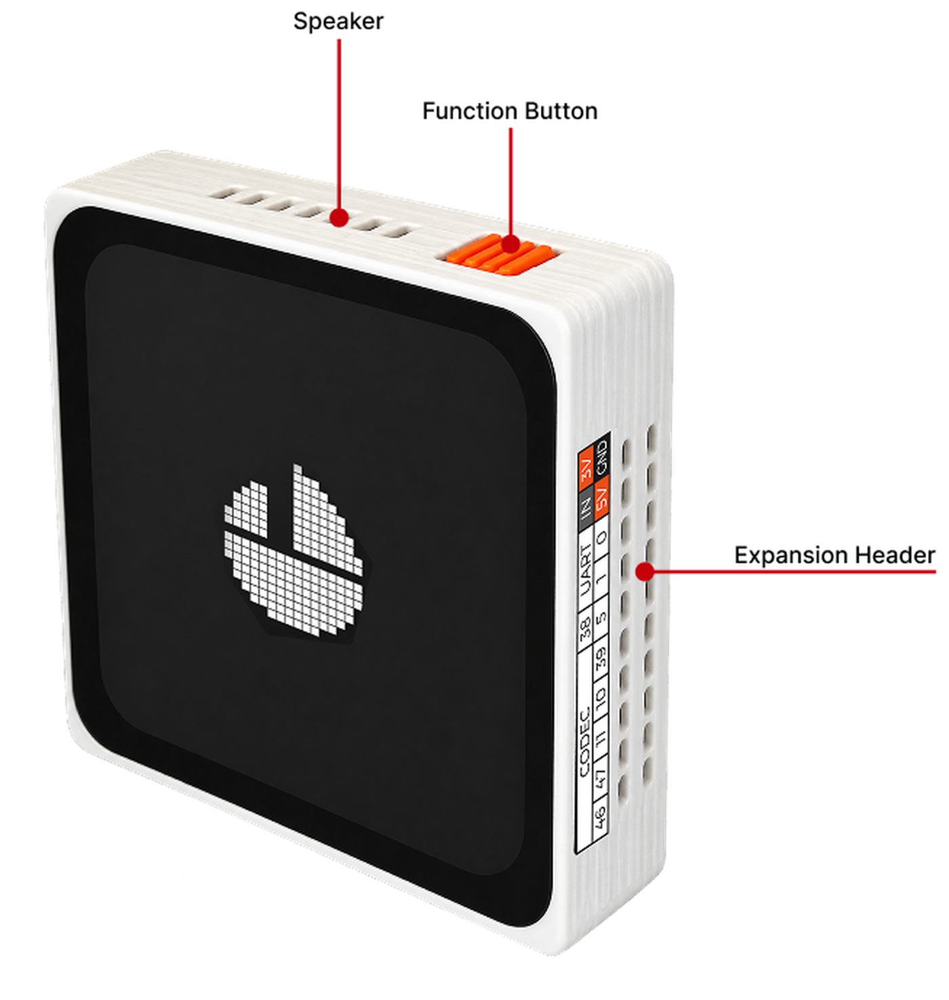

   ESP-Mosaico 整机正面（点击放大）

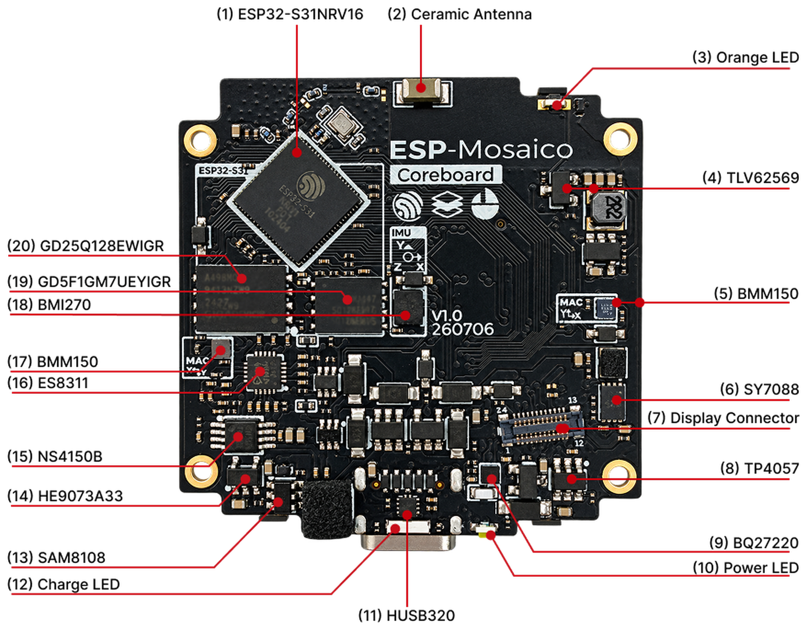

   ESP-Mosaico CoreBoard 正面（点击放大）

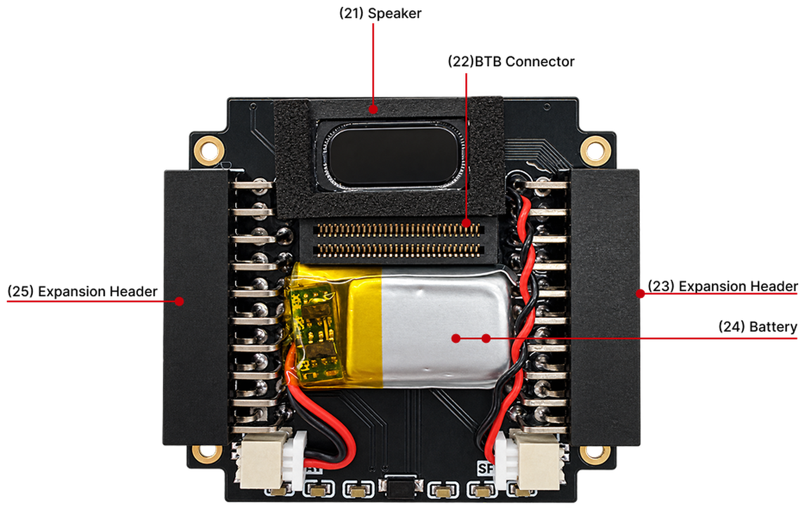

   ESP-Mosaico BaseBoard 正面（点击放大）

以下按照顺时针的顺序依次介绍正面 PCB 上的主要组件。

.. list-table::
   :widths: 8 28 64
   :header-rows: 1

   * - 序号
     - 主要组件
     - 描述
   * -
     - :strong:`CoreBoard（核心板）`
     - 核心板，集成主控芯片、射频天线、电源管理、显示接口、音频编解码与传感器等。
   * - 1
     - ESP32-S31NRV16
     - ESP32-S31 主控芯片，RISC-V 32 位双核，最高 320 MHz，芯片内封装 16 MB PSRAM；支持 2.4 GHz Wi-Fi 6、Bluetooth 5.4（LE + BR/EDR）与 IEEE 802.15.4。
   * - 2
     - KH-3216-A35 Ceramic Antenna（陶瓷天线）
     - 2.4 GHz 贴片陶瓷天线，用于 Wi-Fi 与 Bluetooth 射频收发。
   * - 3
     - Orange LED（橙色 LED）
     - 程序可控单色状态灯，连接 GPIO3，低电平点亮。
   * - 4
     - TLV62569
     - 降压 (DCDC) 转换芯片，将输入电源转换为系统 3.3 V。
   * - 5
     - BMM150
     - 三轴地磁传感器（BMM150 #2），I2C 地址 0x11。
   * - 6
     - SY7088
     - 升压 (BOOST) 转换芯片，为需高于电池电压的电路供电。
   * - 7
     - Display Connector（显示屏连接座）
     - 用于连接 480 × 480、2.16 寸 QSPI 触摸屏（CO5300 驱动 + CST9220 触摸）。
   * - 8
     - TP4057
     - 锂电池充电管理芯片，为板载锂电池充电。
   * - 9
     - BQ27220
     - 电池电量计，I2C 地址 0x55，用于电压、电流、电量 (SOC) 等状态检测。
   * - 10
     - 3V3 Power LED（3.3 V 电源指示灯）
     - 开机后，3.3 V 供电正常时点亮；关机时熄灭。
   * - 11
     - HUSB320
     - USB Type-C 接口控制器，负责 CC 逻辑检测，并据此控制 USB 供电方向。
   * - 12
     - Charge LED（充电指示灯）
     - 充电状态指示：红灯表示充电中，绿灯表示已充满。
   * - 13
     - SAM8108
     - 开关机控制芯片，配合 POWER 按键实现整机开关控制。
   * - 14
     - HE9073A33
     - 低压差稳压器 (LDO)，为音频 codec 提供独立供电以降低噪声。
   * - 15
     - NS4150B
     - 低 EMI、无需滤波器的 3 W 单声道 D 类功放，用于驱动扬声器。
   * - 16
     - ES8311
     - 低功耗单声道音频编解码芯片，I2C 地址 0x19，通过 I2S 与主控传输音频数据。
   * - 17
     - BMM150
     - 三轴地磁传感器（BMM150 #3），I2C 地址 0x12。
   * - 18
     - BMI270
     - 六轴 IMU（加速度计 + 陀螺仪），I2C 地址 0x69。
   * - 19
     - GD25Q128EWIGR
     - 16 MB (128 Mbit) SPI NOR flash，用于程序与数据存储。
   * - 20
     - GD5F1GM7UEYIGR
     - 1 Gbit（128 MB）SPI NAND flash，用于大容量资源存储。
   * -
     - :strong:`BaseBoard（底板）`
     - 底板，集成扬声器、电池与左右 2 × 10P 模块接口，通过板对板连接座与核心板对接。
   * - 21
     - Speaker（喇叭）
     - 板载扬声器，由 NS4150B 功放驱动。
   * - 22
     - BTB Connector（主副板连接座）
     - 60 针 0.5 mm 板对板连接座，用于连接 CoreBoard 与 BaseBoard。
   * - 23
     - Expansion Header 1（外扩排针 1）
     - 2 × 10P、2.54 mm 双排扩展排针，引出 GPIO 与电源，用于功能扩展。
   * - 24
     - Battery（电池）
     - 3.7 V / 65 mAh 锂电池，为整机提供便携供电。
   * - 25
     - Expansion Header 2（外扩排针 2）
     - 另一组扩展排针，引出剩余 GPIO 与电源。

背面
^^^^

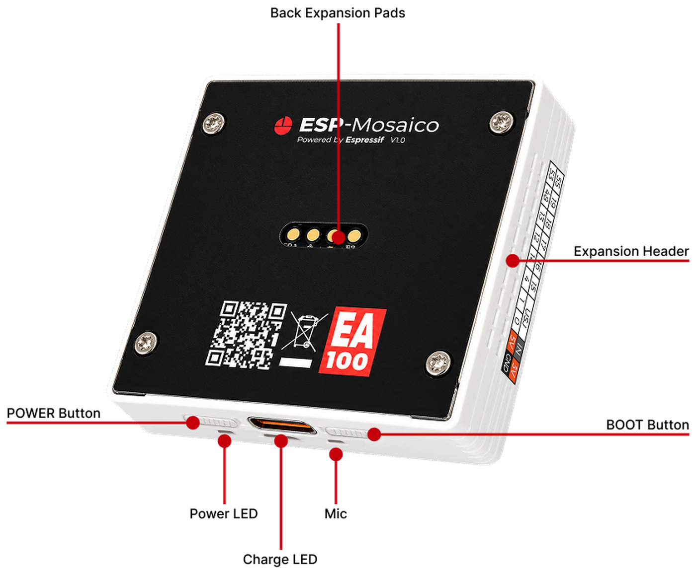

   ESP-Mosaico 整机背面（点击放大）

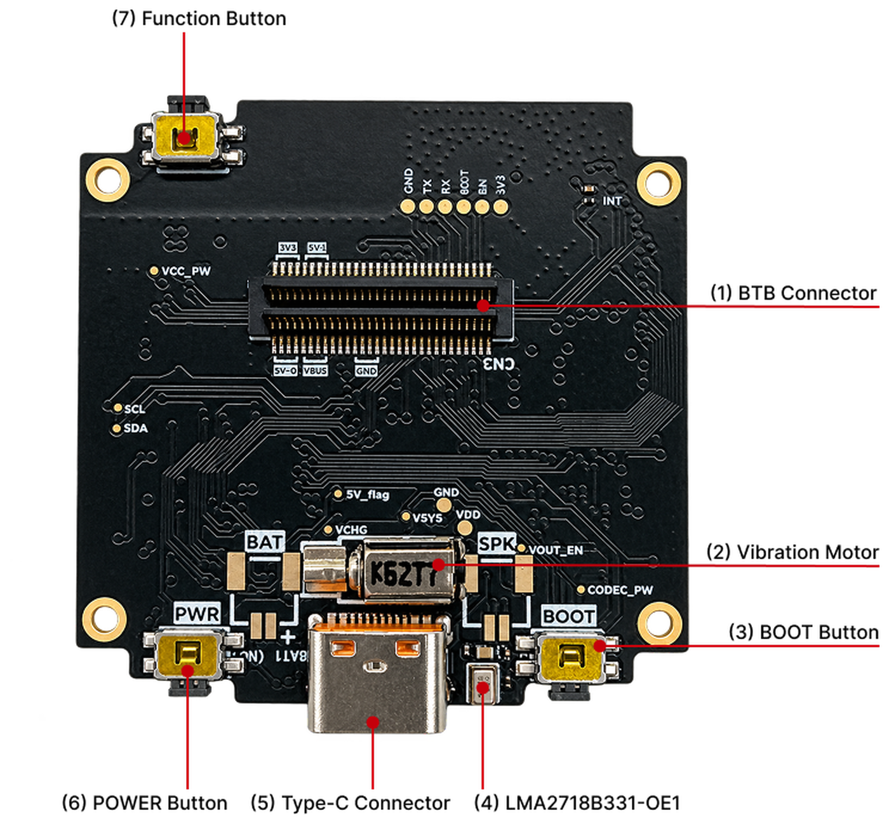

   ESP-Mosaico CoreBoard 背面（点击放大）

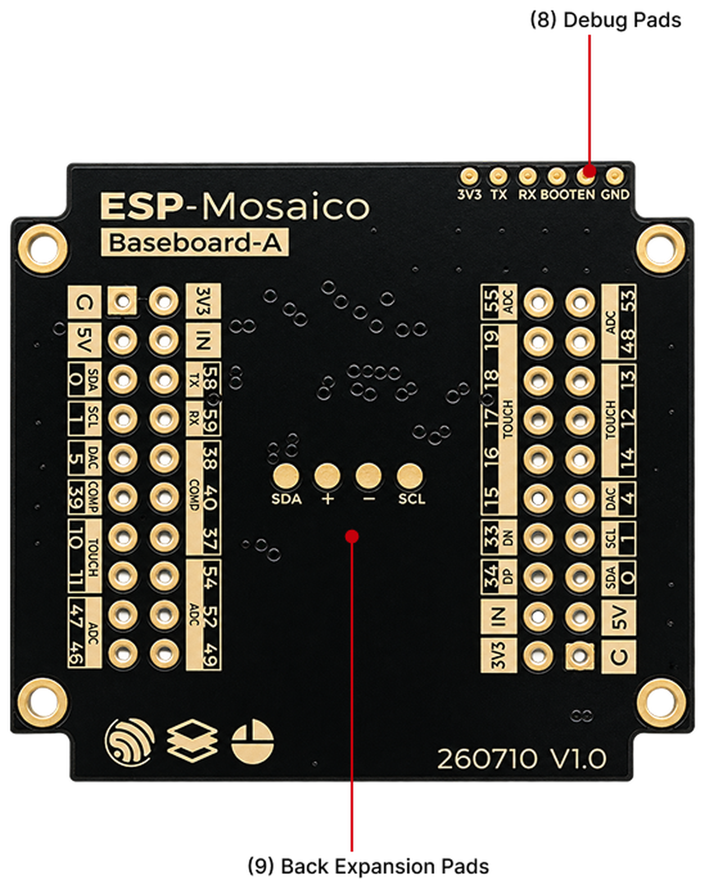

   ESP-Mosaico BaseBoard 背面（点击放大）

以下按照顺时针的顺序依次介绍背面 PCB 上的主要组件。

.. list-table::
   :widths: 8 28 64
   :header-rows: 1

   * - 序号
     - 主要组件
     - 描述
   * -
     - :strong:`CoreBoard（核心板）`
     - 核心板背面，引出按键、Type-C 接口、麦克风与振动马达等。
   * - 1
     - BTB Connector（板对板连接座）
     - 与 BaseBoard 对接的板对板连接座（背面侧）。
   * - 2
     - Vibration Motor（震动马达）
     - 振动马达，由 GPIO8 控制（高电平开启），用于触觉反馈。
   * - 3
     - BOOT Button（BOOT 按键）
     - 上电时按住可进入固件下载模式。
   * - 4
     - LMA2718B331-OE1
     - 板载麦克风，连接至 ES8311，用于语音采集。
   * - 5
     - Type-C Connector（Type-C 接口）
     - USB 2.0 High-Speed 接口，用于供电、调试下载与 USB 通信，并支持锂电池充电。
   * - 6
     - POWER Button（开关机按键）
     - 单击切换整机开关机状态（POWER 按键）。
   * - 7
     - Function Button（功能按键）
     - 应用按键，连接 GPIO7，低电平有效。
   * -
     - :strong:`BaseBoard（底板）`
     - 底板背面，提供调试触点与背扩供电触点。
   * - 8
     - Debug Pads（调试触点）
     - 引出 GND / TX / RX / BOOT / EN / 3V3 等调试信号的测试点。
   * - 9
     - Back Expansion Pads（背扩触点）
     - 背面扩展触点，引出 I2C 与供电接口，可用于给设备供电。

开始开发应用
------------

通电前，请确保 ESP-Mosaico 完好无损。

必备硬件
^^^^^^^^

- ESP-Mosaico
- USB 数据线（支持数据传输）
- 电脑（Windows、Linux 或 macOS）

.. note::

  请确保使用适当的 USB 数据线。部分数据线仅可用于充电，无法用于数据传输和编程。

硬件说明
^^^^^^^^

1. 烧录方式

   请使用 USB 数据线，将 ESP-Mosaico 通过板载 Type-C 接口连接至电脑。该接口为 USB 2.0 High-Speed，可同时供电并完成 USB 协议数据通信。原生 ESP32-S31 芯片仅支持在烧录模式下通过该接口烧录固件，不具备自动烧录与日志输出能力。出厂固件已集成 CDC 虚拟串口，支持自动烧录和串口日志输出。若无法烧录，可尝试在关机状态下按住 BOOT 按键后再开机，进入烧录模式。此外，左右模块接口分别提供 USB Serial/JTAG（左侧）和 TX/RX 串口（右侧），均可用于调试和下载程序。

2. 电源说明

   Type-C 接口可为设备供电，内部电池的额定充电电流为 65 mA；当插入用电端设备时，Type-C 接口会自动切换为供电模式，最大输出 5 V / 500 mA，超出 1 A 时会自动断电，并会隔一段时间自动恢复。
   左右两侧模块接口提供向外供电的 3.3 V 与 5 V 引脚（``3V`` / ``5V``），这两个电源仅在 GPIO60 置低时才会输出。``VIN`` 为向设备供电的接口，同时也会为设备内电池充电。

软件设置
^^^^^^^^

请前往 `ESP-IDF 快速入门 <https://docs.espressif.com/projects/esp-idf/zh_CN/latest/esp32s31/get-started/index.html>`__ 章节查看如何快速设置开发环境。本开发板目标芯片为 ``esp32s31``。

.. note::

  开发板使用 USB 端口与电脑通信。大多数操作系统（Windows、Linux、macOS）已预装所需驱动，开发板插入后可自动识别。如无法识别设备或无法建立串口连接，请参考 `与 ESP32-S31 建立串口连接 <https://docs.espressif.com/projects/esp-idf/zh_CN/latest/esp32s31/get-started/establish-serial-connection.html>`__ 获取安装驱动的详细步骤。

板级支持包与示例
^^^^^^^^^^^^^^^^

乐鑫为 ESP-Mosaico 提供了板级支持包 (BSP)，可帮助您更轻松地初始化 LCD、触摸、音频、传感器、电池、NAND flash、模块资源与 USB 控制台等外设。

- BSP 与示例工程：``esp-mosaico``
- 推荐结合 `ESP-Claw <https://esp-claw.com/zh-cn/>`__ 应用开发框架进行开发。
- 推荐首次烧录后使用 BSP 提供的 USB CDC 控制台与自动下载能力。典型命令：

.. code-block:: bash

   idf.py set-target esp32s31
   idf.py -p /dev/ttyACM0 flash monitor

.. note::

  - 首次烧录可能需要手动进入 ROM 下载模式。
  - 芯片复位时 USB 设备会短暂断开，IDF Monitor 通常会自动重连。
  - 若仅附加监视器而不希望复位应用，可使用 ``monitor --no-reset``。
  - 相关配置项：``CONFIG_BSP_USB_CONSOLE``、 ``CONFIG_BSP_USB_CONSOLE_AUTO_INIT``、 ``CONFIG_BSP_USB_AUTO_DOWNLOAD``。

.. _Hardware-reference_esp-mosaico:

硬件参考
========

功能框图
--------

ESP-Mosaico 的主要组件和连接方式如下图所示。

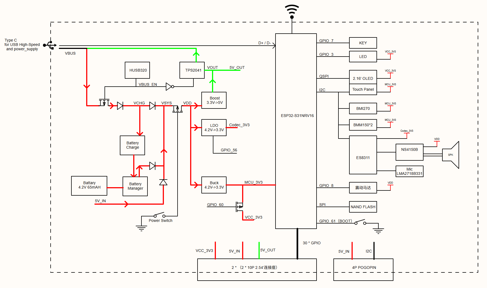

   ESP-Mosaico 功能框图（点击放大）

电源选项
--------

可通过以下方法为开发板供电：

1. 通过 ``Type-C（USB-C 接口）`` 供电

   使用 USB Type-C 数据线连接设备的 Type-C 接口。

2. 通过 ``背部触点`` 供电

   通过 BaseBoard 背面的背扩触点引入外部电源，即可对设备进行供电。

3. 通过 ``电池`` 供电

   设备支持 3.7 V / 65 mAh 锂电池供电。

无论采用何种供电方式，均通过 POWER 按键完成开关机。上述外部供电方式可对设备内锂电池进行充电。

Type-C 接口
-----------

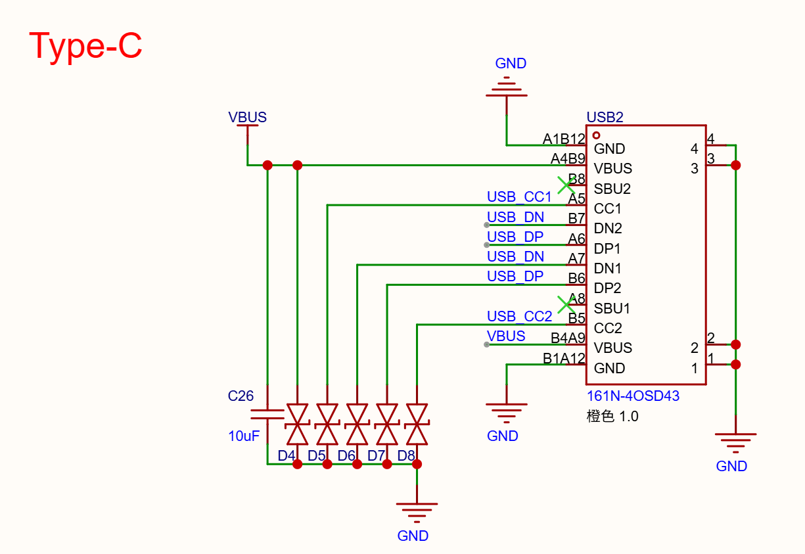

   Type-C 接口电路图（点击放大）

Type-C 接口连接 ESP32-S31 USB 2.0 High-Speed OTG，用于供电、调试与应用通信；板载 USB Serial/JTAG 相关信号用于下载与调试。应用侧推荐使用 BSP 的 USB CDC 控制台与自动下载功能。

DCDC 3.3 V 电路
---------------

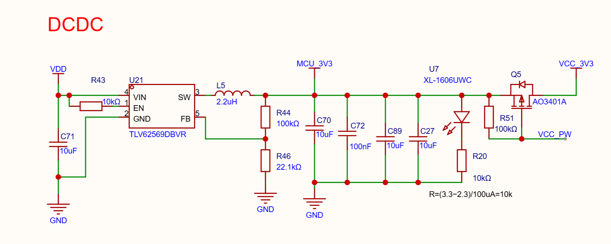

   DCDC 3.3 V 电路图（点击放大）

板载 TLV62569 将 ``VDD`` 降压为 ``MCU_3V3``，再经 ``VCC_PW`` 控制的负载开关输出 ``VCC_3V3``。图中 ``U7`` 为 3.3 V 电源指示灯。

电源控制相关 GPIO（BSP 定义）：

.. list-table::
   :widths: 30 20 50
   :header-rows: 1

   * - 信号
     - GPIO
     - 说明
   * - VCC_3V3 / VCC_PW
     - GPIO60
     - 系统 3.3 V 轨控制，**低电平有效**；开启时 BSP 默认做软启动斜坡。
   * - CODEC_3V3
     - GPIO56
     - Codec 电源控制，**高电平有效**。
   * - POWER_SWITCH
     - GPIO57
     - 请求整机关机；BSP 正常运行时保持高阻，关机时以开漏方式拉低。

BOOST 电路
----------

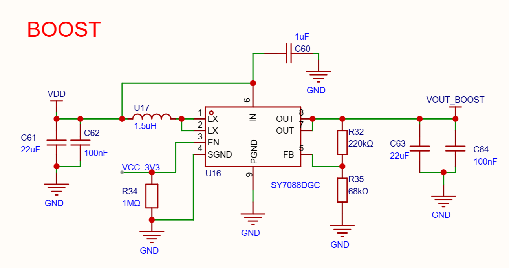

   BOOST 电路图（点击放大）

板载 SY7088 升压电路，由 ``VCC_3V3`` 使能，输出 ``VOUT_BOOST``，为需高于电池电压的电路供电。

开关机电路
----------

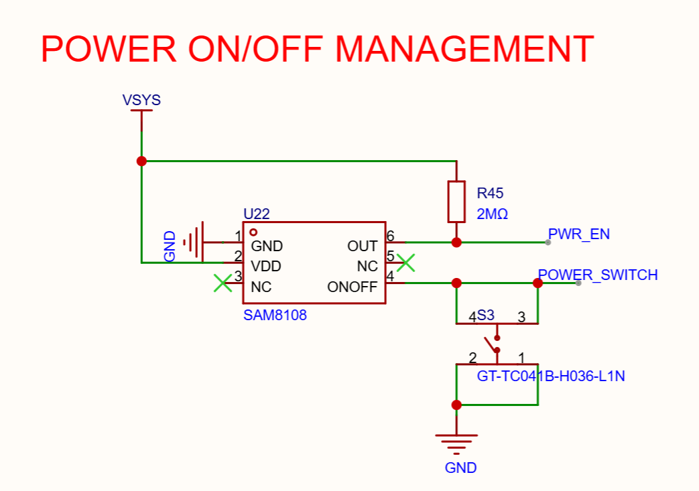

   开关机电路图（点击放大）

SAM8108 配合 POWER 按键实现整机开关控制；``POWER_SWITCH`` 信号亦可由软件监测或请求关机。

MCU 与管脚分配
--------------

下表按功能分组列出 ESP-Mosaico BSP 中的主要管脚分配。

.. container:: wide-table-scroll

   .. list-table:: ESP-Mosaico 主要管脚分配
      :header-rows: 1
      :widths: 14 18 12 56

      * - 分类
        - 信号
        - GPIO
        - 说明
      * - I2C / 传感器
        - I2C0_SDA
        - GPIO0
        - 共享 I2C：触摸、ES8311、BMI270、BMM150、BQ27220、模块 EEPROM
      * -
        - I2C0_SCL
        - GPIO1
        - 共享 I2C 时钟
      * -
        - SENSOR_INT
        - GPIO2
        - IMU / 磁力计中断或信号
      * -
        - TOUCH_INT
        - GPIO6
        - 触摸中断
      * - 人机交互
        - STATUS_LED
        - GPIO3
        - 橙色状态灯，程序可控，低电平点亮
      * -
        - AI_BUTTON
        - GPIO7
        - 应用按键，低电平有效
      * -
        - MOTOR
        - GPIO8
        - 振动马达，高电平开启
      * - LCD
        - LCD_DATA3
        - GPIO9
        - CO5300 QSPI DATA3
      * -
        - LCD_DATA2
        - GPIO35
        - CO5300 QSPI DATA2
      * -
        - LCD_DATA0
        - GPIO36
        - CO5300 QSPI DATA0
      * -
        - LCD_RST
        - GPIO42
        - LCD 复位
      * -
        - LCD_TE
        - GPIO43
        - LCD_TE 防撕裂同步
      * -
        - LCD_SCL
        - GPIO44
        - QSPI 时钟
      * -
        - LCD_CS
        - GPIO50
        - LCD 片选
      * -
        - LCD_DATA1
        - GPIO51
        - CO5300 QSPI DATA1
      * - 音频
        - I2S_BCK
        - GPIO37
        - 音频位时钟
      * -
        - I2S_DOUT
        - GPIO40
        - 音频数据输出（DAC）
      * -
        - PA_CTRL
        - GPIO45
        - 功放使能
      * -
        - I2S_WS
        - GPIO49
        - 音频帧时钟（字选择）
      * -
        - I2S_DIN
        - GPIO52
        - 音频数据输入（ADC）
      * -
        - I2S_MCLK
        - GPIO54
        - 音频主时钟
      * -
        - CODEC_PW
        - GPIO56
        - Codec 3.3 V 电源控制
      * - 电源
        - POWER_SWITCH
        - GPIO57
        - 开关机请求
      * -
        - VCC_3V3_CTRL
        - GPIO60
        - 系统 3.3 V 电源控制
      * - NAND Flash
        - NAND_CLK
        - GPIO20
        - SPI NAND（SD_D0）
      * -
        - NAND_D
        - GPIO21
        - SPI NAND（SD_D1 / SIO0）
      * -
        - NAND_Q
        - GPIO22
        - SPI NAND（SD_D2 / SIO1）
      * -
        - NAND_CS
        - GPIO23
        - SPI NAND（SD_D3）
      * -
        - NAND_HOLD
        - GPIO24
        - SPI NAND（SD_CLK / SIO3）
      * -
        - NAND_WP
        - GPIO25
        - SPI NAND（SD_CMD / SIO2）

I2C 设备地址
------------

共享 I2C 总线（``I2C0_SDA`` / ``I2C0_SCL``）上的 7-bit 地址如下。其中板载器件位于 CoreBoard / BaseBoard；**模块 EEPROM 位于外接模块上，不在主板上**，仅在对应模块插槽接入带 EEPROM 的模块时出现。

.. list-table::
   :widths: 20 40 40
   :header-rows: 1

   * - I2C 地址
     - 器件
     - 说明
   * - 0x11
     - BMM150 #2
     - 板载三轴地磁传感器
   * - 0x12
     - BMM150 #3
     - 板载三轴地磁传感器
   * - 0x19
     - ES8311
     - 板载音频编解码芯片
   * - 0x50
     - 模块 EEPROM（Left）
     - 位于左侧模块上，不在主板；由 GPIO14 低电平选通
   * - 0x51
     - 模块 EEPROM（Right）
     - 位于右侧模块上，不在主板；由 GPIO39 高电平选通
   * - 0x55
     - BQ27220
     - 板载电池电量计
   * - 0x5A
     - CST9220
     - 板载触摸控制器
   * - 0x69
     - BMI270
     - 板载六轴 IMU

LCD 接口
--------

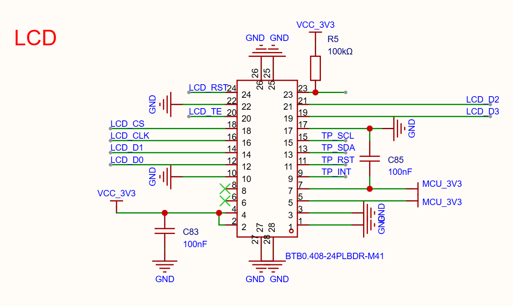

   LCD 接口电路图（点击放大）

- LCD 驱动芯片：CO5300，QSPI 接口，分辨率 480 × 480。
- 触摸控制器：CST9220 系列，I2C 接口（``TP_SCL`` / ``TP_SDA`` / ``TP_RST`` / ``TP_INT``）。

振动马达接口
------------

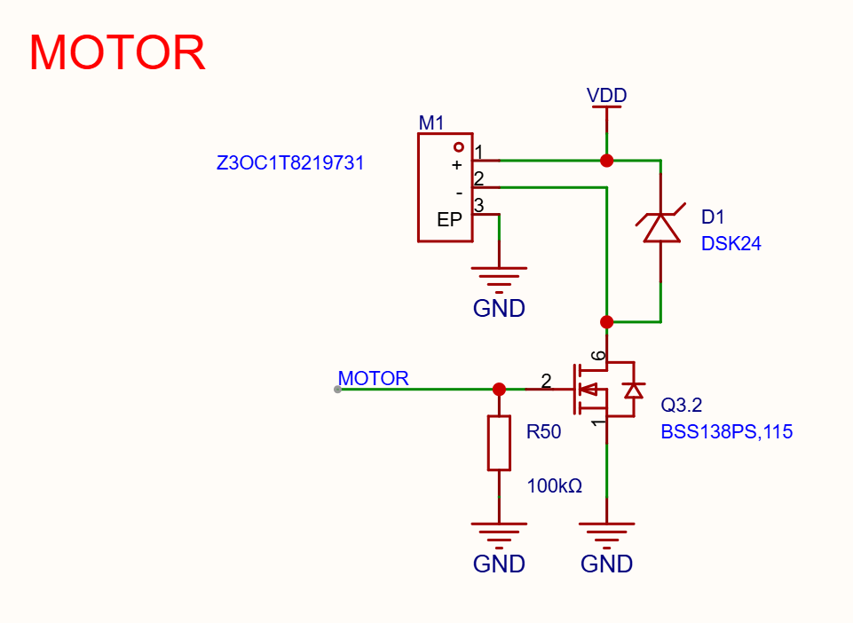

   振动马达电路图（点击放大）

振动马达由 ``MOTOR`` (GPIO8) 经低边 MOSFET 驱动，高电平开启。

模块接口
--------

BaseBoard 提供两组 ``2 × 10P``、2.54 mm 间距外扩排针（``H2`` 左侧 / ``H1`` 右侧），引出 GPIO、UART、USB Serial/JTAG、电源与地，便于二次开发与功能扩展。除电源与地外，**所有扩展信号脚均支持 GPIO，并可通过 GPIO 交换矩阵灵活映射外设功能**。下表中的 ADC / TOUCH / COMP / DAC 等标注为该脚的模拟功能能力，不限制其作为通用 GPIO 使用。

ESP-Mosaico 提供左右两个模块插槽，BSP 通过 EEPROM 地址选择完成发现：

.. list-table::
   :widths: 20 20 60
   :header-rows: 1

   * - 插槽
     - EEPROM 地址
     - 说明
   * - Left（``H2``）
     - 0x50
     - 地址选择 GPIO14，低电平
   * - Right（``H1``）
     - 0x51
     - 地址选择 GPIO39，高电平；相对左侧旋转 180° 安装

左侧模块插槽（``H2``）引脚
^^^^^^^^^^^^^^^^^^^^^^^^^^

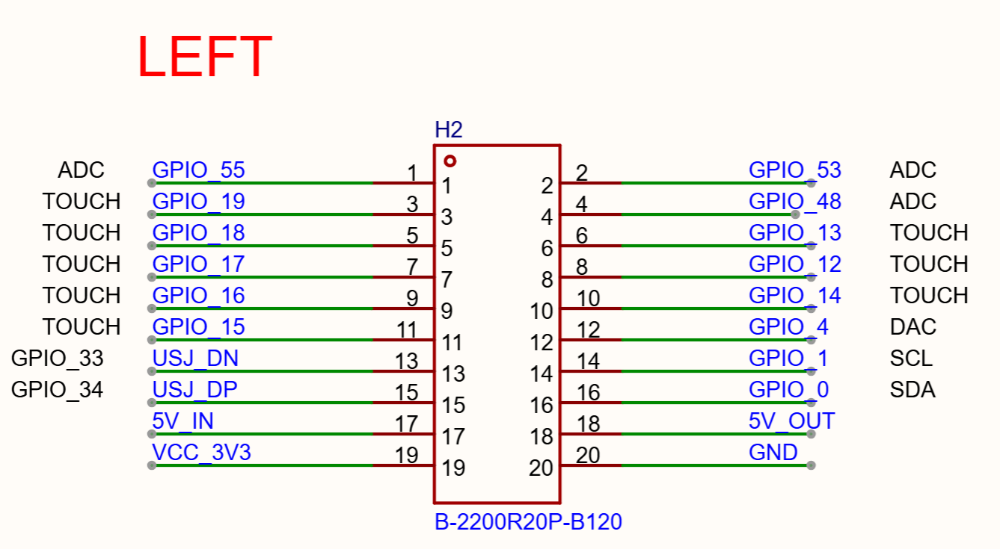

   左侧模块接口电路图（点击放大）

以下按连接器顺时针顺序介绍（自 Pin1 起，先奇数脚一侧，再偶数脚一侧回绕）。

.. list-table::
   :widths: 12 28 60
   :header-rows: 1

   * - 引脚
     - 信号
     - 说明
   * - 1
     - GPIO55
     - ADC
   * - 3
     - GPIO19
     - ADC
   * - 5
     - GPIO18
     - TOUCH
   * - 7
     - GPIO17
     - TOUCH
   * - 9
     - GPIO16
     - TOUCH
   * - 11
     - GPIO15
     - TOUCH
   * - 13
     - USJ_DN（GPIO33）
     - USB Serial/JTAG D-
   * - 15
     - USJ_DP（GPIO34）
     - USB Serial/JTAG D+
   * - 17
     - 5V_IN
     - 外部 5 V 输入（可为整机供电并充电）
   * - 19
     - VCC_3V3
     - 3.3 V 输出（由 GPIO60 控制）
   * - 20
     - GND
     - 地
   * - 18
     - 5V_OUT
     - 5 V 输出（由 GPIO60 控制）
   * - 16
     - GPIO0
     - SDA（板载共享 I2C）
   * - 14
     - GPIO1
     - SCL（板载共享 I2C）
   * - 12
     - GPIO4
     - DAC
   * - 10
     - GPIO14
     - TOUCH；EEPROM 地址选择
   * - 8
     - GPIO12
     - TOUCH
   * - 6
     - GPIO13
     - TOUCH
   * - 4
     - GPIO48
     - ADC
   * - 2
     - GPIO53
     - ADC

右侧模块插槽（``H1``）引脚
^^^^^^^^^^^^^^^^^^^^^^^^^^

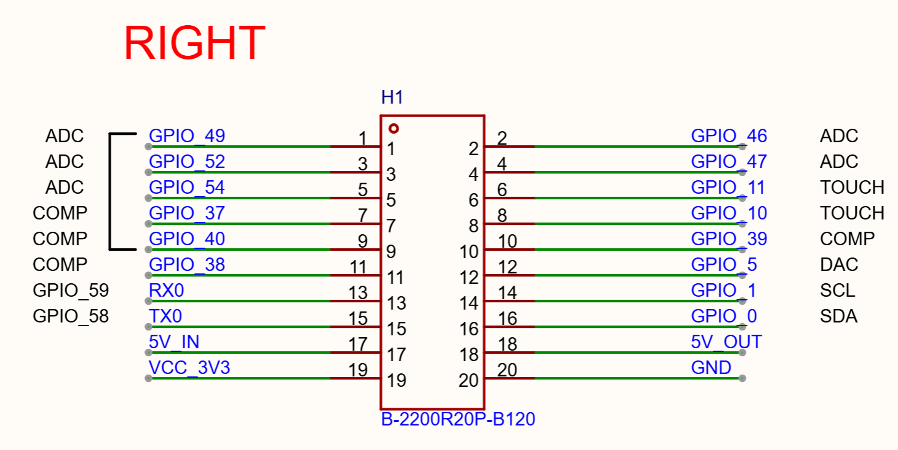

   右侧模块接口电路图（点击放大）

以下按连接器顺时针顺序介绍（自 Pin1 起，先奇数脚一侧，再偶数脚一侧回绕）。

.. list-table::
   :widths: 12 28 60
   :header-rows: 1

   * - 引脚
     - 信号
     - 说明
   * - 1
     - GPIO49 \*
     - ADC；与 codec ``I2S_WS`` 复用
   * - 3
     - GPIO52 \*
     - ADC；与 codec ``I2S_DIN`` 复用
   * - 5
     - GPIO54 \*
     - ADC；与 codec ``I2S_MCLK`` 复用
   * - 7
     - GPIO37 \*
     - COMP；与 codec ``I2S_BCK`` 复用
   * - 9
     - GPIO40 \*
     - COMP；与 codec ``I2S_DOUT`` 复用
   * - 11
     - GPIO38
     - COMP
   * - 13
     - RX0（GPIO59）
     - UART RX
   * - 15
     - TX0（GPIO58）
     - UART TX
   * - 17
     - 5V_IN
     - 外部 5 V 输入（可为整机供电并充电）
   * - 19
     - VCC_3V3
     - 3.3 V 输出（由 GPIO60 控制）
   * - 20
     - GND
     - 地
   * - 18
     - 5V_OUT
     - 5 V 输出（由 GPIO60 控制）
   * - 16
     - GPIO0
     - SDA（板载共享 I2C）
   * - 14
     - GPIO1
     - SCL（板载共享 I2C）
   * - 12
     - GPIO5
     - DAC
   * - 10
     - GPIO39
     - TOUCH；EEPROM 地址选择
   * - 8
     - GPIO10
     - TOUCH
   * - 6
     - GPIO11
     - TOUCH
   * - 4
     - GPIO47
     - ADC
   * - 2
     - GPIO46
     - ADC

.. important::

  表中带 ``*`` 的 **5** 个引脚与板载音频 codec 的 I2S 总线复用：``GPIO49``（``I2S_WS``）、``GPIO52``（``I2S_DIN``）、``GPIO54``（``I2S_MCLK``）、``GPIO37``（``I2S_BCK``）、``GPIO40``（``I2S_DOUT``）。这些引脚**仅在不需要 codec 功能时才可占用**；若应用仍使用板载 ES8311 / 扬声器 / 麦克风音频通路，请勿将这些引脚用于模块扩展。

.. note::

  左侧摄像头模块占用 DVP 管脚时，会复用 GPIO14（原 EEPROM 地址选择脚）作为 DVP D4，并暂停该插槽的 EEPROM 访问，直到释放摄像头资源。

硬件版本
========

无历史版本。

.. _Related-documents_esp-mosaico:

相关文档
========

-  `ESP-Mosaico CoreBoard V1.0 原理图`_ (PDF)
-  `2.16 寸 480 × 480 QSPI AMOLED 屏幕规格书`_ (PDF)
-  `ESP32-S31 系列芯片技术规格书`_ (HTML)
-  ESP-Mosaico BSP 与示例：``esp-mosaico`` 工程
-  `ESP-Claw`_ (HTML)

.. _ESP-Mosaico CoreBoard V1.0 原理图: https://dl.espressif.com/AE/SCH_SCH_ESP-Mosaico_CoreBoard_V1_0_2026-08-18.pdf
.. _2.16 寸 480 × 480 QSPI AMOLED 屏幕规格书: https://dl.espressif.com/AE/H0216F002AMT004-1%20V1%E8%A7%84%E6%A0%BC%E4%B9%A62.16%E5%AF%B8%20480X480%20QSPI%20MIPI%20%20AMOLED.pdf
.. _ESP32-S31 系列芯片技术规格书: https://documentation.espressif.com/esp32-s31_datasheet_cn.html
.. _ESP-Claw: https://esp-claw.com/zh-cn/

免责声明和版权公告
==================

请参阅 :doc:`免责声明和版权公告 <../disclaimer-and-copyright>`。
