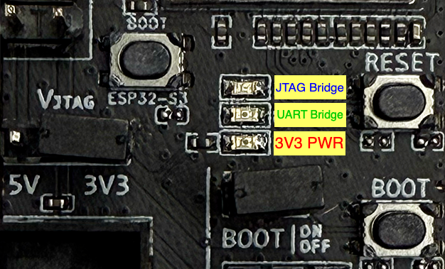
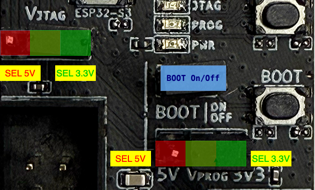

参考文档
=======================

:link_to_translation:`en:[English]`

功能介绍
~~~~~~~~~~~~~

USB 桥接器的工作模式
^^^^^^^^^^^^^^^^^^^^^^^^^^^^

ESP-Prog-2 基于 ESP32-S3 芯片在计算机和目标芯片之间建立桥接。它可以模拟 USB 复合设备，通过 USB 转 UART 桥接，实现计算机与目标芯片的串口数据收发。或通过 JTAG 桥接，实现计算机与目标芯片之间双向传输 JTAG 通信。

通讯接口
^^^^^^^^^^^^^^^

-  **Program 接口**

.. figure:: ../../../_static/esp-prog/program_pin.png
   :align: center
   :scale: 80%
   :alt: Program 接口

   Program 接口（点击放大）

-  **JTAG 接口**

   用户板上 JTAG 接口管脚设计应如下图。

.. figure:: ../../../_static/esp-prog/JTAG_pin.png
   :align: center
   :scale: 65%
   :alt: JTAG 接口

   JTAG 接口（点击放大）

-  **防呆设计**

   ESP-Prog-2 接口使用牛角座连接器 (DC3-6P/DC3-10P)，具有防反接功能。建议用户使用同类型的连接器，如 ``FTSH-105-01-S-DV-*`` 或 ``DC3-*P``。

   .. note::

      由于排线具有方向性，ESP-Prog-2 的每个接口都与排线一一对应，如果使用不配套的排线会导致接错接口，所以请使用官方提供的排线。

LED 状态指示灯
^^^^^^^^^^^^^^^^^^^

- 当系统的 3.3 V 电源通电时，红色 LED 灯亮起；
- 当ESP-Prog-2通过USB 转 UART 桥接时，绿色 LED 灯亮起；
- 当ESP-Prog-2通过 JTAG 桥接时，蓝色 LED 灯亮起。

   LED 状态（点击放大）

排针
^^^^^^^^^^^^^^^^^^^

-  **接口电源选择排针**
    标出的排针是每个接口的电源输入管脚。与 5 V 连接时，接口的电源输出为 5 V；与 3.3 V 连接时，接口电源输出则为 3.3 V。

-  **BOOT On/Off 排针**
    乐鑫芯片的 Boot 模式选择管脚在芯片上电后，可作为正常 GPIO 使用。为了防止 ESP-Prog-2 影响你的开发板上 BOOT 管脚的正常使用，可手动控制 BOOT 信号的通断。

   排针（点击放大）

有关本开发板的更多设计文档，请联系商务： `sales@espressif.com <sales@espressif.com>`_。
