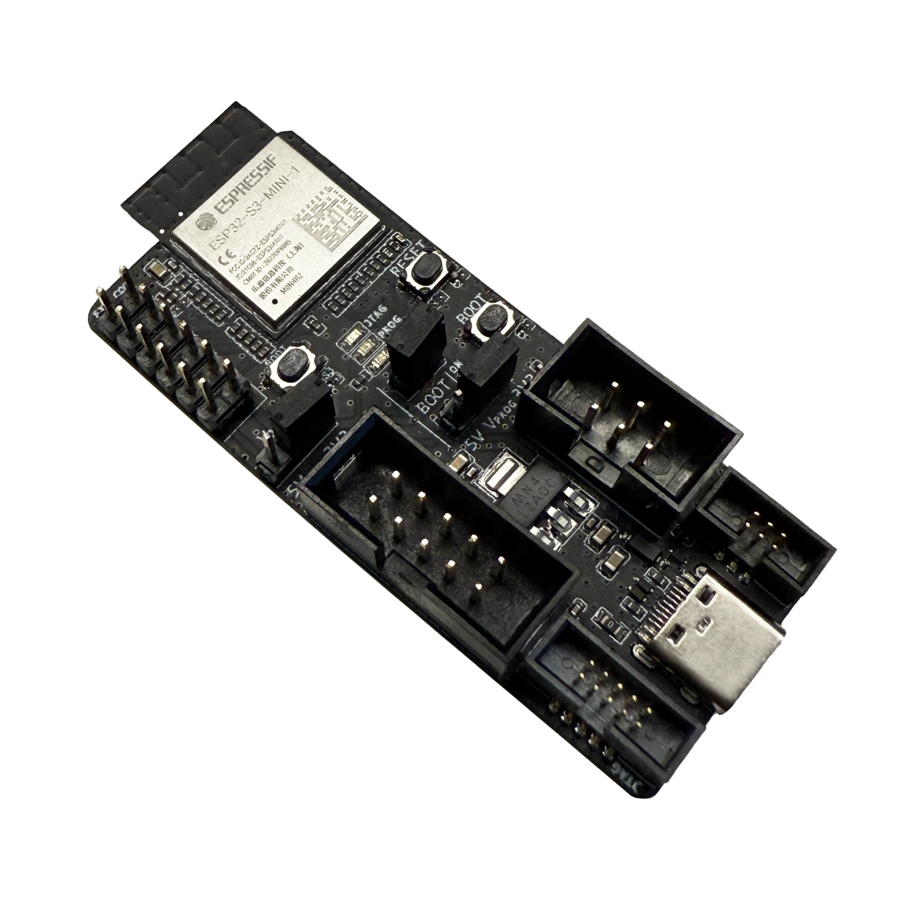
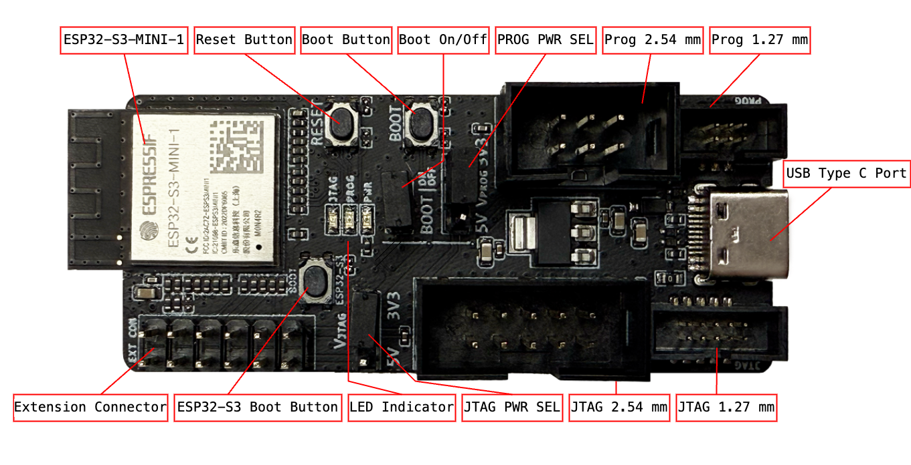
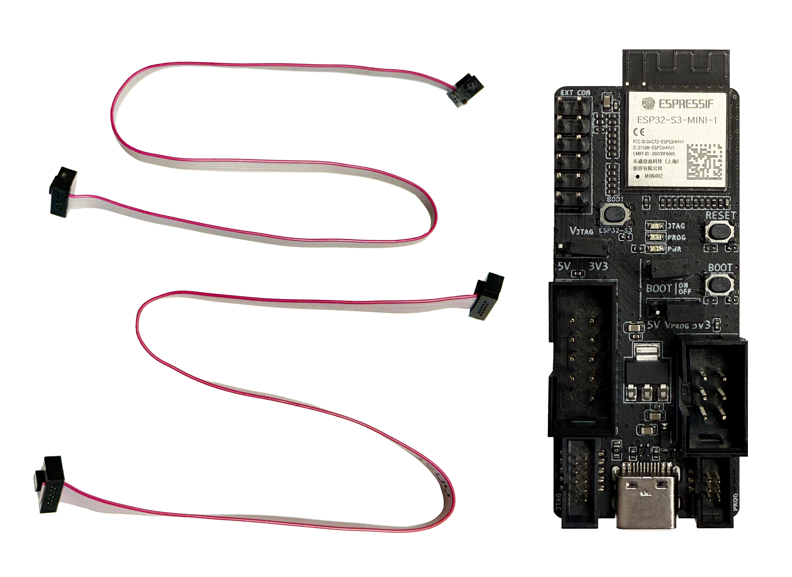
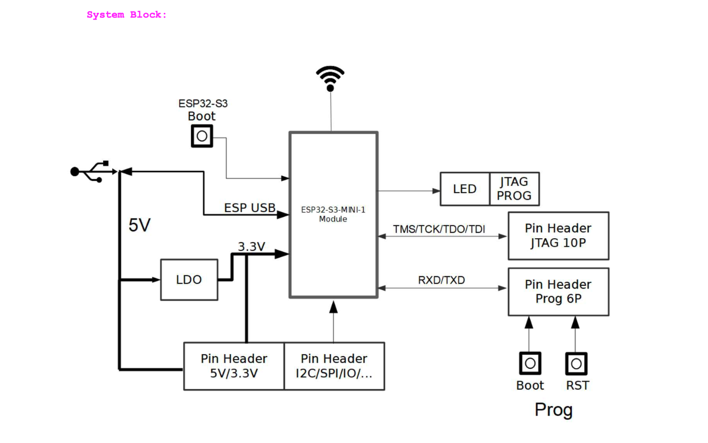

==========
ESP-Prog-2
==========

:link_to_translation:`en:[English]`

本指南帮助您快速上手 ESP-Prog-2，并详细介绍该开发板的功能和特性。

ESP-Prog-2 是乐鑫推出的一款开发调试工具，具有固件自动下载、串口通信、JTAG 在线调试等功能。其中，固件自动下载和串口通信功能适用于 ESP8266、ESP32、ESP32-S2、ESP32-S3 和 ESP32-C3；JTAG 在线调试功能适用于 ESP32、ESP32-S2、ESP32-S3 和 ESP32-C3。

ESP-Prog-2 设计简洁，使用方便，仅需一根 USB 线即可连接到电脑。电脑端可以通过端口号识别出下载功能和 JTAG 功能所对应的两个端口。

考虑到不同目标板的电源电压可能不同，ESP-Prog-2 的两个接口均支持 5 V 或者 3.3 V 供电，可通过排针进行选择，具备较强的电源兼容性。需要注意的是，尽管 ESP-Prog-2 的电源电压可以在 3.3 V 和 5 V 之间切换，其 RX/TX 和 JTAG 信号电平始终为 3.3 V。

    ESP-Prog-2（点击放大）

本指南包括如下内容：

- `入门指南`_：简要介绍了开发板和硬件、软件设置指南。
- `硬件参考`_：详细介绍了开发板的硬件。
- `相关文档`_：列出了相关文档的链接。

入门指南
========

本小节简要介绍 ESP-Prog-2，说明如何对 ESP-Prog-2 进行初始硬件设置。

组件介绍
--------

    ESP-Prog-2 - 正面（点击放大）

以下按照顺时针的顺序依次介绍开发板上的主要组件。

.. list-table::
   :widths: 25 75
   :header-rows: 1

   * - 主要组件
     - 介绍
   * - ESP32-S3-MINI-1
     - ESP32-S3-MINI-1 是通用型 Wi-Fi + 低功耗蓝牙 MCU 模组，具有丰富的外设接口，采用 PCB 板载天线。模组的核心是 ESP32-S3 芯片。
   * - Reset 键
     - 用于重启被调试的目标系统。
   * - Boot 键
     - 目标系统下载按键。按住 **Boot** 键的同时，短按 **Reset** 键进入固件下载模式，通过串口向要调试的目标系统下载固件。正常使用中可以作为确认按钮。
   * - BOOT On/Off
     - 用于配置 BOOT Strapping 管脚状态的排针。
   * - PROG PWR SEL
     - 用于选择 Program 接口电源输入电压（3.3 V 或 5 V）的排针。
   * - PROG 2.54 mm
     - 管脚间距为 2.54 mm (0.1”) 的 Program 接口。
   * - PROG 1.27 mm
     - 管脚间距为 1.27 mm (0.05”) 的 Program 接口。
   * - USB Type-C 接口
     - ESP32-S3 芯片的 USB Type-C 接口支持 USB 2.0 全速模式，数据传输速率最高为 12 Mbps（注意，该接口不支持 480 Mbps 的高速传输模式）。该接口可用作开发板的供电接口，支持通过 USB 协议与 ESP32-S3 芯片通信。
   * - JTAG 1.27 mm
     - 管脚间距为 1.27 mm (0.05”) 的 JTAG 接口。
   * - JTAG 2.54 mm
     - 管脚间距为 2.54 mm (0.1”) 的 JTAG 接口。
   * - JTAG PWR SEL
     - 用于选择 JTAG 接口电源输入电压（3.3 V 或 5 V）的排针。
   * - LED 指示灯
     - 显示 ESP-Prog-2 的状态。共有三种 LED 模式：红色、绿色和蓝色。系统的 3.3 V 电源通电时，红色 LED 灯亮；使用自动下载固件和串口通信功能时，绿色 LED 灯亮；使用JTAG 在线调试功能时，蓝色 LED 灯亮。
   * - ESP32-S3 Boot 键
     - 板载 ESP32-S3 芯片的下载按键。按住 **ESP32-S3 Boot 键** 的同时重新为 ESP-Prog-2 上电，可以使 ESP32-S3 进入固件下载模式。
   * - 扩展连接器
     - 扩展 IO 连接器，用于引出 ESP32-S3 的空闲 IO。可自定义管脚信号，以扩展 ESP-Prog-2 的额外功能。

开始开发应用
-------------

通电前，请确保开发板完好无损。

必备硬件
^^^^^^^^

- ESP-Prog-2
- USB-A 转 USB-C 数据线
- 电脑（Windows、Linux 或 macOS）
- 杜邦线或是乐鑫提供的排线，用于连接开发板和 ESP-Prog-2

.. note::

    请确保使用适当的 USB 数据线。部分数据线仅可用于充电，无法用于数据传输和编程。

硬件设置
^^^^^^^^^^^^^^

1. 通过 USB 线连接 ESP-Prog-2 调试板和电脑端的 USB 口。
2. 使用 PROG PWR SEL 或 JTAG PWR SEL 排针选择 Program 接口 或 JTAG 接口上的电源输出电压。
3. 使用乐鑫提供的排线连接 ESP-Prog-2 调试板和 ESP 产品板。
4. 使用乐鑫官方软件工具或脚本，实现自动下载和 JTAG 调试功能。

固件下载
^^^^^^^^^^^^^^

在软件开发前，建议更新 ESP-Prog-2 的内置出厂固件，以确保设备运行最新的功能和错误修复。

1. **使用在线工具更新固件**：通过乐鑫官方在线烧录工具 `ESP Launchpad <https://espressif.github.io/esp-launchpad/?flashConfigURL=https://espressif.github.io/esp-usb-bridge/launchpad.toml>`__ 更新 ESP-Prog-2 固件，请按以下步骤操作：

  a. 使用基于 Chromium 内核的浏览器，例如 Chrome。
  b. **按住** 靠近模块的 BOOT 按键，然后连接 USB 线，使 ESP-Prog-2 进入固件下载模式。
  c. 在浏览器中打开 `ESP Launchpad <https://espressif.github.io/esp-launchpad/?flashConfigURL=https://espressif.github.io/esp-usb-bridge/launchpad.toml>`__ 页面，并按照屏幕上的指引完成设备连接和固件烧录。

2. **获取固件源代码**：若希望了解固件实现，可访问 `esp-usb-bridge <https://github.com/espressif/esp-usb-bridge>`__ 获取 ESP-Prog-2 的固件源代码。

软件设置
^^^^^^^^^^^^^^

要快速设置开发环境，请参阅 `ESP-IDF 快速入门 <https://idf.espressif.com/zh-cn/index.html>`__ 的 `安装 <https://docs.espressif.com/projects/esp-idf/zh_CN/latest/esp32/get-started/index.html#get-started-step-by-step>`__ 章节。

内容和包装
-----------------

零售订单
^^^^^^^^^^^^^

每一个零售 ESP-Prog-2 开发板均有独立包装。

   ESP-Prog-2 包装内容（点击放大）

包含以下部分：

- 开发板

  ESP-Prog-2

- 数据线

  一根用于 PROG 2.54 mm 接口，连接 2*5-PIN 的牛角座。
  一根用于 PROG 1.27 mm 接口，连接 2*3-PIN 的牛角座。

如果您订购了一批样品，根据零售商的不同，每块开发板的独立包装会有所差异。

如需零售，请前往 `购买样品 <https://www.espressif.com/zh-hans/company/contact/buy-a-sample>`_。

批量订单
^^^^^^^^^^^^^^^^

如果进行批量订购，开发板会装在纸板箱中。

如需批量订购，请 `联系商务 <https://www.espressif.com/zh-hans/contact-us/sales-questions>`_。

硬件参考
==================

功能框图
-------------

ESP-Prog-2 的主要组件和连接方式如下图所示。

    ESP-Prog-2 功能框图（点击放大）

电源选项
^^^^^^^^^^^^^^^^^^^^^^^

开发板有三种互不兼容的供电方式：

- 默认使用 ESP-Prog-2 USB 端口供电（推荐供电方式）
- 5 V 和 G (GND) 管脚供电
- 3.3 V 和 G (GND) 管脚供电

排针
-------------

以下三个表格提供了开发板两侧连接器（Program 接口和 JTAG 接口）和扩展连接器的 **名称** 和 **功能**。连接器名称如 ESP-Prog-2 正面图所示，管脚编号与 `ESP-Prog-2 原理图 <https://dl.espressif.com/schematics/SCH_ESP32-PROG-2_20250403.pdf>`__ (PDF) 中一致。

Program 接口
^^^^^^^^^^^^^^^^^^

.. list-table::
   :widths: 30 35 35
   :header-rows: 1

   * - 编号
     - 名称
     - 功能
   * - 1
     - ESP_EN
     - 使能信号
   * - 2
     - VDD
     - 供电
   * - 3
     - ESP_TXD
     - TX 管脚
   * - 4
     - GND
     - 地线
   * - 5
     - ESP_RXD
     - RX 管脚
   * - 6
     - ESP_IO0
     - Strapping 管脚

JTAG 接口
^^^^^^^^^^^^^^^

.. list-table::
   :widths: 30 30 40
   :header-rows: 1

   * - 编号
     - 名称
     - 功能
   * - 1
     - VDD
     - 供电
   * - 2
     - ESP_TMS
     - JTAG TMS 管脚，选择模式
   * - 3
     - GND
     - 地线
   * - 4
     - ESP_TCK
     - JTAG TCK 管脚，时钟输入
   * - 5
     - GND
     - 地线
   * - 6
     - ESP_TDO
     - JTAG TDO 管脚
   * - 7
     - GND
     - 地线
   * - 8
     - ESP_TDI
     - JTAG TDI 管脚
   * - 9
     - GND
     - 地线
   * - 10
     - NC
     - 无

扩展连接器
^^^^^^^^^^^^^^^^^^

.. list-table::
   :widths: 30 40 40
   :header-rows: 1

   * - 编号
     - 名称
     - 功能
   * - 1
     - I2C_SDA/OPTN_IO
     - 可配置 IO
   * - 2
     - I2C_SCL/OPTN_IO
     - 可配置 IO
   * - 3
     - GND
     - 地线
   * - 4
     - SPI_HD/OPTN_IO
     - 可配置 IO
   * - 5
     - SPI_D/OPTN_IO
     - 可配置 IO
   * - 6
     - SPI_CS/OPTN_IO
     - 可配置 IO
   * - 7
     - GND
     - 地线
   * - 8
     - SPI_CLK/OPTN_IO
     - 可配置 IO
   * - 9
     - SPI_WD/OPTN_IO
     - 可配置 IO
   * - 10
     - SPI_Q/OPTN_IO
     - 可配置 IO
   * - 11
     - VCC_5V
     - 5V 电源
   * - 12
     - VCC_3V3
     - 3V3 电源

相关文档
=================

* `ESP-Prog-2 原理图`_ (PDF)
* `ESP-Prog-2 PCB 布局图`_ (PDF)
* `ESP-Prog-2 尺寸图`_ (PDF)

.. _ESP-Prog-2 原理图: https://dl.espressif.com/schematics/SCH_ESP32-PROG-2_20250403.pdf
.. _ESP-Prog-2 PCB 布局图: https://dl.espressif.com/schematics/PCB_ESP32-PROG-2_20250403.pdf
.. _ESP-Prog-2 尺寸图: https://dl.espressif.com/schematics/DIM_ESP32-PROG-2_20250403.pdf

有关本开发板的更多设计文档，请联系乐鑫商务部门: `sales@espressif.com <sales@espressif.com>`_。
