==========================
ESP-SensairShuttle v1.0
==========================

:link_to_translation:`en:[English]`

.. note::

  请查看主板上的丝印版本号(在主板正面或背面右上角白色圆环内)，以确认您的开发板版本。对于 v1.0 版本的开发板，请参考当前用户指南。

本指南将帮助您快速上手 ESP-SensairShuttle，并提供该款开发板的详细信息。

**ESP-SensairShuttle** 是乐鑫携手 **Bosch Sensortec** 面向 **动作感知** 与 **大模型人机交互** 场景联合推出的开发板，致力于推动多模态感知与智能交互技术的深度融合。该平台覆盖 **AI 玩具、智能家居、运动健康、智慧办公** 等典型应用场景，支持从环境感知、行为理解到智能反馈的完整技术链路，为新一代智能终端提供更自然、更实时、更智能的交互体验。

ESP-SensairShuttle 主控采用乐鑫 **ESP32-C5-WROOM-1-N16R8** 模组，具有 2.4 & 5 GHz 双频 Wi-Fi 6 (802.11ax)、Bluetooth® 5 (LE)、Zigbee 及 Thread (802.15.4) 无线通信能力。此外，主板提供丰富的外设接口，包括 `Bosch Sensortec Shuttle Board <https://www.digikey.sg/en/products/filter/evaluation-boards/expansion-boards-daughter-cards/797?s=N4IgjCBcoLQdIDGUBmBDANgZwKYBoQB7KAbRAA4AmckAXQF96DLSQsALAVwBduMcABACNCaAE4ATAQGYAdAAY6BAKxRQAByhgC6zZErLGQA>`_ （仅支持 shuttle board 3.0 版本）接口、**麦克风与扬声器接口** 以及 **电池供电接口**。用户可通过更换不同的 Shuttle 传感器子板（乐鑫官方支持 **BME690** 以及 **BMI270 & BMM350** 子板），灵活实现对 **空气质量、手势动作、姿态方向及磁场信息** 等多维度感知，适用于教学演示、算法验证及多场景原型开发。

音频方面，ESP-SensairShuttle 支持外接麦克风与扬声器，可无缝对接各类 **大语言模型**，实现自然流畅的 AI 语音交互能力，适用于 **AI 玩具、智能音箱、智能中控面板** 等需要大模型赋能的语音交互类产品。

本指南包括如下内容：

- `入门指南`_：简要介绍了开发板和硬件、软件设置指南。
- `硬件参考`_：详细介绍了开发板的硬件。
- `硬件版本`_：介绍硬件历史版本和已知问题（如有）。
- `相关文档`_：列出了相关文档的链接。

.. _Getting-started_esp-sensairshuttle:

入门指南
========

本小节将简要介绍 ESP-SensairShuttle，说明如何在 ESP-SensairShuttle 上烧录固件及相关准备工作。

组件介绍
--------
.. figure:: ../../_static/esp-sensairshuttle/esp-sensairshuttle-mainboard-front.png
   :alt: SensairShuttle-Mainboard PCB 正面图（点击放大）
   :scale: 70%
   :figclass: align-center

   SensairShuttle-Mainboard PCB 正面图（点击放大）

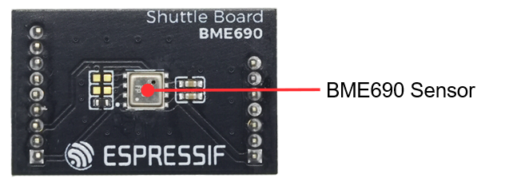

   ShuttleBoard-BME690 PCB 正面图（点击放大）

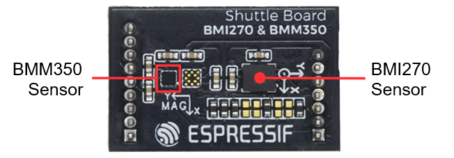

   ShuttleBoard-BMI270&BMM350 PCB 正面图（点击放大）

以下按照顺时针的顺序依次介绍正面 PCB 上的主要组件。

.. list-table::
   :widths: 30 70
   :header-rows: 1

   * - 主要组件
     - 描述
   * - :strong:`MainBoard (主板)`
     -
   * - External Pin Interface（外置引脚接口）
     - 4 pin 的外置引脚接口，自上而下分别是 GPIO5、GPIO4、VDD、GND。注：GPIO5 默认不可用，若需使用，请将 R14 电阻上件。
   * - I2C Interface（外置 I2C 接口）
     - 4 pin 的外置 I2C 接口，可接入支持 I2C 协议通信的设备。
   * - RGB Interface（外置 RGB 灯带接口）
     - 3 pin 的外置 RGB 灯带接口，可接 WS2812 等 RGB 灯带。
   * - ESP32-C5-WROOM-1-N16R8
     - 主控模组，集成 16 MB Flash 和 8 MB PSRAM，具备 2.4 & 5 GHz 双频 Wi-Fi 6 (802.11ax)、Bluetooth® 5 (LE)、Zigbee 及 Thread (802.15.4) 无线通信能力。
   * - LCD Connector（LCD 连接器）
     - 用于连接 LCD 屏幕，分辨率为 284 x 240。
   * - Boot Button（Boot 按键）
     - 用于手动进入下载模式，也可用作普通功能按键。
   * - Power Indicator LED（电源指示灯）
     - 用于指示设备电源状态，指示状态详见 `电源选项`_ 小节。
   * - Power Switch（电源开关）
     - 用于控制设备开关机，单击电源开关即可切换开关机状态。
   * - :strong:`BME690 传感器子板`
     -
   * - BME690 传感器
     - 博世 BME690 气体传感器，可检测空气质量，包括温度、湿度、气压、气体电阻，支持 I2C 与 SPI 协议通信。
   * - :strong:`BMI270&BMM350 传感器子板`
     -
   * - BMI270 传感器
     - 博世 BMI270 惯性测量单元，可检测三轴加速度与三轴角速度，支持 I2C 与 SPI 协议通信。
   * - BMM350 传感器
     - 博世 BMM350 地磁传感器，可检测三轴地磁场强度，支持 I2C 协议通信。

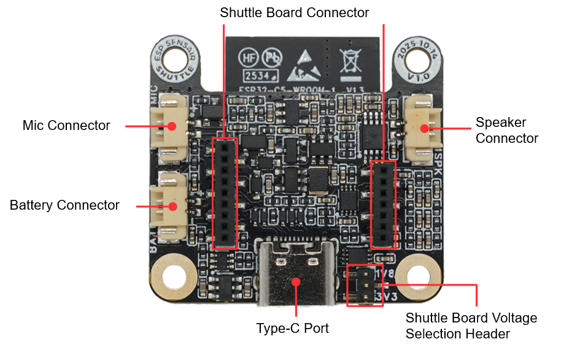

   SensairShuttle-Mainboard PCB 背面图（点击放大）

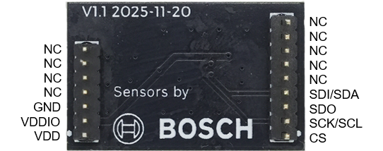

   ShuttleBoard-BME690 PCB 背面图（点击放大）

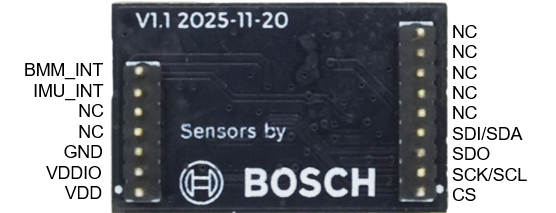

   ShuttleBoard-BMI270&BMM350 PCB 背面图（点击放大）

以下按照顺时针的顺序依次介绍背面 PCB 上的主要组件。

.. list-table::
   :widths: 30 70
   :header-rows: 1

   * - 主要组件
     - 描述
   * - :strong:`MainBoard (主板)`
     -
   * - Battery Connector（电池连接器）
     - 电池连接器，可外接一个 3.7V 锂电池，采用 HC-1.25-2P 线对板连接器。
   * - Mic Connector（麦克风连接器）
     - 2 线麦克风连接器，可外接一个模拟麦克风，采用 HC-1.25-2P 线对板连接器。
   * - Shuttle Board Connector（子板连接器）
     - 9+7 pin 1.27mm 排母连接器，可连接 ShuttleBoard-BME690、ShuttleBoard-BMI270&BMM350 等传感器子板。
   * - Speaker Connector（扬声器连接器）
     - 2 线扬声器连接器，可外接一个扬声器，采用 HC-1.25-2P 线对板连接器。
   * - Type-C Port（USB-C 接口）
     - USB-C 接口，用于供电、程序烧录和调试，支持对锂电池进行充电。
   * - :strong:`BME690 传感器子板`
     - 传感器子板各针脚定义已在图中标出。
   * - :strong:`BMI270&BMM350 传感器子板`
     - 传感器子板各针脚定义已在图中标出。

开始开发应用
------------

通电前，请确保 ESP-SensairShuttle 完好无损。

必备硬件
~~~~~~~~

- ESP-SensairShuttle 主板、ShuttleBoard-BME690 子板、ShuttleBoard-BMI270&BMM350 子板
- USB 数据线
- 电脑（Windows、Linux 或 macOS）

.. 注解::

  请确保使用适当的 USB 数据线。部分数据线仅可用于充电，无法用于数据传输和编程。

硬件设置
~~~~~~~~

使用 USB 数据线将 ESP-SensairShuttle 连接到电脑，通过 ``Type-C（USB-C 接口）`` 烧录固件、调试和供电。

软件设置
~~~~~~~~

请前往 `ESP-IDF 快速入门 <https://docs.espressif.com/projects/esp-idf/zh_CN/latest/esp32c5/get-started/index.html>`__ 小节查看如何快速设置开发环境，将应用程序烧录至您的开发板。

.. 注解::

  开发板使用 USB 端口与电脑通信。大多数操作系统（Windows、Linux、macOS）已预装所需驱动，开发板插入后可自动识别。如无法识别设备或无法建立串口连接，请参考 `如何建立串口连接 <https://docs.espressif.com/projects/esp-idf/zh_CN/latest/esp32c5/get-started/establish-serial-connection.html>`__ 获取安装驱动的详细步骤。

硬件参考
========

功能框图
--------

ESP-SensairShuttle 的主要组件和连接方式如下图所示。

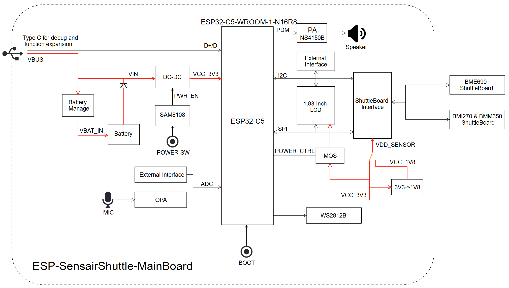

   ESP-SensairShuttle 功能框图（点击放大）

电源选项
--------

可通过以下方法为开发板供电：

1. 通过 ``Type-C（USB-C 接口）`` 供电

   使用该方法供电时，使用 USB Type-C 数据线连接设备上 Type-C 接口。
   若未安装锂电池，电源指示灯亮绿色。若已安装锂电池，需按下 ``POWER`` 按键将设备开机，此时电源指示灯为黄色（电池正在充电）或者绿色（电池已充满）。

2. 通过 ``电池`` 供电

  设备可外接一个 3.7V 锂电池，按下 ``POWER`` 按键即可对设备进行供电，电源指示灯亮绿色表示设备已开机，不亮表示设备已关机。

Type-C 接口
----------------------

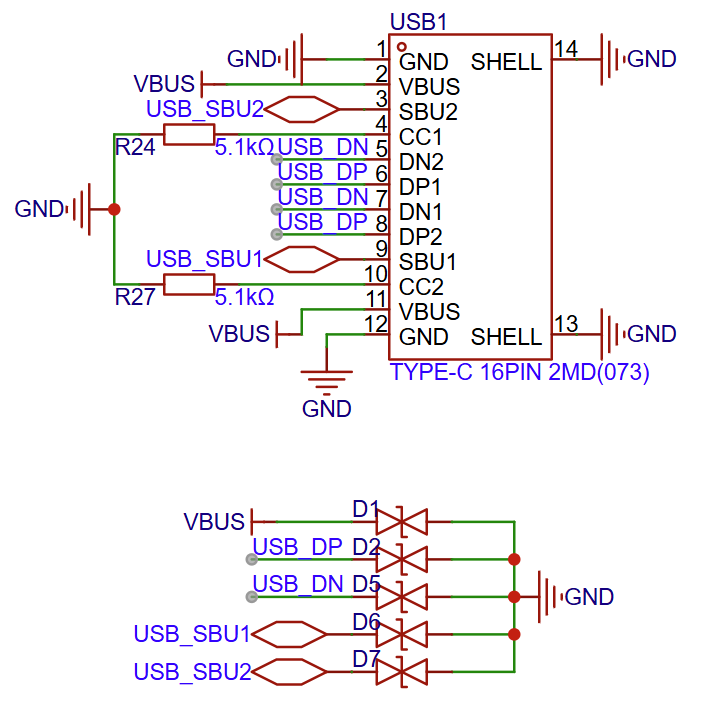

   Type-C 接口电路图（点击放大）

LCD 接口
---------

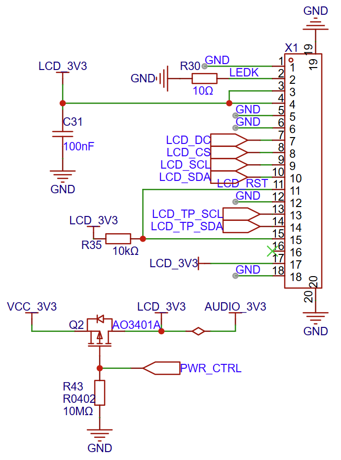

   LCD 接口电路图（点击放大）

X1 接口为正式使用的 LCD 屏幕接口，该开发板使用的屏幕型号为 `ST7789P3 <https://dl.espressif.com/AE/esp-dev-kits/1.83-inch-LCD-P183B001-V4-CTP.pdf>`_，
LCD: 1.83"， 240(H)x284(V)，ST7789P3，4-lineSPI Interface，``PWR_CTRL`` (GPIO5) 可用于控制屏幕电源。

开关机电路
----------

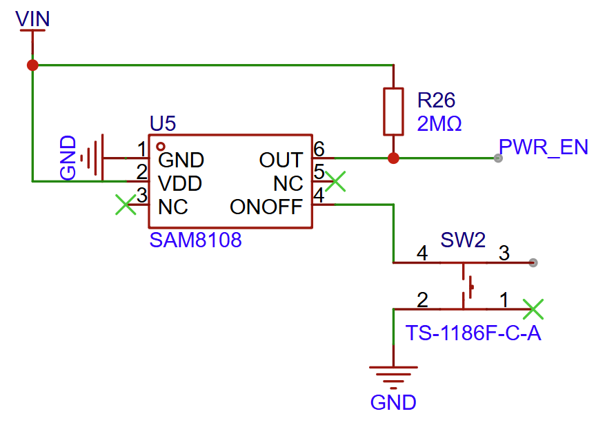

   开关机电路图（点击放大）

充电电路
----------

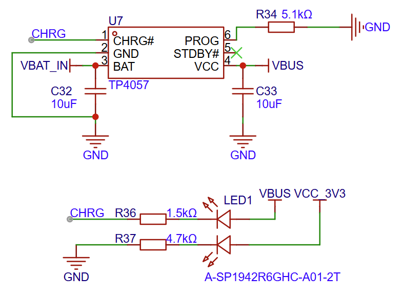

   充电电路图（点击放大）

Shuttle Board 接口电路
----------------------

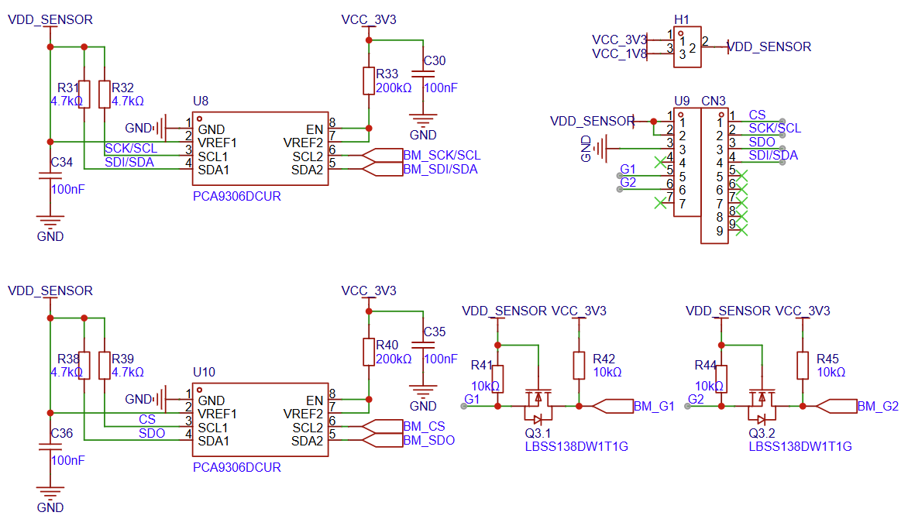

   Shuttle Board 接口电路图（点击放大）

I2C/RGB/外置引脚接口
--------------------

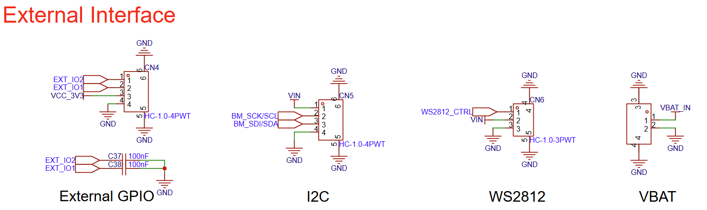

   I2C/RGB/外置引脚接口电路图（点击放大）

硬件版本
==========

无历史版本。

.. _Related-documents_esp-sensairshuttle:

相关文档
==========

-  `ESP32-C5 技术规格书`_ (PDF)
-  `ESP32-C5-WROOM-1 & ESP32-C5-WROOM-1U 技术规格书`_ (PDF)
-  `乐鑫产品选型工具`_
-  `ESP-SensairShuttle-Mainboard V1.0 原理图`_ (PDF)
-  `ESP-SensairShuttle-Mainboard V1.0 PCB 布局图`_ (PDF)
-  `ESP-SensairShuttle-ShuttleBoard-BME690 V1.0 原理图`_ (PDF)
-  `ESP-SensairShuttle-ShuttleBoard-BME690 V1.0 PCB 布局图`_ (PDF)
-  `ESP-SensairShuttle-ShuttleBoard-BMI270&BMM350 V1.0 原理图`_ (PDF)
-  `ESP-SensairShuttle-ShuttleBoard-BMI270&BMM350 V1.0 PCB 布局图`_ (PDF)
-  `显示屏规格书`_ (PDF)
-  `气体传感器 BME690 官方数据手册`_
-  `六轴惯性测量单元 BMI270 官方数据手册`_
-  `三轴磁力计 BMM350 官方数据手册`_

.. _ESP32-C5 技术规格书: https://documentation.espressif.com/esp32-c5_datasheet_cn.pdf
.. _ESP32-C5-WROOM-1 & ESP32-C5-WROOM-1U 技术规格书: https://documentation.espressif.com/esp32-c5-wroom-1_wroom-1u_datasheet_cn.html
.. _乐鑫产品选型工具: https://products.espressif.com/#/product-selector?names=
.. _ESP-SensairShuttle-Mainboard V1.0 原理图: https://dl.espressif.com/AE/esp-dev-kits/SCH_SCH-ESP-SensairShuttle-MainBoard-V1_0_2025-12-16.pdf
.. _ESP-SensairShuttle-Mainboard V1.0 PCB 布局图: https://dl.espressif.com/AE/esp-dev-kits/PCB_PCB-ESP-SensairShuttle-MainBoard-V1_0_2025-12-16.pdf
.. _ESP-SensairShuttle-ShuttleBoard-BME690 V1.0 原理图: https://dl.espressif.com/AE/esp-dev-kits/SCH_SCH-ShuttleBoard-BME690-V1_0_2025-12-16.pdf
.. _ESP-SensairShuttle-ShuttleBoard-BME690 V1.0 PCB 布局图: https://dl.espressif.com/AE/esp-dev-kits/PCB_PCB-ShuttleBoard-BME690-V1_0_2025-12-16.pdf
.. _ESP-SensairShuttle-ShuttleBoard-BMI270&BMM350 V1.0 原理图: https://dl.espressif.com/AE/esp-dev-kits/SCH_SCH-ShuttleBoard-BMI270&BMM350-V1_1_2025-12-16.pdf
.. _ESP-SensairShuttle-ShuttleBoard-BMI270&BMM350 V1.0 PCB 布局图: https://dl.espressif.com/AE/esp-dev-kits/PCB_PCB-ShuttleBoard-BMI270&BMM350-V1_1_2025-12-16.pdf
.. _显示屏规格书: https://dl.espressif.com/AE/esp-dev-kits/1.83-inch-LCD-P183B001-V4-CTP.pdf
.. _气体传感器 BME690 官方数据手册: https://www.bosch-sensortec.com/products/environmental-sensors/gas-sensors/bme690/
.. _六轴惯性测量单元 BMI270 官方数据手册: https://www.bosch-sensortec.com/products/motion-sensors/imus/bmi270/
.. _三轴磁力计 BMM350 官方数据手册: https://www.bosch-sensortec.com/products/motion-sensors/magnetometers/bmm350/

