============
ESP32-P4-EYE
============

:link_to_translation:`en:[English]`

本指南将帮助您快速上手 ESP32-P4-EYE，并提供该款开发板的详细信息。

ESP32-P4-EYE 是一款基于 ESP32-P4 芯片的视觉开发板，主要面向摄像头应用。ESP32-P4 搭载双核 RISC-V 处理器，支持最大 32 MB PSRAM。此外，ESP32-P4 支持 USB 2.0 标准, MIPI-CSI/DSI, H264 Encoder 等多种外设，可满足客户对低成本、高性能、低功耗的多媒体产品的开发需求。

此开发板搭载了 ESP32-C6-MINI-1U 模组，用于该开发板的 Wi-Fi 和蓝牙通信；支持 MIPI-CSI 摄像头接口和 USB 2.0 High-Speed 从机模式。板载功能丰富，包括摄像头、显示屏、麦克风和 MicroSD 卡扩展，使得设备能够实时监测周围环境并采集图像、音频数据。适用于智能安防摄像头、视觉模型检测、物联网边缘计算等需要实时图像处理与无线通信的应用场景。

板上芯片大部分管脚均已引出至排母，开发人员可根据实际需求，轻松通过跳线连接多种外围设备。

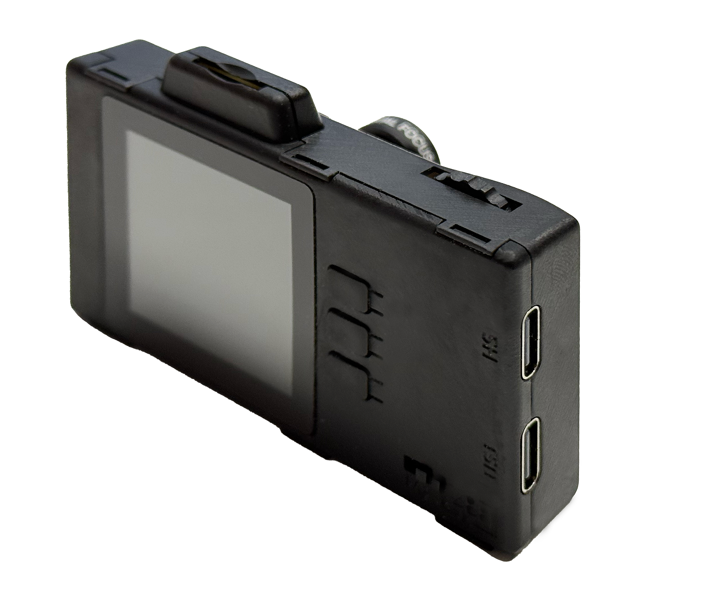

   ESP32-P4-EYE 正面图（点击放大）

.. figure:: ../../_static/esp32-p4-eye/pic_product_esp32_p4_eye_front.png
   :alt: ESP32-P4-EYE 背面图（点击放大）
   :scale: 18%
   :figclass: align-center

   ESP32-P4-EYE 背面图（点击放大）

本指南包括如下内容：

- `入门指南`_：简要介绍了 ESP32-P4-EYE 和硬件、软件设置指南。
- `硬件参考`_：详细介绍了 ESP32-P4-EYE 的硬件。
- `硬件版本`_：介绍硬件历史版本和已知问题，并提供链接至历史版本开发板的入门指南（如有）。
- `相关文档`_：列出了相关文档的链接。

.. _Getting-started:

入门指南
========

本节介绍如何开始使用 ESP32-P4-EYE。首先，介绍一些关于 ESP32-P4-EYE 的基本信息，然后在 `应用程序开发`_ 章节介绍如何开始使用该开发板进行开发。

组件介绍
--------

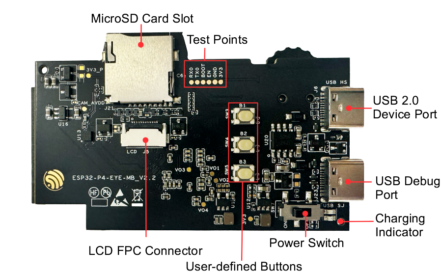

   ESP32-P4-EYE PCB 正面图（点击放大）

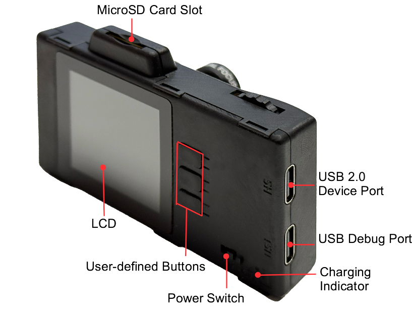

   ESP32-P4-EYE 正面图（点击放大）

以下按照顺时针的顺序依次介绍正面 PCB 上的主要组件。为了方便用户使用，我们同时在 ESP32-P4-EYE 的外壳上标注出了这些组件或者接口。

.. list-table::
   :widths: 30 70
   :header-rows: 1

   * - 主要组件
     - 描述
   * - MicroSD Card Slot（MicroSD 卡槽）
     - 支持通过 4 线 SD 总线连接 MicroSD 卡，兼容 SDIO 协议与 SPI 协议两种通信模式。
   * - Test Points（测试点）
     - 用于对 ESP32-C6-MINI-1U 进行烧录测试的测试点，可焊接杜邦线。
   * - USB 2.0 Device Port（USB 2.0 Device 接口）
     - USB 2.0 Device 接口与 ESP32-P4 芯片的 USB 2.0 OTG High-Speed 接口连接，支持 USB 2.0 标准。通过该接口进行 USB 通讯时，ESP32-P4 作为 USB Device 设备与其他 USB Host 设备连接。该接口也可用作开发板的供电接口，外壳上以 ``USB 2.0`` 符号标识。
   * - USB Debug Port（USB Debug 接口）
     - 该接口可用作开发板的供电接口，可烧录固件至芯片，也可作为通信接口，与 ESP32-P4 芯片上的 USB Serial JTAG 接口连接。外壳上以 ``Debug`` 符号标识。
   * - Power Switch（电源开关）
     - 电源开关。拨向 ``I`` 一侧，开发板连接 5 V 电源上电；拨向 ``O`` 一侧，开发板断开 5 V 电源掉电。
   * - User-defined Buttons（用户自定义按键）
     - 用户可根据应用自定义相关功能。
   * - LCD FPC Connector（屏幕连接器）
     - 用于连接 1.54 英寸 LCD 屏幕。
   * - LCD
     - 1.54 英寸 LCD，SPI 接口，分辨率为 240 x 240，支持 Camera 图像实时显示。详细参数请参考 `显示屏规格书`_。
   * - Charging Indicator（充电指示灯）
     - 为电池充电时，充电指示灯为红色；充电完成后，指示灯变为绿色。

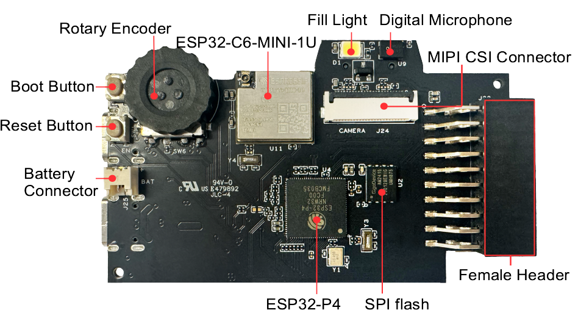

   ESP32-P4-EYE 开发板背面图（点击放大）

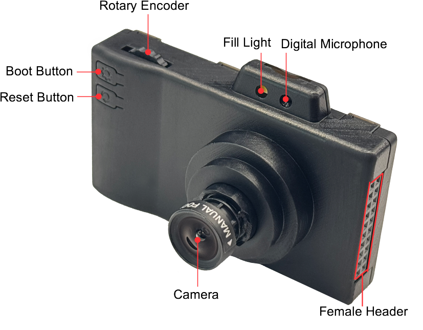

   ESP32-P4-EYE 背面图（点击放大）

以下按照顺时针的顺序依次介绍背面 PCB 上的主要组件。为了方便用户使用，我们同时在 ESP32-P4-EYE 的外壳上标注出了这些组件或者接口。

.. list-table::
   :widths: 30 70
   :header-rows: 1

   * - 主要组件
     - 描述
   * - Rotary Encoder（旋转编码器）
     - 用户可根据应用自定义相关功能，比如可用于拨动控制 LCD 界面和摄像头像素缩放。
   * - ESP32-C6-MINI-1U
     - ESP32-C6-MINI-1U 模组用于该开发板的 Wi-Fi 和蓝牙通信。
   * - Fill Light（补光灯）
     - 用于拍照录像时补光。
   * - Digital Microphone（数字麦克风）
     - 用于语音识别或者录制视频时收音。
   * - MIPI CSI Connector（MIPI CSI 连接器）
     - 用于连接摄像头模组。
   * - Female Header（排母）
     - 2 x 10P 排母，用户可根据应用进行自定义。
   * - SPI flash
     - 通过 SPI 接口与 ESP32-P4 芯片连接，大小为 16 MB。
   * - ESP32-P4
     - ESP32-P4 是一款高性能 MCU，支持超大片上内存，具有强大的图像和语音处理能力。
   * - Battery Connector（电池接口）
     - 用于连接锂电池。
   * - Reset Button（Reset 键）
     - 复位按键，外壳上以 ``↻`` 符号标识。
   * - Boot Button（Boot 键）
     - 启动模式控制按键，外壳上以 ``⚙`` 符号标识。保持按住 **Boot 键** 的同时按一下 **Reset 键**，ESP-P4 将重新启动并进入“固件下载”模式，这时可以通过 USB Debug 接口下载固件到板载 SPI flash 中。正常使用中可以作为确认按钮。
   * - Camera
     - 分辨率为 200 万像素，可旋转摄像头进行手动聚焦。详细参数请参考 `摄像头规格书`_。

应用程序开发
------------

通电前，请确保 ESP32-P4-EYE 完好无损。

必备硬件
^^^^^^^^

- ESP32-P4-EYE
- USB 数据线
- 电脑（Windows、Linux 或 macOS）

.. note::

  请确保使用优质 USB 数据线。部分数据线仅可用于充电，无法用于数据传输和编程。

可选硬件
^^^^^^^^

- MicroSD 卡
- 锂电池

硬件设置
^^^^^^^^

使用 USB 数据线将 ESP32-P4-EYE 连接到电脑，可通过 ``USB 2.0 Device 接口`` 或 ``USB Debug 接口`` 为开发板供电。建议使用 ``USB Debug 接口`` 烧录固件和调试。

软件设置
^^^^^^^^

请前往 `快速入门 <https://docs.espressif.com/projects/esp-idf/zh_CN/latest/esp32p4/get-started/index.html>`__ 中 `详细安装步骤 <https://docs.espressif.com/projects/esp-idf/zh_CN/latest/esp32p4/get-started/index.html#get-started-how-to-get-esp-idf>`__ 一节查看如何快速设置开发环境。

开发板应用示例存放在 :project:`Examples <examples/esp32-p4-eye/examples>` 中。在示例目录下输入 ``idf.py menuconfig`` 即可配置工程选项。

.. _Hardware-reference:

硬件参考
========

功能框图
--------

ESP32-P4-EYE 的主要组件和连接方式如下图所示。

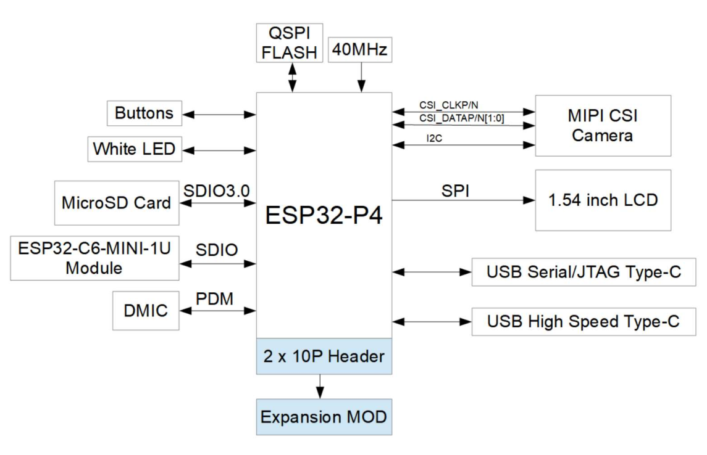

   ESP32-P4-EYE 功能框图（点击放大）

电源选项
--------

可通过以下方法为开发板供电：

1. 通过 ``USB 2.0 Device 接口`` 或 ``USB Debug 接口`` 供电

  使用该方法供电时，应使用 USB Type-C 数据线将开发板通过上述任一接口连接至供电设备。如果已安装锂电池，会同时对锂电池进行充电。

2. 通过 ``电池接口`` 使用外部锂电池供电

  使用该方法供电时，应将外壳拆开，然后将电池接入电池接口。锂电池体积不超过 4 mm x 25 mm x 45 mm，使用 1.25 mm 间距连接器，正负极需与开发板上标识保持一致。

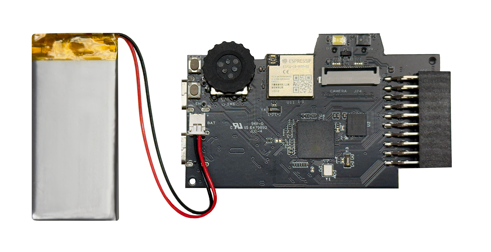

   电池连接图（点击放大）

排母
------

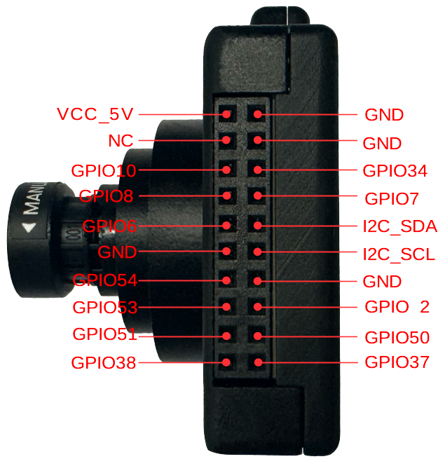

   排母实物图（点击放大）

USB 2.0 Device 接口
----------------------

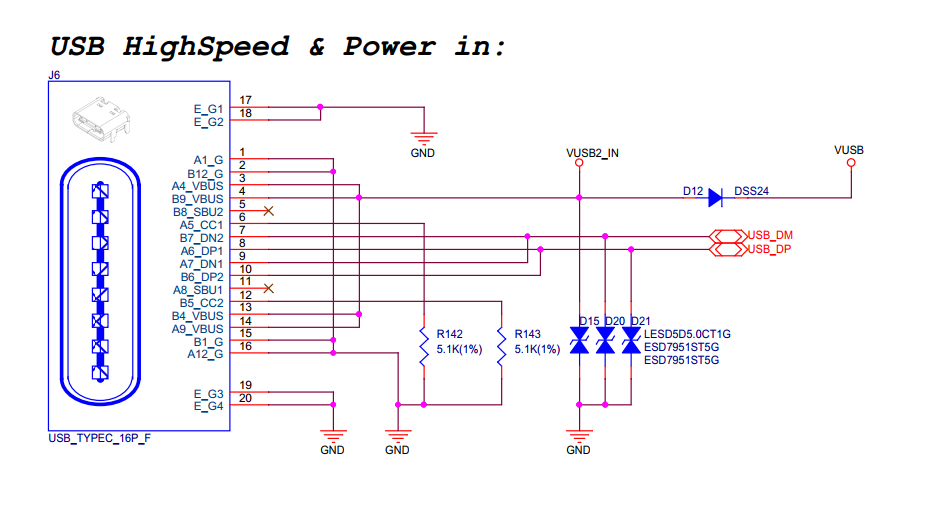

   USB 2.0 Device 接口电路图（点击放大）

LCD 接口
---------

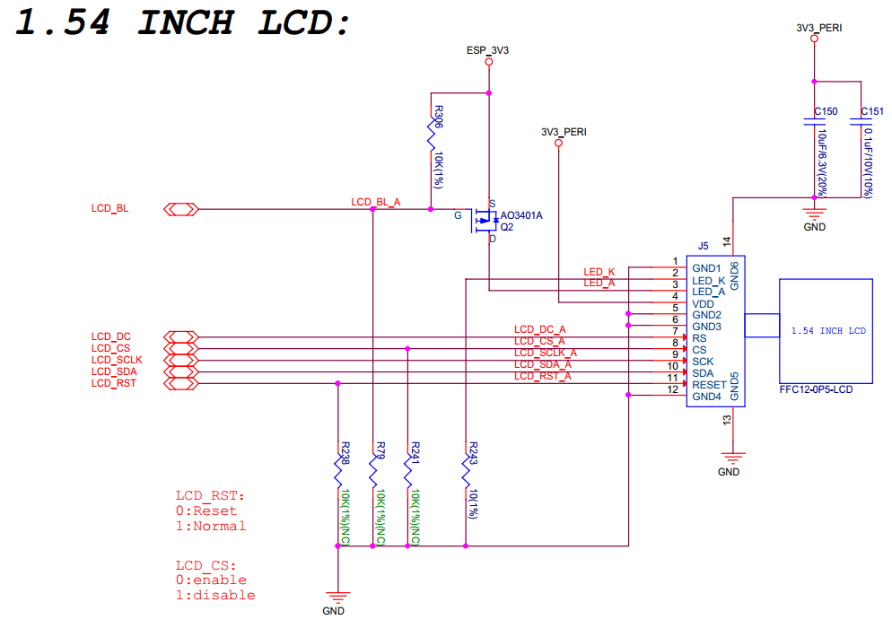

   LCD 接口电路图（点击放大）

请注意，该接口支持连接 SPI 接口屏幕，该开发板使用的屏幕型号为 `ST7789 <https://dl.espressif.com/AE/esp-dev-kits/ST7789VW芯片手册.pdf>`_，``LCD_BL`` (GPIO20) 可用于控制屏幕背光。

SD 卡接口
-------------

.. figure:: ../../_static/esp32-p4-eye/sch_micro_sd_slot.png
   :alt: SD 卡接口电路图（点击放大）
   :scale: 70%
   :figclass: align-center

   SD 卡接口电路图（点击放大）

**请注意，SD 卡接口支持：**

* 1-线和4-线的 SD 总线配置
* 可通过 SDIO 协议或 SPI 协议通信

充电电路
----------

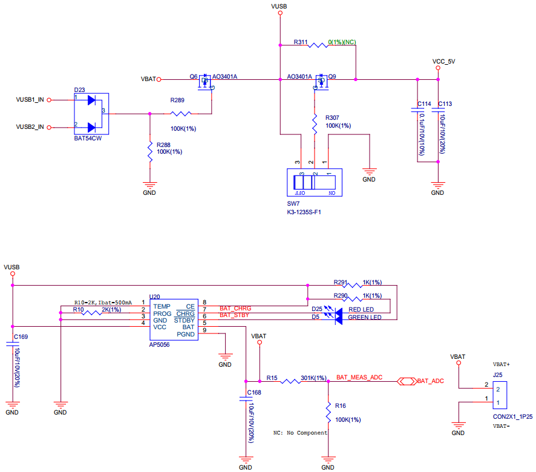

   充电电路图（点击放大）

麦克风接口
--------------

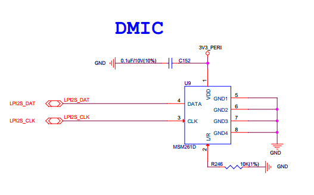

   麦克风接口电路图（点击放大）

摄像头接口
--------------

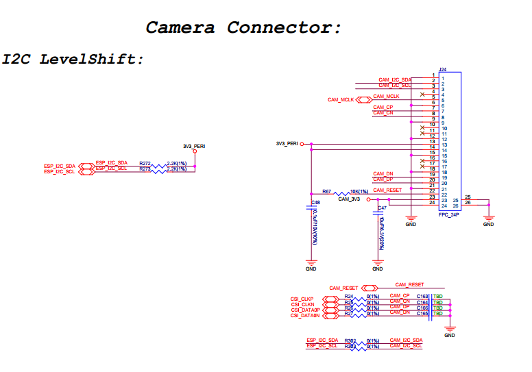

   摄像头接口电路图（点击放大）

滚动编码器接口
-------------------

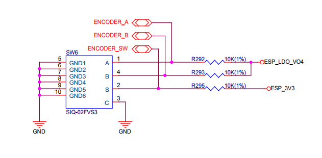

   滚动编码器接口电路图（点击放大）

ESP32-C6-MINI-1U 模组接口
----------------------------------

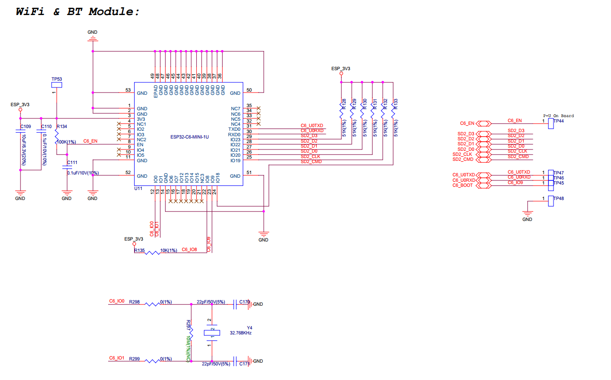

   ESP32-C6-MINI-1U 模组接口电路图（点击放大）

硬件版本
==========

该开发板为最新硬件，尚未有历史版本。

.. _Related-documents:

相关文档
==========

.. only:: latex

   请前往 `esp-dev-kits 文档 HTML 网页版本 <https://docs.espressif.com/projects/esp-dev-kits/zh_CN/latest/{IDF_TARGET_PATH_NAME}/index.html>`_ 下载以下文档。

-  `ESP32-P4-EYE 原理图`_ (PDF)
-  `ESP32-P4-EYE PCB 布局图`_ (PDF)
-  `摄像头规格书`_ (PDF)
-  `显示屏规格书`_ (PDF)
-  `ST7789VW 规格书`_ (PDF)
-  `OV2710 概述`_ (PDF)

.. _ESP32-P4-EYE 原理图: https://dl.espressif.com/AE/esp-dev-kits/SCH_ESP32-P4-EYE-MB_V2.3_20250416.pdf
.. _ESP32-P4-EYE PCB 布局图: https://dl.espressif.com/AE/esp-dev-kits/PCB_ESP32-P4-EYE-MB_V2.2_20250314.pdf
.. _ST7789VW 规格书: https://dl.espressif.com/AE/esp-dev-kits/ST7789VW芯片手册.pdf
.. _OV2710 概述: https://dl.espressif.com/AE/esp-dev-kits/ov2710pbv1.1web.pdf
.. _摄像头规格书: https://dl.espressif.com/AE/esp-dev-kits/HDF2710-47-MIPI-V2.0.pdf
.. _显示屏规格书: https://dl.espressif.com/AE/esp-dev-kits/胶铁一体ZJY154KC-IF17.pdf
