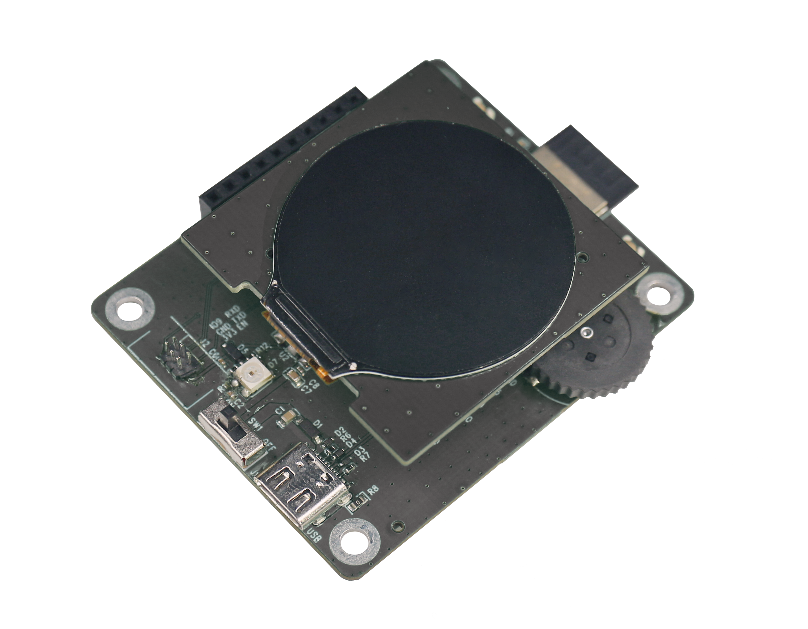
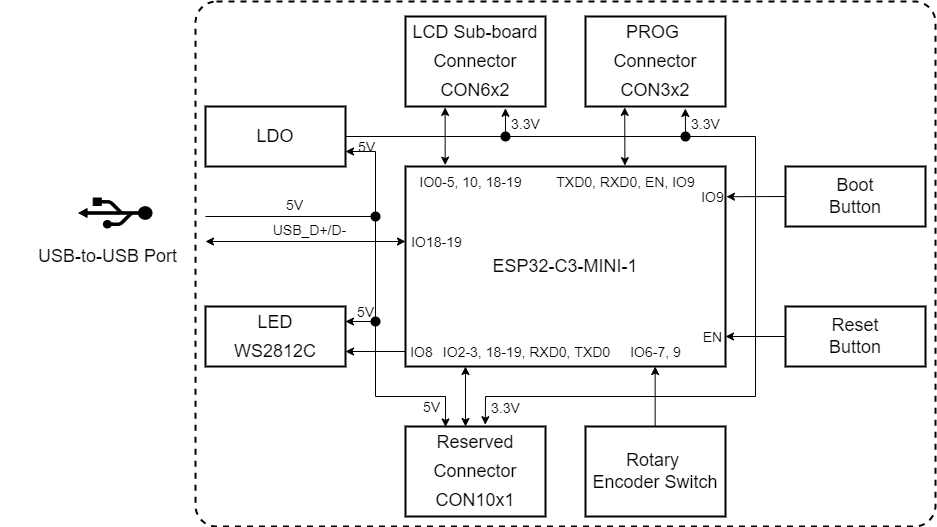
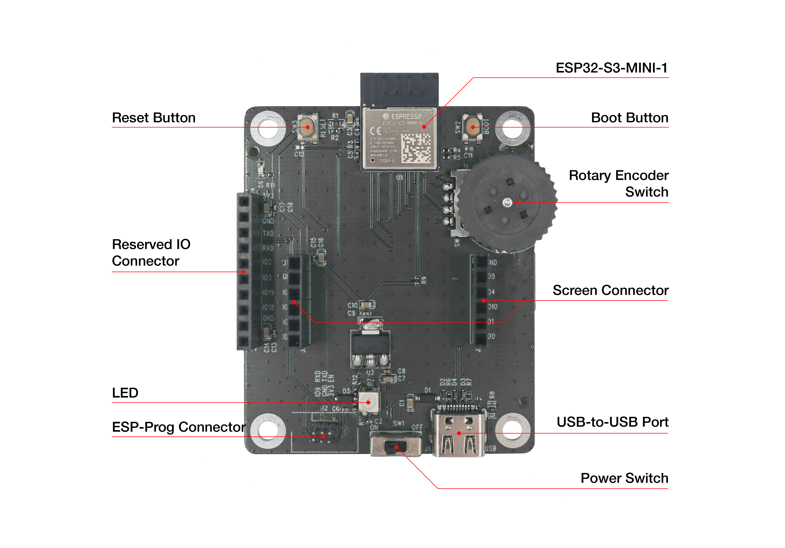
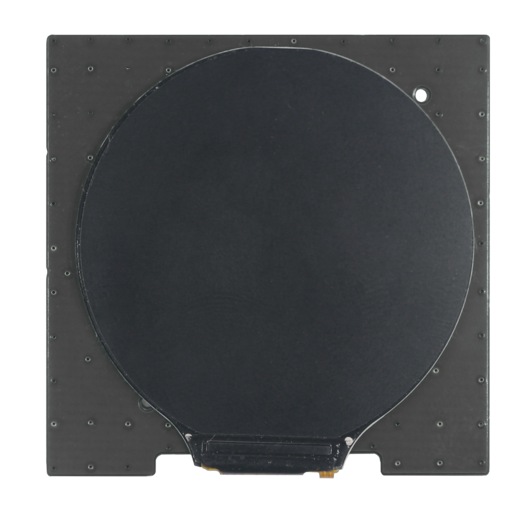
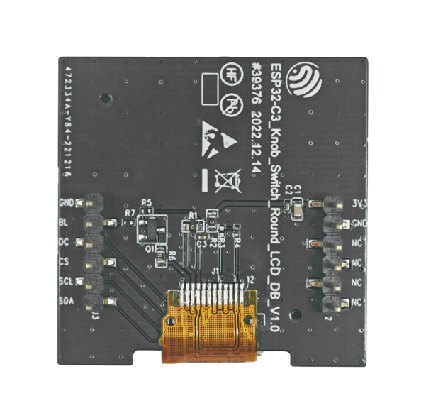
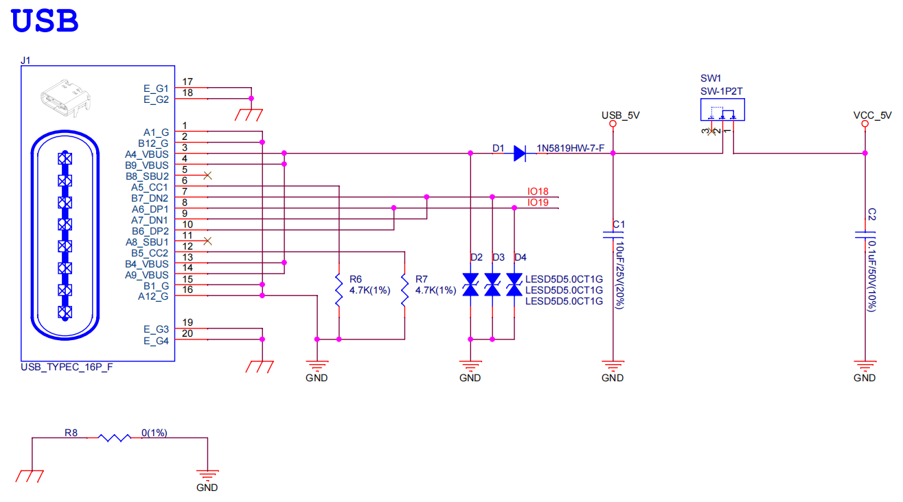
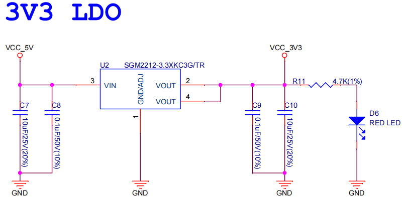

=====================
ESP32-C3-LCD-Ev-Board
=====================

:link_to_translation:`en:[English]`

本指南将帮助您快速上手 ESP32-C3-LCD-Ev-Board，并提供该款开发板的详细信息。

本指南包括如下内容：

- `开发板概述`_：简要介绍了开发板的软件和硬件。
- `应用程序开发`_：介绍了应用程序开发过程中的软硬件设置。
- `硬件参考`_：详细介绍了开发板的硬件。
- `硬件版本`_：暂无历史版本。
- `样品获取`_：如何获取样品。
- `相关文档`_：列出了相关文档的链接。

开发板概述
===================

ESP32-C3-LCD-Ev-Board 是一款基于 ESP32-C3 芯片和 SPI 接口显示屏的评估开发板，同时它还使用了旋转编码器开关，实现屏幕交互的功能。由于 ESP32-C3 具有成本低、功耗低、性能强的特点，能够满足用户基本的 GUI 交互需求，其在小尺寸屏幕的应用场景中占据优势。

    搭载 ESP32-C3-MINI-1 模组的 ESP32-C3-LCD-Ev-Board

特性列表
----------------

该开发板具有以下特性：

-  **嵌入式模组**：板载 ESP32-C3-MINI-1 模组，内置 4 MB flash 以及 400 KB SRAM
-  **屏幕**：可搭配不同屏幕子板使用，支持 ``I2C`` 和 ``SPI`` 接口屏幕，请查看 `LCD 子板`_ 了解更多信息
-  **旋转编码器开关**：支持按键开关以及进行 360° 的旋转，用于实现对屏幕 GUI 的控制操作
-  **USB**：支持 USB Type-C 接口下载调试

功能框图
-------------

ESP32-C3-LCD-Ev-Board 的主要组件和连接方式如下图所示。

    ESP32-C3-LCD-Ev-Board 功能框图（点击放大）

组件介绍
-----------

ESP32-C3-LCD-Ev-Board 开发板由主板和子板组成。

主板
^^^^^^

**ESP32-C3-LCD-Ev-Board_MB** 主板是整个套件的核心，该主板集成了 ESP32-C3-MINI-1 模组，并提供与 LCD 子板连接的端口。

    ESP32-C3-LCD-Ev-Board - 正面（点击放大）

以下按照逆时针顺序依次介绍开发板上的主要组件。

.. list-table::
   :widths: 30 70
   :header-rows: 1

   * - 主要组件
     - 介绍
   * - ESP32-C3-MINI-1 模组
     - ESP32-C3-MINI-1 模组是一款通用型 Wi-Fi + 低功耗蓝牙 MCU 模组，搭载 ESP32-C3 系列芯片，内置 4 MB flash 以及 400 KB SRAM。
   * - Reset 按键
     - 单独按下此按键会重置系统。
   * - 预留 IO 连接器
     - 通过 2.54 mm 间距的连接器连接系统电源管脚以及预留的部分模组管脚。
   * - LED
     - 具有 RGB 三色显示功能，可供用户配置用来做状态行为指示。
   * - ESP-Prog 连接器
     - 通过 1.27 mm 间距的连接器可以连接 `ESP-Prog <https://docs.espressif.com/projects/esp-dev-kits/zh_CN/latest/other/esp-prog/user_guide.html>`_ 的 Program 接口，用于固件下载与调试。
   * - 电源开关
     - 电源拨动开/关：向 ON 拨动开启开发板电源，向 OFF 拨动关闭开发板电源。
   * - USB-to-USB 端口
     - 为整个系统提供电源。建议使用至少 5V/2A 电源适配器供电，保证供电稳定。该端口用于 PC 端与 ESP32-C3-MINI-1 模组的 USB 通信。
   * - 屏幕连接器
     - 通过 2.54 mm 间距的连接器连接 1.28 英寸 LCD 子板。
   * - 旋转编码器开关
     - 同时具有 360° 旋转编码器和按键开关的功能，用于实现对屏幕 GUI 的控制操作。
   * - Boot 按键
     - 长按 Boot 键时，再按 Reset 键可启动固件上传模式，然后便可通过串口或 USB 上传固件。

LCD 子板
^^^^^^^^

**ESP32-C3-LCD-Ev-Board_DB** 子板支持 1.28 英寸、SPI 接口、分辨率为 240x240 的 LCD 屏，该屏使用的驱动芯片型号为 GC9A01。

    ESP32-C3-LCD-Ev-Board_DB - 正面（点击放大）

    ESP32-C3-LCD-Ev-Board_DB - 反面（点击放大）

软件支持
----------------

ESP32-C3-LCD-Ev-Board 的开发框架为 `ESP-IDF <https://github.com/espressif/esp-idf>`_。ESP-IDF 是基于 FreeRTOS 的乐鑫 SoC 开发框架，具有众多组件，包括 LCD、ADC、RMT、SPI 等。

应用程序开发
======================

本节介绍硬件和软件的设置方法，以及烧录固件至开发板以开发应用程序的说明。

必备硬件
--------

- 1 x ESP32-C3-LCD-Ev-Board_MB
- 1 x LCD 子板
- 1 x USB 2.0 数据线（标准 A 型转 Type-C 型）
- 1 x 电脑（Windows、Linux 或 macOS）

.. note::

  请确保使用适当的 USB 数据线。部分数据线仅可用于充电，无法用于数据传输和程序烧录。

硬件设置
--------

准备开发板，加载第一个示例应用程序：

1. 连接 LCD 子板至 **LCD 子板连接器** 端口。
2. 插入 USB 数据线，分别连接 PC 与开发板的 USB 端口。
3. LCD 屏幕亮起，可以使用拨轮编码器开关控制 GUI。

硬件设置完成，接下来可以进行软件设置。

软件设置
--------

了解如何快速设置开发环境，请前往 `快速入门 <https://docs.espressif.com/projects/esp-idf/zh_CN/latest/esp32s3/get-started/index.html>`__ > `安装 <https://docs.espressif.com/projects/esp-idf/zh_CN/latest/esp32s3/get-started/index.html#get-started-step-by-step>`__。

了解开发应用程序的更多软件信息，请查看 `软件支持`_。

硬件参考
========

本节提供关于开发板硬件的更多信息。

GPIO 分配列表
-------------

下表为 ESP32-C3-MINI-1 模组管脚的 GPIO 分配列表，用于控制开发板的特定组件或功能。

.. list-table:: ESP32-C3-MINI-1 GPIO 分配
   :header-rows: 1
   :widths: 20 20 50

   * - 管脚
     - 管脚名称
     - 功能
   * - 1
     - GND
     - 接地
   * - 2
     - GND
     - 接地
   * - 3
     - 3V3
     - 供电
   * - 4
     - NC
     - 未连接
   * - 5
     - IO2
     - 预留
   * - 6
     - IO3
     - 预留
   * - 7
     - NC
     - 未连接
   * - 8
     - EN
     - Reset
   * - 9
     - NC
     - 未连接
   * - 10
     - NC
     - 未连接
   * - 11
     - GND
     - 接地
   * - 12
     - IO0
     - LCD_SDA
   * - 13
     - IO1
     - LCD_SCL
   * - 14
     - GND
     - 接地
   * - 15
     - NC
     - 未连接
   * - 16
     - IO10
     - LCD_CS
   * - 17
     - NC
     - 未连接
   * - 18
     - IO4
     - LCD_D/C
   * - 19
     - IO5
     - LCD_BL_CTRL
   * - 20
     - IO6
     - ENCODER_B
   * - 21
     - IO7
     - ENCODER_A
   * - 22
     - IO8
     - LED
   * - 23
     - IO9
     - BOOT, ENCODER_SW
   * - 24
     - NC
     - 未连接
   * - 25
     - NC
     - 未连接
   * - 26
     - IO18
     - 预留
   * - 27
     - IO19
     - 预留
   * - 28
     - NC
     - 未连接
   * - 29
     - NC
     - 未连接
   * - 30
     - RXD0
     - RXD0
   * - 31
     - TXD0
     - TXD0
   * - 32-35
     - NC
     - 未连接
   * - 36-53
     - GND
     - 接地

供电说明
--------

开发板通过 ``USB-to-USB`` 端口供电：

    ESP32-C3-LCD-Ev-Board - USB-to-USB 电源供电

输出系统电源供电：

    ESP32-C3-LCD-Ev-Board - 系统电源供电

硬件设置选项
------------

自动下载
^^^^^^^^

可以通过两种方式使 ESP 开发板进入下载模式：

- 手动按下 Boot 和 RST 键，然后先松开 RST，再松开 Boot 键。
- 由 ESP-Prog 控制 ESP 开发板的 EN、IO9 管脚的状态来执行下载。

硬件版本
================

无历史版本。

样品获取
================

暂无。

相关文档
========

-  `ESP32-C3 技术规格书 <https://www.espressif.com/sites/default/files/documentation/esp32-c3_datasheet_cn.pdf>`__
-  `ESP32-C3-MINI-1 技术规格书 <https://www.espressif.com/sites/default/files/documentation/esp32-c3-mini-1_datasheet_cn.pdf>`__
-  `乐鑫产品选型工具 <https://products.espressif.com/#/product-selector?names=>`__
-  `ESP32-C3-LCD_EV_Board-MB 原理图 <../../_static/esp32-c3-lcd-ev-board/schematics/SCH_ESP32-C3-LCD_EV_Board_MB_V1.0_20221212.pdf>`__
-  `ESP32-C3-LCD_EV_Board-MB PCB 布局图 <../../_static/esp32-c3-lcd-ev-board/schematics/PCB_ESP32-C3-LCD_Ev_Board_MB_V1.0_20221213.pdf>`__
-  `ESP32-C3-LCD_EV_Board-DB 原理图 <../../_static/esp32-c3-lcd-ev-board/schematics/SCH_ESP32-C3-LCD_Ev_Board_DB_V1.0_20221207.pdf>`__
-  `ESP32-C3-LCD_EV_Board-DB PCB 布局图 <../../_static/esp32-c3-lcd-ev-board/schematics/PCB_ESP32-C3-LCD_EV_Board_DB_V1.0_20221213.pdf>`__

有关本开发板的更多设计文档，请联系我们的商务部门 `sales@espressif.com <sales@espressif.com>`_。
