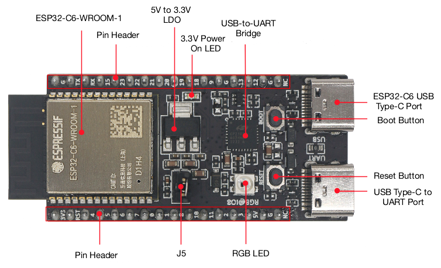
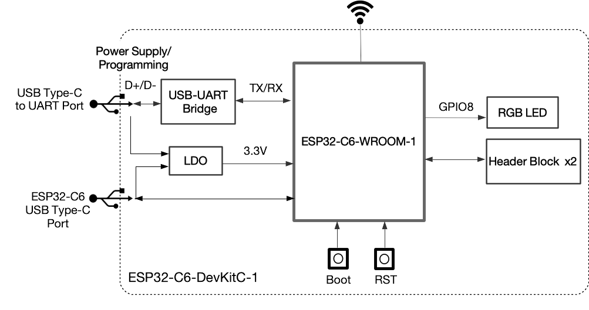
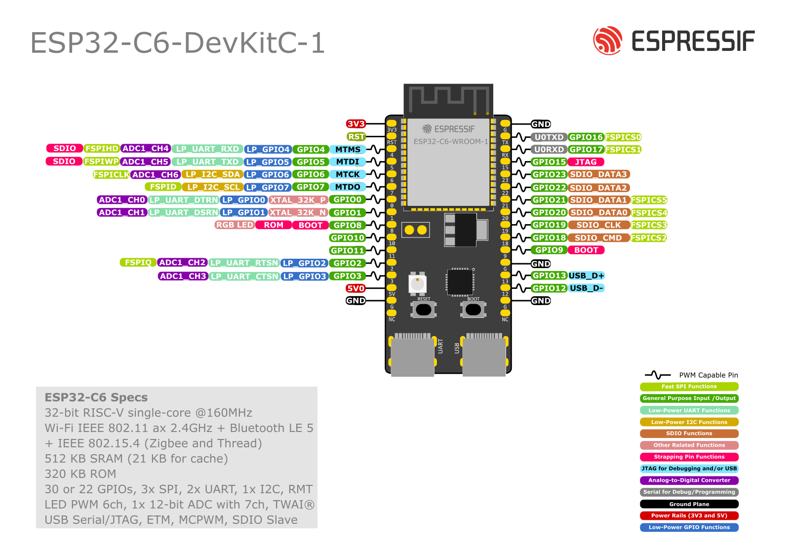

=======================
ESP32-C6-DevKitC-1 v1.1
=======================

:link_to_translation:`en: [English]`

最新版本： :doc:`user_guide`

本指南将帮助您快速上手 ESP32-C6-DevKitC-1，并提供该款开发板的详细信息。

ESP32-C6-DevKitC-1 是一款入门级开发板，使用带有 8 MB SPI flash 的通用型模组 `ESP32-C6-WROOM-1 <https://www.espressif.com/sites/default/files/documentation/esp32-c6-wroom-1_datasheet_cn.pdf>`_。该款开发板具备完整的 Wi-Fi、低功耗蓝牙、Zigbee 及 Thread 功能。

板上模组大部分管脚均已引出至两侧排针，开发人员可根据实际需求，轻松通过跳线连接多种外围设备，同时也可将开发板插在面包板上使用。

.. figure:: ../../../_static/esp32-c6-devkitc-1/esp32-c6-devkitc-1-isometric.png
    :align: center
    :alt: ESP32-C6-DevKitC-1
    :figclass: align-center

    ESP32-C6-DevKitC-1

本指南包括如下内容：

- `入门指南`_：简要介绍了 ESP32-C6-DevKitC-1 和硬件、软件设置指南。
- `硬件参考`_：详细介绍了 ESP32-C6-DevKitC-1 的硬件。
- `硬件版本`_：介绍硬件历史版本和已知问题，并提供链接至历史版本开发板的入门指南（如有）。
- `相关文档`_：列出了相关文档的链接。

入门指南
========

本小节将简要介绍 ESP32-C6-DevKitC-1，说明如何在 ESP32-C6-DevKitC-1 上烧录固件及相关准备工作。

组件介绍
--------

.. _user-guide-c6-devkitc-1-v1-board-front:

    ESP32-C6-DevKitC-1 - 正面

以下按照顺时针的顺序依次介绍开发板上的主要组件。 

.. list-table::
   :widths: 30 70
   :header-rows: 1

   * - 主要组件
     - 介绍
   * - ESP32-C6-WROOM-1
     - ESP32-C6-WROOM-1 是一款通用型模组，支持 2.4 GHz Wi-Fi 6、蓝牙 5 及 IEEE 802.15.4（Zigbee 3.0 和 Thread 1.3）。该款模组内置 ESP32-C6 芯片，采用 PCB 板载天线，配置 8 MB SPI flash。更多信息，请参考 `ESP32-C6-WROOM-1 技术规格书`_。
   * - Pin Header（排针）
     - 所有可用 GPIO 管脚（除 flash 的 SPI 总线）均已引出至开发板的排针。
   * - 5 V to 3.3 V LDO（5 V 转 3.3 V LDO）
     - 电源转换器，输入 5 V，输出 3.3 V。
   * - 3.3 V Power On LED（3.3 V 电源指示灯）
     - 开发板连接 USB 电源后，该指示灯亮起。
   * - USB-to-UART Bridge（USB 转 UART 桥接器）
     - 单芯片 USB 转 UART 桥接器，可提供高达 3 Mbps 的传输速率。
   * - ESP32-C6 USB Type-C Port（ESP32-C6 USB Type-C 接口）
     - ESP32-C6 芯片的 USB Type-C 接口，支持 USB 2.0 全速模式，数据传输速率最高为 12 Mbps（注意，该接口不支持 480 Mbps 的高速传输模式）。该接口可用作开发板的供电接口，可烧录固件至芯片，可通过 USB 协议与芯片通信，也可用于 JTAG 调试。
   * - Boot Button（Boot 键）
     - 下载按键。按住 **Boot** 键的同时按一下 **Reset** 键进入“固件下载”模式，通过串口下载固件。
   * - Reset Button（Reset 键）
     - 复位按键。
   * - USB Type-C to UART Port（USB Type-C 转 UART 接口）
     - 可用作开发板的供电接口，可烧录固件至芯片，也可作为通信接口，通过板载 USB 转 UART 桥接器与 ESP32-C6 芯片通信。
   * - RGB LED
     - 可寻址 RGB 发光二极管，由 GPIO8 驱动。
   * - J5
     - 用于测量电流。详见章节 :ref:`user-guide-c6-devkitc-1-v1-current`。

开始开发应用
------------

通电前，请确保 ESP32-C6-DevKitC-1 完好无损。

必备硬件
^^^^^^^^

- ESP32-C6-DevKitC-1
- USB-A 转 USB-C 数据线
- 电脑（Windows、Linux 或 macOS）

.. 注解::

  请确保使用优质 USB 数据线。部分数据线仅可用于充电，无法用于数据传输和编程。

软件设置
^^^^^^^^

请前往 `ESP-IDF 快速入门 <https://docs.espressif.com/projects/esp-idf/zh_CN/latest/esp32c6/get-started/index.html>`__，查看如何快速设置开发环境，将应用程序烧录至您的开发板。

.. ESP-AT 固件支持
.. ^^^^^^^^^^^^^^^^^^^^^^

.. ESP32-C6-DevKitC-1 支持使用 ESP-AT 指令集，无需对本开发板上的模组进行软件开发即可快速实现产品的无线通讯功能。

.. 乐鑫提供官方的 ESP-AT 固件，您可以前往 `ESP-AT 仓库 <https://github.com/espressif/esp-at/tags>`_ 选择并下载。

.. 如果您需要自定义固件，或查询更多信息，请参考 `ESP-AT 用户指南 <https://docs.espressif.com/projects/esp-at/zh_CN/latest/index.html>`_。

内含组件和包装
--------------

零售订单
^^^^^^^^

如购买样品，每个 ESP32-C6-DevKitC-1 将以防静电袋或零售商选择的其他方式包装。

零售订单请前往 https://www.espressif.com/zh-hans/company/contact/buy-a-sample。

批量订单
^^^^^^^^

如批量购买，ESP32-C6-DevKitC-1 将以大纸板箱包装。

批量订单请参考 `乐鑫产品订购信息 <https://www.espressif.com/sites/default/files/documentation/espressif_products_ordering_information_cn.pdf>`__ (PDF)。

硬件参考
========

功能框图
--------

ESP32-C6-DevKitC-1 的主要组件和连接方式如下图所示。

    ESP32-C6-DevKitC-1（点击放大）

电源选项
--------

您可从以下三种供电方式中任选其一给 ESP32-C6-DevKitC-1 供电：

- USB Type-C 转 UART 接口或 ESP32-C6 USB Type-C 接口供电（选择其一或同时供电），默认供电方式（推荐）
- 5V 和 GND 排针供电
- 3V3 和 GND 排针供电

.. _user-guide-c6-devkitc-1-v1-current:

测量电流
--------

开发板上的 J5 排针（见图 :ref:`user-guide-c6-devkitc-1-v1-board-front` 中的 J5）可用于测量 ESP32-C6-WROOM-1 模组的电流：

- 移除 J5 跳帽：此时开发板上外设和模组电源断开，J5 排针接入电流表后可测量模组电流。
- 安装 J5 跳帽（出厂时默认）：开发板恢复正常功能。

.. 注解::

  使用 3V3 和 GND 排针给开发板供电时，需移除 J5 跳帽，在外部电路上串联接入电流表，才可测量模组的电流。

排针 
---- 

下表列出了开发板两侧排针（J1 和 J3）的 **名称** 和 **功能**，排针的名称如图 :ref:`user-guide-c6-devkitc-1-v1-board-front` 所示，排针的序号与 `ESP32-C6-DevKitC-1 原理图 <../../_static/esp32-c6-devkitc-1/schematics/esp32-c6-devkitc-1-schematics.pdf>`_ (PDF) 一致。 

J1 
^^^ 
====  =======  ==========  ================================================= 
序号  名称     类型 [1]_    功能
====  =======  ==========  ================================================= 
1     3V3       P          3.3 V 电源
2     RST       I          高电平：芯片使能；低电平：芯片关闭。
3     4         I/O/T      MTMS [3]_, GPIO4, LP_GPIO4, LP_UART_RXD, ADC1_CH4, FSPIHD
4     5         I/O/T      MTDI [3]_, GPIO5, LP_GPIO5, LP_UART_TXD, ADC1_CH5, FSPIWP
5     6         I/O/T      MTCK, GPIO6, LP_GPIO6, LP_I2C_SDA, ADC1_CH6, FSPICLK
6     7         I/O/T      MTDO, GPIO7, LP_GPIO7, LP_I2C_SCL, FSPID
7     0         I/O/T      GPIO0, XTAL_32K_P, LP_GPIO0, LP_UART_DTRN, ADC1_CH0
8     1         I/O/T      GPIO1, XTAL_32K_N, LP_GPIO1, LP_UART_DSRN, ADC1_CH1
9     8         I/O/T      GPIO8 [2]_ [3]_
10    10        I/O/T      GPIO10
11    11        I/O/T      GPIO11
12    2         I/O/T      GPIO2, LP_GPIO2, LP_UART_RTSN, ADC1_CH2, FSPIQ
13    3         I/O/T      GPIO3, LP_GPIO3, LP_UART_CTSN, ADC1_CH3
14    5V        P          5 V 电源
15    G         G          接地
16    NC        –          空管脚
====  =======  ==========  ================================================= 

J3 
^^^ 
====  ==========  ======  ========================================== 
序号  名称         类型     功能
====  ==========  ======  ==========================================
1      G          G       接地
2      TX         I/O/T   U0TXD, GPIO16, FSPICS0
3      RX         I/O/T   U0RXD, GPIO17, FSPICS1
4      15         I/O/T   GPIO15 [3]_
5      23         I/O/T   GPIO23, SDIO_DATA3
6      22         I/O/T   GPIO22, SDIO_DATA2
7      21         I/O/T   GPIO21, SDIO_DATA1, FSPICS5
8      20         I/O/T   GPIO20, SDIO_DATA0, FSPICS4
9      19         I/O/T   GPIO19, SDIO_CLK, FSPICS3
10     18         I/O/T   GPIO18, SDIO_CMD, FSPICS2
11     9          I/O/T   GPIO9 [3]_
12     G          G       接地
13     13         I/O/T   GPIO13, USB_D+
14     12         I/O/T   GPIO12, USB_D-
15     G          G       接地
16     NC         –       空管脚
====  ==========  ======  ==========================================

.. [1] P：电源；I：输入；O：输出；T：可设置为高阻。 
.. [2] 用于驱动 RGB LED。 
.. [3] MTMS、MTDI、GPIO8、GPIO9 和 GPIO15 为 ESP32-C6 芯片的 Strapping 管脚。在芯片上电和系统复位过程中，Strapping 管脚根据管脚的二进制电压值控制芯片功能。Strapping 管脚的具体描述和应用，请参考 `ESP32-C6 技术规格书`_ > Strapping 管脚章节。

管脚布局
^^^^^^^^

    ESP32-C6-DevKitC-1 管脚布局（点击放大）

硬件版本
==========

该开发板为最新硬件，尚未有历史版本。

相关文档
========
* `ESP32-C6 技术规格书`_ (PDF)
* `ESP32-C6-WROOM-1 技术规格书`_ (PDF)
* `ESP32-C6-DevKitC-1 原理图 <../../_static/esp32-c6-devkitc-1/schematics/esp32-c6-devkitc-1-schematics.pdf>`_ (PDF)
* `ESP32-C6-DevKitC-1 PCB 布局图 <../../_static/esp32-c6-devkitc-1/schematics/esp32-c6-devkitc-1-pcb-layout.pdf>`_ (PDF)
* `ESP32-C6-DevKitC-1 尺寸图 <../../_static/esp32-c6-devkitc-1/schematics/esp32-c6-devkitc-1-dimensions.pdf>`_ (PDF)
* `ESP32-C6-DevKitC-1 尺寸图源文件 <../../_static/esp32-c6-devkitc-1/schematics/esp32-c6-devkitc-1-dimensions.dxf>`_ (DXF) - 可使用 `Autodesk Viewer <https://viewer.autodesk.com/>`_ 查看

有关本开发板的更多设计文档，请联系我们的商务部门 `sales@espressif.com <sales@espressif.com>`_。

.. _ESP32-C6 技术规格书: https://www.espressif.com/sites/default/files/documentation/esp32-c6_datasheet_cn.pdf
.. _ESP32-C6-WROOM-1 技术规格书: https://www.espressif.com/sites/default/files/documentation/esp32-c6-wroom-1_datasheet_cn.pdf
