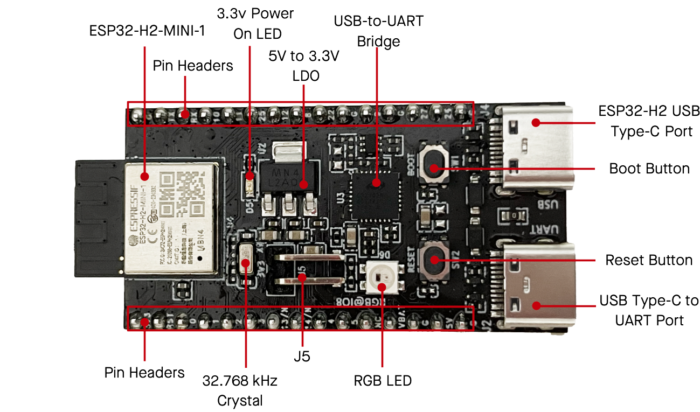

===================
ESP32-H2-DevKitM-1
===================

:link_to_translation:`en: [English]`

本指南将帮助您快速上手 ESP32-H2-DevKitM-1，并提供该款开发板的详细信息。

ESP32-H2-DevKitM-1 是一款入门级开发板，搭载低功耗蓝牙®和 IEEE 802.15.4 双模模组 ESP32-H2-MINI-1 或 ESP32-H2-MINI-1U。

板上模组的大部分管脚均已引出至开发板两侧排针，开发人员可根据实际需求，轻松通过跳线连接多种外围设备，同时也可将开发板插在面包板上使用。

.. figure:: ../../../_static/esp32-h2-devkitm-1/esp32-h2-devkitm-1-45.png
    :align: center
    :alt: ESP32-H2-DevKitM-1（板载 ESP32-H2-MINI-1 模组）

    ESP32-H2-DevKitM-1（板载 ESP32-H2-MINI-1 模组）

本指南包括如下内容：

- `入门指南`_：简要介绍了开发板和硬件、软件设置指南。
- `硬件参考`_：详细介绍了开发板的硬件。
- `硬件版本`_：介绍硬件历史版本和已知问题，并提供链接至历史版本开发板的入门指南（如有）。
- `相关文档`_：列出了相关文档的链接。

入门指南
========

本小节将简要介绍 ESP32-H2-DevKitM-1，说明如何在 ESP32-H2-DevKitM-1 上烧录固件及相关准备工作。

组件介绍
--------

.. _user-guide-H2-devkitm-1-board-front:

    ESP32-H2-DevKitM-1 - 正面

以下按照顺时针的顺序依次介绍开发板上的主要组件。

.. list-table::
   :widths: 40 60
   :header-rows: 1

   * - 主要组件
     - 介绍
   * - ESP32-H2-MINI-1 或 ESP32-H2-MINI-1U
     - ESP32-H2-MINI-1/1U 搭载 ESP32-H2 芯片，集成 2.4 GHz 接收器兼容低功耗蓝牙和 IEEE 802.15.4 技术，支持 Bluetooth 5（LE）, Bluetooth mesh, Zigbee, Thread 和 Matter 等协议，适用于多种低功耗物联网应用场景。
   * - Pin Headers（排针）
     - 所有可用 GPIO 管脚（除 flash 的 SPI 总线）均已引出至开发板的排针。请查看 `排针`_ 获取更多信息
   * - 3.3 V Power On LED（3.3 V 电源指示灯）
     - 开发板连接 USB 电源后，该指示灯亮起。
   * - 5 V to 3.3 V LDO（5 V 转 3.3 V LDO）
     - 电源转换器，输入 5 V，输出 3.3 V
   * - USB-to-UART Bridge（USB 至 UART 桥接器）
     - 单芯片 USB 至 UART 桥接器，可提供高达 3 Mbps 的传输速率。
   * - ESP32-H2 USB Type-C Port（ESP32-H2 USB Type-C 接口）
     - ESP32-H2 芯片的 USB Type-C 接口，支持 USB 2.0 全速模式，数据传输速率最高为 12 Mbps（注意，该接口不支持 480 Mbps 的高速传输模式）。
   * - Boot Button（Boot 键）
     - 下载按键。按住 Boot 键的同时按一下 Reset 键进入“固件下载”模式，通过串口下载固件。
   * - Reset Button（Reset 键）
     - 复位按键。
   * - USB Type-C to UART Port（USB Type-C 转 UART 接口）
     - 可用作开发板的供电接口，也可作为通信接口，通过板载 USB 转 UART 桥接器与 ESP32-H2 芯片通信。
   * - RGB LED
     - 可寻址 RGB 发光二极管，由 GPIO8 驱动。
   * - J5
     - 用于测量电流，详见章节 `测量电流`_ 。
   * - 32.768 kHz 晶振 [A]_
     - ESP32-H2 支持外置 32.768 kHz 作为低功耗时钟。使用外部低功耗时钟源是为了使时间更准确，从而降低平均功耗，但对于功能没有任何影响。

.. [A] 生产工单号为 PW-2024-02-0362 之前的开发板默认不上件 32.768 kHz 晶振。

开始开发应用
-------------

通电前，请确保开发板完好无损。

必备硬件
^^^^^^^^

- ESP32-H2-DevKitM-1
- USB-A 转 USB-C (Type C) 数据线
- 电脑（Windows、Linux 或 macOS）

.. 注解::

  请确保使用适当的 USB 数据线。部分数据线仅可用于充电，无法用于数据传输和编程。

软件设置
^^^^^^^^

请前往 `快速入门 <https://docs.espressif.com/projects/esp-idf/zh_CN/latest/esp32h2/get-started/index.html>`_ 的 `安装 <https://docs.espressif.com/projects/esp-idf/zh_CN/latest/esp32h2/get-started/index.html#get-started-step-by-step>`_ 小节查看如何快速设置开发环境，将应用程序烧录至您的开发板。

内含组件和包装
---------------

订购信息
^^^^^^^^

该开发板有多种型号可供选择，详见下表。

.. list-table::
   :header-rows: 1
   :widths: 41 24 9 8 18

   * - 订购代码
     - 搭载模组
     - Flash [B]_
     - PSRAM
     - 天线
   * - ESP32-H2-DevKitM-1-N4
     - ESP32-H2-MINI-1
     - 4 MB
     - 0 MB
     - PCB 板载天线
   * - ESP32-H2-DevKitM-1U-N4
     - ESP32-H2-MINI-1U
     - 4 MB
     - 0 MB
     - 外部天线连接器

.. [B] flash 封装在芯片内部。

零售订单
^^^^^^^^

如购买样品，每个开发板将以防静电袋或零售商选择的其他方式包装。

零售订单请前往 https://www.espressif.com/zh-hans/company/contact/buy-a-sample。

批量订单
^^^^^^^^

如批量购买，开发板将以大纸板箱包装。

批量订单请前往 https://www.espressif.com/zh-hans/contact-us/sales-questions。

硬件参考
========

功能框图
--------

ESP32-H2-DevKitM-1 的主要组件和连接方式如下图所示。

.. figure:: ../../../_static/esp32-h2-devkitm-1/esp32-h2-devkitm-1_v1.0_systemblock.png
    :align: center
    :alt: ESP32-H2-DevKitM-1
    :width: 700

    ESP32-H2-DevKitM-1

电源选项
^^^^^^^^

您可从以下三种供电方式中任选其一给开发板供电：

- USB Type-C 转 UART 接口供电（默认）
- 5V 和 G (GND) 排针供电
- 3V3 和 G (GND) 排针供电

.. _user-guide-h2-devkitm-1-current:

测量电流
^^^^^^^^

开发板上的 J5 排针（见图 :ref:`user-guide-H2-devkitm-1-board-front` - 正面 中的 J5）可用于测量 ESP32-H2-MINI-1/1U 模组的电流：

- 移除 J5 跳帽：此时开发板上外设和模组电源断开，J5 排针接入电流表后可测量模组电流。
- 安装 J5 跳帽（出厂时默认）：开发板恢复正常功能。

.. 注解::

  使用 3V3 和 GND 排针给开发板供电时，需移除 J5 跳帽，在外部电路上串联接入电流表，才可测量模组的电流。

排针
----

下表列出了开发板两侧排针（J1 和 J3）的 **名称** 和 **功能**，排针的名称见 `管脚布局`_ 所示，排针的序号与开发板原理图（随附 PDF）一致。

J1
^^^
====  ====  ==========  ==================================================================
序号  名称   类型 [1]_    功能
====  ====  ==========  ==================================================================
1     3V3     P         3.3 V 电源
2     RST     I         高电平：芯片使能；低电平：芯片关闭；内部默认已上拉。
3     0       I/O/T     GPIO0, FSPIQ
4     1       I/O/T     GPIO1, FSPICS0, ADC1_CH0
5     2       I/O/T     GPIO2, FSPIWP, ADC1_CH1, MTMS
6     3       I/O/T     GPIO3, FSPIHD, ADC1_CH2, MTDO
7     13/N    I/O/T     GPIO13, XTAL_32K_P [2]_
8     14/N    I/O/T     GPIO14, XTAL_32K_N [3]_
9     4       I/O/T     GPIO4, FSPICLK, ADC1_CH3, MTCK
10    5       I/O/T     GPIO5, FSPID, ADC1_CH4, MTDI
11    NC      --        空管脚
12    VBAT    P         3.3 V 电源或电池电源
13    G       P         接地
14    5V      P         5 V 电源
15    G       P         接地
====  ====  ==========  ==================================================================

J3
^^^
====  ====  ==========  ================================
序号  名称   类型 [1]_     功能
====  ====  ==========  ================================
1     G     P           接地
2     TX    I/O/T       GPIO24, FSPICS2, U0TXD
3     RX    I/O/T       GPIO23, FSPICS1, U0RXD
4     10    I/O/T       GPIO10, ZCD0
5     11    I/O/T       GPIO11, ZCD1
6     25    I/O/T       GPIO25, FSPICS3
7     12    I/O/T       GPIO12
8     8     I/O/T       GPIO8 [4]_, LOG
9     22    I/O/T       GPIO22
10    G     P           接地
11    9     I/O/T       GPIO9, BOOT
12    G     P           接地
13    27    I/O/T       GPIO27, FSPICS5, USB_D+
14    26    I/O/T       GPIO26, FSPICS4, USB_D-
15    G     P           接地
====  ====  ==========  ================================

.. [1] P：电源；I：输入；O：输出；T：可设置为高阻。
.. [2] 当模组内部选择连接 XTAL_32K_P，不能作他用。
.. [3] 当模组内部选择连接 XTAL_32K_N，不能作他用。
.. [4] 模组内部已用于驱动 RGB LED。

有关管脚功能名称的解释，请参考 `ESP32-H2 技术规格书`_。

管脚布局
^^^^^^^^

.. figure:: ../../../_static/esp32-h2-devkitm-1/esp32-h2-devkitm-1-v1.2_pinlayout.png
    :align: center
    :scale: 42%
    :alt: ESP32-H2-DevKitM-1

    ESP32-H2-DevKitM-1 管脚布局

硬件版本
============

- 生产工单号为 PW-2024-02-0362 及之后（2024 年 2 月当月或之后）的开发板，32.768 KHz 晶振默认贴片，同时此处与周围排针连接的串联电阻更新为不贴片。为优化电路，UART_RXD 上的串联电阻 R7 更新为 470 Ω。

.. 注解::

  生产工单号可在批量订单大纸板箱包装的物料标签中找到。

相关文档
========

- `ESP32-H2 技术规格书 <https://www.espressif.com/sites/default/files/documentation/esp32-h2_datasheet_cn.pdf>`_ (PDF)
- `ESP32-H2-MINI-1/1U 技术规格书 <https://www.espressif.com/sites/default/files/documentation/esp32-h2-mini-1_mini-1u_datasheet_cn.pdf>`_ (PDF)
- `ESP32-H2-DevKitM-1 原理图 v1.3  <../../_static/esp32-h2-devkitm-1/esp32-h2-devkitm-1_v1.3_schematics.pdf>`_ (PDF) - 适用于 PW-2024-02-0362 及之后的开发板
- `ESP32-H2-DevKitM-1 原理图 v1.2  <../../_static/esp32-h2-devkitm-1/esp32-h2-devkitm-1_v1.2_schematics.pdf>`_ (PDF) - 适用于 PW-2024-02-0362 之前的开发板
- `ESP32-H2-DevKitM-1 PCB 布局图 <../../_static/esp32-h2-devkitm-1/esp32-h2-devkitm-1_v1.2_pcb_layout.pdf>`_ (PDF)
- `ESP32-H2-DevKitM-1 尺寸图 <../../_static/esp32-h2-devkitm-1/esp32-h2-devkitm-1_v1.2_dimension.pdf>`_ (PDF)
- `ESP32-H2-DevKitM-1 尺寸图源文件 <../../_static/esp32-h2-devkitm-1/esp32-h2-devkitm-1_v1.2_dimension.dxf>`_ (DXF)

有关本开发板的更多设计文档，请联系我们的商务部门 `sales@espressif.com <sales@espressif.com>`_。