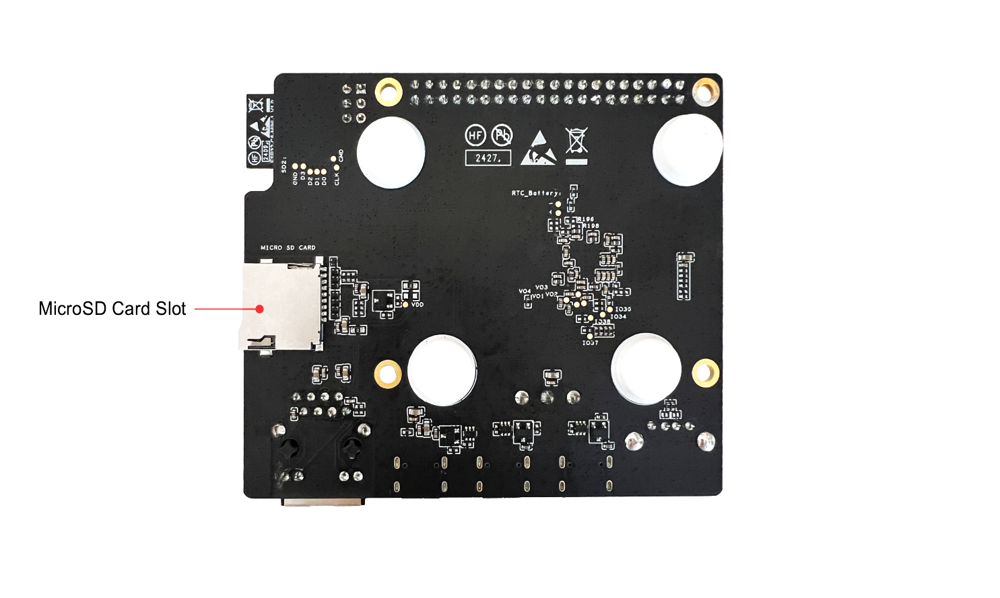
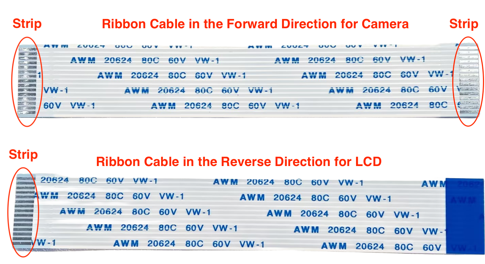

==========================
ESP32-P4-Function-EV-Board
==========================

:link_to_translation:`en: [English]`

本指南将帮助您快速上手 ESP32-P4-Function-EV-Board，并提供该款开发板的详细信息。

ESP32-P4-Function-EV-Board 是一款基于 ESP32-P4 芯片的多媒体开发板。ESP32-P4 搭载双核 400 MHz RISC-V 处理器，支持最大 32 MB PSRAM。此外，ESP32-P4 支持 USB 2.0 标准, MIPI-CSI/DSI, H264 Encoder 等多种外设，可满足客户对低成本、高性能、低功耗的多媒体产品的开发需求。

此开发板搭载了 ESP32-C6-MINI-1 2.4 GHz Wi-Fi 6 & Bluetooth 5 (LE) 模组，用于该开发板的 Wi-Fi 和蓝牙通信；它还配置了一块 7 英寸电容式触摸屏，分辨率为 1024 x 600，并配有一颗 200 万像素的 MIPI CSI 接口摄像头，丰富了用户的交互体验。该开发板适用于可视门铃、网络摄像头、智能家居中控屏、LCD 电子价签、两轮车仪表盘等产品的原型构建。

板上模组大部分管脚均已引出至排针，开发人员可根据实际需求，轻松通过跳线连接多种外围设备。

.. figure:: ../../../_static/esp32-p4-function-ev-board/esp32-p4-function-ev-board-isometric.png
    :align: center
    :alt: ESP32-P4-Function-EV-Board
    :figclass: align-center

    ESP32-P4-Function-EV-Board

本指南包括如下内容：

- `入门指南`_：简要介绍了 ESP32-P4-Function-EV-Board 和硬件、软件设置指南。
- `硬件参考`_：详细介绍了 ESP32-P4-Function-EV-Board 的硬件。
- `硬件版本`_：介绍硬件历史版本和已知问题，并提供链接至历史版本开发板的入门指南（如有）。
- `相关文档`_：列出了相关文档的链接。

入门指南
========

本小节将简要介绍 ESP32-P4-Function-EV-Board，说明如何在 ESP32-P4-Function-EV-Board 上烧录固件及相关准备工作。

组件介绍
--------

.. _user-guide-esp32-p4-function-ev-board-front:

.. figure:: ../../../_static/esp32-p4-function-ev-board/esp32-p4-function-ev-board-annotated-photo-front.png
    :align: center
    :width: 100%
    :alt: ESP32-P4-Function-EV-Board - 正面（点击放大）
    :figclass: align-center

    ESP32-P4-Function-EV-Board - 正面（点击放大）

    ESP32-P4-Function-EV-Board - 背面（点击放大）

以下按照顺时针的顺序依次介绍开发板上的主要组件。

.. list-table::
   :widths: 30 70
   :header-rows: 1

   * - 主要组件
     - 介绍
   * - J1
     - 所有可用 GPIO 管脚均已引出至排针 J1，详细信息请见 :ref:`header-block`。
   * - ESP32-C6 Module Programming Connector（ESP32-C6 模组固件烧录接口）
     - 该接口可配合使用 ESP-Prog 或其他 UART 工具为 ESP32-C6 模组烧录固件。
   * - ESP32-C6-MINI-1 Module（ESP32-C6-MINI-1 模组）
     - ESP32-C6-MINI-1 模组用于该开发板的 Wi-Fi 和蓝牙通信。
   * - Microphone（麦克风）
     - 板载麦克风，连接至 Audio Codec Chip 接口。
   * - Reset Button（Reset 键）
     - 复位按键。
   * - Audio Codec Chip（音频编解码芯片）
     - 音频编解码器芯片 ES8311 是一种低功耗单声道音频编解码器，包含单通道 ADC、单通道 DAC、低噪声前置放大器、耳机驱动器、数字音效、模拟混音和增益功能。它通过 I2S 和 I2C 总线与 ESP32-P4 芯片连接，以提供独立于音频应用程序的硬件音频处理。
   * - Speaker Output Port（扬声器输出端口）
     - 该输出端口用于连接扬声器。最高输出功率可以驱动 4 Ω 3 W 扬声器，引脚间距为 2.00 mm/0.08”。
   * - Audio PA Chip（音频功率放大器）
     - NS4150 是一款低 EMI、3 W 单声道 D 类音频功率放大器，用于放大来自音频编解码芯片的音频信号，以驱动扬声器。
   * - 5 V to 3.3 V LDO（5 V 转 3.3 V LDO）
     - 电源转换器，输入 5 V，输出 3.3 V。
   * - BOOT Button（BOOT 键）
     - 启动模式控制按键，保持按住 **BOOT 键** 的同时按一下 **Reset 键**，ESP-P4 将重新启动并进入“固件下载”模式，这时可以通过 USB 转 UART 接口下载固件到板载 SPI flash 中。
   * - Ethernet PHY IC
     - 以太网 PHY 芯片，与 ESP32-P4 EMAC RMII 接口和 RJ45 以太网模块端口连接。
   * - Buck Converter（降压转换器）
     - 用于 3.3 V 电源的降压型 DC-DC 转换器。
   * - USB-to-UART Bridge Chip（USB 转 UART 桥接器）
     - 单芯片 USB 转 UART 桥接器芯片 CP2102N，与 ESP32-P4 UART0 接口、CHIP_PU 及 GPIO35 管脚 (strapping pin) 连接，可提供高达 3 Mbps 的传输速率，用于固件下载和调试 log 打印，支持自动下载功能。
   * - 5 V Power-on LED（5 V 电源指示灯）
     - 开发板通过任一 USB Type-C 接口连接电源后，该指示灯亮起。
   * - RJ45 Ethernet Port（RJ45 以太网接口）
     - 以太网接口，支持 10/100 Mbps 自适应。
   * - USB-to-UART Port（USB 转 UART 接口）
     - USB Type-C 接口，可用作开发板的供电接口，可烧录固件至芯片，也可作为通信接口，通过板载 USB 转 UART 桥接器与 ESP32-P4 芯片通信。
   * - USB Power-in Port（USB 电源输入接口）
     - 开发板的 USB Type-C 供电接口。
   * - USB 2.0 Type-C Port（USB 2.0 Type-C 接口）
     - USB 2.0 Type-C 接口与 ESP32-P4 芯片的 USB 2.0 OTG High-Speed 接口连接，支持 USB 2.0 标准。通过该接口进行 USB 通讯时，ESP32-P4 作为 USB Device 设备与其他 USB Host 设备连接。USB 2.0 Type-C 接口和 USB 2.0 Type-A 接口需要二选一使用，不能同时使用。该接口也可用作开发板的供电接口。
   * - USB 2.0 Type-A Port （USB 2.0 Type-A 接口）
     - USB 2.0 Type-A 接口与 ESP32-P4 芯片的 USB 2.0 OTG High-Speed 接口连接，支持 USB 2.0 标准。通过该接口进行 USB 通讯时，ESP32-P4 作为 USB Host 与其它 USB device 设备连接，对外提供最高 500 mA 电流。USB 2.0 Type-C 接口和 USB 2.0 Type-A 接口需要二选一使用，不能同时使用。
   * - Power Switch（电源开关）
     - 电源开关。拨向 ON 一侧，开发板连接 5 V 电源上电；拨离 ON 一侧，开发板断开 5 V 电源掉电。
   * - Switch（开关）
     - TPS2051C 是一款 USB 电源开关，提供 500 mA 输出电流限制。
   * - MIPI CSI Connector（MIPI CSI 连接器）
     - FPC 连接器 1.0K-GT-15PB，用以连接外接摄像头模组，实现图像传输，详情请见相关文档中的 1.0K-GT-15PB 规格书。适配的 FPC 规格：间距 1.0 mm，管脚宽度 0.7 mm，厚度 0.3 mm，管脚数量 15。
   * - Buck Converter（降压转换器）
     - 用于 VDD_HP 电源的降压型 DC-DC 转换器。
   * - ESP32-P4
     - ESP32-P4 是一款高性能 MCU，支持超大片上内存，具有强大的图像和语音处理能力。
   * - 40 MHz XTAL
     - 40 MHz 晶振，用于提供系统时钟。
   * - 32.768 kHz XTAL
     - 32.768 kHz 晶振，可提供 Deep-sleep 下使用的低功耗时钟。
   * - MIPI DSI Connector（MIPI DSI 连接器）
     - FPC 连接器 1.0K-GT-15PB，用以连接 LCD 扩展板，详情请见相关文档中的 1.0K-GT-15PB 规格书。适配的 FPC 规格：间距 1.0 mm，管脚宽度 0.7 mm，厚度 0.3 mm，管脚数量 15。
   * - SPI flash
     - 通过 SPI 接口与 ESP32-P4 芯片连接，大小为 16 MB。
   * - MicroSD Card Slot（MicroSD 卡槽）
     - 本开发板支持 4-bit 模式的 MicroSD 卡，可以存储或播放 MicroSD 卡中的音频文件。

开发板配件
-------------------

ESP32-P4-Function-EV-Board 的包装盒中包含以下可选配件：

- 显示屏及其附件（可选）

  * 7 英寸 MIPI DSI 电容式触摸屏，分辨率为 1024 x 600 像素
  * LCD 屏幕适配板
  * 附件包，包括杜邦线、屏幕排线、长铜柱（长度为 20 mm）、短铜柱（长度为 8 mm）

- 摄像头及其附件（可选）

  * 200 万像素 MIPI CSI 接口摄像头
  * 摄像头适配板
  * 摄像头排线

    正向和反向线序排线

.. 注解::

  同向线序的排线为摄像头排线，其排线两侧的金属触点在同一面上；反向线序的排线为屏幕排线，其排线两侧的金属触点在不同面上。

开始开发应用
------------

通电前，请确保 ESP32-P4-Function-EV-Board 完好无损。

必备硬件
^^^^^^^^

- ESP32-P4-Function-EV-Board
- USB 数据线
- 电脑（Windows、Linux 或 macOS）

.. 注解::

  请确保使用优质 USB 数据线。部分数据线仅可用于充电，无法用于数据传输和编程。

可选硬件
^^^^^^^^^^^^^^^

- MicroSD 卡

硬件设置
^^^^^^^^^^^^^^^^^^^^^

使用 USB 数据线将 ESP32-P4-Function-EV 连接到电脑，可通过任何一个 USB Type-C 端口为开发板供电。建议使用 USB 转 UART 接口烧录固件和调试。

如需使用显示屏，请按照以下步骤连接显示屏：

1. 用短铜柱将开发板固定在 LCD 屏幕适配板中心的四个螺母柱上。
2. 用屏幕排线（**反向线序**）连接 LCD 屏幕适配板的 J3 排针和开发板的 MIPI DSI 连接器。LCD 屏幕适配板已与 LCD 连接。
3. 用杜邦线将 LCD 屏幕适配板 J6 排针的 RST_LCD 引脚连接到开发板 J1 排针的 GPIO27 引脚。使用时 RST_LCD 由 ESP32-P4 芯片控制，具体引脚可由软件设置，默认为 GPIO27。
4. 用杜邦线将 LCD 屏幕适配板 J6 排针的 PWM 引脚连接到开发板 J1 排针的 GPIO26 引脚。使用时 PWM 由 ESP32-P4 芯片控制，具体引脚可由软件设置，默认为 GPIO26。
5. 推荐使用外接 USB 供电连接 LCD 屏幕适配板 J1 排针对屏幕供电。如果条件不允许，也可以在开发板供电充足的情况下，使用杜邦线将 LCD 屏幕适配板的 5V 与 GND 管脚连接到开发板的 J1 排针的 5V 与 GND 引脚。
6. 将长铜柱固定在 LCD 屏幕适配板四周的四个螺母柱上，可以将 LCD 立放。

连接关系如下表所示：

.. list-table::
  :widths: 20 20
  :header-rows: 1

  * - LCD 屏幕适配板
    - ESP32-P4-Function-EV
  * - J3 排针
    - MIPI DSI 连接器
  * - J6 排针 RST_LCD 引脚
    - J1 排针 GPIO27 引脚
  * - J6 排针 PWM 引脚
    - J1 排针 GPIO26 引脚
  * - J6 排针 5V 引脚
    - J1 排针 5V 引脚
  * - J6 排针 GND 引脚
    - J1 排针 GND 引脚

.. 注解::

  - 如果使用外接 USB 供电连接 LCD 屏幕适配板，则不需要连接 5V 和 GND 引脚。
  - 如需使用摄像头，请将摄像头排线（**同向线序**）连接至摄像头适配板和开发板的 MIPI CSI 连接器。

软件设置
^^^^^^^^

请前往 `ESP-IDF 快速入门 <https://docs.espressif.com/projects/esp-idf/zh_CN/latest/esp32p4/get-started/index.html>`__，查看如何快速设置开发环境，将应用程序烧录至您的开发板。

开发板应用示例存放在 :project:`Examples <esp32-p4-function-ev-board/examples>` 中，在示例目录下输入 ``idf.py menuconfig`` 即可配置工程选项。

硬件参考
========

功能框图
--------

ESP32-P4-Function-EV-Board 的主要组件和连接方式如下图所示。

.. figure:: ../../../_static/esp32-p4-function-ev-board/esp32-p4-function-ev-board-block-diagram.png
    :align: center
    :width: 100%
    :alt: ESP32-P4-Function-EV-Board（点击放大）
    :figclass: align-center

    ESP32-P4-Function-EV-Board（点击放大）

.. _power-supply-options:

电源选项
--------

可通过以下接口为开发板供电：

- USB 2.0 Type-C 接口
- USB 电源输入接口
- USB 转 UART 接口

如果用于调试的 USB 数据线无法提供足够的电流，可通过空闲的 USB Type-C 接口连接电源适配器。

.. _header-block:

排针
----

下表列出了开发板排针 J1 的 **名称** 和 **功能**，排针的名称如图 :ref:`user-guide-esp32-p4-function-ev-board-front` 所示，排针的序号与 `ESP32-P4-Function-EV-Board 原理图 <../../_static/esp32-p4-function-ev-board/schematics/esp32-p4-function-ev-board-schematics.pdf>`_ 一致。

J1
^^^
====  =======  ==========  =================================================
序号   名称     类型 [1]_    功能
====  =======  ==========  =================================================
1     3V3      P           3.3 V 电源
2     5V       P           5 V 电源
3     7        I/O/T       GPIO7
4     5V       P           5 V 电源
5     8        I/O/T       GPIO8
6     GND      GND         接地
7     23       I/O/T       GPIO23
8     37       I/O/T       U0TXD, GPIO37
9     GND      GND         接地
10    38       I/O/T       U0RXD, GPIO38
11    21       I/O/T       GPIO21
12    22       I/O/T       GPIO22
13    20       I/O/T       GPIO20
14    GND      GND         接地
15    6        I/O/T       GPIO6
16    5        I/O/T       GPIO5
17    3V3      P           3.3 V 电源
18    4        I/O/T       GPIO4
19    3        I/O/T       GPIO3
20    GND      GND         接地
21    2        I/O/T       GPIO2
22    NC(1)    I/O/T       GPIO1 [2]_
23    NC(0)    I/O/T       GPIO0 [2]_
24    36       I/O/T       GPIO36
25    GND      GND         接地
26    32       I/O/T       GPIO32
27    24       I/O/T       GPIO24
28    25       I/O/T       GPIO25
29    33       I/O/T       GPIO33
30    GND      GND         接地
31    26       I/O/T       GPIO26
32    54       I/O/T       GPIO54
33    48       I/O/T       GPIO48
34    GND      GND         接地
35    53       I/O/T       GPIO53
36    46       I/O/T       GPIO46
37    47       I/O/T       GPIO47
38    27       I/O/T       GPIO27
39    GND      GND         接地
40    NC(45)   I/O/T       GPIO45 [3]_
====  =======  ==========  =================================================

.. [1] P：电源；I：输入；O：输出；T：可设置为高阻。
.. [2] 为启用 GPIO0 与 GPIO1，可将 R61、R59 分别移动到 R199、R197 处以禁用 XTAL_32K 功能。
.. [3] 为启用 GPIO45，可将 R231 移动到 R100 以禁用 SD_PWRn 功能。

硬件版本
==========

该开发板为最新硬件，尚未有历史版本。

.. 注解::

  当前开发板的版本为 v1.4，下一版本为 v1.5 正在验证阶段。 `ESP32-P4-Function-EV-Board 原理图 v1.5 <../../_static/esp32-p4-function-ev-board/schematics/esp32-p4-function-ev-board-schematics_v1.5.pdf>`_ 已上传以供参考。

相关文档
========

* `ESP32-P4-Function-EV-Board 原理图 <../../_static/esp32-p4-function-ev-board/schematics/esp32-p4-function-ev-board-schematics.pdf>`_ (PDF)
* `ESP32-P4-Function-EV-Board 原理图 v1.5 <../../_static/esp32-p4-function-ev-board/schematics/esp32-p4-function-ev-board-schematics_v1.5.pdf>`_ (PDF)
* `ESP32-P4-Function-EV-Board PCB 布局图 <../../_static/esp32-p4-function-ev-board/schematics/esp32-p4-function-ev-board-pcb-layout.pdf>`_ (PDF)
* `ESP32-P4-Function-EV-Board 尺寸图 <../../_static/esp32-p4-function-ev-board/schematics/esp32-p4-function-ev-board-dimensions.pdf>`_ (PDF)
* `ESP32-P4-Function-EV-Board 尺寸图源文件 <../../_static/esp32-p4-function-ev-board/schematics/esp32-p4-function-ev-board-dimensions.dxf>`_ (DXF) - 可使用 `Autodesk Viewer <https://viewer.autodesk.com/>`_ 查看
* `1.0K-GT-15PB 规格书 <../../_static/esp32-p4-function-ev-board/schematics/1.0K-GT-15PB_specification.pdf>`_ (PDF)
* `摄像头规格书 <../../_static/esp32-p4-function-ev-board/camera_display_datasheet/camera_datasheet.pdf>`_ (PDF)
* `显示屏规格书 <../../_static/esp32-p4-function-ev-board/camera_display_datasheet/display_datasheet.pdf>`_ (PDF)
* `显示屏驱动芯片 EK73217BCGA 规格书 <../../_static/esp32-p4-function-ev-board/camera_display_datasheet/display_driver_chip_EK73217BCGA_datasheet.pdf>`_ (PDF)
* `显示屏驱动芯片 EK79007AD 规格书 <../../_static/esp32-p4-function-ev-board/camera_display_datasheet/display_driver_chip_EK79007AD_datasheet.pdf>`_ (PDF)
* `显示屏适配板原理图 <../../_static/esp32-p4-function-ev-board/schematics/esp32-p4-function-ev-board-lcd-subboard-schematics.pdf>`_ (PDF)
* `显示屏适配板 PCB 布局图 <../../_static/esp32-p4-function-ev-board/schematics/esp32-p4-function-ev-board-lcd-subboard-pcb-layout.pdf>`_ (PDF)
* `摄像头适配板原理图 <../../_static/esp32-p4-function-ev-board/schematics/esp32-p4-function-ev-board-camera-subboard-schematics.pdf>`_ (PDF)
* `摄像头适配板 PCB 布局图 <../../_static/esp32-p4-function-ev-board/schematics/esp32-p4-function-ev-board-camera-subboard-pcb-layout.pdf>`_ (PDF)

有关本开发板的更多设计文档，请联系我们的商务部门 `sales@espressif.com <sales@espressif.com>`_。
