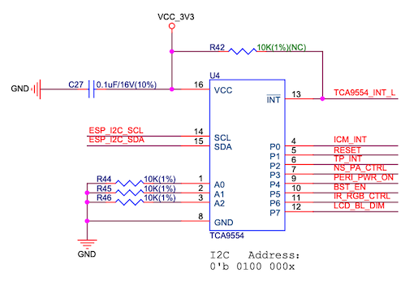

.. _power:

电源
==========

:link_to_translation:`en: [English]`

为了降低电源功耗、提高电源效率并支持电池供电，ESP32-S2-HMI-DevKit-1 的电源花分成了 5 V 电源域和 3.3 V 电源域，其中部分电源可以通过软件控制，另一部分在硬件设计时被配置为始终开启。

开发板出厂时烧录的固件已经关闭所有可控电源域的电源，并将所有 IC 配置为低功耗模式，以降低电流消耗。

.. _v-电源域-2:

3.3 V 电源域
----------------

该电源域负责为绝大部分的 IC 和模组供电，但其分为两部分：不可控 3.3 V 电源域和可控 3.3 V 电源域。

不可控 3.3 V 电源域无法通过软件关闭，该电源由 Buck 电路得到。在 USB 有电源输入的情况下，将从 USB 线缆输入的 5 V 电源取电；在 USB 断开的情况下，则由锂电池提供 3.6 ~ 4.2 V 的电源。该电源域负责为 ESP32-S2-WROVER 模组以及其他可通过软件控制进入低功耗模式的器件供电。

可控 3.3 V 电源域来自于不可控 3.3 V 电源域，通过 PMOS 控制开关，该 PMOS 栅极连接至 IO 扩展器的 P4 脚，低电平开启该电源。该电源负责为一些具有较大静态功耗且无法进入低功耗模式的 IC 进行供电。

   ESP32-S2-HMI-DevKit-1 IO 扩展器原理图

.. _v-电源域-1:

5 V 电源域
---------------

开发板的 5 V 电源域负责为音频功放和 TWAI® 收发器供电。其来源有以下几种方式：

-  USB 接口
-  外部输入至连接器的 5 V 电源口
-  锂电池经过 Booster 电路后的电源

通过 USB 和外部 5 V 输入的电源会为所有需要 5 V 供电的器件（除 CP2102N）进行供电，且无法通过软件断开。通过电池供电时，则可以通过 IO 扩展器的 P5 引脚来控制 Booster IC 的 EN 脚电平，通过高电平开启 5 V 电源。

通过开发板底部 USB 接口输入的电源将分为两路，一路负责为 CP2102N 供电，另一路在经过二极管后成为 USB_5V。由于 CP2102N 只在连接 PC 时才需进入工作状态，因此只有在该 USB 口连接后，CP2102N 才会上电。任何 5 V 的电源输入都会关闭 Booster IC，并经由充电 IC 为板载锂离子电池进行充电。

电源依赖情况
----------------

以下功能依赖 5 V 电源域：

-  TWAI®（从 USB 5 V 或 Booster 5 V 自动选择可用电源）
-  音频功放（从 USB 5 V 获取，若失败，尝试从电池获取）
-  5 V 电源输出连接器（同 TWAI®)

以下功能依赖可控 3.3 V 电源域：

-  Micro-SD 卡
-  麦克风及其偏置电路、运算放大器
-  显示屏与触摸功能
-  WS2812 RGB LED 与 IR LED
-  IR LED

电源工作状态
----------------

当通过 USB 线缆连接开发板时，5 V 电源域自动开启，充电 IC 输出电压为电池充电，可控 3.3 V 电源域由 IO 扩展器的 P4 脚进行控制。

当使用电池为开发板进行供电时，可控 3.3 V 电源域由 IO 扩展器的 P4 脚进行控制，5 V 电源域由 IO 扩展器的 P5 脚控制，充电 IC 不会工作。
