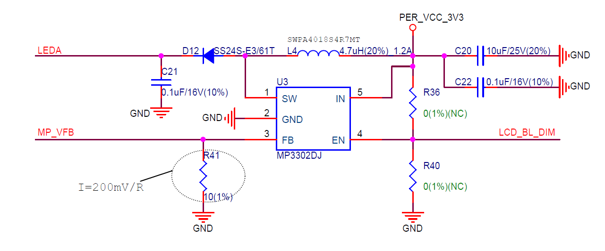
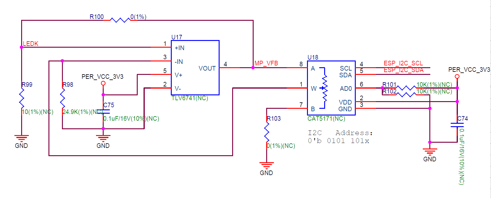

显示屏与触摸面板
=================

:link_to_translation:`en: [English]`

ESP32-S2-HMI-DevKit-1 配备了一块分辨率为 800×480 的 4.3 英寸彩色液晶显示屏，并附带有 I2C 接口的触摸面板。该屏幕的接口类型与数据位宽由可编程引脚控制。该开发板已通过电阻配置为 16 位的 8080 并口通讯。

该 LCD 使用的显示 IC 为 RM68120，触控 IC 为 FT5436。

通讯
--------

ESP32-S2-HMI-DevKit-1 所用 LCD 的显示 IC 已配置为使用 16 位的 8080 接口进行通讯，共使用 18 个 GPIO 接口，包括 16 位数据线（LCD_D0…LCD_D15)，位时钟信号（LCD_WR）及数据命令区分信号 (LCD_DC/LCD_RS)。

触控 IC 使用 I2C 接口与 MCU 通讯，可与其他 I2C IC 共用，无需额外占用 GPIO 接口。触控 IC 支持中断信号输出。该中断信号将被发送至 IO 扩展器的 P2 引脚，由该引脚产生的下降沿会使 IO 扩展器的中断输出脚产生低电平，从而使 MCU 接收到中断信号。此时，可通过读取 IO 扩展器的输入电平寄存器判读中断来源，从而确定该中断是否来自触控 IC。完成一次输入电平的读取会自动清除中断标志。

.. figure:: ../../../../_static/esp32-s2-hmi-devkit-1/esp32-s2-hmi-devkit-1-IO-expander.png
   :align: center
   :alt: ESP32-S2-HMI-DevKit-1 IO 扩展器原理图
   :figclass: align-center

   ESP32-S2-HMI-DevKit-1 IO 扩展器原理图

背光
--------

该 LCD 内置了串联型 LED，需要使用 Booster 电路进行恒流驱动。额定电流为 18 mA，此时电压约为 24 V（可能有误差，仅供参考）。为了防止屏幕未连接时 Booster 电路的反馈电压始终为 0，从而导致高压加载到背光滤波电容 C21 的两端，请确保该电容的耐压在 38 V 以上。

   ESP32-S2-HMI-DevKit-1 PWM 调光电路原理图（点击放大）

由于 PWM 调光可能会带来闪烁，且部分 Booster IC 不支持高频 PWM 信号控制，该开发板提供了 DC 调光电路以解决上述问题，如下图所示：

   ESP32-S2-HMI-DevKit-1 DC 调光电路原理图（点击放大）

该 DC 调光电路将 VFB 电压输入到运算放大器 TLV6741，其增益电阻为数字电位器，可以通过 I2C 总线修改其阻值以达到修改增益大小的目的。使用的数字电位器为 CAT5171，具有 256 级分辨率，最大电阻值为 50 kOhm。

Booster IC 的 EN 脚由 IO 扩展器的 P7 脚控制，高电平有效。如需在关闭屏幕的同时保留显存的内容，可以将该引脚设置为低电平来关闭屏幕背光。

触摸
--------

开发板搭载的电容式触摸面板使用的触控 IC 分辨率为 800×480，支持最多 5 点触摸和硬件手势识别。

该显示 IC 不支持硬件坐标方向转换，因此，对于显示时使用不同的旋转方向，可能需要软件对触摸 IC 读取到的数据做交换或求其相对于分辨率的差值。多点触摸属于硬件支持，在驱动中，我们也提供了读取多个触摸点的 API 供您使用该功能，但是使用的 GUI 库 LVGL 暂时不支持多点触控的处理，您可能需要在应用层自行处理这些触摸点的数据。
