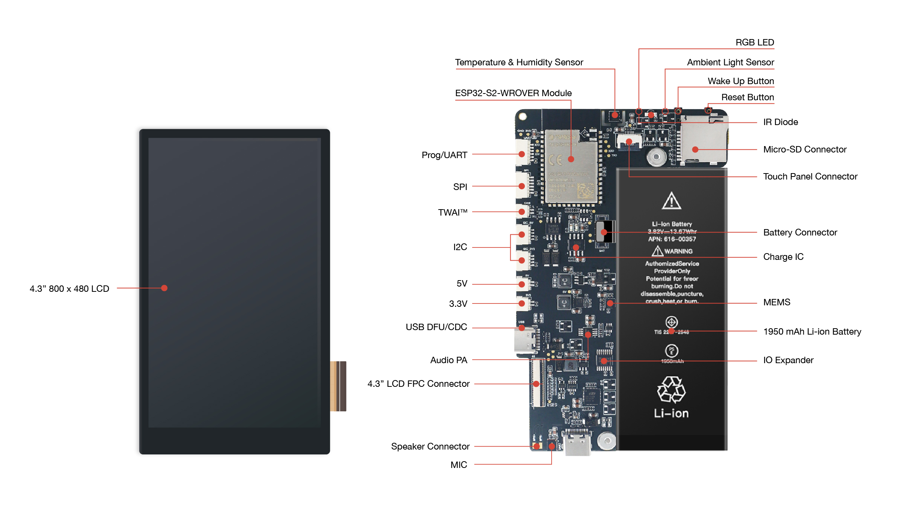
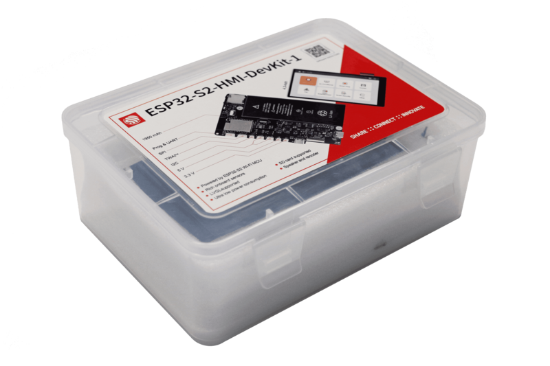
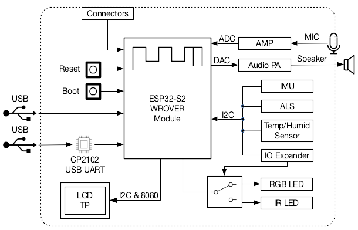
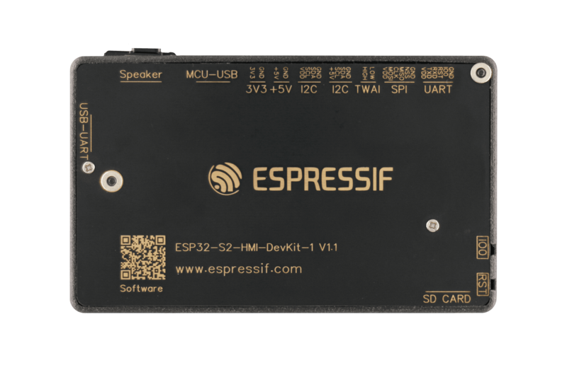

===========================
ESP32-S2-HMI-DevKit-1 V1.0
===========================

:link_to_translation:`en: [English]`

本指南将帮助您快速上手 ESP32-S2-HMI-DevKit-1，并提供该款开发板的详细信息。

ESP32-S2-HMI-DevKit-1 面向 GUI 应用场景设计，可实现智能家居交互面板，带显示屏的音箱、闹钟等人机交互界面的智能控制。该开发板具有丰富的板载传感器和拓展接口，方便用户快速进行二次开发，实现多样的功能。

该开发板的主要功能如下：

- **内置模组：** ESP32-S2-WROVER 模组，内置 4 MB flash 和 2 MB PSRAM
- **显示：** 使用 16 位 8080 并口的 4.3 寸 TFT-LCD，分辨率为 480×800，配有 256 级硬件 DC 背光调节电路，并配备电容式触摸面板，使用 I2C 接口进行通讯
- **音频：** 音频放大器、板载模拟麦克风、扬声器接口
- **存储：** microSD 卡接口
- **传感器：** 三轴加速计和三轴陀螺仪的惯性传感器、环境光传感器、温湿度传感器
- **扩展：** SPI 接口、TWAI（兼容 CAN 2.0）接口、I2C接口、UART/Prog 接口
- **LED：** 可编程 RGB LED 和 IR LED
- **按键：** Wake Up 键和 Reset 键
- **USB：** 1 x USB-C OTG (DFU/CDC) 接口、1 x USB-C 调试接口
- **电源：** 5 V 和 3.3 V 电源接口
- **可选电池：** 1950 mAh 单芯锂离子电池，配有充电 IC

.. figure:: ../../../_static/esp32-s2-hmi-devkit-1/esp32-s2-hmi-devkit-1-3d-v1.0.png
    :align: center
    :alt: ESP32-S2-HMI-DevKit-1（板载 ESP32-S2-WROVER 模组）
    :figclass: align-center

    ESP32-S2-HMI-DevKit-1（板载 ESP32-S2-WROVER 模组）
    

本指南包括如下内容：

- `入门指南`_：简要介绍了开发板和硬件、软件设置指南。
- `硬件参考`_：详细介绍了开发板的硬件。
- `相关文档`_：列出了相关文档的链接。

入门指南
========

本小节将简要介绍 ESP32-S2-HMI-DevKit-1，说明如何在 ESP32-S2-HMI-DevKit-1 上烧录固件及相关准备工作。

组件介绍
--------

该开发板是基于 ESP32-S2 的 HMI 开发板，其板载资源如下图所示。

.. _board-func:

   ESP32-S2-HMI-DevKit-1（点击放大）

以下按照顺时针的顺序依次介绍开发板上的主要组件（开发板接口将在 :ref:`connectors` 小节单独介绍）。

.. list-table::
   :widths: 30 70
   :header-rows: 1

   * - 主要组件
     - 介绍
   * - ESP32-S2-WROVER 模组
     - ESP32-S2-WROVER 集成 ESP32-S2，是通用型 Wi-Fi MCU 模组，功能强大。该模组采用 PCB 板载天线，配置了 4 MB SPI flash 和 2 MB SPI PSRAM。
   * - 温湿度传感器
     - 温湿度传感器，用于检测环境温度与湿度，通过 I2C 总线读取。
   * - RGB LED
     - 可寻址 RGB 发光二极管 (WS2812)，由 GPIO21 驱动。需要通过 IO 扩展器在 RGB LED 与 IR LED 间切换。
   * - 环境光传感器
     - 环境光传感器，用于检测环境光强度，通过 I2C 总线读取。
   * - Wake Up Button (下载键)
     - 下载按键。按住 **Boot** 键的同时按一下 **Reset** 键进入“固件下载”模式，通过串口下载固件。该按键同时也可被配置用于从 Deep Sleep 模式唤醒设备。
   * - Reset Button（Reset 键）
     - 复位按键。
   * - IR LED
     - 红外发射二极管，由 GPIO21 驱动。需要通过 IO 扩展器在 RGB LED 与 IR LED 间切换。
   * - 电源 IC
     - 用于为电池充电。
   * - MEMS
     - 3 轴加速计和 3 轴陀螺仪。
   * - 1950 mAh 锂电池
     - 可选 1,950 mAh 可充电锂电池。
   * - IO 扩展器（IO 扩展器）
     - 通过 I2C 总线扩展 GPIO。
   * - MIC
     - 板载模拟麦克风。
   * - 音频 PA
     - 音频放大器。
   * - 4.3" 800 × 480 LCD
     - 使用 16 位 8080 并口的 4.3 寸 TFT-LCD，分辨率为 480×800，配有 256 级硬件 DC 背光调节电路，并与一个 I2C 电容式触摸板相连。

开始开发应用
-------------

通电前，请确保开发板完好无损。

必备硬件
^^^^^^^^

-  1 x 装有 Windows、macOS 或 Linux 系统的 PC（推荐使用 Linux 操作系统）
-  1 x ESP32-S2-HMI-DevKit-1
-  1 x USB-C 数据线（如果想同时评估 MCU 的 USB 功能，推荐准备 2 根 USB-C 数据线）
-  1 x 扬声器 (8 Ohm, 2 W)
-  1 x microSD 卡（部分示例可能需要大容量存储）

.. 注解::

  请确保使用适当的 USB 数据线。部分数据线仅可用于充电，无法用于数据传输和编程。

硬件设置
^^^^^^^^

为了方便您对所有例程进行快速评估，请按照以下步骤设置开发板：

1. 将 microSD 卡插入卡槽。请确保您的重要资料已经备份，若分区不为 FAT 格式，该 microSD 可能会被格式化。
2. 如果需要评估音频播放功能，请将开发板下方 USB 口附近的扬声器焊盘连接至附赠的扬声器，或者连接至其它相近规格的扬声器 (8 Ohm, 2 W)。

软件设置
^^^^^^^^

首先，请确保您已经正确完成 IDF 环境配置。为确保这一点，请在终端中输入 ``idf.py --version``，如果输出结果类似于 ``ESP-IDF v4.2-dev-2084-g98d5b5dfd``，则代表安装成功。详细的安装和配置说明请参考 `快速入门文档 <https://docs.espressif.com/projects/esp-idf/zh_CN/latest/esp32s2/get-started/index.html>`_。

配置完成后，请切换到仓库所在的目录。所有的示例代码都被放置在 examples 目录下。您可以运行 ``idf.py build`` 对工程进行编译。

工程选项
^^^^^^^^

我们为 ESP32-S2-HMI-DevKit-1 开发板提供了丰富示例，如下所示：

- 在屏幕上打印 "Hello world!"：:dev-kits:`esp32-s2-hmi-devkit-1/examples/get-started/hello_world`
- 使 WS2812 LED 灯闪烁并在屏幕上显示颜色：:dev-kits:`esp32-s2-hmi-devkit-1/examples/get-started/led_blink`
- 启动交互界面以配置 Wi-Fi 凭证： :dev-kits:`esp32-s2-hmi-devkit-1/examples/get-started/provision`
- 利用 ADC 从模拟 MIC 获取音频：:dev-kits:`esp32-s2-hmi-devkit-1/examples/audio/audio_record`
- 播放音乐：:dev-kits:`esp32-s2-hmi-devkit-1/examples/audio/music_player`
- 使特定区域进入 Deep-sleep 模式：:dev-kits:`esp32-s2-hmi-devkit-1/examples/examples/power`
- 使用 Freetype 渲染字体：:dev-kits:`esp32-s2-hmi-devkit-1/examples/freetype`
- 使用板载传感器：:dev-kits:`esp32-s2-hmi-devkit-1/examples/sensors`
- 使用智慧触摸板：:dev-kits:`esp32-s2-hmi-devkit-1/examples/smart-panel`
- 查看 SD 卡上的文件：:dev-kits:`esp32-s2-hmi-devkit-1/examples/storage/sdcard_fatfs`
- USB flash disk：:dev-kits:`esp32-s2-hmi-devkit-1/examples/storage/usb_msc`

您可以在各示例目录下，输入 ``idf.py menuconfig`` 配置工程选项。

在 menuconfig 中，请确保正确配置以下选项：

-  ``(Top) > HMI Board Config > HMI board``：开发板版本选择，默认请选择 ``ESP32-S2-HMI-DevKit-V2``；
-  ``(Top) > HMI Board Config > Audio HAL``：音频输出接口选择，使用 PWM 或 DAC；
-  ``(Top) > HMI Board Config > LCD Drivers``：LCD 显示 IC 型号选择，ESP32-S2-HMI-DevKit-1 使用的显示 IC 为 RM68120；
-  ``(Top) > Component config > ESP32S2-specific`` 中，请进入 ``Support for external, SPI-connected RAM`` 选项：

   -  在 ``SPI RAM config > Set RAM clock speed`` 中，将 PSRAM 的时钟设置为 ``80 MHz clock speed``；

-  ``(Top) -> Component config -> FreeRTOS``：``Tick rate (Hz)`` 设置为 1000。

在每个示例下，我们都提供了名为 ``sdkconfig.defaults`` 的默认配置文件，已将上述选项配置完成。

ESP-IDF 版本依赖
^^^^^^^^^^^^^^^^

``esp32-s2-hmi-devkit-1/examples/storage/usb_msc`` 需要在 IDF v4.3 下进行编译，其它示例程序可以在 IDF v4.2 及以后版本进行编译。

内含组件和包装
---------------

零售订单
^^^^^^^^

每一个零售 ESP32-S2-HMI-DevKit-1 开发套件均有独立包装。

   ESP32-S2-HMI-DevKit-1 包装

内含以下部分：

- 开发板
  - ESP32-S2-HMI-Devit-1
- 线缆
  - SH1.25 至 2.54mm 连接线 x 7

零售订单请前往 https://www.espressif.com/zh-hans/company/contact/buy-a-sample。

批量订单
^^^^^^^^

如批量购买，开发板将以大纸板箱包装。

批量订单请前往 https://www.espressif.com/zh-hans/contact-us/sales-questions。

硬件参考
========

功能框图
--------

ESP32-S2-HMI-DevKit-1 的主要组件和连接方式如下图所示。

    ESP32-S2-HMI-DevKit-1 功能框图

电源选项
--------

为了降低电源功耗、提高电源效率并支持电池供电，ESP32-S2-HMI-DevKit-1 的电源花分成了 5 V 电源域和 3.3 V 电源域，其中部分电源可以通过软件控制，另一部分在硬件设计中始终开启。

开发板出厂时烧录的固件已经关闭所有可控电源域的电源，并将所有 IC 配置为低功耗模式，以降低电流消耗。

更多信息请参阅 :ref:`power`。

.. _connectors:

接口
--------

该开发板提供了多个扩展接口方便用户进行二次开发，以下按照顺时针顺序依次介绍开发板上的接口，请参考 :ref:`ESP32-S2-HMI-DevKit-1 板载资源 <board-func>`。

.. list-table::
   :widths: 30 70
   :header-rows: 1

   * - 连接器
     - 介绍
   * - 扬声器接口
     - 用于连接扬声器。
   * - 4.3" LCD FPC 连接器
     - （保留）可使用 FPC 线连接配套的 4.3” LCD 扩展板。
   * - USB DFU/CDC
     - 1 个 USB-C OTG (DFU/CDC) 端口，1 个 USB-C 调试端口。
   * - 3.3 V
     - 3.3 V 电源接口。
   * - 5 V
     - 5 V 电源接口。
   * - I2C
     - 带 5 V/3.3 V 电源的 I2C 连接器。
   * - TWAI（兼容 CAN 2.0）接口
     - 使用双线车载串口 (Two-wire Automotive Interface, TWAI®) 协议的连接器。
   * - SPI
     - 在不使用 SD 卡时可以使用该连接器连接 SPI 总线的设备。
   * - Prog/UART
     - 可以通过该串口接口观察日志输出与固件烧录。   
   * - microSD 连接器
     - 可以插入 microSD 卡以扩展设备存储空间。
   * - 电源端口
     - 用于连接电池。

下图展示了该开发板的背面，供您参考。

   ESP32-S2-HMI-DevKit-1 背面

相关文档
========

- `ESP32-S2 技术规格书 <https://www.espressif.com/sites/default/files/documentation/esp32-s2-wrover_esp32-s2-wrover-i_datasheet_cn.pdf>`_ (PDF)
- `ESP32-S2-WROVER 技术规格书 <https://www.espressif.com/sites/default/files/documentation/esp32-s2-wrover_esp32-s2-wrover-i_datasheet_cn.pdf>`_ (PDF)
- `ESP32-S2-HMI-DevKit-1 原理图 <../../_static/schematics/esp32-s2-hmi-devkit-1/SCH_ESP32-S2-HMI-DEVKIT-1_V1_1_20210526A.pdf>`_ (PDF)
- `ESP32-S2-HMI-DevKit-1 PCB 布局图 <../../_static/schematics/esp32-s2-hmi-devkit-1/Assemble_ESP32-S2-HMI-DevKit-1_V1.1_20210203.pdf>`_ (PDF)
- `ESP32-S2-HMI-DevKit-1 尺寸图 <../../_static/schematics/esp32-s2-hmi-devkit-1/PCB_ESP32-S2-HMI-DevKit-1_V1.1_20210202-2045.pdf>`_ (PDF)
- `ESP32-S2-HMI-DevKit-1 尺寸图源文件 <../../_static/schematics/esp32-s2-hmi-devkit-1/PCB_ESP32-S2-HMI-DevKit-1_V1.1_20210202-2045.dxf>`_ (DXF) - 可使用 `Autodesk Viewer <https://viewer.autodesk.com/>`_ 查看

有关本开发板的更多设计文档，请联系我们的商务部门 `sales@espressif.com <sales@espressif.com>`_。