==========================
ESP32-S3-LCD-EV-Board v1.5
==========================

:link_to_translation:`en: [English]`

.. note::

  请查看主板 ESP32-S3-LCD-EV-Board-MB 背面的丝印版本号，以确认您的开发板版本。对于 v1.5 版本的开发板，请参考当前用户指南；对于 v1.4 及以下版本的开发板，请参考 :doc:`user_guide_v1.4`。

  除非另有说明，本文中的 ESP32-S3-LCD-EV-Board 同时指 **ESP32-S3-LCD-EV-Board** 和 **ESP32-S3-LCD-EV-Board-2** 两款开发板。

本指南将帮助您快速上手 ESP32-S3-LCD-EV-Board，并提供该款开发板的详细信息。

本指南包括如下内容：

- `开发板概述`_：简要介绍了开发板的软件和硬件。
- `应用程序开发`_：介绍了应用程序开发过程中的软硬件设置。
- `硬件参考`_：详细介绍了开发板的硬件。
- `硬件版本`_：暂无历史版本。
- `样品获取`_：如何获取样品。
- `相关文档`_：列出了相关文档的链接。

开发板概述
===================

ESP32-S3-LCD-EV-Board 是一款基于 ESP32-S3 芯片的屏幕交互开发板，通过搭配不同类型的 LCD 子板，可以驱动 IIC、SPI、8080 以及 RGB 接口的 LCD 显示屏。同时它还搭载双麦克风阵列，支持语音识别和近/远场语音唤醒，具有触摸屏交互和语音交互功能，满足用户对多种不同分辨率以及接口的触摸屏应用产品的开发需求。

目前支持两款开发板：

- 搭配 480x480 LCD 的 ESP32-S3-LCD-EV-Board
- 搭配 800x480 LCD 的 ESP32-S3-LCD-EV-Board-2

.. figure:: ../../../_static/esp32-s3-lcd-ev-board/ESP32-S3-LCD-EV-Board_480x480.png
    :align: center
    :scale: 50%
    :alt: 搭配 480x480 LCD 的 ESP32-S3-LCD-EV-Board

    搭配 480x480 LCD 的 ESP32-S3-LCD-EV-Board

.. figure:: ../../../_static/esp32-s3-lcd-ev-board/ESP32-S3-LCD-EV-Board_800x480.png
    :align: center
    :scale: 45%
    :alt: 搭配 800x480 LCD 的 ESP32-S3-LCD-EV-Board-2

    搭配 800x480 LCD 的 ESP32-S3-LCD-EV-Board-2

特性列表
----------------

该开发板具有以下特性：

-  **嵌入式模组：** 板载 ESP32-S3-WROOM-1 模组，内置 16 MB flash 以及 16 MB PSRAM
-  **屏幕：** 可搭配不同屏幕子板使用，支持 ``RGB``、``8080``、``SPI`` 以及 ``I2C`` 接口屏幕，请查看 `LCD 子板`_ 了解更多信息
-  **音频：** 板载音频 Codec + ADC 功放，支持双麦克风拾音
-  **USB：** 板载 USB 转串口芯片，并且支持 USB Type-C 接口下载调试

功能框图
-------------

ESP32-S3-LCD-EV-Board 的主要组件和连接方式如下图所示。

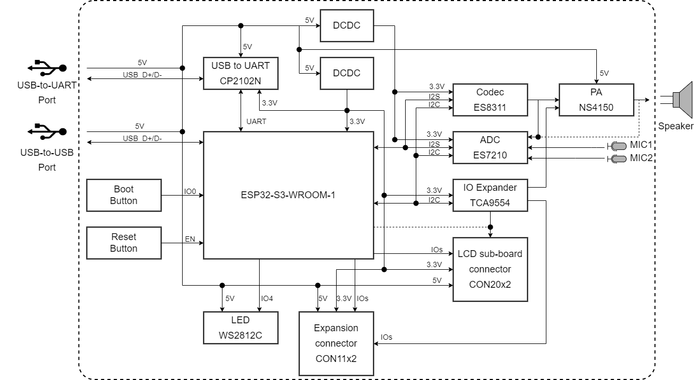

    ESP32-S3-LCD-EV-Board 功能框图（点击放大）

组件介绍
-----------

ESP32-S3-LCD-EV-Board 开发板由主板和子板（子板类型请查看 `LCD 子板`_）组成，此外还可以选配一块 USB Type-A 转接板。

主板
^^^^^^

**ESP32-S3-LCD-EV-Board-MB** 主板是整个套件的核心，该主板集成了 ESP32-S3-WROOM-1 模组，并提供与 LCD 子板连接的端口。

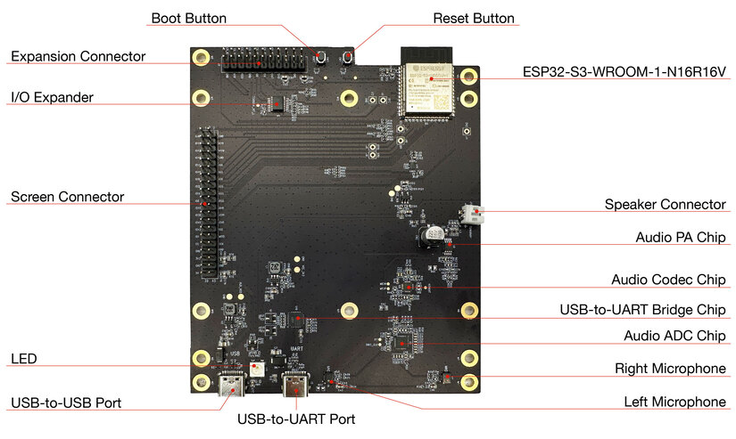

    ESP32-S3-LCD-EV-Board-MB - 正面（点击放大）

以下按照逆时针顺序依次介绍开发板上的主要组件。

.. list-table::
   :widths: 30 70
   :header-rows: 1

   * - 主要组件
     - 介绍
   * - ESP32-S3-WROOM-1-N16R16V 模组
     - ESP32-S3-WROOM-1-N16R16V 模组是一款通用型 Wi-Fi + 低功耗蓝牙 MCU 模组，搭载 ESP32-S3 系列芯片，内置 16 MB flash 以及 16 MB PSRAM。除具有丰富的外设接口外，模组还拥有强大的神经网络运算能力和信号处理能力，适用于 AIoT 领域的多种应用场景。
   * - Reset 按键
     - 单独按下此按键会重置系统。
   * - Boot 按键
     - 长按 Boot 键时，再按 Reset 键可启动固件上传模式，然后便可通过串口或 USB 上传固件。
   * - 扩展连接器
     - 可供连接所有的 IO 扩展芯片管脚、系统电源管脚以及部分模组管脚。
   * - I/O 扩展芯片
     - `TCA9554 <https://www.ti.com/lit/gpn/tca9554>`_ 是一款 8 位通用并行输入和输出 I/O 扩展芯片，它通过两线 I2C 通信控制 IO 口的模式以及输出电平，丰富了系统的 IO 应用场景。
   * - LCD 子板连接器
     - 通过 2.54 mm 间距的连接器可以连接三种不同类型的 LCD 子板。
   * - LED
     - 具有 RGB 三色显示功能，可供用户配置用来做状态行为指示。
   * - USB-to-USB 端口
     - 为整个系统提供电源（USB-to-USB 端口和 USB-to-UART 端口两者选一）。建议使用至少 5V/2A 电源适配器供电，保证供电稳定。该端口用于 PC 端与 ESP32-S3-WROOM-1 模组的 USB 通信。
   * - USB-to-UART 端口
     - 为整个系统提供电源（USB-to-USB 端口和 USB-to-UART 端口两者选一）。建议使用至少 5V/2A 电源适配器供电，保证供电稳定。该端口用于 PC 端与 ESP32-S3-WROOM-1 模组的串口通信。
   * - 左侧麦克风
     - 板载麦克风，连接至音频模数转换器。
   * - 右侧麦克风
     - 板载麦克风，连接至音频模数转换器。
   * - 音频模数转换器
     - `ES7210 <http://www.everest-semi.com/pdf/ES7210%20PB.pdf>`_ 是一款用于麦克风阵列应用的高性能、低功耗 4 通道音频模数转换器，同时具备声学回声消除 (AEC) 功能，非常适合音乐和语音应用。
   * - USB-to-UART 桥接器
     - 单芯片 USB-UART 桥接器 CP2102N 为软件下载和调试提供高达 3 Mbps 的传输速率。
   * - 音频编解码芯片
     - `ES8311 <http://www.everest-semi.com/pdf/ES8311%20PB.pdf>`_ 是一种低功耗单声道音频编解码器，包含单通道 ADC、单通道 DAC、低噪声前置放大器、耳机驱动器、数字音效、模拟混音和增益功能。它通过 I2S 和 I2C 总线与 ESP32-S3-WROOM-1 模组连接，以提供独立于音频应用程序的硬件音频处理。
   * - 音频功率放大器
     - NS4150 是一款低 EMI、3 W 单声道 D 类音频功率放大器，用于放大来自音频编解码芯片的音频信号，以驱动扬声器。
   * - 扬声器连接器
     - 可通过音频功率放大器的支持，实现外部扬声器播放功能。

LCD 子板
^^^^^^^^

主板可搭配以下三种不同类型的子板使用：

.. list-table::
   :widths: 30 15 15 15 15 30
   :header-rows: 1

   * - 子板名称
     - 屏幕（英寸）
     - 分辨率 (px)
     - LCD 驱动芯片（接口）
     - 触摸驱动芯片
     - 在售开发板
   * - ESP32-S3-LCD-EV-Board-SUB1 v1.0
     - 0.96
     - 128 x 64
     - `SSD1315 <../../_static/esp32-s3-lcd-ev-board/datasheets/0.96_128x64/SSD1315.pdf>`_ (I2C)
     - N/A
     - 无
   * -
     - 2.40
     - 320 x 240
     - `ST7789V <../../_static/esp32-s3-lcd-ev-board/datasheets/2.4_320x240/ST7789V_SPEC_V1.0.pdf>`_ (SPI)
     - `XTP2046 <../../_static/esp32-s3-lcd-ev-board/datasheets/2.4_320x240/XPT2046_user_manual.pdf>`_
     - 无
   * - ESP32-S3-LCD-EV-Board-SUB2 v1.5
     - 3.50
     - 480 x 320
     - `ST7796S <../../_static/esp32-s3-lcd-ev-board/datasheets/3.5_320x480/ST7796S_SPEC_V1.0.pdf>`_ (8080)
     - `GT911 <../../_static/esp32-s3-lcd-ev-board/datasheets/3.5_320x480/GT911_Datasheet_20130319.pdf>`_
     - 无
   * -
     - 3.95
     - 480 x 480
     - `GC9503CV <../../_static/esp32-s3-lcd-ev-board/datasheets/3.95_480x480_SmartDisplay/GC9503NP_DataSheet_V1.7.pdf>`_ (RGB)
     - `FT5x06 <https://www.displayfuture.com/Display/datasheet/controller/FT5x06.pdf>`_
     - `ESP32-S3-LCD-EV-Board <https://item.taobao.com/item.htm?spm=a1z10.5-c.w4002-8715811636.23.4bc567d8eBiLiI&id=680580609719>`_
   * - ESP32-S3-LCD-EV-Board-SUB3 v1.3
     - 4.30
     - 800 x 480
     - `ST7262E43 <../../_static/esp32-s3-lcd-ev-board/datasheets/4.3_800x480/ST7262E43_V0.1_201905.pdf>`_ (RGB)
     - `GT1151 <../../_static/esp32-s3-lcd-ev-board/datasheets/4.3_800x480/GT911.pdf>`_
     - `ESP32-S3-LCD-EV-Board-2 <https://item.taobao.com/item.htm?spm=a1z10.5-c.w4002-8715811636.23.4bc567d8eBiLiI&id=680580609719>`_

- **ESP32-S3-LCD-EV-Board-SUB1** 子板提供了两种屏幕接口，分别支持连接一块 2.4 英寸 SPI 接口屏或者一块 0.96 英寸 I2C 接口屏。该子板暂未做适配，此处不做进一步讲解。

- **ESP32-S3-LCD-EV-Board-SUB2** 子板提供了两种屏幕接口，分别支持连接一块 RGB 接口屏或者一块 8080 并口屏。当前子板贴装了一块 3.95 英寸、RGB565 接口、分辨率为 480x480 的触摸屏，该屏使用的 LCD 驱动芯片型号为 GC9503CV，触摸驱动芯片型号为 FT5x06。

.. figure:: ../../../_static/esp32-s3-lcd-ev-board/esp32-s3-lcd-ev-board-sub2-front.png
    :align: center
    :scale: 50%
    :alt: ESP32-S3-LCD-EV-Board-SUB2 - 正面（点击放大）

    ESP32-S3-LCD-EV-Board-SUB2 - 正面（点击放大）

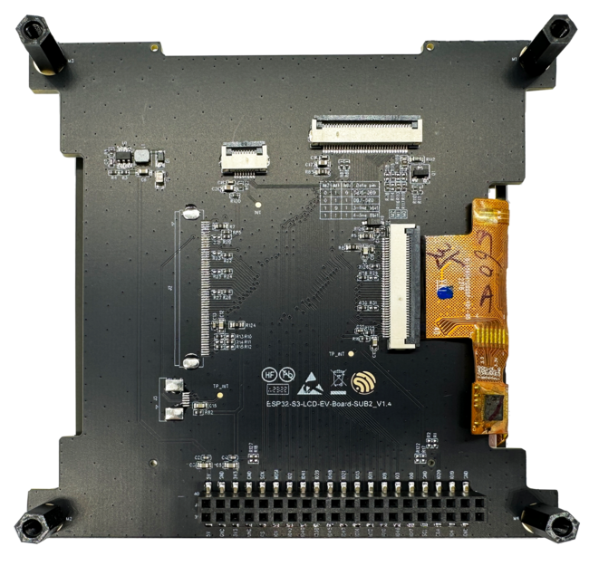

    ESP32-S3-LCD-EV-Board-SUB2 - 反面（点击放大）

- **ESP32-S3-LCD-EV-Board-SUB3** 子板仅支持 4.3 英寸、RGB565 接口、分辨率为 800x480 的触摸屏，该屏使用的 LCD 驱动芯片型号为 ST7262E43，触摸驱动芯片型号为 GT1151。

.. figure:: ../../../_static/esp32-s3-lcd-ev-board/esp32-s3-lcd-ev-board-sub3-front.png
    :align: center
    :scale: 50%
    :alt: ESP32-S3-LCD-EV-Board-SUB3 - 正面（点击放大）

    ESP32-S3-LCD-EV-Board-SUB3 - 正面（点击放大）

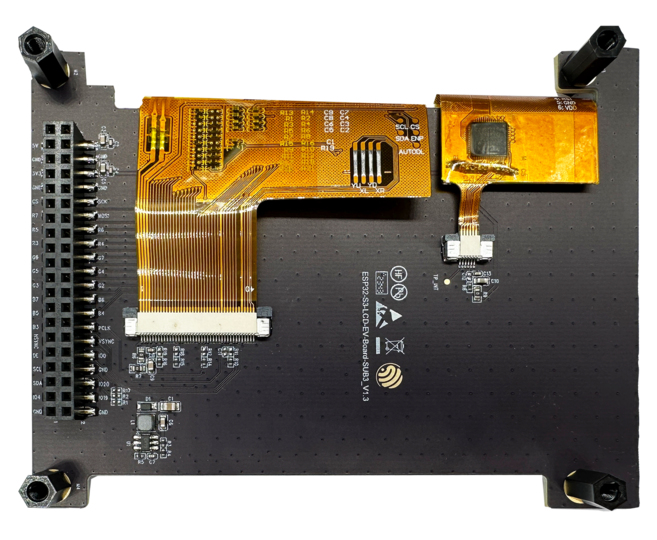

    ESP32-S3-LCD-EV-Board-SUB3 - 反面（点击放大）

USB Type-A 转接板
^^^^^^^^^^^^^^^^^^

通过连接 USB Type-A 转接板，主板可作为 USB Host 连接 USB 设备。

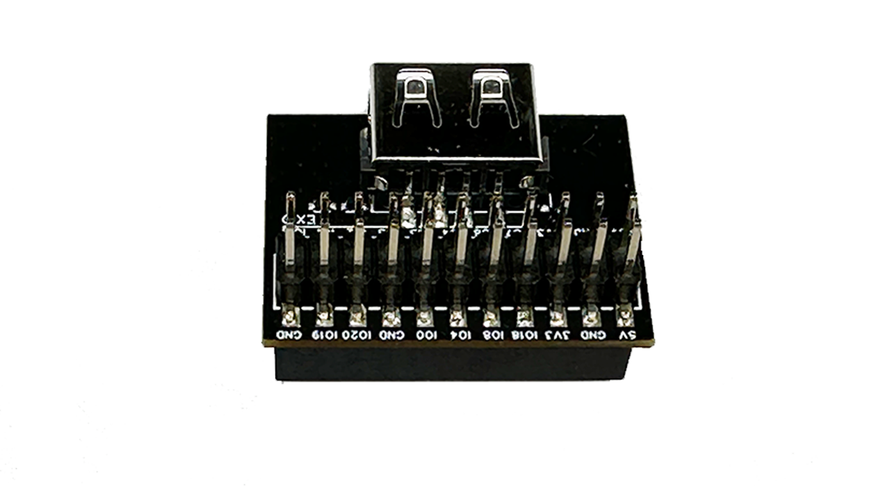

    USB Type-A 转接板 v1.1 - 正面（点击放大）

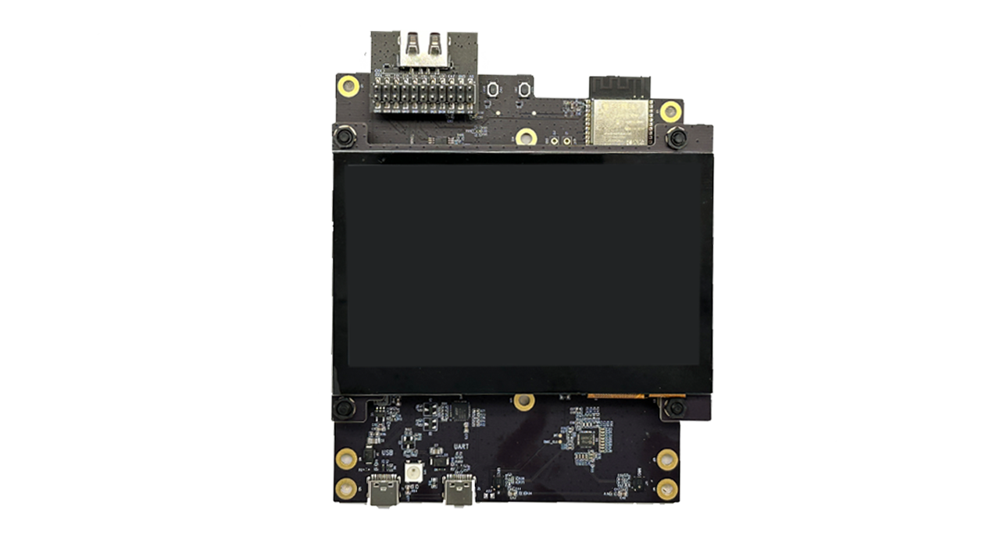

    USB Type-A 转接板 v1.1 - 与主板连接（点击放大）

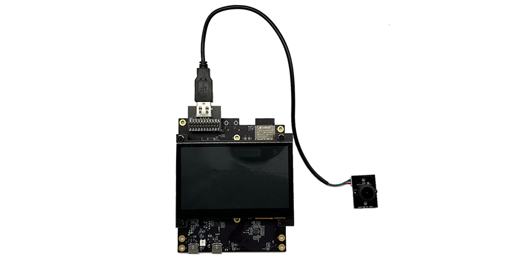

    USB Type-A 转接板 v1.1 - 连接 USB 设备（点击放大）

应用程序开发
======================

本节介绍硬件和软件的设置方法，以及烧录固件至开发板以开发应用程序的说明。

必备硬件
--------

- 1 x ESP32-S3-LCD-EV-Board-MB
- 1 x LCD 子板
- 1 x USB 2.0 数据线（标准 A 型转 Type-C 型）
- 1 x 电脑（Windows、Linux 或 macOS）

.. note::

  请确保使用适当的 USB 数据线。部分数据线仅可用于充电，无法用于数据传输和程序烧录。

可选硬件
^^^^^^^^

- 1 x 扬声器

硬件设置
--------

准备开发板，加载第一个示例应用程序：

1. 连接 LCD 子板至 **LCD 子板连接器** 端口。
2. 插入 USB 数据线，分别连接 PC 与开发板的两个 USB 端口之一。
3. LCD 屏幕亮起，可以用手指与触摸屏进行交互。

硬件设置完成，接下来可以进行软件设置。

软件设置
--------

ESP32-S3-LCD-EV-Board 的开发框架为 `ESP-IDF <https://github.com/espressif/esp-idf>`_。ESP-IDF 是基于 FreeRTOS 的乐鑫 SoC 开发框架，具有众多组件，包括 LCD、ADC、RMT、SPI 等。开发板应用示例存放在 :project:`Examples <esp32-s3-lcd-ev-board/examples>` 中，在示例目录下输入 ``idf.py menuconfig`` 可以配置工程选项。

了解如何快速设置开发环境，请前往 `快速入门 <https://docs.espressif.com/projects/esp-idf/zh_CN/latest/esp32s3/get-started/index.html>`__ > `安装 <https://docs.espressif.com/projects/esp-idf/zh_CN/latest/esp32s3/get-started/index.html#get-started-step-by-step>`__。

.. note::

  - ESP-IDF 的版本要求在 v5.0.1 及以上，推荐使用最新的 release/v5.1 分支开发。
  - 关于如何开发 LCD 应用的更多信息，请参考 `ESP-IoT-Solution 编程指南 <https://docs.espressif.com/projects/esp-iot-solution/zh_CN/latest/display/lcd/index.html>`__。

硬件参考
========

本节提供关于开发板硬件的更多信息。

GPIO 分配列表
-------------

下表为 ESP32-S3-WROOM-1 模组管脚的 GPIO 分配列表，用于控制开发板的特定组件或功能。

.. list-table:: ESP32-S3-WROOM-1 GPIO 分配
   :header-rows: 1
   :widths: 20 20 50

   * - 管脚
     - 管脚名称
     - 功能
   * - 1
     - GND
     - 接地
   * - 2
     - 3V3
     - 供电
   * - 3
     - EN
     - RESET
   * - 4
     - IO4
     - LED
   * - 5
     - IO5
     - I2S_MCLK
   * - 6
     - IO6
     - I2S_CODEC_DSDIN
   * - 7
     - IO7
     - I2S_LRCK
   * - 8
     - IO15
     - I2S_ADC_SDOUT
   * - 9
     - IO16
     - I2S_SCLK
   * - 10
     - IO17
     - LCD_DE
   * - 11
     - IO18
     - LCD_DATA7
   * - 12
     - IO8
     - LCD_DATA6
   * - 13
     - IO19
     - USB_D-
   * - 14
     - IO20
     - USB_D+
   * - 15
     - IO3
     - LCD_VSYNC
   * - 16
     - IO46
     - LCD_HSYNC
   * - 17
     - IO9
     - LCD_PCLK
   * - 18
     - IO10
     - LCD_DATA0
   * - 19
     - IO11
     - LCD_DATA1
   * - 20
     - IO12
     - LCD_DATA2
   * - 21
     - IO13
     - LCD_DATA3
   * - 22
     - IO14
     - LCD_DATA4
   * - 23
     - IO21
     - LCD_DATA5
   * - 24
     - IO47
     - I2C_SDA
   * - 25
     - IO48
     - I2C_SCL
   * - 26
     - IO45
     - LCD_DATA8
   * - 27
     - IO0
     - BOOT
   * - 28
     - IO35
     - 未连接
   * - 29
     - IO36
     - 未连接
   * - 30
     - IO37
     - 未连接
   * - 31
     - IO38
     - LCD_DATA9
   * - 32
     - IO39
     - LCD_DATA10
   * - 33
     - IO40
     - LCD_DATA11
   * - 34
     - IO41
     - LCD_DATA12
   * - 35
     - IO42
     - LCD_DATA13
   * - 36
     - RXD0
     - UART_RXD0
   * - 37
     - TXD0
     - UART_TXD0
   * - 38
     - IO2
     - LCD_DATA14
   * - 39
     - IO1
     - LCD_DATA15
   * - 40
     - GND
     - 接地
   * - 41
     - EPAD
     - 接地

分配给 IO 扩展芯片的 GPIO 被进一步分配为多个 GPIO。

.. list-table:: IO 扩展芯片 GPIO 分配
   :header-rows: 1
   :widths: 20 20 30

   * - IO 扩展器管脚
     - 管脚名称
     - 功能
   * - 1
     - A0
     - 接地
   * - 2
     - A1
     - 接地
   * - 3
     - A2
     - 接地
   * - 4
     - P0
     - PA_CTRL
   * - 5
     - P1
     - LCD_SPI_CS
   * - 6
     - P2
     - LCD_SPI_SCK
   * - 7
     - P3
     - LCD_SPI_MOSI
   * - 8
     - GND
     - 接地
   * - 9
     - P4
     - 可做任意用途
   * - 10
     - P5
     - 可做任意用途
   * - 11
     - P6
     - 可做任意用途
   * - 12
     - P7
     - 可做任意用途
   * - 13
     - INT
     - 未连接
   * - 14
     - SCL
     - I2C_SCL
   * - 15
     - SDA
     - I2C_SDA
   * - 16
     - VCC
     - 供电电压

供电说明
--------

USB 供电
^^^^^^^^

开发板有两种 USB 供电方式：

- 通过 ``USB-to-USB`` 端口供电

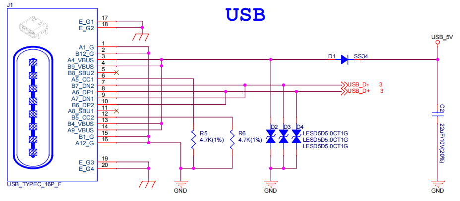

    ESP32-S3-LCD-EV-Board - USB-to-USB 电源供电

- 通过 ``USB-to-UART`` 端口供电

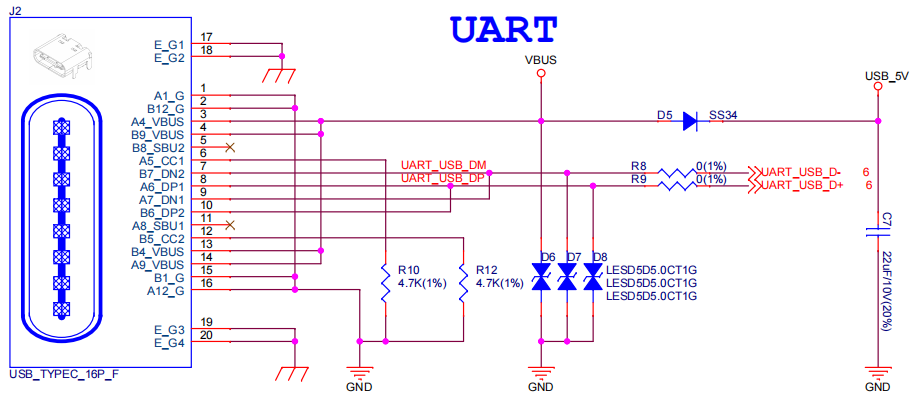

    ESP32-S3-LCD-EV-Board - USB-to-UART 电源供电

音频和数字独立供电
^^^^^^^^^^^^^^^^^^

ESP32-S3-LCD-EV-Board 可为音频组件和 ESP 模组提供相互独立的电源，可降低数字组件给音频信号带来的噪声并提高组件的整体性能。

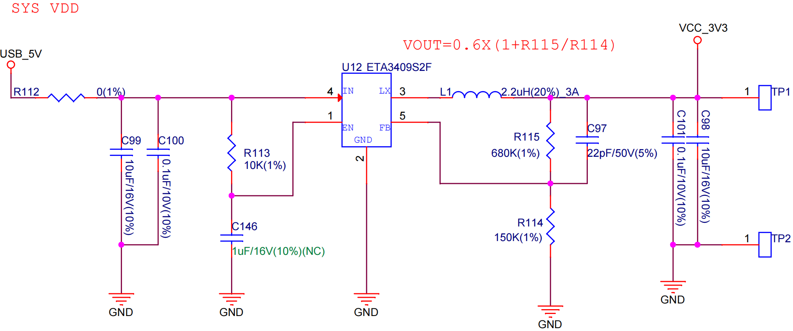

    ESP32-S3-LCD-EV-Board - 数字供电

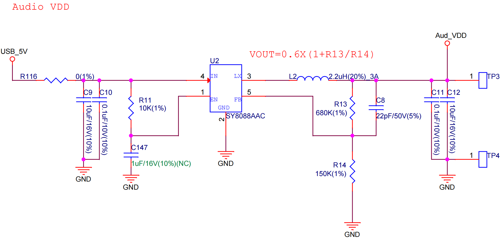

    ESP32-S3-LCD-EV-Board - 音频供电

AEC 电路
--------

AEC 电路为 AEC 算法提供参考信号。

ESP32-S3-LCD-EV-Board 回声参考信号源有两路兼容设计，一路是 Codec (ES8311) DAC 输出 (DAC_AOUTLN/DAC_AOUTLP)，一路是 PA (NS4150) 输出 (PA_OUTL+/PA_OUTL-)。推荐将默认 Codec (ES8311) DAC 输出 (DAC_AOUTLN/DAC_AOUTLP) 作为回声参考信号，下图中电阻 R54、R56 无需连接。

回声参考信号通过 ADC (ES7210) 的 ADC_MIC3P/ADC_MIC3N 采集后送回给 ESP32-S3 用于 AEC 算法。

.. figure:: ../../../_static/esp32-s3-lcd-ev-board/esp32-s3-lcd-ev-board-aec-codec.png
    :align: center
    :scale: 50%
    :alt: ESP32-S3-LCD-EV-Board - AEC Codec DAC 输出（点击放大）

    ESP32-S3-LCD-EV-Board - AEC Codec DAC 输出（点击放大）

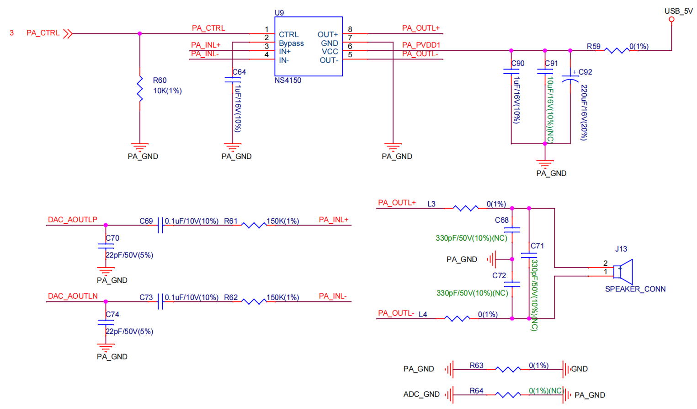

    ESP32-S3-LCD-EV-Board - AEC PA 输出（点击放大）

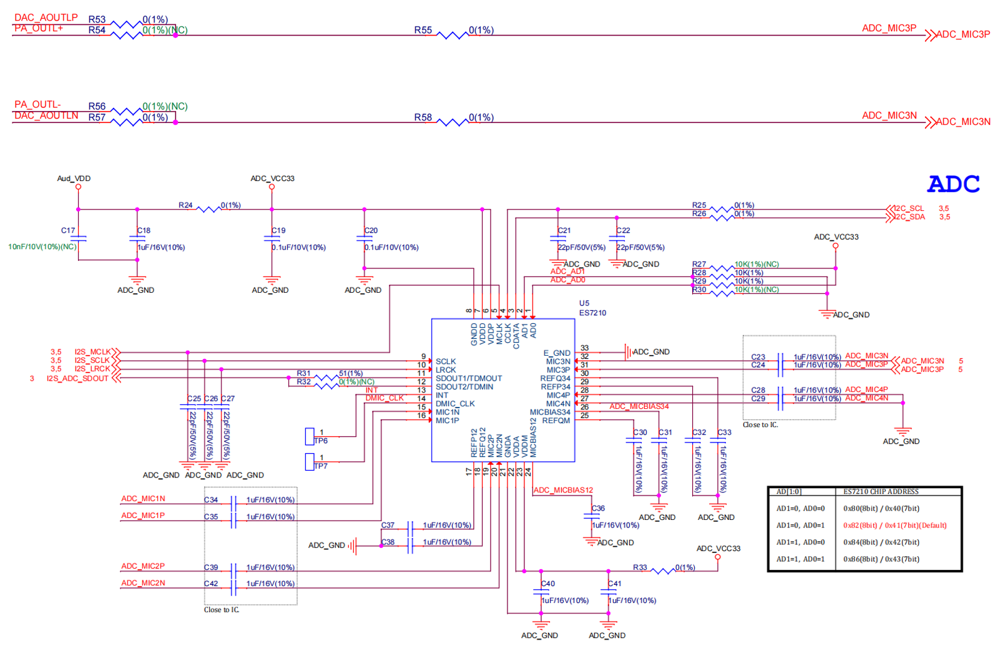

    ESP32-S3-LCD-EV-Board - 参考信号采集（点击放大）

硬件设置选项
------------

自动下载
^^^^^^^^

可以通过两种方式使开发板进入下载模式：

- 按下 Boot 和 Reset 键，然后先松开 Reset 键，再松开 Boot 键。
- 由软件自动执行下载。软件利用串口的 DTR 和 RTS 信号来控制开发板 EN、IO0 管脚的状态。

硬件版本
================

ESP32-S3-LCD-EV-Board v1.5
--------------------------

- 以下管脚已重新分配，以适用于 ESP32-S3-WROOM-1-N16R16V 模组：

  - ``I2C_SCL``：由 ``IO18`` 改为 ``IO48``
  - ``I2C_SDA``：由 ``IO8`` 改为 ``IO47``
  - ``LCD_DATA6``：由 ``IO47`` 改为 ``IO8``
  - ``LCD_DATA7``：由 ``IO48`` 改为 ``IO18``

- ``IO47`` 和 ``IO48`` 新增电平转换电路，用于将 1.8 V 电平转换为 3.3 V 电平。

ESP32-S3-LCD-EV-Board v1.4
--------------------------

- :doc:`首次发布 <user_guide_v1.4>`

样品获取
================

此开发板及转接板适用于评估高性能的 `智能屏方案 <https://www.espressif.com/zh-hans/solutions/hmi/smart-displays>`_。如有需要，请前往 `乐鑫官方淘宝商城 <https://item.taobao.com/item.htm?spm=a1z10.5-c.w4002-8715811636.23.4bc567d8eBiLiI&id=680580609719>`_ 进行采购。

相关文档
========

-  `ESP32-S3 技术规格书 <https://www.espressif.com/sites/default/files/documentation/esp32-s3_datasheet_cn.pdf>`__
-  `ESP32-S3-WROOM-1 技术规格书 <https://www.espressif.com/sites/default/files/documentation/esp32-s3-wroom-1_wroom-1u_datasheet_cn.pdf>`__
-  `乐鑫产品选型工具 <https://products.espressif.com/#/product-selector?names=>`__
-  `ESP32-S3-LCD-EV-Board-MB 原理图 <../../_static/esp32-s3-lcd-ev-board/schematics/SCH_ESP32-S3-LCD-Ev-Board-MB_V1.5_20231009.pdf>`__
-  `ESP32-S3-LCD-EV-Board-MB PCB 布局图 <../../_static/esp32-s3-lcd-ev-board/schematics/PCB_ESP32-S3-LCD-EV-Board-MB_V1.5_20231009.pdf>`__
-  `ESP32-S3-LCD-EV-Board-SUB1 原理图 <../../_static/esp32-s3-lcd-ev-board/schematics/SCH_ESP32-S3-LCD-Ev-Board-SUB1_V1.0_20220617.pdf>`__
-  `ESP32-S3-LCD-EV-Board-SUB1 PCB 布局图 <../../_static/esp32-s3-lcd-ev-board/schematics/PCB_ESP32-S3-LCD-Ev-Board-SUB1_V1.0_20220617.pdf>`__
-  `ESP32-S3-LCD-EV-Board-SUB2 原理图 <../../_static/esp32-s3-lcd-ev-board/schematics/SCH_ESP32-S3-LCD-EV-Board-SUB2_V1.3_20231010.pdf>`__
-  `ESP32-S3-LCD-EV-Board-SUB2 PCB 布局图 <../../_static/esp32-s3-lcd-ev-board/schematics/PCB_ESP32-S3-LCD-EV-Board-SUB2_V1.5_20231010.pdf>`__
-  `3.95_480x480_RGB_Display 屏幕规格书 <../../_static/esp32-s3-lcd-ev-board/datasheets/3.95_480x480_SmartDisplay/3.95_480x480_ZXT395HYC005P.pdf>`__
-  `ESP32-S3-LCD-EV-Board-SUB3 原理图 <../../_static/esp32-s3-lcd-ev-board/schematics/SCH_ESP32-S3-LCD-EV-Board-SUB3_V1.1_20230315.pdf>`__
-  `ESP32-S3-LCD-EV-Board-SUB3 PCB 布局图 <../../_static/esp32-s3-lcd-ev-board/schematics/PCB_ESP32-S3-LCD-EV-Board-SUB3_V1.3_20230317.pdf>`__
-  `ESP32-S3-LCD-EV-Board USB 转接板原理图 <../../_static/esp32-s3-lcd-ev-board/schematics/SCH_ESP32-S3-LCD-EV-Board-USB-Adapter_V1.1_20231001.pdf>`__
-  `ESP32-S3-LCD-EV-Board USB 转接板 PCB 布局图 <../../_static/esp32-s3-lcd-ev-board/schematics/PCB_ESP32-S3-LCD-EV-Board-USB-Adapter_V1.1_20231001.pdf>`__
-  `TCA9554 规格书 <https://www.ti.com/lit/gpn/tca9554>`__
-  `4.3_800x480_RGB_Display 屏幕规格书 <../../_static/esp32-s3-lcd-ev-board/datasheets/4.3_800x480/WKS43246_SPEC_V0.0.pdf>`__

有关本开发板的更多设计文档，请联系我们的商务部门 `sales@espressif.com <sales@espressif.com>`_。
