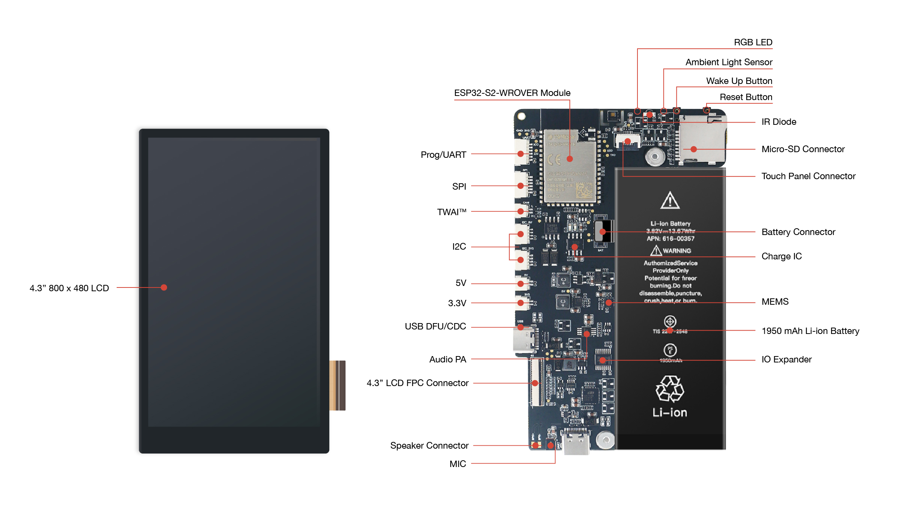

ESP-Dev-Kits  编程指南
===========================

:link_to_translation:`en:[English]`

This is the documentation for `ESP-Dev-Kits <https://github.com/espressif/esp-dev-kits>`_ .

Supported Development Boards
----------------------------------------

============================   ===========================
       ESP32 Development Boards
----------------------------------------------------------
 |esp32-sense-kit|_                |esp32-meshkit-sense|_
----------------------------   ---------------------------
 `esp32-sense-kit`_                `esp32-meshkit-sense`_
----------------------------   ---------------------------
 |esp32-lcdkit|_                        
----------------------------   ---------------------------
 `esp32-lcdkit`_       
----------------------------   ---------------------------
       ESP32-S2 Development Boards    
----------------------------------------------------------
 |esp32-s2-hmi-devkit-1|_        |esp32-s2-kaluga-1|_ 
----------------------------   ---------------------------
 `esp32-s2-hmi-devkit-1`_        `esp32-s2-kaluga-1`_   
----------------------------   ---------------------------
       Other Boards    
----------------------------------------------------------
 |esp-prog|_        
----------------------------   ---------------------------
 `esp-prog`_       
----------------------------   ---------------------------
============================   ===========================

.. |esp32-sense-kit| image:: ../_static/esp32-sense-kit/touch_eb_overview.jpg
.. _esp32-sense-kit: esp32/esp32-sense-kit/index.html

.. |esp32-meshkit-sense| image:: ../_static/esp32-meshkit-sense.png
.. _esp32-meshkit-sense: ../hw-reference/ESP32-MeshKit-Sense_guide.html

.. |esp32-lcdkit| image:: ../_static/esp32-lcdkit.png
.. _esp32-lcdkit: esp32/esp32-lcdkit/index.html

.. _esp32-s2-hmi-devkit-1: esp32s2/esp32-s2-hmi-devkit-1/index.html

.. |esp32-s2-kaluga-1| image:: ../../esp32-s2-kaluga-1/docs/_static/ESP32-S2-Kaluga_V1.0_body.png
.. _esp32-s2-kaluga-1: esp32s2/esp32-s2-kaluga-1/index.html

.. |esp-prog| image:: ../_static/esp-prog/modules.png
.. _esp-prog: other/esp-prog/index.html

相关文档
~~~~~~~~~~~~~~~~

- `ESP-IDF 详细安装步骤 <https://docs.espressif.com/projects/esp-idf/zh_CN/latest/esp32/get-started/index.html#get-started-get-prerequisites>`_
- `ESP-IDF 编程指南 <https://docs.espressif.com/projects/esp-idf/zh_CN/latest/esp32/get-started/index.html>`__
- `ESP 产品选型工具 <http://products.espressif.com:8000/#/product-selector>`_

.. toctree::
   :hidden:

   ESP32-S2-HMI-DevKit-1 <esp32s2/esp32-s2-hmi-devkit-1/index>
   ESP32-S2-Kaluga <esp32s2/esp32-s2-kaluga-1/index>
   ESP32-LCDKit <esp32/esp32-lcdkit/index>
   ESP32-MESHKIT-SENSOR <esp32/esp32-meshkit-sensor/index>
   ESP32-SENSE-KIT <esp32/esp32-sense-kit/index>
   ESP-PROG <other/esp-prog/index>
   贡献代码 <contribute/index>
