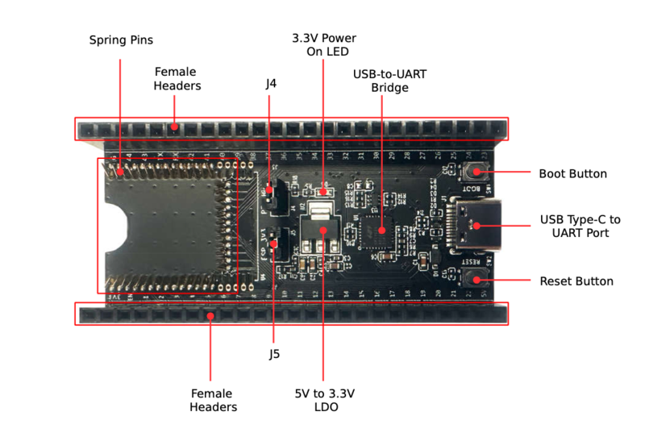
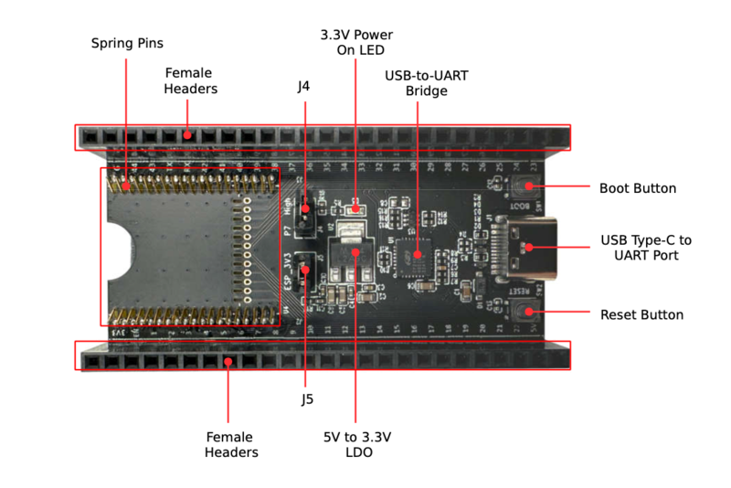
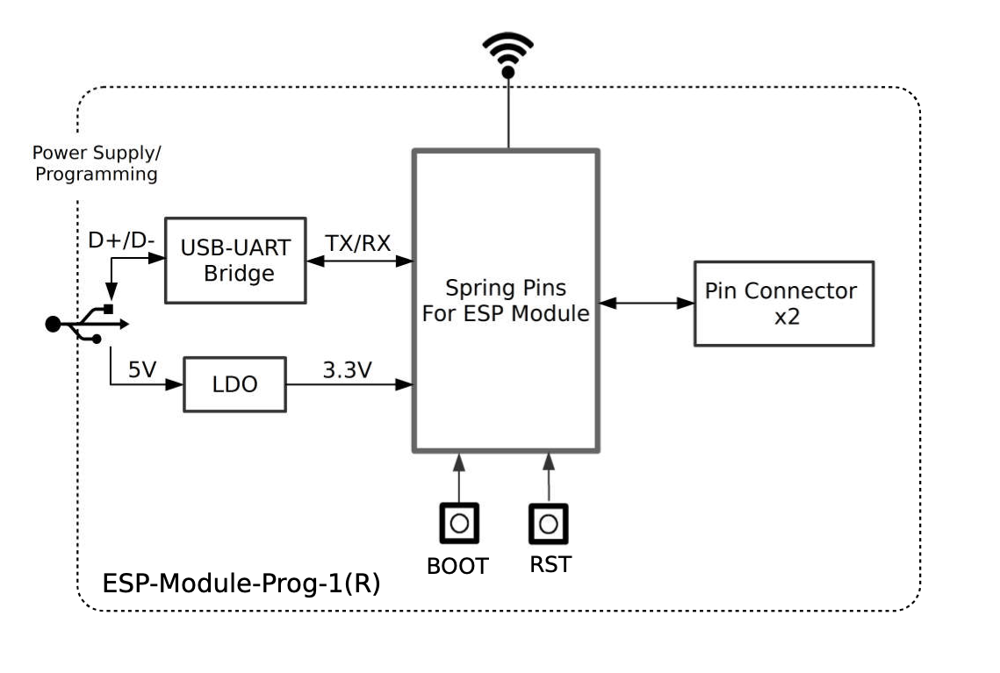

====================
ESP-Module-Prog-1(R)
====================

:link_to_translation:`en: [English]`

本指南将帮助您快速上手 ESP-Module-Prog-1(R)，并提供该款开发板的详细信息。

ESP-Module-Prog-1 和 ESP-Module-Prog-1R（R 代表 WROVER 模组）是乐鑫专为模组设计的两款烧录底板，无需将模组与电源和信号线焊接便可进行烧录。底板可以单独使用，也可以搭配子板使用。乐鑫支持 ESP-Module-Prog-SUB-02 和 ESP-Module-Prog-SUB-01&04 两款子板，子板无法单独使用，需搭配上述任一底板使用。

本指南主要介绍 **ESP-Module-Prog-1(R) 底板**。有关子板的详细信息，请点击下方链接，查看对应子板的用户指南。

  - :doc:`../esp-module-prog-sub-01&04/user_guide`
  - :doc:`../esp-module-prog-sub-02/user_guide`

.. figure:: ../../../_static/esp-module-prog-1-r/esp-module-prog-1.png
    :align: center
    :scale: 70%
    :alt: ESP-Module-Prog-1

    ESP-Module-Prog-1

.. figure:: ../../../_static/esp-module-prog-1-r/esp-module-prog-1r.png
    :align: center
    :scale: 60%
    :alt: ESP-Module-Prog-1R

    ESP-Module-Prog-1R

本指南包括如下内容：

- `开发板概述`_：简要介绍了开发板的软件和硬件。
- `应用程序开发`_：介绍了应用程序开发过程中的软硬件设置。
- `硬件参考`_：详细介绍了开发板的硬件。
- `样品获取`_：如何获取样品。
- `相关文档`_：列出了相关文档的链接。

开发板概述
==============

ESP-Module-Prog-1(R) 是专为模组设计的烧录底板，搭载模组后，可作为类似 ESP32-DevKitC 的小型开发板使用。ESP-Module-Prog-1 和 ESP-Module-Prog-1R 仅在弹簧布局上有所不同，用于适配不同的模组。

.. _fitting-modules-of-prog-1:

.. list-table::
   :widths: 40 60
   :header-rows: 1

   * - 底板
     - 适配模组
   * - ESP-Module-Prog-1
     - * ESP32-WROOM-32
       * ESP32-WROOM-32D
       * ESP32-WROOM-32U
       * ESP32-SOLO-1
       * ESP32-WROOM-32E
       * ESP32-WROOM-32UE
       * ESP32-S2-SOLO
       * ESP32-S2-SOLO-U
       * ESP32-S2-SOLO-2
       * ESP32-S2-SOLO-2U
       * ESP32-S3-WROOM-1
       * ESP32-S3-WROOM-1U
       * ESP32-S3-WROOM-2
       * ESP32-C6-WROOM-1
       * ESP32-C6-WROOM-1U
   * - ESP-Module-Prog-1R:
     - * ESP32-WROVER-B
       * ESP32-WROVER-IB
       * ESP32-WROVER-E
       * ESP32-WROVER-IE

有关上述适配模组的详细信息，请参考 `乐鑫系列模组 <https://www.espressif.com/zh-hans/products/modules?id=ESP32>`_。

组件介绍
--------

.. _user-guide-esp-module-prog-1-front:

    ESP-Module-Prog-1 - 正面

    ESP-Module-Prog-1R - 正面

以下按照顺时针的顺序依次介绍开发板上的主要组件。

.. list-table::
   :widths: 30 70
   :header-rows: 1

   * - 主要组件
     - 介绍
   * - 引脚弹簧
     - 适配模组上的邮票孔，用于连接和固定模组。
   * - 排母
     - 2.54 mm 排母，连接板上搭载模组的引脚。具体信息请参见 `管脚描述`_ 小节。
   * - J4
     - 用于选择 strapping 管脚状态，具体描述请见 `strapping 管脚状态选择`_ 小节。
   * - 3.3 V 电源指示 LED
     - 开发板使用 USB 或供电电源通电后，该指示灯亮起。
   * - USB-to-UART 桥接器
     - 单芯片 USB 转 UART 桥接器，可提供高达 3 Mbps 的传输速率。
   * - Boot 键
     - 下载按键。按住 **Boot** 键的同时按一下 **EN** 键进入“固件下载”模式，通过串口下载固件。
   * - USB Type-C 转 UART 接口
     - 可用作开发板的供电接口，也可作为通信接口，通过板载 USB 转 UART 桥接器与芯片通信。
   * - Reset 键
     - 复位按键。
   * - 5V 转 3.3V LDO
     - 低压差线型稳压器 (LDO)。
   * - J5
     - 用于测量电流，具体描述请见 `测量电流`_ 小节。

应用程序开发
=====================

通电前，请确保 ESP-Module-Prog-1(R) 完好无损。

必备硬件
--------

- 任意一款上述列出的乐鑫模组
- USB-A 转 USB-C 数据线
- 电脑 （Windows、Linux 或 macOS）

.. note::

  请确保使用适当的 USB 数据线。部分数据线仅可用于充电，无法用于数据传输和程序烧录。

硬件设置
-----------

请按照下列步骤将模组安装到 ESP-Module-Prog-1(R) 烧录底板上：

1. 将模组轻放到 ESP-Module-Prog-1(R) 烧录底板上，确保模组上方的邮票孔与底板上的引脚弹簧对齐。
2. 将模组向下压，听到“咔哒”一声即说明模组已经压入底板。
3. 检查所有引脚弹簧是否均已卡进邮票孔中。如发现错位，可使用镊子将引脚弹簧拨入邮票孔中。

硬件设置完成，接下来可以进行软件设置。

软件设置
-----------

首选方式
^^^^^^^^

推荐使用 ESP-IDF 开发框架将二进制文件 (\*.bin) 烧录到 ESP-Module-Prog-1(R)。请前往 `ESP-IDF 快速入门 <https://docs.espressif.com/projects/esp-idf/zh_CN/latest/esp32/get-started/index.html>`__，了解如何快速设置开发环境并烧录应用程序。

备选方式
^^^^^^^^

Windows 用户也可以使用 `Flash 下载工具 <https://www.espressif.com/zh-hans/support/download/other-tools?keys=FLASH+>`_ 烧录二进制文件。

.. note::

  1. 烧录二进制文件时，需将芯片设置为固件下载模式。这一步骤可由烧录工具自动执行，也可按住 Boot 键并点按 Reset 键手动执行。
  2. 烧录完成后，烧录工具将默认重启模组，运行已烧录的程序。

硬件参考
========

本节提供关于开发板硬件的更多信息。

功能框图
--------

ESP-Module-Prog-1(R) 的主要组件和连接方式如下图所示。

    ESP-Module-Prog-1(R)

电源选项
-------------

开发板支持以下任意一种供电方式：

- USB Type-C 转 UART 接口供电（默认供电方式，推荐）
- 5V 和 GND 管脚供电
- 3V3 和 GND 管脚供电

Strapping 管脚状态选择
--------------------------

开发板上的 J4 为双排排针，一端为 P7，一端为 High（即上拉）：

- P7 适配某些模组时，对应管脚不是 strapping 管脚，下载不需要上拉，此时 J4 不需要跳帽。
- P7 适配某些模组时，对应管脚是 strapping 管脚，下载需要上拉，此时 J4 需要跳帽。

.. note::

  有关 P7 在乐鑫各款模组上的对应管脚，请参见 `ESP-Module-Prog-1(R) GPIO 分配列表 <https://dl.espressif.com/dl/schematics/GPIO_MAP_ESP-Module-Prog-1_V1.1_CN_20230523.xls>`__。

测量电流
-------------

开发板上的 J5 排针可用于测量 ESP-Module-Prog-1(R) 模组的电流：

- 移除 J5 跳帽：此时开发板上外设和模组电源断开，J5 排针接入电流表后可测量模组电流。
- 安装 J5 跳帽（出厂时默认）：开发板恢复正常功能。

.. note::

  使用 3V3 和 GND 排针给开发板供电时，需移除 J5 跳帽，在外部电路上串联接入电流表，才可测量模组的电流。

管脚描述
----------

下表列出了 ESP-Module-Prog-1(R) 两侧排母（J2 和 J3）的 **名称** 和 **信号**。管脚的名称如图 :ref:`user-guide-esp-module-prog-1-front` 所示，管脚的序号与 `ESP-Module-Prog-1(R) 原理图 <https://dl.espressif.com/dl/schematics/esp_idf/esp-module-prog-1-schematics.pdf>`_ (PDF) 一致。有关各个信号在乐鑫模组上的对应管脚，请参见 `ESP-Module-Prog-1(R) GPIO 分配列表 <https://dl.espressif.com/dl/schematics/GPIO_MAP_ESP-Module-Prog-1_V1.1_CN_20230523.xls>`__。

J2
^^^
=======  ================  ================================
序号      名称              信号
=======  ================  ================================
1        3V3               3.3 V 电源
2        EN                CHIP_EN（高电平：芯片使能；低电平：芯片关闭；内部默认已上拉。）
3        1                 P1
4        2                 P2
5        3                 P3
6        4                 P4
7        5                 P5
8        6                 P6
9        7                 P7
10       8                 P8
11       9                 P9
12       10                P10
13       11                P11
14       12                P12
15       13                P13
16       14                P14
17       15                P15
18       16                P16
19       17                P17
20       18                P18
21       19                P19
22       20                P20
23       21                P21
24       22                P22
25       5V                5 V 电源
=======  ================  ================================

J3
^^^
=======  ================  ================================
序号      名称               信号
=======  ================  ================================
1        G                 接地
2        44                P44
3        43                P43
4        TX                TXD0
5        RX                RXD0
6        42                P42
7        41                P41
8        40                P40
9        39                P39
10       38                P38
11       37                P37
12       36                P36
13       35                P35
14       34                P34
15       33                P33
16       32                P32
17       31                P31
18       30                P30
19       29                P29
20       28                P28
21       27                P27
22       26                P26
23       25                P25
24       24                P24
25       23                P23
=======  ================  ================================

样品获取
===========

零售订单
------------

如购买样品，每个 ESP-Module-Prog-1(R) 底板将以防静电袋或零售商选择的其他方式包装。

零售订单请前往 https://www.espressif.com/zh-hans/company/contact/buy-a-sample。

批量订单
------------

如批量购买，ESP-Module-Prog-1(R) 烧录底板将以大纸板箱包装。

批量订单请前往 https://www.espressif.com/zh-hans/contact-us/sales-questions。

相关文档
========

- `ESP-Module-Prog-1(R) GPIO 分配列表 <https://dl.espressif.com/dl/schematics/GPIO_MAP_ESP-Module-Prog-1_V1.1_CN_20230523.xls>`__ (XLS)
- `ESP-Module-Prog-1(R) 原理图 <https://dl.espressif.com/dl/schematics/esp_idf/esp-module-prog-1-schematics.pdf>`_ (PDF)
- `ESP-Module-Prog-1(R) PCB 布局图 <https://dl.espressif.com/dl/schematics/esp_idf/PCB_ESP-Module-Prog-1_V1.1_20230113.pdf>`_ (PDF)
- `ESP-Module-Prog-1(R) 尺寸图 <https://dl.espressif.com/dl/schematics/esp_idf/Dimension_ESP-Module-Prog-1_V1.1_20230523.pdf>`_ (PDF)
- `ESP-Module-Prog-1(R) 尺寸图源文件 <https://dl.espressif.com/dl/schematics/esp_idf/Dimension_ESP-Module-Prog-1_V1.1_20230523.dxf>`_ (DXF) - 可使用 `Autodesk Viewer <https://viewer.autodesk.com/>`_ 查看
- `乐鑫系列模组技术规格书 <https://www.espressif.com/zh-hans/support/documents/technical-documents?keys=&field_type_tid%5B%5D=1133&field_type_tid%5B%5D=838&field_type_tid%5B%5D=839&field_type_tid%5B%5D=1181&field_type_tid%5B%5D=682&field_type_tid%5B%5D=268&field_type_tid%5B%5D=266&field_type_tid%5B%5D=54&field_type_tid%5B%5D=400>`__
- `乐鑫产品选型工具 <https://products.espressif.com/#/product-selector?names=>`__
