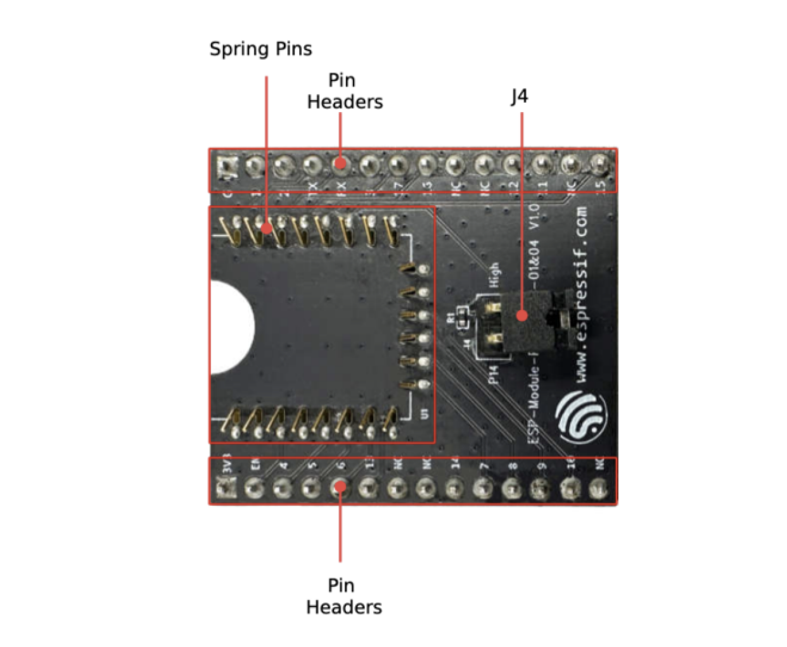
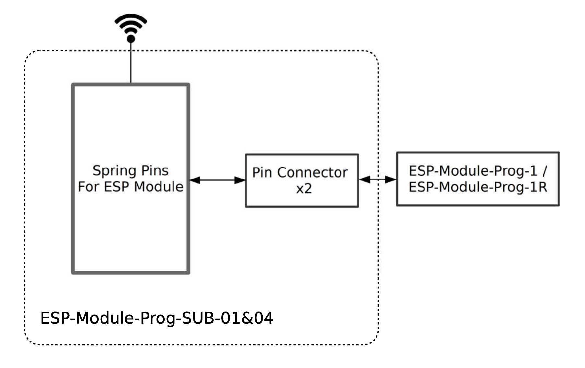

=========================
ESP-Module-Prog-SUB-01&04
=========================

:link_to_translation:`en: [English]`

本指南将帮助您快速上手 ESP-Module-Prog-SUB-01&04，并提供该款开发板的详细信息。有关底板及其他子板的详细信息，请点击下方链接，查看对应的用户指南。

  - :doc:`../esp-module-prog-1-r/user_guide`
  - :doc:`../esp-module-prog-sub-02/user_guide`

.. figure:: ../../../_static/esp-module-prog-sub-01&04/esp-module-prog-sub-0104.png
    :align: center
    :scale: 50%
    :alt: ESP-Module-Prog-SUB-01&04

    ESP-Module-Prog-SUB-01&04

本指南包括如下内容：

- `开发板概述`_：简要介绍了开发板的软件和硬件。
- `应用程序开发`_：介绍了应用程序开发过程中的软硬件设置。
- `硬件参考`_：详细介绍了开发板的硬件。
- `样品获取`_：如何获取样品。
- `相关文档`_：列出了相关文档的链接。

开发板概述
============

ESP-Module-Prog-SUB-01&04 是专为模组设计的烧录子板，无需将模组与电源和信号线焊接便可进行烧录。搭载模组后，可作为类似 ESP32-DevKitC 的小型开发板使用。需注意，作为子板，ESP-Module-Prog-SUB-01&04 无法单独使用，需搭配底板 ESP-Module-Prog-1 或 ESP-Module-Prog-1R 共同使用。

.. _fitting-modules-of-prog-0104:

- ESP-Module-Prog-SUB-01&04 适配的乐鑫模组如下：
   - ESP8685-WROOM-01
   - ESP8684-WROOM-01C
   - ESP8685-WROOM-04
   - ESP8684-WROOM-04C

有关上述模组的详细信息，请参考 `乐鑫系列模组 <https://www.espressif.com/zh-hans/products/modules?id=ESP32>`_。

组件介绍
--------

.. _user-guide-esp-module-prog-sub-0104-front:

    ESP-Module-Prog-SUB-01&04 - 正面

以下按照顺时针的顺序依次介绍开发板上的主要组件。

.. list-table::
   :widths: 30 70
   :header-rows: 1

   * - 主要组件
     - 介绍
   * - 引脚弹簧
     - 适配模组上的邮票孔，用于连接和固定模组。
   * - 排针
     - 2.54 mm 排针，连接板上搭载模组的引脚，并用于插接至底板。具体信息请参见 `管脚描述`_ 小节。
   * - J4
     - 用于选择 strapping 管脚状态。具体信息请参见 `strapping 管脚状态选择`_ 小节。
   * - ESP-Module-Prog-1(R)
     - ESP-Module-Prog-1 和 ESP-Module-Prog-1R（R 代表 WROVER 模组）是乐鑫专为模组设计的两款烧录底板。有关底板的详细信息，请参见 :doc:`../esp-module-prog-1-r/user_guide`。

应用程序开发
=====================

通电前，请确保 ESP-Module-Prog-SUB-01&04 及底板完好无损。

必备硬件
-----------

- 任选一款上述所列的乐鑫模组
- USB-A 转 USB-C 数据线
- 电脑 （Windows、Linux 或 macOS）
- ESP-Module-Prog-1 或 ESP-Module-Prog-1R 底板

.. note::

  请确保使用适当的 USB 数据线。部分数据线仅可用于充电，无法用于数据传输和程序烧录。

硬件设置
-----------

请按照下列步骤将模组安装到 ESP-Module-Prog-SUB-01&04 子板上：

1. 将模组轻放到 ESP-Module-Prog-SUB-01&04 子板上，确保模组上方的邮票孔与板上的引脚弹簧对齐。
2. 将模组向下压，听到“咔哒”一声即说明模组已经压入板中。
3. 检查所有引脚弹簧是否均已卡进邮票孔中。如发现错位，可使用镊子将引脚弹簧拨入邮票孔中。
4. 将子板插入底板。

硬件设置完成，接下来可以进行软件设置。

软件设置
-----------

首选方式
^^^^^^^^
推荐使用 ESP-IDF 开发框架将二进制文件 (\*.bin) 烧录到 ESP-Module-Prog-SUB-01&04。请前往 `ESP-IDF 快速入门 <https://docs.espressif.com/projects/esp-idf/zh_CN/latest/esp32c6/get-started/index.html>`__，了解如何快速设置开发环境并烧录应用程序。

备选方式
^^^^^^^^

Windows 用户也可以使用 `Flash 下载工具 <https://www.espressif.com/zh-hans/support/download/other-tools?keys=FLASH+>`_ 烧录二进制文件。

.. note::

  1. 烧录二进制文件时，需将芯片设置为固件下载模式。这一步骤可由烧录工具自动执行，也可按住 Boot 键并点按 Reset 键手动执行。
  2. 烧录完成后，烧录工具将默认重启模组，运行已烧录的程序。

硬件参考
========

本节提供关于开发板硬件的更多信息。

功能框图
--------

ESP-Module-Prog-SUB-01&04 的主要组件和连接方式如下图所示。

    ESP-Module-Prog-SUB-01&04

Strapping 管脚状态选择
^^^^^^^^^^^^^^^^^^^^^^

子板上的 J4 为双排排针，一端为 P14，一端为 High（即上拉）：

- P14 适配某些模组时，对应管脚不是 strapping 管脚，下载不需要上拉，此时 J4 不需要跳帽。
- P14 适配某些模组时，对应管脚是 strapping 管脚，下载需要上拉，此时 J4 需要跳帽。

.. note::

  1. 有关 P14 在乐鑫各款模组上的对应管脚，请参见 `ESP-Module-Prog-SUB-01&04 GPIO 分配列表 <https://dl.espressif.com/dl/schematics/GPIO_MAP_ESP-Module-Prog-SUB-01&04_V1.0_CN_20230308.xls>`__。
  2. 由于 ESP-Module-Prog-SUB-01&04 子板目前皆适配于 ESP8684 系列模组上，P14 需要上拉，故 J4 默认需要跳帽。

管脚描述
------------

下表列出了开发板两侧排针（J2 和 J3）上管脚的 **名称** 和 **信号**。管脚的名称如图 :ref:`user-guide-esp-module-prog-sub-0104-front` 所示，管脚的序号与 `ESP-Module-Prog-SUB-01&04 原理图 <https://dl.espressif.com/dl/schematics/esp_idf/esp-module-prog-sub-0104-schematics.pdf>`_ (PDF) 一致。有关各个信号在乐鑫模组上的对应管脚，请参见 `ESP-Module-Prog-SUB-01&04 GPIO 分配列表 <https://dl.espressif.com/dl/schematics/GPIO_MAP_ESP-Module-Prog-SUB-01&04_V1.0_CN_20230308.xls>`__。

J2
^^^
=======  ================  ================================
序号     名称               信号
=======  ================  ================================
1        3V3               3.3 V 电源
2        EN                CHIP_EN（高电平：芯片使能；低电平：芯片关闭；内部默认已上拉。）
3        4                 P4
4        5                 P5
5        6                 P6
6        13                P13
7        NC                未连接
8        NC                未连接
9        14                P14
10       7                 P7
11       8                 P8
12       9                 P9
13       10                P10
14       NC                未连接
=======  ================  ================================

J3
^^^
=======  ================  ================================
序号     名称               信号
=======  ================  ================================
1        G                 接地
2        1                 P1
3        2                 P2
4        TX                TXD0
5        RX                RXD0
6        3                 P3
7        17                P17
8        16                P16
9        NC                未连接
10       NC                未连接
11       12                P12
12       11                P11
13       NC                未连接
14       15                P15
=======  ================  ================================

样品获取
===========

零售订单
------------

如购买样品，每个 ESP-Module-Prog-SUB-01&04 将以防静电袋或零售商选择的其他方式包装。

零售订单请前往 https://www.espressif.com/zh-hans/company/contact/buy-a-sample。

批量订单
------------

如批量购买，ESP-Module-Prog-SUB-01&04 将以大纸板箱包装。

批量订单请前往 https://www.espressif.com/zh-hans/contact-us/sales-questions。

相关文档
========

- `ESP-Module-Prog-SUB-01&04 GPIO 分配列表 <https://dl.espressif.com/dl/schematics/GPIO_MAP_ESP-Module-Prog-SUB-01&04_V1.0_CN_20230308.xls>`__ (XLS)
- `ESP-Module-Prog-SUB-01&04 原理图 <https://dl.espressif.com/dl/schematics/esp_idf/esp-module-prog-sub-0104-schematics.pdf>`_ (PDF)
- `ESP-Module-Prog-SUB-01&04 PCB 布局图 <https://dl.espressif.com/dl/schematics/esp_idf/PCB_ESP-Module-Prog-SUB-01&04_V1.0_20230308.pdf>`_ (PDF)
- `ESP-Module-Prog-SUB-01&04 尺寸图 <https://dl.espressif.com/dl/schematics/esp_idf/Dimension_ESP-Module-Prog-SUB-01&04_V1.0_20230523.pdf>`_ (PDF)
- `ESP-Module-Prog-SUB-01&04 尺寸图源文件 <https://dl.espressif.com/dl/schematics/esp_idf/Dimension_ESP-Module-Prog-SUB-01&04_V1.0_20230523.dxf>`_ (DXF) - 可使用 `Autodesk Viewer <https://viewer.autodesk.com/>`_ 查看
- `乐鑫各模组技术规格书 <https://www.espressif.com/zh-hans/support/documents/technical-documents?keys=&field_type_tid%5B%5D=1133&field_type_tid%5B%5D=838&field_type_tid%5B%5D=839&field_type_tid%5B%5D=1181&field_type_tid%5B%5D=682&field_type_tid%5B%5D=268&field_type_tid%5B%5D=266&field_type_tid%5B%5D=54&field_type_tid%5B%5D=400>`__
- `乐鑫产品选型工具 <https://products.espressif.com/#/product-selector?names=>`__
