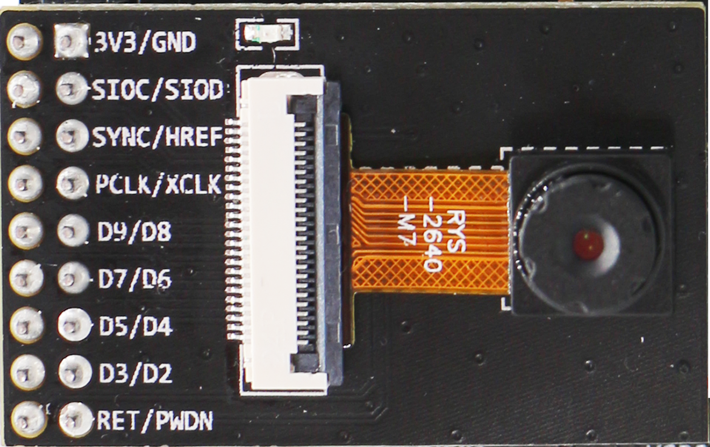

# ESP32-S2-Kaluga   

ESP32-S2-kaluga-1 is a development kit released by Espressif for human-computer interaction products. The kit consists of a main board and four external daughter boards with main functions, which can realize the insertion and expansion of multiple daughter boards , To achieve the four types of functions of Audio audio playback, Touch panel control, LCD image display and Camera image acquisition, allowing users to multi-dimensionally interact with the machine through sensory channels and body language.

**Touch Panel Control** 

* Support 14 very sensitive touch sensors, 3 of them support distance sensing
* Support 3 mm acrylic panel
* Support wet hand operation
* Anti-mistouch design: If multiple touch buttons are covered by a large area of ​​water droplets at the same time, the ESP32-S2 will activate the self-locking function (after wiping the water droplets back to normal)


**Audio Music Player**

* Connect speakers to play audio
* By sharing with the Touch panel, you can switch the audio playback and adjust the sound level

**LCD image display**

* Support LCD interface (8-bit parallel RGB, 8080, 6800 interface)
* The motherboard is equipped with MPU6050 (3-axis gyroscope + 3-axis acceleration sensor chip), which displays the data on the LCD screen in real time
 
**Camera image acquisition**

* Support 8/16 bit DVP image sensor interface
* The highest clock frequency supports up to 40 MHz
* DMA transmission bandwidth optimization, easier transmission of high-resolution images
 
Arrangement and combination of the above 4 types of functions can meet the different needs of users for products. For example, the following common scenarios:

* Smart home: from the simplest smart lighting, smart door locks, smart sockets, to video streaming devices such as white goods, kitchen appliances, OTT devices and security cameras;
* Battery-powered equipment: Wi-Fi networked sensors, Wi-Fi networked toys, wearable devices and health management equipment;
* Industrial automation equipment: wireless control and robot technology, intelligent lighting, HVAC control equipment, etc.;
* Retail and catering industry applications: POS machines and service robots.


# 1. Content

## 1.1 Docu

```
├── components
├── docs
│   ├── datasheet
│   ├── schematic
│   └── _static
├── examples
│   ├── lcd
│   ├── touch
│   ├── camera
│   ├── audio
│   ├── touch_audio_music
│   ├── README.md
│   └── ...
└── README_cn.md
```

* **components**: common program components
* **docs**: schematic diagrams and data sheets of each part
  * datasheet : data sheet for each hardware
  * schematic ：schematic diagram of each hardware
  * _static : Pictures referenced by each `README.md` in the project
* **examples**: Various ESP32-S2-Kaluga related sample programs
    * [lcd](examples/lcd) : LCD screen displays fixed images.
    * [touch](examples/touch) : The touch panel controls LED lights to display different colors.
    * [camera](examples/camera) : After the camera captures the image, it is displayed on the LCD screen.
    * [audio](examples/audio) : Control the LED light through the buttons on the audio sub-version, at the same time you can perform recording and playback operations.
    * [touch_audio_music](examples/touch_audio_music) : Control the audio playing music through the touchpad.
  

# 2. ESP32-S2-Kaluga Quick Start

## 2.1 Hardware preparation

<table>
    <tr>
        <td ><p align=center>ESP32-S2-Kaluga-1 development board</p></td>
        <td ><p align=center>ESP-LyraT-8311A audio board</p></td>
        <td ><p align=center>EESP-LyraP-LCD32 display</p></td>
        <td ><p align=center>ESP-LyraP-TOUCHA touchpad</p></td>
        <td ><p align=center>ESP-LyraP-CAM camera</p></td>
    </tr>
</table>

* Two USB 2.0 data cables (standard A type to Micro-B type)
* Computer (Windows, Linux or macOS)


For how to configure the ESP32-S2-Kaluga module for your application, please refer to `README.md` of each [examples](examples).

## 2.2 Software preparation


```
git clone --recursive https://github.com/espressif/esp32-s2-kaluga.git 
```

If you clone a project without the `--recursive` flag, go to the `esp32-s2-kaluga` directory and run the command `git submodule update --init` before performing any operation.

### 2.2.1 ESP-IDF

For detailed instructions on setting up ESP-IDF, please refer to the setup guide:

* [ESP-IDF v4.2 Getting Started Guide](https://docs.espressif.com/projects/esp-idf/en/latest/esp32s2/index.html)
  
We will use [ESP-IDF v4.2] (https://github.com/espressif/esp-idf/tree/release/v4.2) as the default version.


### 2.2.2 Examples

The [examples](examples) folder contains sample programs that demonstrate various functions of ESP32-S2-Kaluga.

Take a [display](examples/lcd) program as an example:
1. Download ESP-IDF as above and configure IDF environment variables.

2. Go to an example folder: `esp32-s2-kaluga/examples/lcd/`.
   
```
cd esp32-s2-kaluga/examples/lcd/
```

3. Compile and flash the project
   
```
idf.py set-target esp32s2 build
idf.py flash -p [PORT] monitor
```

4. Advanced users can use commands to modify certain options `idf.py menuconfig`.

Check the `README.md` of each example for more detailed information.

# 3. Appendix

## 3.1 Schematic

* [ESP32-S2-Kaluga-1 v1.2 motherboard](docs/schematic/SCH_ESP32-S2-KALUGA-1_V1_2_20200325A.pdf)
* [ESP-LyraT-8311A v1.2 audio board](docs/schematic/SCH_ESP-LYRAT-8311A_V1_2_20200324A.pdf)
* [ESP-LyraP-LCD32 v1.2 display](docs/schematic/SCH_ESP-LYRAP-LCD32_V1_1_20200324A.pdf)
* [ESP-LyraP-TOUCHA v1.2 touchpad](docs/schematic/SCH_ESP-LYRAP-TOUCHA_V1.1_20200325A.pdf)
* [ESP-LyraP-CAM v1.2 camera](docs/schematic/SCH_ESP-LYRAP-CAM_V1_20200302.pdf)

## 3.2 Data Sheet

* [ESP32-S2 datasheet](docs/datasheet/esp32-s2_datasheet_en.pdf)
* [LCD ST7789](docs/datasheet/LCD_ST7789.pdf)
* [Camera OV2640](docs/datasheet/Camera_OV2640.pdf)
* [Audio ES8311](docs/datasheet/Audio_ES8311.pdf)
