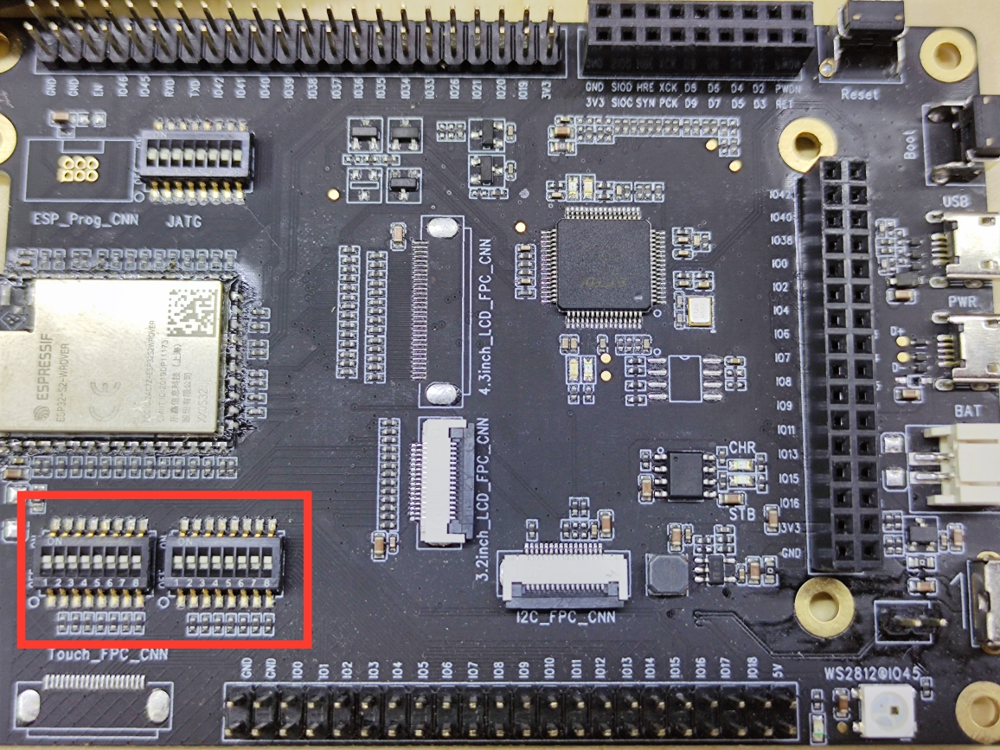

# _Camera 示例程序_

此工程展示了 Camera 采集图像数据后，将其图像数据显示在显示屏上。（目前支持 OV3660 和 OV2640 ）

## 1 快速入门

### 1.1 硬件准备

<table>
    <tr>
        <td ><p align=center>ESP32-S2-Kaluga-1 开发板</p></td>
        <td ><p align=center>ESP-LyraP-LCD32 显示屏</p></td>
        <td ><p align=center>ESP-LyraP-CAM 摄像头</p></td>
    </tr>
</table>

## 1.2 硬件连接

1. 将 SW3 和 SW4 的拨码开关**全部打开（ ON ）**，即主板左下角两组拨码开关，如下图：
* 高级：如果想使用部分触摸板  管脚，只需将触摸板相关拨码开关关闭( OFF )，详情请参阅主板和触摸板原理图。

<div align="left"></div>

2. 将显示屏插入主板双排排针的内侧一排（注意：不要在显示屏和主板之间接入音频板），如下图:

<div align="left"></div>

3. 将摄像头插入主板，如下图:

<div align="left"></div>

* ESP32_S2_Kaluga-1 LCD 管脚分配

LCD PIN|MISO|MOSI|CLK|CS|D_C|RST|BCKL(BLCT)|
 ---|---| ---|---| ---|---| ---|---|
 **GPIO** |8|9|15|11|13|16|6

* ESP32_S2_Kaluga-1_v1.1 Camera 管脚分配

CAMERA PIN|XCLK|PCLK|VSYNC|HSYNC|D2|D3|D4|D5|D6|D7|D8|D9|
---|---| ---|---| ---|---| ---|---|---|---|---|---|---|
**GPIO** |1|0|2|3|46|45|41|42|39|40|21|38

* ESP32_S2_kaluga-1_v1.2 Camera 管脚分配

CAMERA PIN|XCLK|PCLK|VSYNC|HSYNC|D2|D3|D4|D5|D6|D7|D8|D9|
---|---| ---|---| ---|---| ---|---|---|---|---|---|---|
**GPIO** |1|33|2|3|46|45|41|42|39|40|21|38

* ESP32_S2_kaluga-1_v1.3 Camera 管脚分配

CAMERA PIN|XCLK|PCLK|VSYNC|HSYNC|D2|D3|D4|D5|D6|D7|D8|D9|
---|---| ---|---| ---|---| ---|---|---|---|---|---|---|
**GPIO** |1|33|2|3|36|37|41|42|39|40|21|38

### 1.3 配置工程

```
idf.py set-target esp32s2 menuconfig
```

* 在`Serial flasher config` 下配置串口相关信息。
* 在`Example Configuration` -> `kaluga version`: 选择 Kaluga 主板版本。
* 在`Example Configuration` -> `Camera version`: 选择 Camera 的版本。（目前支持 OV3660 和 OV2640 ）
* 在`Example Configuration` -> `LCD version`: 选择 Camera 的版本。（目前支持 ST7789 和 ILI9341 ）
* 在`Example Configuration` -> `jpeg mode`: 选择是否需要启动 jpeg 解码。
* 在`Component config` -> `ESP32S2-specific` -> `Support for external, SPI-connected RAM`: 此工程需要打开 SPIRAM,确认是否打开了.

## 1.4 构建和烧录

建立工程，并将其烧入到板子，然后运行监测工具，以查看串行输出:

```
idf.py -p PORT flash monitor
```

* 如果有两个端口号，最大的是`PORT`。

(要退出串行监视器，请键入``Ctrl-]``)

有关配置和使用 ESP-IDF 构建项目的完整步骤，请参阅入门指南。

### 1.5 示例输出

当程序烧录进去后，你会看到如下场景，则烧录成功。

您还可以在串行监视器上看到以下输出日志:

```
 (60) boot.esp32s2: SPI Mode       : QIO
I (64) boot.esp32s2: SPI Flash Size : 4MB
I (69) boot: Enabling RNG early entropy source...
I (75) boot: Partition Table:
I (78) boot: ## Label            Usage          Type ST Offset   Length
I (85) boot:  0 nvs              WiFi data        01 02 00009000 00006000
I (93) boot:  1 phy_init         RF data          01 01 0000f000 00001000
I (100) boot:  2 factory          factory app      00 00 00010000 00100000
I (108) boot: End of partition table
I (112) esp_image: segment 0: paddr=0x00010020 vaddr=0x3f000020 size=0x067a8 ( 26536) map
I (126) esp_image: segment 1: paddr=0x000167d0 vaddr=0x3ffbe820 size=0x01f9c (  8092) load
I (132) esp_image: segment 2: paddr=0x00018774 vaddr=0x40024000 size=0x00404 (  1028) load
0x40024000: _WindowOverflow4 at /home/chenzhengwei/esp/esp-idf/components/freertos/xtensa/xtensa_vectors.S:1730

I (139) esp_image: segment 3: paddr=0x00018b80 vaddr=0x40024404 size=0x07498 ( 29848) load
I (155) esp_image: segment 4: paddr=0x00020020 vaddr=0x40080020 size=0x17570 ( 95600) map
0x40080020: _stext at ??:?

I (174) esp_image: segment 5: paddr=0x00037598 vaddr=0x4002b89c size=0x02f84 ( 12164) load
0x4002b89c: prvAcquireItemNoSplit at /home/chenzhengwei/esp/esp-idf/components/esp_ringbuf/ringbuf.c:325 (discriminator 1)

I (183) boot: Loaded app from partition at offset 0x10000
I (183) boot: Disabling RNG early entropy source...
I (183) cache: Instruction cache        : size 8KB, 4Ways, cache line size 32Byte
I (191) cache: Data cache               : size 8KB, 4Ways, cache line size 32Byte
I (198) spiram: Found 16MBit SPI RAM device
I (203) spiram: SPI RAM mode: sram 80m
I (207) spiram: PSRAM initialized, cache is in normal (1-core) mode.
I (214) cpu_start: Pro cpu up.
I (218) cpu_start: Application information:
I (223) cpu_start: Project name:     esp32-s2-hmi
I (228) cpu_start: App version:      535fb9e-dirty
I (234) cpu_start: Compile time:     Apr 27 2020 21:39:04
I (240) cpu_start: ELF file SHA256:  9b9cdfa6808cf056...
I (246) cpu_start: ESP-IDF:          v4.2-dev-1054-g7d0f1536e-dirty
I (253) cpu_start: Single core mode
I (476) spiram: SPI SRAM memory test OK
I (476) heap_init: Initializing. RAM available for dynamic allocation:
I (476) heap_init: At 3FFC1038 len 0003AFC8 (235 KiB): D/IRAM
I (483) heap_init: At 3FFFC000 len 00003A10 (14 KiB): DRAM
I (489) cpu_start: Pro cpu start user code
I (494) spiram: Adding pool of 2048K of external SPI memory to heap allocator
I (501) spiram: Reserving pool of 32K of internal memory for DMA/internal allocations
I (562) spi_flash: detected chip: generic
I (562) spi_flash: flash io: qio
I (562) cpu_start: Starting scheduler on PRO CPU.
I (565) gpio: GPIO[6]| InputEn: 0| OutputEn: 1| OpenDrain: 0| Pullup: 0| Pulldown: 0| Intr:0
I (565) gpio: GPIO[11]| InputEn: 0| OutputEn: 1| OpenDrain: 0| Pullup: 0| Pulldown: 0| Intr:0
I (575) gpio: GPIO[13]| InputEn: 0| OutputEn: 1| OpenDrain: 0| Pullup: 0| Pulldown: 0| Intr:0
I (585) gpio: GPIO[16]| InputEn: 0| OutputEn: 1| OpenDrain: 0| Pullup: 0| Pulldown: 0| Intr:0
I (595) lcd: lcd_buffer_size: 2048, lcd_dma_size: 1024, lcd_dma_node_cnt: 2

I (905) lcd: lcd init ok

I (905) gpio: GPIO[2]| InputEn: 1| OutputEn: 0| OpenDrain: 0| Pullup: 1| Pulldown: 1| Intr:2
I (905) cam: cam_xclk_pin setup

I (905) cam: cam_buffer_size: 7680, cam_dma_size: 3840, cam_dma_node_cnt: 2, cam_total_cnt: 40

I (915) cam: frame1_buffer_en

I (915) cam: frame2_buffer_en

I (1015) main: camera init done

```

### 1.6 故障排除

* 烧录失败
  * 硬件连接不正确：运行 `idf.py monitor` ，然后重新启动电路板，以查看是否有任何输出日志。
  * 下载的波特率太高：降低 `menuconfig` 菜单中的波特率，然后重试。
* 无法显示或者显示不正常
  * 拨码开关没有正确打开（ ON ）。
  * 检测屏幕的驱动是 ST7789 还是 ILI9341.
  * 摄像头或者显示屏是否接触不良。
  * 在`menuconfig`中是否打开了 SPIRAM.
  * 不要在显示屏和主板中间接入音频板,否则会影响自动识别 Camera 型号的功能。

## 2 附录

* [ESP32-S2 技术规格书](https://www.espressif.com/sites/default/files/documentation/esp32-s2_datasheet_cn.pdf)
* [ESP32-S2-Kaluga-1 主板](../../../docs/_static/esp32-s2-kaluga-1/schematics/SCH_ESP32-S2-KALUGA-1_V1_2_20200325A.pdf)
* [ESP-LyraP-CAM 摄像头](../../../docs/_static/esp32-s2-kaluga-1/schematics/SCH_ESP-LYRAP-CAM_V1_20200302.pdf)
* [ESP-LyraP-LCD32 显示屏](../../../docs/_static/esp32-s2-kaluga-1/schematics/SCH_ESP-LYRAP-LCD32_V1_1_20200324A.pdf)