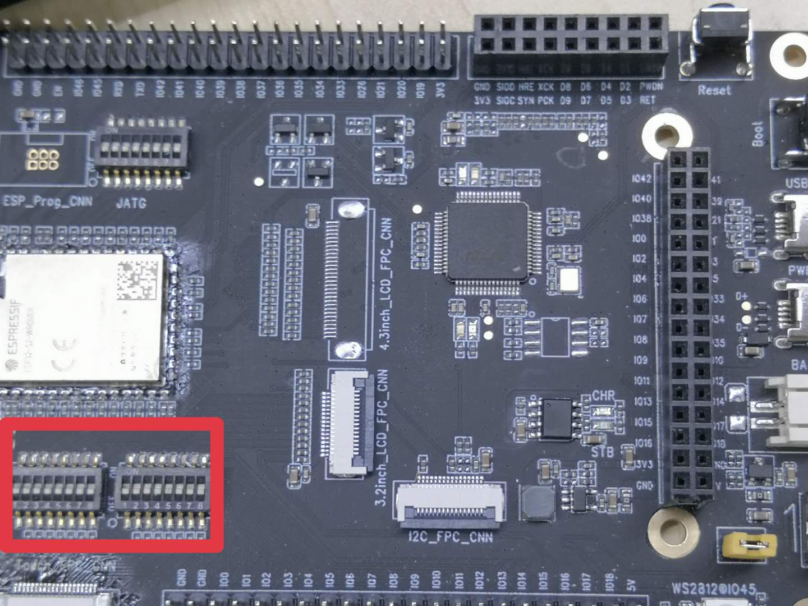
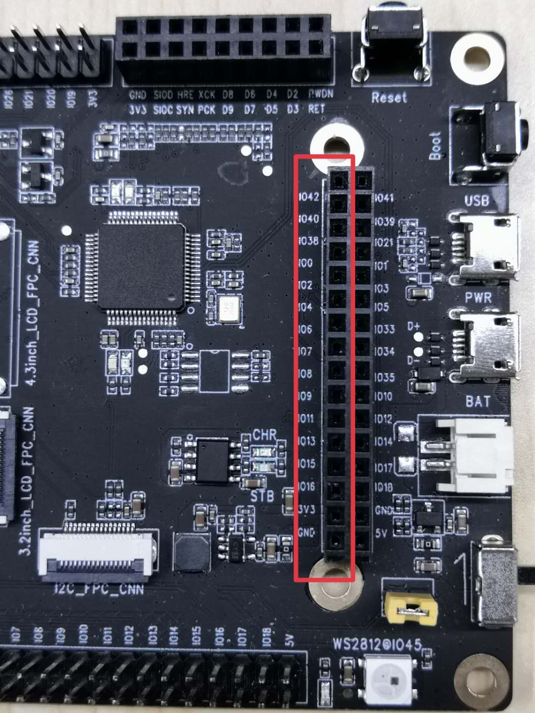
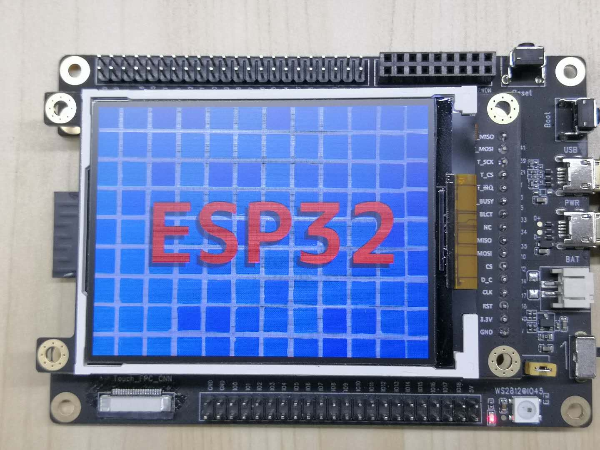

# _SPI LCD screen sample program_

This project shows that jpeg pictures are decoded and cached in memory, and a simple dynamic image is generated and output to the LCD screen.

## 1 Quick Start

### 1.1 Hardware preparation

<table>
    <tr>
        <td ><p align=center>ESP32-S2-Kaluga-1 development board</p></td>
        <td ><p align=center>ESP-LyraP-LCD32 display</p></td>
    </tr>
</table>

### 1.2 Hardware connection

1. Turn on all the DIP switches of SW3 and SW4, that is, the two groups of DIP switches in the lower left corner of the motherboard, as shown below:
* Advanced: If you want to use some touchpad GPIO pins, just turn off the related DIP switch of the touchpad, please refer to the schematic diagram of the motherboard and touchpad for details.
  
<div align="left"></div>  

2. Insert the display into the inner row of the double-row header on the motherboard, as shown below:

<div align="left"></div>  

* ESP32_S2_kaluga-1_v1.1 LCD pin assignment

LCD PIN|MISO|MOSI|CLK|CS|D_C|RST|BCKL(BLCT)|
 ---|---| ---|---| ---|---| ---|---|
 **GPIO** |GPIO8|GPIO9|GPIO15|GPIO11|GPIO13|GPIO16|GPIO6

### 1.3 Configuration Engineering

```
idf.py set-target esp32s2 menuconfig
```

* Configure serial port related information under `Serial flasher config`.
* Set `Example Configuration`->`LCD module type`: configure the display type.
* Set `Example Configuration`->`image type`: Set to display dynamic/static images.

### 1.4 Build and burn

Build the project and burn it into the board, then run the monitoring tool to view the serial output:

```
idf.py -p PORT flash monitor
```

* If there are two port numbers, the largest is `PORT`.

(To exit the serial monitor, type ``Ctrl-]`` )

For the complete steps to configure and use ESP-IDF to build a project, please refer to the Getting Started Guide.


### 1.5 Sample output

When the program is burned in, you will see the following scene, then the burn is successful.



You can also see the following output log on the serial monitor:

```
I (49) boot: ESP-IDF v4.2-dev-1097-g2e14149bf 2nd stage bootloader
I (49) boot: compile time 19:19:55
I (49) boot: chip revision: 0
I (53) qio_mode: Enabling default flash chip QIO
I (58) boot.esp32s2: SPI Speed      : 40MHz
I (63) boot.esp32s2: SPI Mode       : QIO
I (67) boot.esp32s2: SPI Flash Size : 4MB
I (72) boot: Enabling RNG early entropy source...
I (77) boot: Partition Table:
I (81) boot: ## Label            Usage          Type ST Offset   Length
I (88) boot:  0 nvs              WiFi data        01 02 00009000 00006000
I (96) boot:  1 phy_init         RF data          01 01 0000f000 00001000
I (103) boot:  2 factory          factory app      00 00 00010000 00100000
I (111) boot: End of partition table
I (115) esp_image: segment 0: paddr=0x00010020 vaddr=0x3f000020 size=0x16bc0 ( 93120) map
I (145) esp_image: segment 1: paddr=0x00026be8 vaddr=0x3ffbe1a0 size=0x02194 (  8596) load
I (147) esp_image: segment 2: paddr=0x00028d84 vaddr=0x40024000 size=0x00404 (  1028) load
0x40024000: _WindowOverflow4 at /home/chenzhengwei/esp/esp-idf/components/freertos/xtensa/xtensa_vectors.S:1730

I (152) esp_image: segment 3: paddr=0x00029190 vaddr=0x40024404 size=0x06e88 ( 28296) load
I (168) esp_image: segment 4: paddr=0x00030020 vaddr=0x40080020 size=0x16e44 ( 93764) map
0x40080020: _stext at ??:?

I (190) esp_image: segment 5: paddr=0x00046e6c vaddr=0x4002b28c size=0x02f0c ( 12044) load
0x4002b28c: split_if_necessary at /home/chenzhengwei/esp/esp-idf/components/heap/multi_heap.c:281 (discriminator 1)

I (199) boot: Loaded app from partition at offset 0x10000
I (199) boot: Disabling RNG early entropy source...
I (202) cache: Instruction cache        : size 8KB, 4Ways, cache line size 32Byte
I (209) cpu_start: Pro cpu up.
I (213) cpu_start: Application information:
I (218) cpu_start: Project name:     spi_lcd
I (223) cpu_start: App version:      f3c6b2f-dirty
I (228) cpu_start: Compile time:     Apr 20 2020 19:19:49
I (234) cpu_start: ELF file SHA256:  c76856ea7cd7e3ea...
I (240) cpu_start: ESP-IDF:          v4.2-dev-1097-g2e14149bf
I (247) cpu_start: Single core mode
I (251) heap_init: Initializing. RAM available for dynamic allocation:
I (258) heap_init: At 3FFBE198 len 00000008 (0 KiB): D/IRAM
I (264) heap_init: At 3FFC1088 len 0003AF78 (235 KiB): D/IRAM
I (271) heap_init: At 3FFFC000 len 00003A10 (14 KiB): DRAM
I (277) cpu_start: Pro cpu start user code
I (334) spi_flash: detected chip: generic
I (334) spi_flash: flash io: qio
I (335) cpu_start: Starting scheduler on PRO CPU.
I (737) LCD: LCD ID: 00290000
I (737) LCD: ST7789V detected.
I (737) LCD: kconfig: force CONFIG_LCD_TYPE_ST7789V.
I (737) LCD: ST7789V initialization.
```

### 1.6 Troubleshooting

* Burn failed
  * The hardware connection is incorrect: run `idf.py monitor`, then restart the board to see if there are any output logs.
  * The download baud rate is too high: lower the baud rate in the `menuconfig` menu and try again.
* No image displayed
  * Whether the DIP switch is correct: the two rows of DIP switches in the lower left corner are all on (ON).
  * Whether the GPIO configuration in the program is correct: whether the GPIO pins correspond to the display pins.

## 2 Appendix

* [ESP32-S2 data sheet] (../../docs/datasheet/esp32-s2_datasheet_en.pdf)
* [ST7789V data sheet] (../../docs/datasheet/ST7789V.pdf)
* [ESP32-S2-Kaluga-1 motherboard schematic] (../../docs/schematic/SCH_ESP32-S2-KALUGA-1_V1_2_20200325A.pdf)
* [ESP-LyraP-LCD32 display principle diagram] (../../docs/schematic/SCH_ESP-LYRAP-LCD32_V1_1_20200324A.pdf)
