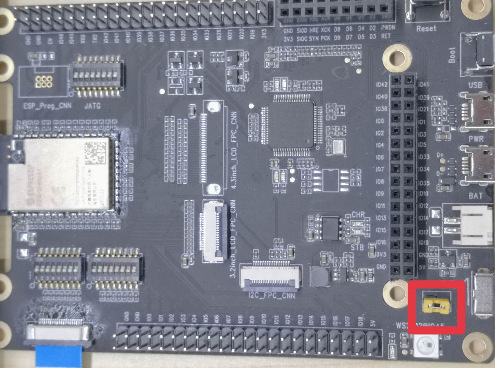
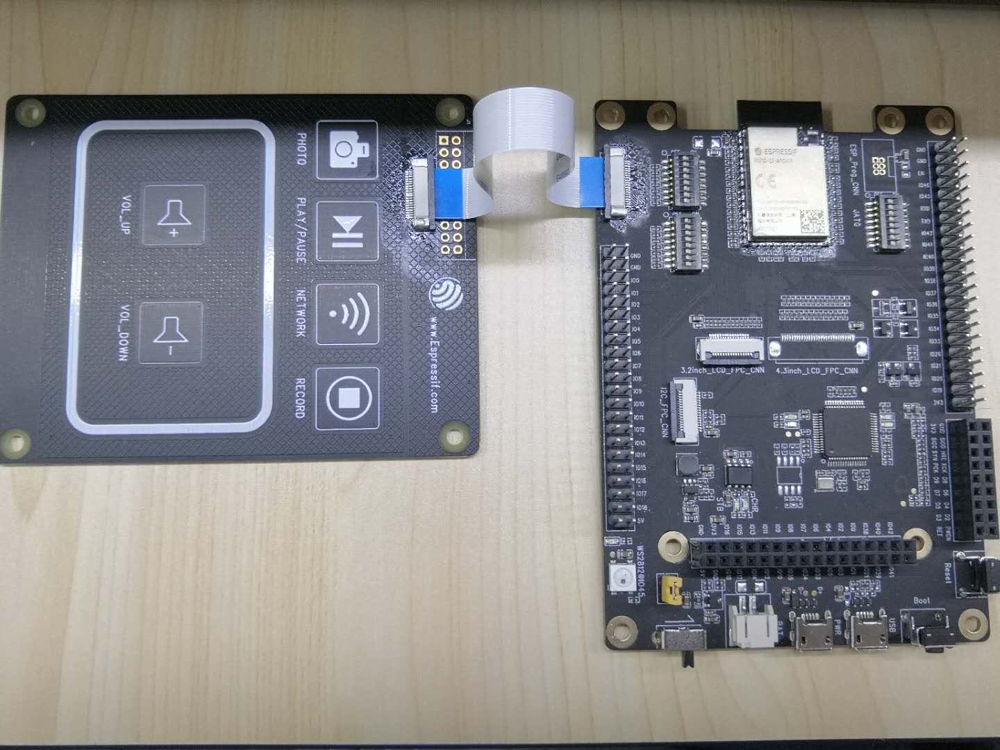

# _Touch panel control LED example program_

This function mainly displays the touch panel to control the color of the led light and adjust the brightness. The functions of each button are as follows:

PHOTO | PLAY/PAUSE | NETWORK | RECORD | VOL_UP | VOL_DOWN |
---|---|---|---|---|---|
Green | Red | Blue | Turn off the lights | Brighten the lights | Darken the lights |

## 1 Quick Start

### 1.1 Hardware preparation

<table>
    <tr>
        <td ><p align=center>ESP32-S2-Kaluga-1 development board< /p></td>
        <td ><p align=center>ESP-LyraP-TOUCHA touchpad</p></td>
    </tr>
</table>

### 1.2 Hardware connection

1. Turn off all the DIP switches of SW3 and SW4 (OFF), that is, the two groups of DIP switches in the lower left corner of the motherboard, as shown below:
* Advanced: If you want to use other pins, just turn off the relevant dial switch of the touch. For details, please refer to the schematic diagram of the motherboard and touch panel.
<div align="left"></div>  

2. Short-circuit the two pins reserved on GPIO45, as shown below:
<div align="left"></div>  

3. Connect the touchpad to the motherboard. As shown below:

<div align="left"></div> </br></br>

* ESP32_S2_Kaluga-1_v1.2 Touch pin assignment

PHOTO | PLAY/PAUSE | NETWORK | RECORD | VOL_UP | VOL_DOWN | GUARD | SHIELD
 ---|---|---|---|---|---|---|---|
 GPIO2 | GPIO6 | GPIO11 | GPIO5 | GPIO1 | GPIO3 |GPIO4 | GPIO14
 
* ESP32_S2_kaluga-1_v1.1 Touch pin assignment

PHOTO | PLAY/PAUSE | NETWORK | RECORD | VOL_UP | VOL_DOWN | GUARD | SHIELD
 ---|---|---|---|---|---|---|---|
 GPIO3 | GPIO8 | GPIO11 | GPIO13 | GPIO2 | GPIO9 |GPIO4 | GPIO14

### 1.3 Configuration Engineering

```
idf.py set-target esp32s2 menuconfig
```

* Configure serial port related information under `Serial flasher config`.
* Set `Example Configuration`-> `WS2812 GPIO`: configure the GPIO pin of the LED light.
* Set `Example Configuration`-> `Number of LEDS in a strip`: the number of connected lights.
* Set `Example Configuration`-> `touch pad type`: select the motherboard version.
  
### 1.4 Build and burn

Build the project and burn it into the board, then run the monitoring tool to view the serial output:

```
idf.py -p PORT flash monitor
```

* If there are two port numbers, the largest is `PORT`.

(To exit the serial monitor, type ``Ctrl-]``)

For the complete steps to configure and use ESP-IDF to build a project, please refer to the Getting Started Guide.

### 1.5 Sample output

When the program is burned in, you will see the following scene, then the burn is successful.

You can also see the following output log on the serial monitor:

```
I (48) boot: chip revision: 0
I (51) boot.esp32s2: SPI Speed      : 40MHz
I (56) boot.esp32s2: SPI Mode       : DIO
I (61) boot.esp32s2: SPI Flash Size : 4MB
I (66) boot: Enabling RNG early entropy source...
I (71) boot: Partition Table:
I (75) boot: ## Label            Usage          Type ST Offset   Length
I (82) boot:  0 nvs              WiFi data        01 02 00009000 00006000
I (89) boot:  1 phy_init         RF data          01 01 0000f000 00001000
I (97) boot:  2 factory          factory app      00 00 00010000 00100000
I (104) boot: End of partition table
I (109) esp_image: segment 0: paddr=0x00010020 vaddr=0x3f000020 size=0x06370 ( 25456) map
I (125) esp_image: segment 1: paddr=0x00016398 vaddr=0x3ffbe240 size=0x01f68 (  8040) load
I (129) esp_image: segment 2: paddr=0x00018308 vaddr=0x40024000 size=0x00404 (  1028) load
0x40024000: _WindowOverflow4 at /home/chenzhengwei/esp/esp-idf/components/freertos/xtensa/xtensa_vectors.S:1730

I (136) esp_image: segment 3: paddr=0x00018714 vaddr=0x40024404 size=0x07904 ( 30980) load
I (154) esp_image: segment 4: paddr=0x00020020 vaddr=0x40080020 size=0x156c0 ( 87744) map
0x40080020: _stext at ??:?

I (179) esp_image: segment 5: paddr=0x000356e8 vaddr=0x4002bd08 size=0x02534 (  9524) load
0x4002bd08: xRingbufferReceive at /home/chenzhengwei/esp/esp-idf/components/esp_ringbuf/ringbuf.c:1104 (discriminator 2)

I (188) boot: Loaded app from partition at offset 0x10000
I (188) boot: Disabling RNG early entropy source...
I (191) cache: Instruction cache        : size 8KB, 4Ways, cache line size 32Byte
I (198) cpu_start: Pro cpu up.
I (202) cpu_start: Application information:
I (207) cpu_start: Project name:     touch
I (212) cpu_start: App version:      8344cda-dirty
I (217) cpu_start: Compile time:     Apr 22 2020 17:55:46
I (223) cpu_start: ELF file SHA256:  9edee7d2ad3b3f70...
I (229) cpu_start: ESP-IDF:          v4.2-dev-1126-gd85d3d969
I (236) cpu_start: Single core mode
I (240) heap_init: Initializing. RAM available for dynamic allocation:
I (247) heap_init: At 3FFBE23C len 00000004 (0 KiB): D/IRAM
I (253) heap_init: At 3FFC09E0 len 0003B620 (237 KiB): D/IRAM
I (260) heap_init: At 3FFFC000 len 00003A10 (14 KiB): DRAM
I (266) cpu_start: Pro cpu start user code
I (325) spi_flash: detected chip: generic
I (326) spi_flash: flash io: dio
I (326) cpu_start: Starting scheduler on PRO CPU.
I (329) Touch pad: Initializing WS2812
I (329) Touch pad: Initializing touch pad
I (329) Touch pad: Denoise function init
I (339) Touch pad: touch pad waterproof init
I (339) Touch pad: touch pad filter init
I (449) Touch pad: touch pad [8] base 17423, thresh 174
I (449) Touch pad: touch pad [3] base 17390, thresh 173
I (449) Touch pad: touch pad [11] base 16966, thresh 169
I (449) Touch pad: touch pad [13] base 15398, thresh 153
I (459) Touch pad: touch pad [2] base 15324, thresh 153
I (459) Touch pad: touch pad [9] base 17431, thresh 174
I (469) Touch pad: touch pad [4] base 15530, thresh 155
```
  
### 1.6 Troubleshooting

* Burn failed
  * The hardware connection is incorrect: run `idf.py monitor` and then restart the board to see if there are any output logs.
  * The download baud rate is too high: lower the baud rate in the `menuconfig` menu and try again.
* No response or bad touch
  * The DIP switch is not turned off properly (OFF).
  * The connection between the touchpad and the motherboard is poor.
  * GPIO45 is not shorted.
  
## 2 Appendix

* [ESP32-S2 data sheet] (../../docs/datasheet/esp32-s2_datasheet_en.pdf)
* [ESP32-S2-Kaluga-1 motherboard] (../../docs/schematic/SCH_ESP32-S2-KALUGA-1_V1_2_20200325A.pdf)
* [ESP-LyraP-TOUCHA touchpad] (../../docs/schematic/SCH_ESP-LYRAP-TOUCHA_V1.1_20200325A.pdf)
