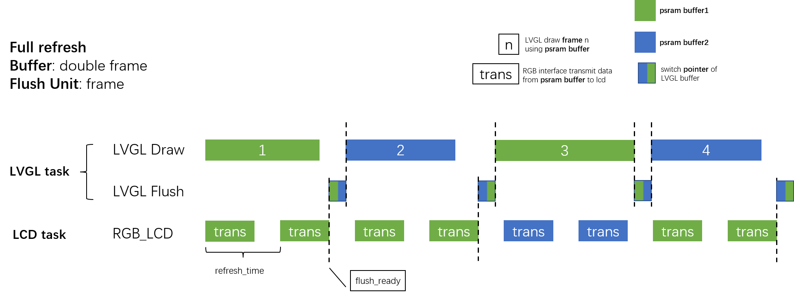
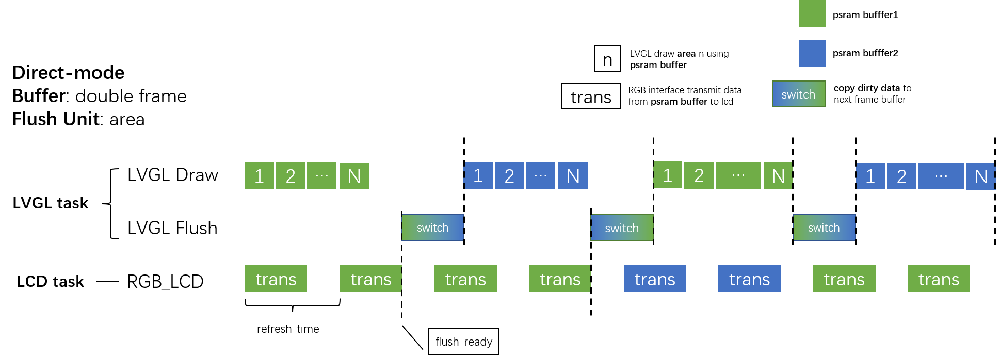

# LVGL Demos Example

An example used to run LVGL's demos on ESP32-S3-LCD-EV-Board. Internal demos include music player, widgets, stress and benchmark. What's more, the printer and tuner are generated from [Squareline](https://squareline.io/).

This example alse shows two methods to avoid tearing effect. It uses two frame buffers and semaphores based on LVGL **buffering modes**. For more information about this, please refer to official [documents](https://docs.lvgl.io/master/porting/display.html?#buffering-modes). The implementation principles of them are shown as follows:

## Full-refresh

## Direct-mode

## How to use example

### Configurations

Run `idf.py menuconfig` and go to `Board Support Package`:

* `BSP_LCD_SUB_BOARD`: Choose a LCD sub-board according to hardware
* `BSP_DISPLAY_LVGL_BUF_CAPS`: Choose the memory type of LVGL buffer. Internal memory is more fast.
* `BSP_DISPLAY_LVGL_BUF_HEIGHT`: Set the height of LVGL buffer, and its width is equal to LCD's width.
* `BSP_DISPLAY_LVGL_AVOID_TEAR`: Avoid tearing effect by using double buffers. Need to enable `BSP_LCD_RGB_DOUBLE_BUFFER` and `BSP_LCD_RGB_REFRESH_TASK_ENABLE` first.

**Note**: When `BSP_DISPLAY_LVGL_AVOID_TEAR` is enabled, the screen does not support software rotation like calling `bsp_display_rotate()` or setting software rotation through LVGL.

### Build and Flash

Run `idf.py -p PORT build flash monitor` to build, flash and monitor the project.

(To exit the serial monitor, type ``Ctrl-]``.)

See the [Getting Started Guide](https://docs.espressif.com/projects/esp-idf/en/latest/get-started/index.html) for full steps to configure and use ESP-IDF to build projects.

## Example Output

Run the example, you will see an example of LVGL's internal demos, default is music player.

## Performance Test

### Test Environment

|         Params         |    Value     |
| :--------------------: | :----------: |
| Configuration of PSRAM | Octal, 120M  |
| Configuration of Flash |  QIO, 120M   |
|    Version of LVGL     |    v8.3.0    |
|   Test Demo of LVGL    | Music player |
|    DCache Line Size    |   64 Byte    |
|         Others         |   Default    |

### Description of Buffering Mode

| Buffering Mode |                    Description                    |
| :------------: | :-----------------------------------------------: |
|     Mode1      | One buffer with 100-line heights in internal sram |
|     Mode2      |        One buffer with frame-size in psram        |
|     Mode3      |  Full-refresh with two frame-size psram buffers   |
|     Mode4      |   Direct-mode with two frame-size psram buffers   |

### Average FPS with 480x480

| Buffering Mode | Average FPS |
| :------------: | :---------: |
|     Mode1      |     30      |
|     Mode2      |     25      |
|     Mode3      |     23      |
|     Mode4      |     23      |

### Average FPS with 800x480

| Buffering Mode | Average FPS |
| :------------: | :---------: |
|     Mode1      |     27      |
|     Mode2      |     21      |
|     Mode3      |     19      |
|     Mode4      |     17      |

## Troubleshooting

* Program upload failure
    * Hardware connection is not correct: run `idf.py -p PORT monitor`, and reboot your board to see if there are any output logs.
    * The baud rate for downloading is too high: lower your baud rate in the `menuconfig` menu, and try again.
    * Error message with `A fatal error occurred: Could not open /dev/ttyACM0, the port doesn't exist`: Please first make sure development board connected, then make board into "Download Boot" mode to upload by following steps:
        1. keep press "BOOT(SW2)" button
        2. short press "RST(SW1)" button
        3. release "BOOT(SW2)".
        4. upload program and reset
* LCD screen tear effect
    * Enable to avoid tearing effect in menuconfig.
* LCD screen flickering after enable avoid tearing effect
    * Set lower screen refresh period.

## Technical support and feedback

Please use the following feedback channels:

* For technical queries, go to the [esp32.com](https://esp32.com/) forum
* For a feature request or bug report, create a [GitHub issue](https://github.com/espressif/esp-dev-kits/issues)

We will get back to you as soon as possible.
