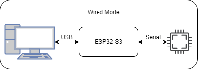
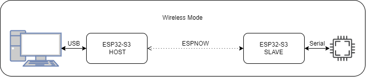

# ESP32-S3-USB-Bridge

该项目基于 ESP USB Bridge 二次开发，增加了通过 ESP-NOW 烧录和串口通信的功能。点击了解 [ESP USB Bridge](https://github.com/espressif/esp-usb-bridge#readmehttps://github.com/espressif/esp-usb-bridge#readme)

## 硬件

* ESP32-S2/ESP32-S3 开发板
    * ESP32-S3-USB-Bridge - [用户指南](../../../docs/en/esp32s3/esp32-s3-usb-bridge/user_guide.rst)
    * ESP32-S3-DevkitC-1 - [用户指南](https://docs.espressif.com/projects/esp-idf/zh_CN/latest/esp32s3/hw-reference/esp32s3/user-guide-devkitc-1.html)
* 用于下载和编程的 USB 数据线

## 烧录

* 按住开发板 Boot 按键后点按 Reset 按键进入下载模式

Note: ESP32-S3-USB-Bridge 开发板为按住开发板 Boot 按键后重新上电

## 模式

本示例支持三种工作模式，分别为有线模式，无线主机模式，以及无线从机模式。

|     功能     | 有线模式 | 无线主机模式 | 无线从机模式 |
| :----------: | :------: | :----------: | :----------: |
| USB 串口通信 |    √     |      √       |      √       |
|   串口烧录   |    √     |      √       |      √       |
|  JTAG 调试   |    √     |              |              |
|     MSC      |    √     |      √       |              |
|   UF2 升级   |    √     |              |              |

### 有线模式



有线模式支持 USB 转串口，JTAG 调试，UF2 升级。

### 无线模式



基于 ESPNOW 无线功能实现无连接的数据收发(必须有主从两个设备)，目前支持无线串口数据收发和无线烧录

Note: 数据传输可靠性与 WIFI 环境是否良好有关

### 模式切换

默认模式颜色：
* 紫色： 有线模式
* 蓝色： 无线主机
* 绿色： 无线从机

模式切换：
* 双击开发板 Boot 按键: 切换工作状态，当指示灯变色代表模式切换成功

无线模式下主从机绑定与解绑：
1. 未绑定时，指示灯闪烁
2. 长按无线主从开发板 Boot 按键开始绑定，指示灯呼吸,绑定持续 10s
3. 绑定成功，指示灯常亮
4. 长按 2s 解绑，指示灯闪烁

## 烧录

1. 如果使用 ESP32-S3-USB-Bridge 开发板，请使用
    ```
        rm -rf build sdkconfig sdkconfig.old
        idf.py -D SDKCONFIG_DEFAULTS="sdkconfig.defaults;sdkconfig.esp32-s3-usb-bridge" reconfigure
    ```

2. 运行 `idf.py -p PORT flash monitor` 去编译烧录监视目标设备。
    **注意：对于 ESP32-S3-USB-Bridge 开发板，需要按住 ESP32-S3 Boot 按键，重新上电才能烧录。**

    <div style="display: flex; justify-content: center;">
    
    </div>

    (退出 Monitor 请键入 ``Ctrl-]``.)

查看 [Getting Started Guide](https://docs.espressif.com/projects/esp-idf/en/latest/get-started/index.html) 获取更多的帮助。

## 技术支持和反馈

请使用以下反馈渠道：

* 如有技术问题，请访问 [esp32.com](https://esp32.com/) 论坛
* 如有功能请求或错误报告，请创建一个 [GitHub 问题](https://github.com/espressif/esp-dev-kits/issues)

我们会尽快回复您。
