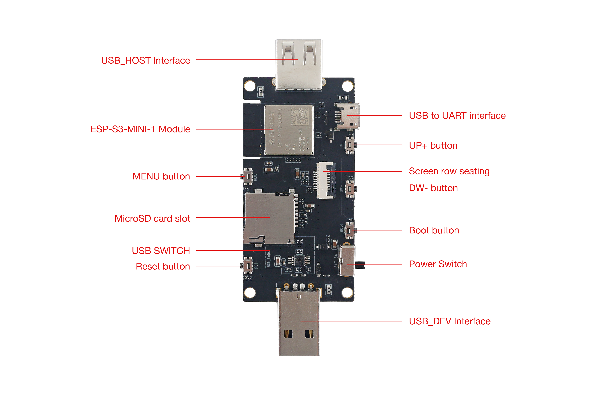
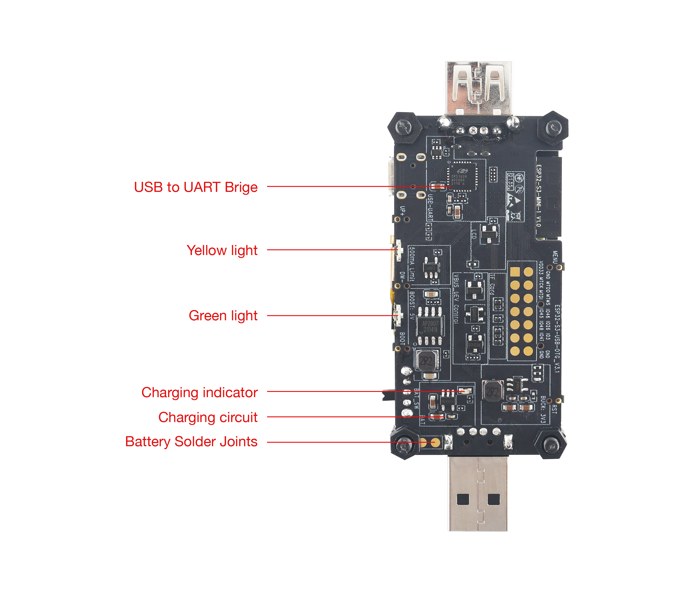
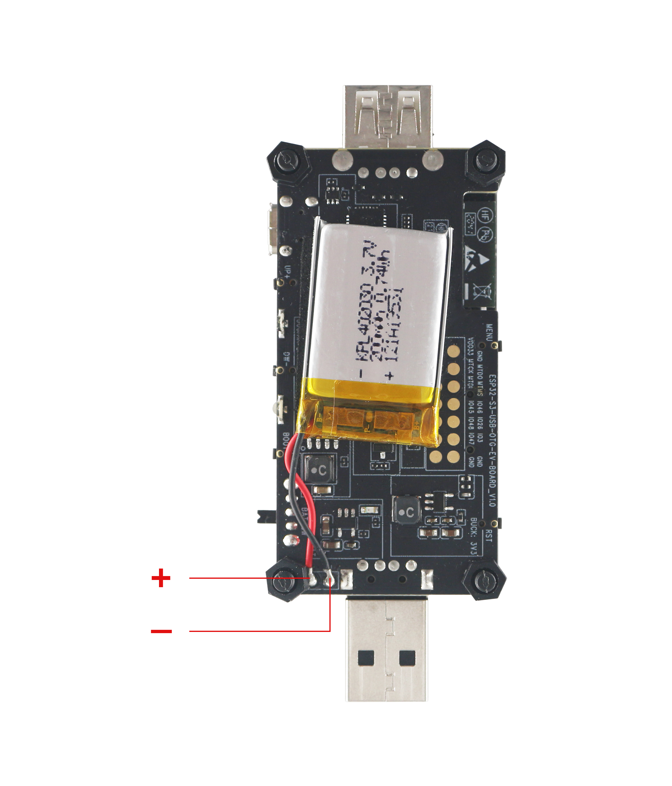
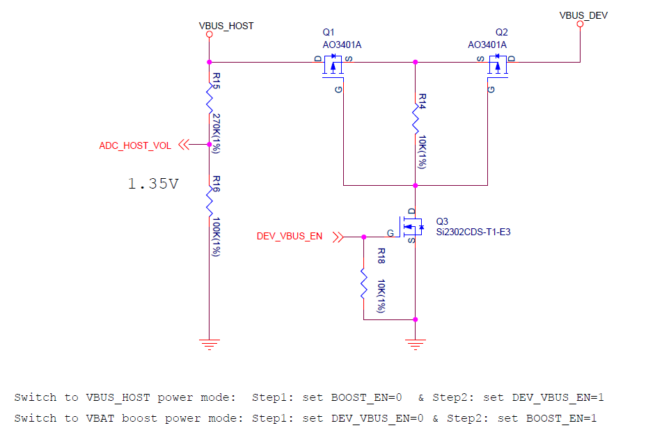
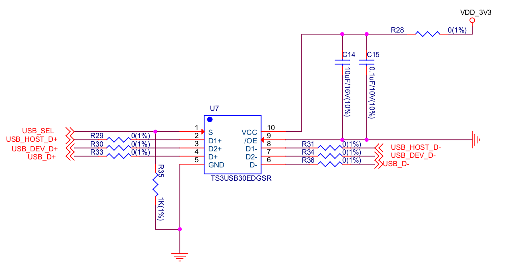
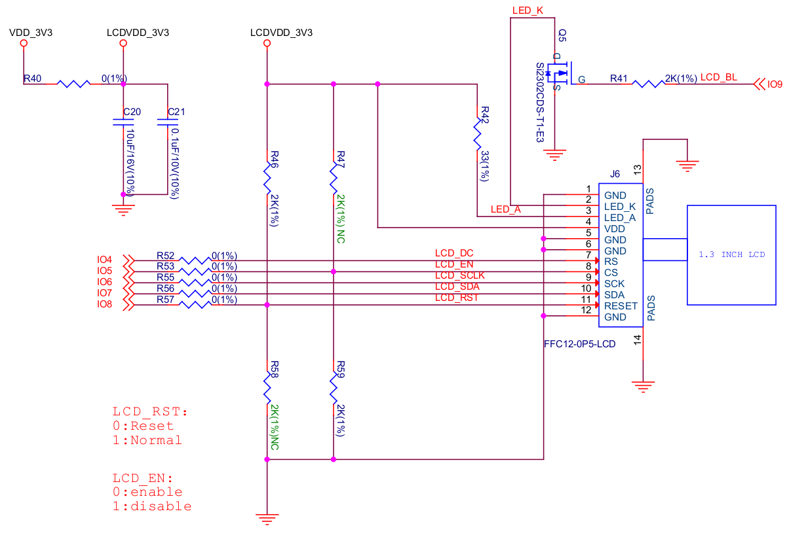
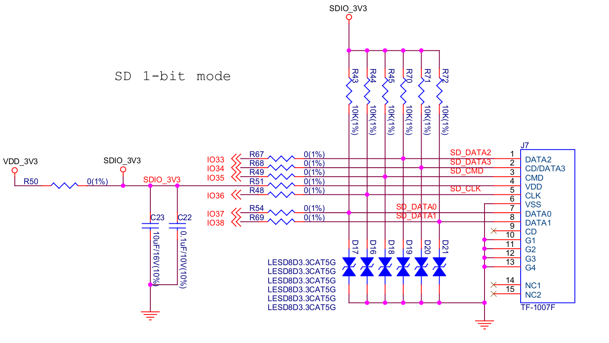

* [中文版本](README_cn.md)

# ESP32-S3-USB-OTG Development Board

ESP32-S3-USB-OTG is a development board that focuses on USB-OTG function verification and application development. It is based on ESP32-S3 SoC, supports Wi-Fi and BLE 5.0 wireless functions, and supports USB host and USB device functions. It can be used to develop applications such as wireless storage devices, Wi-Fi network cards, LTE MiFi, multimedia devices, virtual keyboards and mice. The development board has the following features:

* Onboard ESP32-S3-MINI-1-N8 module, with built-in 8MB flash
* Onboard USB Type-A host and device interface, built-in USB interface switching circuit
* Onboard USB to serial debugging chip (Micro USB interface)
* Onboard 1.3-inch LCD color screen, support GUI
* Onboard SD card interface, compatible with SDIO and SPI interfaces
* Onboard charging IC, can be connected to lithium battery

    

 ESP32-S3-USB-OTG (click to enlarge) 

**The document consists of the following major sections:**

* [Getting Started](#Getting-Started): Provides a brief overview of ESP32-S3-USB-OTG and necessary hardware and software information.
* [Hardware Reference](#Hardware-Reference): Provide detailed hardware information of ESP32-S3-USB-OTG.
* [Related Documents](#Related-Documents): Provide links to related documents.

## Getting Started

This section describes how to start using ESP32-S3-USB-OTG. First, introduce some basic information about ESP32-S3-USB-OTG, then introduce how to start using the development board for application development, and finally introduce the development board packaging and retail information.

### Description of Components

The ESP32-S3-USB-OTG development board includes the following parts:

* **Motherboard:** ESP32-S3-USB-OTG motherboard is the core of the kit. The motherboard integrates the ESP32-S3-MINI-1 module and provides an interface of the 1.3-inch LCD screen.

 ESP32-S3-USB-OTG Top view (click to enlarge) 

 ESP32-S3-USB-OTG Bottom view (click to enlarge) 

The following table starts with the ESP32-S3-MINI-1 module on the right, and introduces the main components in the above figure in clockwise order.

| Main components | Description |
| :---- | :---- |
| ESP32-S3-MINI-1 Module | ESP32-S3 is a powerful, generic Wi-Fi + Bluetooth LE MCU modules that have a rich set of peripherals. They provide acceleration for neural network computing and signal processing workloads. ESP32-S3-MINI-1 comes with a PCB antenna and is pin-to-pin compatible with ESP32-S2-MINI-1 |
| USB_HOST interface | USB Type-A female port, used to connect other USB devices. |
| USB to UART interface | A Micro-USB port used for power supply to the board, for flashing applications to the chip, as well as for communication with the chip via the on-board USB-to-UART bridge. |
| UP+ button | Up button. |
| Screen interface | Used to connect 1.3-inch LCD screen. |
| DW- button | Down button. |
| Boot button | Download button. Holding down Boot and then pressing Reset initiates Firmware Download mode for downloading firmware through the serial port. |
| Battery switch | Switch to ON to use battery power; Switch to OFF to power off battery. |
| USB_DEV interface | USB Type-A male port, can be connected to the USB host, and also used as a lithium battery charge power source. |
| USB switch IC | By setting the level of USB_SEL, you can switch USB peripherals connected to the USB_DEV or USB_HOST interface, connected to USB_DEV by default. |
| Reset button | Press this button to restart the system. |
| MicroSD slot | MicroSD card can be inserted. 4-line SDIO and SPI mode both supported |
| MENU button | Menu button |
| Battery solder joints | 3.6V lithium battery can be welded to power the motherboard |
| Charging circuit | Used to charge lithium battery |
| Charging LED | During charging, the red light is on, off when charged |
| Green LED | Driven by GPIO, Set high level to turn on |
| Yellow LED | Driven by GPIO, Set high level to turn on |
| USB to UART Bridge | Single USB-to-UART bridge chip provides transfer rates up to 3 Mbps. |

* **Subboard:** ESP32-S3-USB-OTG-SUB mount the 1.3-inch LCD screen

 ESP32-S3-USB-OTG Subboard (click to enlarge) 

### Start Application Development

Before powering on the ESP32-S3-USB-OTG, please make sure that the development board is intact.

#### Required Hardware

* ESP32-S3-USB-OTG
* A USB 2.0 data cable (standard A to Micro-B)
* Computer (Windows, Linux or macOS)

#### Software Setup

Please proceed to [Get Started](https://docs.espressif.com/projects/esp-idf/en/latest/esp32s3/get-started/index.html), where Section [Installation Step by Step](https://docs.espressif.com/projects/esp-idf/en/latest/esp32s3/get-started/index.html#get-started-step-by-step) will quickly help you set up the development environment and then flash an application example onto your board.

Then, you can click [here](./examples) to get stated with ESP32-S3-USB-OTG examples.

### Contents and Packaging

#### Retail Orders

If you order a few samples, each board comes in an individual package in either antistatic bag or any packaging depending on your retailer.

 ESP32-S3-USB-OTG packaging diagram (click to enlarge) 

Which contains the following parts:
* Motherboard:
  * ESP32-S3-USB-OTG
* Subboard: 
  * ESP32-S3-USB-OTG_SUB
* Fastener
  * Mounting bolt (x4)
  * Screw (x4)
  * Nut (x4)

For retail orders, please go to https://www.espressif.com/zh-hans/company/contact/buy-a-sample.

#### Wholesale Order

If purchased in bulk, the development board will be packaged in a large cardboard box.

For wholesale orders, please go to https://www.espressif.com/en/contact-us/sales-questions.

## Hardware Reference

### Block Diagram

The block diagram below shows the components of ESP32-S3-USB-OTG and their interconnections.

 ESP32-S3-USB-OTG block diagram 

Please note that the external interface corresponding to the `USB_HOST D+ D-` signal in the functional block diagram is `USB DEV`, which means that ESP32-S3 is used as a device to receive signals from other USB hosts. The external interface corresponding to the `USB_DEV D+ D-` signal is `USB HOST`, which means that ESP32-S3 acts as a host to control other devices.

### Power Supply Options

There are three power supply methods for the development board:

1. Power supply through the `Micro_USB` interface
   * Using the USB cable connect to the motherboard Micro-B, and set battery switch to OFF. Please note that in this power supply mode, only the motherboard and display are powered.
2. Power supply through the `USB_DEV` interface
   * Set `DEV_VBUS_EN` to high level, and set battery switch to OFF. This mode can supply power to the `USB HOST` interface. The lithium battery will be charged at the same time (if the lithium battery is installed)
3. Power supply through battery
   * Set `BOOST_EN` to high level, and set battery switch to ON. You should solder a 1-Serial lithium battery (3.7-4.2V) to the power solder joint reserved on the back of the motherboard first. This  mode can supply power to the `USB HOST` interface at the same time. The battery interface description is as follows:

 Battery connection diagram 

### USB HOST Interface Power Options

The `USB HOST` interface (Type-A female port) can supply power to the connected USB device. The power supply voltage is 5V and the maximum current is 500mA.

* There are two power supply methods for `USB HOST` interface:
  1. Power is supplied through the `USB_DEV` interface, and the 5V power is directly from the power source connected to the interface.
  2. Power is supplied through the lithium battery, and the 3.6V~4.2V voltage of the lithium battery is boosted to 5V through the Boost circuit. The working status of Boost IC can be controlled by BOOST_EN / GPIO13, set high to enable Boost.

  

  
  

  
 boost circuit 

* `USB HOST` interface power supply selection:

|BOOST_EN|DEV_VBUS_EN|Power Supply|
|:--:|:--:|:--:|
|0|1| USB_DEV |
|1|0| Battery |
|0|0| No output |
|1|1| Undefined |

  

  
  

  
 power switch circuit 

* 500mA current limiting circuit:
  1. The current limiting IC MIC2005A can limit the maximum output current of the `USB HOST` interface to 500 mA. You must set the `IDEV_LIMIT_EN` (GPIO17) to high level to enable the current-limiting IC to output voltage.

  

  
  

  
 500mA current limiting circuit 

### Usb Interface Switch Circuit

 USB interface switching circuit 

* When set **USB_SEL** (GPIO18) to high level, the USB D+/D- Pin (GPIO19,20) will be connected to `USB_DEV D+ D-`. Then you can use the `USB HOST` interface (Type-A female Port) to connect other USB devices. 
* When set **USB_SEL** (GPIO18) to low level, the USB D+/D- Pin (GPIO19,20) will be connected to `USB_HOST D+ D-`,  Then you can be use the `USB DEV` interface (Type-A male port) to connect to host like PC.
* **USB_SEL** is low level by default.

### LCD Interface

 LCD interface diagram 

Please note that this interface supports connecting SPI interface screens. The screen controller used by this development board is [ST7789](docs/hw/ST7789VW_datasheet.pdf), and `LCD_BL` (GPIO9) can be used to control the screen backlight.

### SD Card Interface

 SD card interface diagram 

Please note that the SD card interface is compatible with 1-wire, 4-wire SDIO mode and SPI mode. After power on, the card will be in 3.3V signaling mode. Send the first CMD0 command to select the bus mode.

### Charging Circuit

 Charging circuit 

Please note that the Type-A male port can be connected to a power adapter that outputs 5V. When charging the battery, the red indicator LED is on, after fully charged, the red indicator LED is off. When using the charging circuit, please set the battery switch to OFF. The charging current is 212.7 mA.

### Pin Layout

**Function pin:**

| No. | ESP32-S3-MINI-1 Pin | Description |
| :--- | :--- | :---- |
| 1 | GPIO18 | USB_SEL: Used to switch the USB interface, when high level, the USB_HOST interface is enabled. when low level, the USB_DEV interface is enabled |
| 2 | GPIO19 | Connect with USB D- |
| 3 | GPIO20 | Connect with USB D+ |
| 4 | GPIO15 | LED_GREEN: the light is lit when set high level |
| 5 | GPIO16 | LED_YELLOW: the light is lit when set high level |
| 6 | GPIO0 | BUTTON_OK: OK button, low level when pressed |
| 7 | GPIO11 | BUTTON_DW: Down button, low level when pressed |
| 8 | GPIO10 | BUTTON_UP: UP button, low level when pressed |
| 9 | GPIO14 | BUTTON_MENU: MENU button, low level when pressed |
| 10 | GPIO8 | LCD_RET: used to reset LCD, low level to reset |
| 11 | GPIO5 | LCD_EN: used to enable LCD, low level to enable |
| 12 | GPIO4 | LCD_DC: Used to switch data and command status |
| 13 | GPIO6 | LCD_SCLK: LCD SPI Clock |
| 14 | GPIO7 | LCD_SDA: LCD SPI MOSI |
| 15 | GPIO9 | LCD_BL: LCD backlight control |
| 16 | GPIO36 | SD_SCK: SD SPI CLK / SDIO CLK |
| 17 | GPIO37 | SD_DO: SD SPI MISO / SDIO Data0 |
| 18 | GPIO38 | SD_D1: SDIO Data1 |
| 19 | GPIO33 | SD_D2: SDIO Data2 |
| 20 | GPIO34 | SD_D3: SD SPI CS / SDIO Data3 |
| 21 | GPIO1 | HOST_VOL: USB_DEV voltage monitoring, ADC1 channel 0 |
| 22 | GPIO2 | BAT_VOL: Battery voltage monitoring, ADC1 channel 1 |
| 23 | GPIO17 | LIMIT_EN: Enable current limiting IC, high level enable |
| 24 | GPIO21 | 0VER_CURRENT: Current overrun signal, high level means overrun |
| 25 | GPIO12 | DEV_VBUS_EN: High level to enable DEV_VBUS power supply |
| 26 | GPIO13 | BOOST_EN: High level to enable Boost boost circuit |

**Extended pin:**

| No. | ESP32-S3-MINI-1 Pin | Description |
| :--- | :--- | :---- |
| 1 | GPIO45 | FREE_1: Idle, can be customized |
| 2 | GPIO46 | FREE_2: Idle, can be customized |
| 3 | GPIO48 | FREE_3: Idle, can be customized |
| 4 | GPIO26 | FREE_4: Idle, can be customized |
| 5 | GPIO47 | FREE_5: Idle, can be customized |
| 6 | GPIO3 | FREE_6: Idle, can be customized |

## Related Documents

* [ESP32-S3 Technical Specification](https://www.espressif.com/sites/default/files/documentation/esp32-s3_datasheet_cn.pdf) (PDF)
* [ESP32-S3-MINI-1 & ESP32-S3-MINI-1U Technical Specifications](https://www.espressif.com/sites/default/files/documentation/esp32-s3-mini-1_mini-1u_datasheet_cn.pdf) (PDF)
* [Espressif Product Selection Tool](https://products.espressif.com/#/product-selector?names=)
* [ESP32-S3-USB-OTG schematic diagram](./docs/hw/SCH_ESP32-S3_USB_OTG.pdf) (PDF)
* [ESP32-S3-USB-OTG PCB layout drawing](./docs/hw/PCB_ESP32-S3_USB_OTG.pdf) (PDF)
