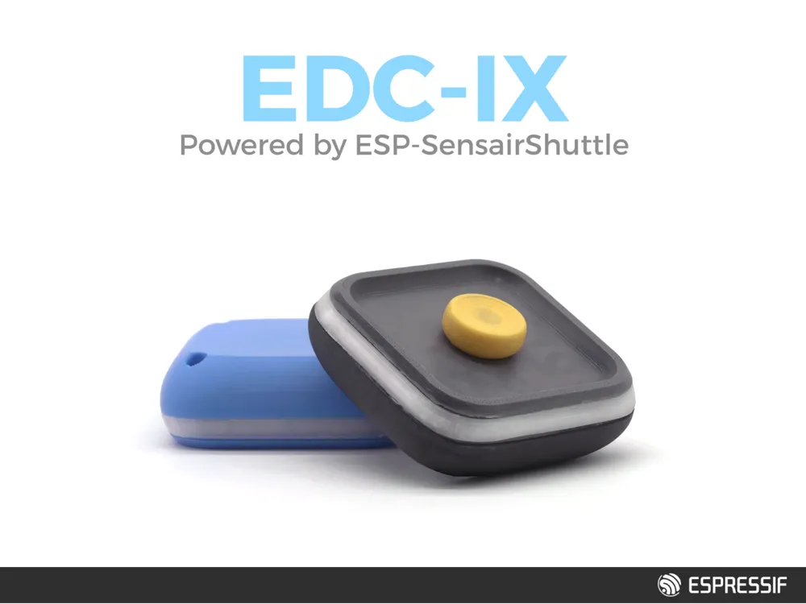

# MagEDC IX Demo — EDC Fidget Toy Interactive Demo

English | [中文](README_CN.md)

An interactive magnetic-bead EDC (fidget) demo built on the **ESP32-C5 SensairShuttle**. A **BMM350** magnetometer senses the position of a magnetic bead over a 3×3 (9-zone) magnet array. Combined with real-time LED feedback and speaker sound effects, it streams live telemetry to a web UI (`upperlevelmachine/game_demo.html`) for mini-games (runner / rhythm / fishing).



## Open-source enclosure

The enclosure model required to build the EDC-IX form shown above is open source.
Download it from
[MakerWorld: ESP-SensairShuttle EDC-IX](https://makerworld.com/zh/models/3305518-esp-sensairshuttle-edc-ix).

## How it works

- **BMM350 magnetometer**: sampled at 100Hz, EMA-smoothed, then mapped to a zone using polar coordinates relative to the center plus Gaussian confidence.
- **BMI270 IMU**: motion wakeup paired with deep-sleep power saving.
- **LED strip (WS2812)**: highlights the active zone in real time; color shifts blue → orange → red with motion speed.
- **Speaker (I2S PDM)**: plays a per-zone tone; gesture toggle and web-based tuning.
- **Wi-Fi (STA)**: once connected, talks to the web UI over HTTP POST (control) + SSE (live telemetry).
- **Web client**: `upperlevelmachine/game_demo.html`, opened locally in a browser for live visualization and games.

## Directory layout

```
magedc_ix/
├── main/                 # firmware: detect / LED / speaker / Wi-Fi / web
├── boards/esp_sensairshuttle/
├── upperlevelmachine/    # browser UI
└── tools/
```

## Hardware Required

- **Board**: ESP-SensairShuttle (ESP32-C5)
- **Sensors**: BMM350 (magnetometer), BMI270 (IMU, motion wakeup) (all integrated on the Shuttle board)
- **Peripherals**: WS2812 LED strip, PDM speaker
- **Magnet array**: nine magnets for zone constraint (magnetic-snap feel)
- **Bead**: one magnetic bead used for sliding position detection

## Software Requirements

### ESP-IDF Version
- `idf: ">=5.5"`, target `esp32c5`. Build-verified with **v5.5.4**, **v6.0.1**, and **v6.0.3**.

### Dependencies
- `espressif/bmm350` (^1.1.0) from the ESP Component Registry
- `espressif/bmi270_sensor` (^0.4.0) from the ESP Component Registry
- `espressif/esp_board_manager`, `espressif/led_strip`, `espressif/mdns`

## Build and Flash

### 1. Enter the example directory

```bash
cd examples/esp-sensairshuttle/examples/magedc_ix
```

### 2. Set up the ESP-IDF environment

Follow the [ESP-IDF Get Started Guide](https://docs.espressif.com/projects/esp-idf/en/latest/esp32c5/get-started/index.html) (target chip `esp32c5`).

```bash
. $HOME/esp/esp-idf/export.sh   # Windows: . $env:IDF_PATH\export.ps1
```

### 3. Generate Board Configuration (Important)

The example uses ESP Board Manager `~0.7.3~1`, the `esp_boards` package `0.6.2`, and the upstream
`esp_boards/esp_sensairshuttle` definition. The auto-amend overlay in
`boards/esp_sensairshuttle` removes display and application-owned devices.
BMGR owns the shared I2C bus, LED strip, and speaker-enable GPIO.
MagEDC owns BMI270 / BMM350 and the custom 24 kHz PDM audio path.

Run `set-target esp32c5` to select the chip and download the Registry dependencies
before generating the board configuration. Regenerate after changing the board
package or overlay. ESP-IDF 5.5 requires the extension path below;
ESP-IDF 6.0 also discovers component extensions automatically.

```bash
# Linux / macOS
idf.py set-target esp32c5
export IDF_EXTRA_ACTIONS_PATH="$PWD/managed_components/espressif__esp_board_manager"
idf.py bmgr -c ./boards -b esp_sensairshuttle
```

```bat
REM Windows
idf.py set-target esp32c5
set IDF_EXTRA_ACTIONS_PATH=%CD%\managed_components\espressif__esp_board_manager
idf.py bmgr -c .\boards -b esp_sensairshuttle
```

### 4. Build and Flash

```bash
idf.py build
idf.py -p PORT flash monitor   # replace PORT with your serial port
```

To exit the serial monitor, type `Ctrl-]`.

## How to Play (first-time walkthrough)

### Step 1: Mandatory first run — 9-point magnetic calibration

On the first flash (no calibration data in NVS), the device **automatically enters the 9-point calibration wizard**; the LED strip first flashes red as a prompt.

1. Calibration starts at the **center**; the strip highlights the zone to calibrate in **amber** (for the center the **whole strip lights up**).
2. Place the bead on the highlighted zone and **hold it still**. Movement interrupts sampling and restarts collection for the current zone. Once stable sampling completes, the zone turns **green** to confirm and **auto-advances to the next zone**.
3. Complete all 9 zones in order. The result is written to NVS (survives power-off).

> **Calibration persistence**: complete, valid calibration data is restored after reset, deep-sleep wake and normal firmware updates that preserve NVS and the calibration schema. Missing, damaged or incompatible calibration data automatically starts the 9-point wizard again.
>
> To recalibrate (the EDC enclosure exposes no button): once you "Connect Serial" in the web page, click the **"🎯 Recalibrate" button** to send `RECALIB` (or send `RECALIB` manually from any serial monitor), or `idf.py erase-flash` and reflash.

### Step 2: Open the web page and provision Wi-Fi

Open the local page `upperlevelmachine/game_demo.html` in **Chrome / Edge** (Web Serial required): click **"串口连接" (Connect Serial)** and pick the device port (115200) → enter your Wi-Fi SSID/password (leave empty for open networks) → click **"配网并连接" (Provision & Connect)**. Once connected the device prints `WIFI_READY:<ip>` over serial, and the page auto-reads the IP and connects via HTTP/SSE.

### Step 3: Play and sound

Once connected, move the bead across the 9 zones — the page shows the live position and offers Runner / Rhythm / Fishing modes.

- **Gesture toggles sound**: move the bead to **zone 1 → zone 9** in sequence (pausing briefly at each) to toggle the speaker **on / off**.
- **When on**: each zone plays a **different piano note**, so you can play it like a keyboard (center zone 5 is a silent transit position).
- **Fishing mode**: in the web **Fishing** tab, flick the bead **upward** to cast; once hooked, **slide left/right** to fight the fish and do a **clockwise circular slide** to reel in, with a dynamic water surface and stage HUD to land the fish.

### Step 4: Idle sleep / pick-up wake

When you're done, just set it down:

- After **60 seconds** of no valid zone activity in running mode, it can enter **deep sleep**. This timer starts again when calibration finishes. Wi-Fi activity or an unavailable IMU wakeup path defers sleep.
- **Pick it up or shake it** (motion detected by the IMU) and it **wakes automatically** and resumes — no button needed.

## Web auto-connect

The page auto-connects by default using the cached device address and retries automatically if an established connection drops. If the initial connection cannot find the device, use "搜索设备" (Search Device). Due to browser security, **serial authorization** still requires one manual click on "串口连接".

## Gesture mapping tab

The web page has a **Gesture** tab:

- Record a gesture of **2 to 8 steps** as an ordered zone sequence on the 3×3 grid (e.g. `1 -> 2 -> 3`).
- Name it and map it to an exposed action.
- Currently available action:
  - `toggle speaker` (controlled via the device `/api/audio`).

The page confirms a save only after the device reports success. A rejected request or failed NVS write leaves the previous gesture active.

> Note: the `toggle speaker` gesture is pushed to the firmware and stored in NVS (device-side persistence), so it keeps working on the device even with the web page closed.

## Subsequent Use

- The device **auto-reconnects** to the saved Wi-Fi and restores complete, valid calibration data.
- To get the device IP again: click "串口连接" — the page auto-probes `WIFI_STATUS` and fills in the IP; it also caches the last IP, so you can click "IP 连接" directly.
- To clear the saved Wi-Fi: send `WIFI_CLEAR` over serial.

## Serial Commands (for debugging / host tools)

| Command | Description |
| --- | --- |
| `WIFI_CFG\t<ssid>\t<pass>` | Provision (save credentials and connect); fields are Tab-separated |
| `WIFI_STATUS` | Query status; replies `WIFI_READY:<ip>` when connected |
| `WIFI_STOP` | Disconnect Wi-Fi |
| `WIFI_CLEAR` | Clear saved credentials and disconnect |
| `RECALIB` | Restart the 9-point magnetic calibration |

## Low-power design

The firmware uses a **three-tier power strategy** to balance "instantly playable" with "saves power when set down":

1. **Running (connected / interactive) — auto Light Sleep + DTIM10 Modem Sleep**
   - ESP-IDF auto Light Sleep is enabled via `esp_pm_configure` (`light_sleep_enable = true`): during idle gaps the CPU and radio power down and wake within milliseconds on interrupt/timer, transparently to the user. Requires `CONFIG_PM_ENABLE=y` and `CONFIG_FREERTOS_USE_TICKLESS_IDLE=y` (already enabled in `sdkconfig`).
   - Wi-Fi runs in **Modem Sleep (`WIFI_PS_MAX_MODEM`) + DTIM10**: `listen_interval = WIFI_STA_LISTEN_INTERVAL` (default **10**) makes the station wake its radio roughly every 10 beacons (~1 s) to receive, powering the radio down in between — far lower connected standby power than waking on every beacon.
   - **Latency trade-off**: DTIM10 affects **downlink** only — web HTTP POST commands may take up to ~1 s to reach the device; SSE is the device's **uplink** push and can be sent anytime, so it is **unaffected** and live data stays smooth. Lower `WIFI_STA_LISTEN_INTERVAL` (e.g. 3) for less latency, raise it for more power savings.
2. **"No-sleep" windows — PM locks protect critical phases**
   - During Wi-Fi connect/retry, the web pairing grace window (`WIFI_WEB_PAIRING_GRACE_MS`, default 60 s) and the control-active window (`WIFI_ACTIVE_WINDOW_MS`, default 4 s), an `ESP_PM_NO_LIGHT_SLEEP` lock temporarily disables Light Sleep so provisioning and real-time SSE streaming aren't interrupted; the lock is released automatically when the window ends.
3. **Deep sleep (set down / idle) — µA-level standby + motion wake**
   - In running mode, after `IDLE_SLEEP_MS` (default **60 s**) of elapsed time with no valid zone activity, the device can enter **deep sleep**. Calibration time is excluded; completing calibration restarts the timer.
   - Before sleeping it shuts down in order: mute speaker → clear & refresh LED → power down Wi-Fi (`wifi_stream_prepare_sleep`) → put BMM350 into `SUSPEND` → clear all wakeup sources.
   - Only the **BMI270 motion interrupt** is kept as the wakeup source (`esp_sleep_enable_ext1_wakeup`, triggered by `IMU_INT_PIN` going high), with `gpio_hold_en` latching the pin level to avoid spurious wakeups from drift during sleep.
   - **Pick it up / shake it → IMU fires → wake (cold boot)**; on detecting `ESP_RST_DEEPSLEEP` it calls `gpio_hold_dis`, re-inits peripherals, and restores complete, valid calibration from NVS.

> Deep sleep is **deferred** while Wi-Fi is connecting or the web pairing window is active, if BMI270 wakeup configuration fails, or if the wake pin cannot be prepared or remains high. The device stays awake until its motion wakeup path is ready.
>
> See the "Power / sleep" parameter table below (`IDLE_SLEEP_MS` / `WIFI_ACTIVE_WINDOW_MS` / `WIFI_WEB_PAIRING_GRACE_MS` / `WIFI_IDLE_STOP_MS`). If Wi-Fi isn't needed, set `ENABLE_WIFI` to 0 for the lowest-power local-only mode.

## Developer Guide

### Source layout (`main/`)

| File | Role |
| --- | --- |
| `main.cpp` | Main app: sensor sampling, EMA filtering, state machine (calibration/running), zone-detection scheduling, LED rendering, deep-sleep/wakeup, `app_main` entry. Exposes `app_request_recalibration()` for serial-triggered recalibration. |
| `zone_polar_detect.c/.h` | Polar zone-detection core: `r/θ` + Z gating; outputs zone id and confidence. |
| `zone_wizard.c/.h` | 9-point calibration wizard: state machine (prompt/collect/confirm), per-point progression, NVS write. |
| `zone_storage.c/.h` | Calibration NVS read/write, schema versioning, deep-sleep resume checks. |
| `calib_nvs.c/.h` | Firmware-fingerprint tracking, preservation of existing calibration across updates, magnetic-center validation and clearing. |
| `mag_zones_config.h` | `polar_zone_t` struct, detection-mode switches, factory-default 9-zone table (cold-boot fallback). |
| `wifi_stream.c/.h` | Wi-Fi STA connect, power management (Auto Light Sleep / Modem Sleep), HTTP server + SSE streaming, serial command parsing (`WIFI_CFG/WIFI_STATUS/WIFI_STOP/WIFI_CLEAR/RECALIB`). |
| `web_portal.c/.h` | HTTP routes (`/events` SSE, `/api/audio`), telemetry JSON packing, audio-tuning control messages. |
| `zone_tone.c/.h` | PDM speaker: per-zone embedded WAV playback, runtime tuning (volume/duration/envelope), enable toggle. |
| `audio_tuning.h` | Audio trigger gate parameters (settle hold / confidence threshold / cooldown). |

> Web client: `upperlevelmachine/game_demo.html` (open locally; serial provisioning + HTTP/SSE + mini-games).

### Host regression tests

From the example directory, run the calibration, runtime, network and browser regressions with Python 3, Node.js and host C/C++ compilers (`cc`, `c++`). Network tests also use the downloaded cJSON component or cJSON from an active ESP-IDF 5.5 environment:

```bash
python3 tests/test_calibration.py
python3 tests/test_runtime.py
python3 tests/test_network.py
node --test tests/test_frontend_connection.mjs
```

### Configurable parameters (compile-time macros)

**Feature switches**

| Macro | File | Default | Description |
| --- | --- | --- | --- |
| `ENABLE_WIFI` | `wifi_stream.h` | 1 | 0 = disable Wi-Fi/web (local-only, lowest power). |
| `ENABLE_ZONE_TONE` | `zone_tone.h` | 1 | 0 = disable speaker tones. |
| `TEMP_SKIP_REFLASH_WIZARD` | `main.cpp` | 0 | Dev-only skip of cold-boot calibration (1 = run with existing/default zones). |

**Detection / calibration**

| Macro | File | Default | Description |
| --- | --- | --- | --- |
| `ZONE_DETECT_USE_XYZ` | `mag_zones_config.h` | 0 | 1 = XYZ box detection; 0 = polar. |
| `ZONE_POLAR_Z_GATE` | `mag_zones_config.h` | 1 | Use z-range gating on confidence in polar mode. |
| `CALIB_SCHEMA_VER` | `mag_zones_config.h` | 5 | NVS calibration schema version; bump invalidates old data. |

**Motion / action (`main.cpp`)**

| Macro | Default | Description |
| --- | --- | --- |
| `ACTION_MIN_HOLD_MS` | 70 | Min hold time for an action zone (debounce). |
| `ACTION_RELEASE_MS` | 110 | Action release time. |
| `VISUAL_RATE_LEAK_MS` | 300 | LED speed leaky-integrator time constant (blue→red color). |
| `MOTION_SLIDE_ENTER/EXIT` | 72 / 45 | Slide-state enter/exit thresholds (adaptive debounce). |
| `SPEAKER_TOGGLE_STEP_*` | 2200 / 140 | Gesture speaker-toggle step timeout/hold. |

**Power / sleep**

| Macro | File | Default | Description |
| --- | --- | --- | --- |
| `IDLE_SLEEP_MS` | `main.cpp` | 60000 | Idle time before entering deep sleep. |
| `WIFI_STA_LISTEN_INTERVAL` | `wifi_stream.c` | 10 | DTIM listen interval (beacons); works with `WIFI_PS_MAX_MODEM`. Lower = less latency, higher = more power saving. |
| `WIFI_ACTIVE_WINDOW_MS` | `wifi_stream.c` | 4000 | No Light Sleep within the control-active window. |
| `WIFI_WEB_PAIRING_GRACE_MS` | `wifi_stream.c` | 60000 | Grace window after connect for the web page to attach (no deep sleep within it). Larger = wastes power idling online; smaller = may sleep before you open the page. |
| `WIFI_IDLE_STOP_MS` | `wifi_stream.c` | 0 | >0 stops Wi-Fi when idle and unattached; 0 = disabled. |

**Wi-Fi / pins**

| Macro | File | Default | Description |
| --- | --- | --- | --- |
| `WIFI_DEFAULT_SSID/PASS` | `wifi_stream.c` | empty | Empty = open-source default (serial provisioning required); set = firmware-baked credentials. |
| `WIFI_STA_HOSTNAME` | `wifi_stream.c` | `magedc` | DHCP hostname shown in the router lease. |
| `WIFI_CONNECT_TIMEOUT_MS` / `WIFI_MAX_RETRY` | `wifi_stream.c` | 30000 / 8 | Connect timeout and retry count. |
| Board Manager `led_strip` | board YAML | GPIO27 / 28 LEDs | MagEDC amend raises the upstream 1-LED default to the 28-LED ring. |
| `IMU_INT_PIN` | `main.cpp` | GPIO0 | BMI270 motion-wakeup interrupt pin. |
| Board Manager `i2c_master` | board YAML | shared | Native I2C bus for BMI270 and BMM350. |

> Audio volume/duration/envelope and detection gates (confidence/cooldown) can be tuned **at runtime** via the web page or serial JSON — no rebuild needed (see `zone_tone.h` / `audio_tuning.h`).

## Troubleshooting

- **Page says serial unsupported**: open `game_demo.html` in Chrome / Edge.
- **Provisioned but can't connect**: make sure the PC and device are on the same LAN, the IP is correct, and the device printed `WIFI_READY`.
- **Bead position inaccurate (need to recalibrate)**: complete, valid calibration survives resets, wakes and compatible firmware updates. Missing, damaged or incompatible data automatically restarts the wizard. To recalibrate otherwise:
  1. **Serial `RECALIB` (recommended, no reflash)**: while running, after "Connect Serial" in the web page click the **"🎯 Recalibrate" button** (or send `RECALIB` manually from any serial monitor); the device clears the old calibration and immediately restarts the 9-point wizard. **Saved Wi-Fi is not affected.**
  2. **Erase NVS (factory-fresh)**: clears the calibration flag so the next boot redoes the first-time wizard. On this ESP32-C5 use `python -m esptool --chip esp32c5 -p COM7 erase_region 0x9000 0x6000` (or `idf.py erase-flash`). ⚠️ This **also wipes Wi-Fi credentials**, so you must re-provision over serial afterward.
- **Calibration stays on the current zone**: keep the bead still on the highlighted zone. Movement discards the interrupted sample batch; the current zone is collected again.
- **Background page power/usage**: when the page loses focus (backgrounded) it auto-throttles, and resumes real-time refresh when brought back to the foreground.

For any technical queries, please open an [issue](https://github.com/espressif/esp-dev-kits/issues) on GitHub.
