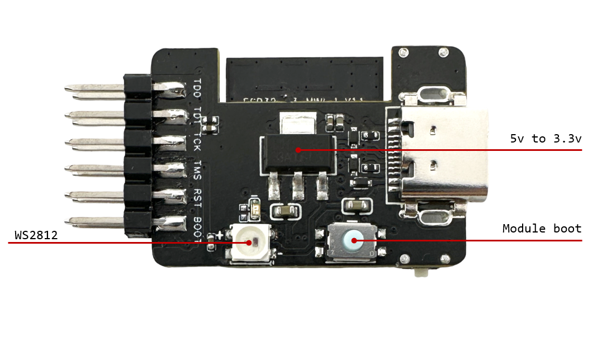

# ESP32-S3-USB-Bridge

This project is based on the ESP USB Bridge with additional features for flashing via ESP-NOW and serial communication. Click to learn more about [ESP USB Bridge](https://github.com/espressif/esp-usb-bridge#readme).

## Hardware

* ESP32-S2/ESP32-S3 Development Board
    * ESP32-S3-USB-Bridge - [User Guide](../../../docs/en/esp32s3/esp32-s3-usb-bridge/user_guide.rst)
    * ESP32-S3-DevkitC-1 - [User Guide](https://docs.espressif.com/projects/esp-idf/en/latest/esp32s3/hw-reference/esp32s3/user-guide-devkitc-1.html)
* USB cable for programming and downloading

## Flashing

* Press and hold the Boot button on the development board, then press the Reset button to enter download mode.

Note: For the ESP32-S3-USB-Bridge development board, press and hold the Boot button and then power on.

## Modes

This example supports three operating modes: wired mode, wireless host mode, and wireless slave mode.

|     Function     | Wired Mode | Wireless Host Mode | Wireless Slave Mode |
| :--------------: | :--------: | :----------------: | :----------------: |
| USB Serial Comms |     √      |         √          |         √          |
|    Serial Flash  |     √      |         √          |         √          |
|    JTAG Debug    |     √      |                    |                    |
|       MSC        |     √      |         √          |                    |
|    UF2 Update    |     √      |                    |                    |

### Wired Mode


Wired mode supports USB-to-Serial, JTAG debug, and UF2 update.

### Wireless Mode


Wireless mode utilizes the ESPNOW wireless functionality for connectionless data transmission (requires both a master and slave device). Currently, it supports wireless serial communication and wireless flashing.

Note: Data transmission reliability depends on the quality of the Wi-Fi environment.

### Mode Switching

Default mode colors:
* Purple: Wired Mode
* Blue: Wireless Host Mode
* Green: Wireless Slave Mode

Mode switching:
* Double-click the Boot button on the development board to switch operating modes. The LED will change color to indicate a successful mode switch.

Binding and Unbinding in Wireless Mode:
1. When not bound, the LED will flash.
2. Press and hold the Boot button on both the wireless host and slave development boards to initiate binding. The LED will breathe during the 10-second binding process.
3. Upon successful binding, the LED will remain lit.
4. Press and hold for 2 seconds to unbind, and the LED will start flashing.

## Flashing

1. If using the ESP32-S3-USB-Bridge development board, use the following command:
    ```
        rm -rf build sdkconfig sdkconfig.old
        idf.py -D SDKCONFIG_DEFAULTS="sdkconfig.defaults;sdkconfig.esp32-s3-usb-bridge" reconfigure
    ```

2. Run `idf.py -p PORT flash monitor` to compile, flash, and monitor the target device.

    **Note: For the ESP32-S3-USB-Bridge development board, press and hold the ESP32-S3 Boot button and then power on the board to enable flashing.**

    <div style="display: flex; justify-content: center;">
    
    </div>

    (To exit the serial monitor, type ``Ctrl-]``.)

See the [Getting Started Guide](https://docs.espressif.com/projects/esp-idf/en/latest/get-started/index.html) for full steps to configure and use ESP-IDF to build projects.

## Technical support and feedback

Please use the following feedback channels:

* For technical queries, go to the [esp32.com](https://esp32.com/) forum
* For a feature request or bug report, create a [GitHub issue](https://github.com/espressif/esp-dev-kits/issues)

We will get back to you as soon as possible.
